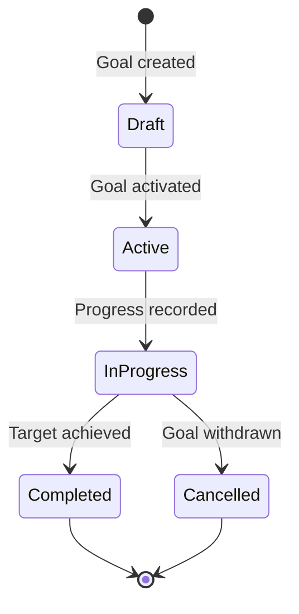

# KPIs and Reviews

## Business Context & Objective

Employee performance management translates organizational strategy into measurable individual outcomes. The PerformanceDevelopment subdomain provides the structured framework for setting performance goals, conducting formal appraisal cycles, collecting multi-source feedback, managing learning and development, and executing succession planning. HR business partners, direct managers, and employees are the primary users. The subdomain closes the loop between workforce planning and individual contribution, enabling data-driven decisions on compensation adjustments, promotions, and succession readiness.

## Domain Entities

| Entity | Business Definition | Role |
|--------|-------------------|------|
| PerformanceGoal | A quantifiable objective assigned to an employee with defined target values, timeline, and progress tracking. | Foundation of the goal-setting framework; supports cascading from organizational to individual goals. |
| PerformanceAppraisal | A structured, periodic evaluation of an employee combining self-assessment, manager feedback, peer feedback, and an overall rating. | The formal record of the performance review cycle. |
| ContinuousFeedback | An informal, real-time feedback entry between any two employees outside of the appraisal cycle. | Supports an ongoing feedback culture independent of the formal review calendar. |
| LearningCourse | A catalogued learning content item, supporting SCORM, video, and instructor-led delivery methods. | Catalog entry for employee development content. |
| LearningEnrollment | The record of an employee's enrollment in and progress through a LearningCourse. | Tracks completion, assessment scores, and certification. |
| SuccessionPlan | A plan identifying candidates who are ready to assume a specific position upon the incumbent's departure. | Strategic talent pipeline record for critical position continuity. |
| SuccessionCandidate | An employee identified as a potential successor for a planned position, assessed for readiness level. | Constituent record of a SuccessionPlan. |

## State Machine / Lifecycle

## Business Rules & Constraints

1. A PerformanceGoal may be linked to a parent_goal_id, enabling cascading from an organizational goal to a team goal and then to an individual goal; circular parent references are prohibited.
2. The progress_percentage field on a PerformanceGoal is updated as current_value approaches target_value; the business rule for automatic completion triggering is based on progress reaching 100%.
3. A PerformanceAppraisal must record ratings as a structured data object encompassing multiple competency dimensions before an overall_rating is derived.
4. LearningCourses that require_assessment must record a passing_score; an enrollment is not marked complete unless the employee achieves at least that threshold.
5. Recurring courses (is_recurring = true) generate a new LearningEnrollment when the recurrence_months interval has elapsed since the employee's last completion.
6. A SuccessionPlan is tied to a specific position and incumbent; candidates are ranked by readiness_level and the plan is reviewed periodically.

## Integration Events

| Event | Direction | Connected Domain | Trigger |
|-------|-----------|-----------------|---------|
| Appraisal Rating Output | Outbound | HumanCapital / PayrollBenefits | Overall rating informs compensation review cycle |
| Succession Readiness | Outbound | HumanCapital / WorkforceAdmin | Succession candidates are referenced in position assignment decisions |
| Course Completion Record | Internal | PerformanceDevelopment | LearningEnrollment completion updates employee development profile |

## Key Operations

**CreatePerformanceGoalAction** establishes a new goal for an employee, linking it optionally to a parent goal and setting the target value, unit, and timeline. The goal is initially created in Draft status.

**CreatePerformanceAppraisalAction** opens a new appraisal cycle for an employee, capturing the appraisal type (annual, mid-year, probationary), the evaluating manager, and the appraisal period. The cycle accepts self-assessment and manager feedback inputs before finalization.

**CreateLearningEnrollmentAction** registers an employee in a specific LearningCourse. For courses requiring assessment, the enrollment remains incomplete until a passing score is recorded.

**CreateSuccessionPlanAction** creates a plan for a critical position, identifying the incumbent and accepting one or more SuccessionCandidate records with associated readiness ratings.

## Known Constraints

- Appraisal records cannot be deleted once created; they may be updated during the open review window, but the record is permanent.
- LearningCourse records that are unpublished (is_published = false) are not available for new enrollments.
- A SuccessionCandidate must reference an active employee; terminated employees are excluded from succession pools.

## Assumptions & Open Questions

<!-- [ASSUMPTION] -->
The mechanism triggering a compensation review cycle from an appraisal overall_rating is inferred from the relationship between PayrollBenefits CompensationPlan and appraisal outcomes. No explicit event or action implementing this link was identified in the source code. Business confirmation of the appraisal-to-compensation workflow is required.
