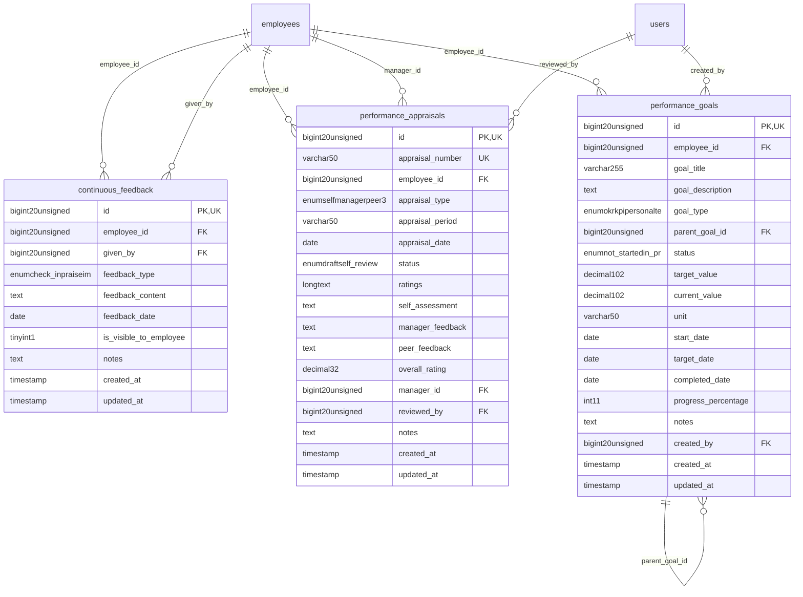

# HumanCapital - PerformanceDevelopment

> **Bounded Context Schema & ERD**
> 3 Tables | Generated dynamically by accoregine

---

## Tables List

- `continuous_feedback`
- `performance_appraisals`
- `performance_goals`

---

## Entity Relationship Diagram

---

## Data Dictionary

### Table: `continuous_feedback`

| Column | Type | Nullable | Default | Indexes | Foreign Keys |
|---|---|---|---|---|---|
| `id` | `bigint(20) unsigned` | No |  | **PK** |  |
| `employee_id` | `bigint(20) unsigned` | No |  | IDX | -> `employees.id` |
| `given_by` | `bigint(20) unsigned` | Yes | `NULL` | IDX | -> `employees.id` |
| `feedback_type` | `enum('check_in','praise','improvement','coaching','other')` | No | `'check_in'` |  |  |
| `feedback_content` | `text` | No |  |  |  |
| `feedback_date` | `date` | No |  |  |  |
| `is_visible_to_employee` | `tinyint(1)` | No | `1` |  |  |
| `notes` | `text` | Yes | `NULL` |  |  |
| `created_at` | `timestamp` | Yes | `NULL` |  |  |
| `updated_at` | `timestamp` | Yes | `NULL` |  |  |

### Table: `performance_appraisals`

| Column | Type | Nullable | Default | Indexes | Foreign Keys |
|---|---|---|---|---|---|
| `id` | `bigint(20) unsigned` | No |  | **PK** |  |
| `appraisal_number` | `varchar(50)` | No |  | *UK* |  |
| `employee_id` | `bigint(20) unsigned` | No |  | IDX | -> `employees.id` |
| `appraisal_type` | `enum('self','manager','peer','360','annual','mid_year')` | No | `'annual'` |  |  |
| `appraisal_period` | `varchar(50)` | No |  |  |  |
| `appraisal_date` | `date` | No |  |  |  |
| `status` | `enum('draft','self_review','manager_review','calibration','completed','cancelled')` | No | `'draft'` |  |  |
| `ratings` | `longtext` | No |  |  |  |
| `self_assessment` | `text` | Yes | `NULL` |  |  |
| `manager_feedback` | `text` | Yes | `NULL` |  |  |
| `peer_feedback` | `text` | Yes | `NULL` |  |  |
| `overall_rating` | `decimal(3,2)` | Yes | `NULL` |  |  |
| `manager_id` | `bigint(20) unsigned` | Yes | `NULL` | IDX | -> `employees.id` |
| `reviewed_by` | `bigint(20) unsigned` | Yes | `NULL` | IDX | -> `users.id` |
| `notes` | `text` | Yes | `NULL` |  |  |
| `created_at` | `timestamp` | Yes | `NULL` |  |  |
| `updated_at` | `timestamp` | Yes | `NULL` |  |  |

### Table: `performance_goals`

| Column | Type | Nullable | Default | Indexes | Foreign Keys |
|---|---|---|---|---|---|
| `id` | `bigint(20) unsigned` | No |  | **PK** |  |
| `employee_id` | `bigint(20) unsigned` | No |  | IDX | -> `employees.id` |
| `goal_title` | `varchar(255)` | No |  |  |  |
| `goal_description` | `text` | No |  |  |  |
| `goal_type` | `enum('okr','kpi','personal','team','corporate')` | No | `'personal'` |  |  |
| `parent_goal_id` | `bigint(20) unsigned` | Yes | `NULL` | IDX | -> `performance_goals.id` |
| `status` | `enum('not_started','in_progress','on_track','at_risk','completed','cancelled')` | No | `'not_started'` |  |  |
| `target_value` | `decimal(10,2)` | Yes | `NULL` |  |  |
| `current_value` | `decimal(10,2)` | No | `0.00` |  |  |
| `unit` | `varchar(50)` | Yes | `NULL` |  |  |
| `start_date` | `date` | No |  |  |  |
| `target_date` | `date` | No |  |  |  |
| `completed_date` | `date` | Yes | `NULL` |  |  |
| `progress_percentage` | `int(11)` | No | `0` |  |  |
| `notes` | `text` | Yes | `NULL` |  |  |
| `created_by` | `bigint(20) unsigned` | Yes | `NULL` | IDX | -> `users.id` |
| `created_at` | `timestamp` | Yes | `NULL` |  |  |
| `updated_at` | `timestamp` | Yes | `NULL` |  |  |

