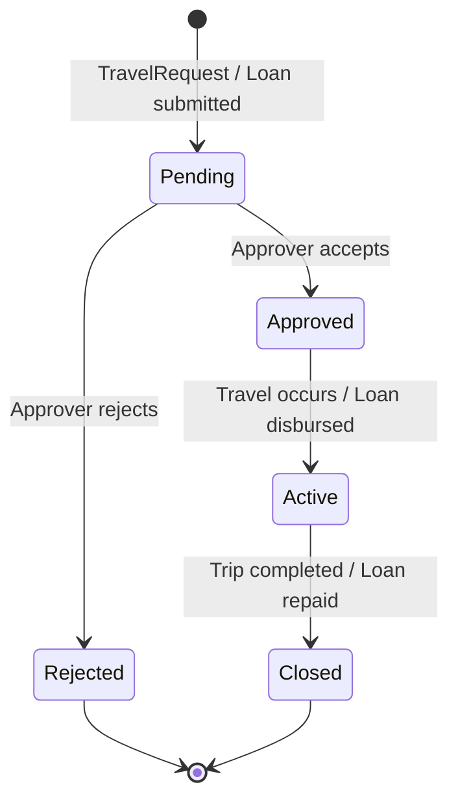

# Employee Self-Service

## Business Context & Objective

Employee self-service capabilities reduce administrative overhead on HR teams by empowering employees to initiate and track their own service requests. The ServicesWellness subdomain covers travel authorization and expense management, employee loan applications with integrated payroll deduction, health record maintenance, Environment, Health, and Safety (EHS) incident reporting, and personal protective equipment (PPE) assignment tracking. Employees, HR administrators, finance controllers, and safety officers are the primary users. The subdomain ensures that employee-initiated transactions follow a formal approval workflow before financial or operational commitments are made.

## Domain Entities

| Entity | Business Definition | Role |
|--------|-------------------|------|
| TravelRequest | A formal employee request for business travel authorization, specifying destination, purpose, dates, and estimated cost. | Authorization gateway for business travel; parent record for expenses. |
| TravelExpense | A line-item expense claim submitted against an approved TravelRequest. | Financial record for travel cost reconciliation and reimbursement. |
| EmployeeLoan | A formal loan arrangement between the employer and employee, with structured installment repayment and optional automatic payroll deduction. | Financial instrument linking employee welfare to payroll. |
| LoanRepayment | An individual repayment event recorded against an active EmployeeLoan, reducing the remaining balance. | Installment payment record used for balance tracking and payroll integration. |
| EmployeeHealthRecord | A confidential record of an employee's medical information maintained for occupational health and insurance purposes. | Compliance and benefits reference record. |
| EhsIncident | A formal report of a health, safety, or environment incident involving an employee at the workplace. | Safety management and regulatory compliance record. |
| PpeManagement | An assignment record tracking personal protective equipment issued to an employee. | Asset-to-employee linkage for PPE accountability. |

## State Machine / Lifecycle

## Business Rules & Constraints

1. A TravelRequest must be approved before any TravelExpense records can be submitted against it; expenses linked to unapproved requests are not accepted.
2. An EmployeeLoan specifies an installment_count and monthly_installment at origination; the remaining_balance is decremented with each LoanRepayment record.
3. When auto_deduction is enabled on an EmployeeLoan, the monthly installment is automatically referenced as a deduction component in the employee's Payroll Cycle via the deduction_component_id link.
4. EhsIncident records carry an osha_reportable flag; incidents flagged as OSHA reportable require a report path and are subject to additional compliance review.
5. An EhsIncident must record both a root_cause and preventive_measures before its status can be set to closed, ensuring the corrective process is documented.
6. EmployeeHealthRecord data is classified as sensitive and access is restricted to authorized HR and medical personnel only.

## Integration Events

| Event | Direction | Connected Domain | Trigger |
|-------|-----------|-----------------|---------|
| Loan Deduction Reference | Outbound | HumanCapital / PayrollBenefits | auto_deduction EmployeeLoan creates a deduction component in PayrollCycle |
| Expense Reimbursement | Outbound | Finance / GeneralLedger | Approved TravelExpense triggers a reimbursement GL entry |
| EHS Incident Log | Outbound | EnterpriseCore / MonitoringCompliance | EhsIncident creation triggers audit logging |

## Key Operations

**CreateTravelRequestAction** submits a new travel authorization for approval. The request captures destination, travel dates, purpose, and estimated cost. The approval chain is triggered upon submission.

**CreateTravelExpenseAction** records an individual expense line against an approved TravelRequest, specifying the expense category, amount, and supporting documentation reference.

**CreateEmployeeLoanAction** initiates a loan arrangement with defined terms (amount, interest rate, installment schedule). If auto_deduction is selected, the monthly installment is linked to a payroll deduction component.

**RecordLoanRepaymentAction** records a single repayment event, updates the remaining_balance on the loan, and marks the loan as closed when the balance reaches zero.

**CreateEhsIncidentAction** logs a workplace safety or health incident, capturing incident type, severity, location, immediate actions taken, and the reporting employee.

## Known Constraints

- TravelExpenses may not exceed the estimated_cost recorded in the parent TravelRequest without a supporting amendment.
- A closed EmployeeLoan cannot be reopened; any subsequent loan for the same employee requires a new EmployeeLoan record.
- EhsIncident records with osha_reportable set to true cannot be closed without an osha_report_path being recorded.

## Assumptions & Open Questions

<!-- [ASSUMPTION] -->
The mechanism for posting approved travel expense reimbursements as GL journal entries is inferred from the domain's integration with Finance; no explicit GL posting action was identified in the ServicesWellness source code. Business confirmation of the expense reimbursement posting workflow is required.
