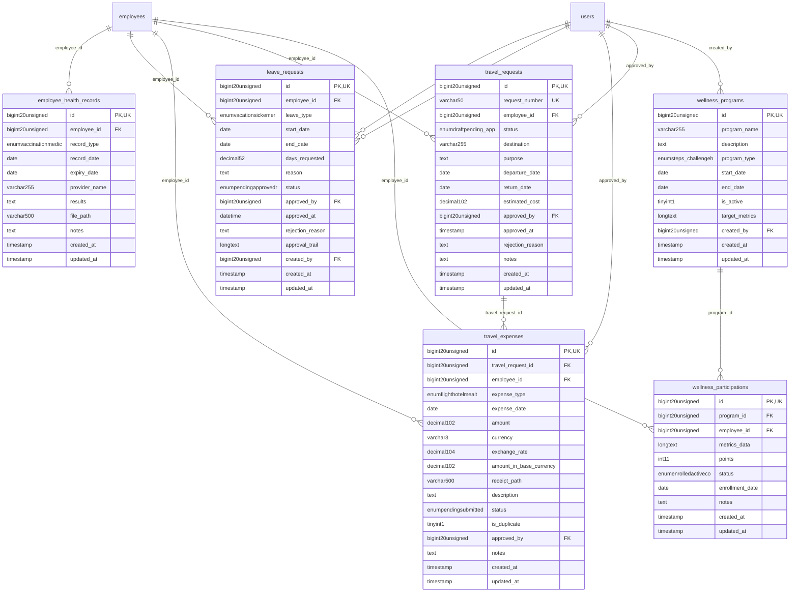

# HumanCapital - ServicesWellness

> **Bounded Context Schema & ERD**
> 6 Tables | Generated dynamically by ACCSYSTEM engine

---

## Tables List

- `employee_health_records`
- `leave_requests`
- `travel_expenses`
- `travel_requests`
- `wellness_participations`
- `wellness_programs`

---

## Entity Relationship Diagram

---

## Data Dictionary

### Table: `employee_health_records`

| Column | Type | Nullable | Default | Indexes | Foreign Keys |
|---|---|---|---|---|---|
| `id` | `bigint(20) unsigned` | No |  | **PK** |  |
| `employee_id` | `bigint(20) unsigned` | No |  | IDX | -> `employees.id` |
| `record_type` | `enum('vaccination','medical_exam','drug_test','health_screening','other')` | No | `'medical_exam'` |  |  |
| `record_date` | `date` | No |  |  |  |
| `expiry_date` | `date` | Yes | `NULL` |  |  |
| `provider_name` | `varchar(255)` | Yes | `NULL` |  |  |
| `results` | `text` | Yes | `NULL` |  |  |
| `file_path` | `varchar(500)` | Yes | `NULL` |  |  |
| `notes` | `text` | Yes | `NULL` |  |  |
| `created_at` | `timestamp` | Yes | `NULL` |  |  |
| `updated_at` | `timestamp` | Yes | `NULL` |  |  |

### Table: `leave_requests`

| Column | Type | Nullable | Default | Indexes | Foreign Keys |
|---|---|---|---|---|---|
| `id` | `bigint(20) unsigned` | No |  | **PK** |  |
| `employee_id` | `bigint(20) unsigned` | No |  | IDX | -> `employees.id` |
| `leave_type` | `enum('vacation','sick','emergency','unpaid','other')` | No | `'vacation'` |  |  |
| `start_date` | `date` | No |  | IDX |  |
| `end_date` | `date` | No |  | IDX |  |
| `days_requested` | `decimal(5,2)` | No |  |  |  |
| `reason` | `text` | Yes | `NULL` |  |  |
| `status` | `enum('pending','approved','rejected','cancelled')` | No | `'pending'` | IDX, IDX |  |
| `approved_by` | `bigint(20) unsigned` | Yes | `NULL` | IDX | -> `users.id` |
| `approved_at` | `datetime` | Yes | `NULL` |  |  |
| `rejection_reason` | `text` | Yes | `NULL` |  |  |
| `approval_trail` | `longtext` | Yes | `NULL` |  |  |
| `created_by` | `bigint(20) unsigned` | Yes | `NULL` | IDX | -> `users.id` |
| `created_at` | `timestamp` | Yes | `NULL` |  |  |
| `updated_at` | `timestamp` | Yes | `NULL` |  |  |

### Table: `travel_expenses`

| Column | Type | Nullable | Default | Indexes | Foreign Keys |
|---|---|---|---|---|---|
| `id` | `bigint(20) unsigned` | No |  | **PK** |  |
| `travel_request_id` | `bigint(20) unsigned` | Yes | `NULL` | IDX | -> `travel_requests.id` |
| `employee_id` | `bigint(20) unsigned` | No |  | IDX | -> `employees.id` |
| `expense_type` | `enum('flight','hotel','meal','transportation','other')` | No | `'other'` |  |  |
| `expense_date` | `date` | No |  |  |  |
| `amount` | `decimal(10,2)` | No |  |  |  |
| `currency` | `varchar(3)` | No | `'SAR'` |  |  |
| `exchange_rate` | `decimal(10,4)` | No | `1.0000` |  |  |
| `amount_in_base_currency` | `decimal(10,2)` | No |  |  |  |
| `receipt_path` | `varchar(500)` | Yes | `NULL` |  |  |
| `description` | `text` | Yes | `NULL` |  |  |
| `status` | `enum('pending','submitted','approved','rejected','reimbursed')` | No | `'pending'` |  |  |
| `is_duplicate` | `tinyint(1)` | No | `0` |  |  |
| `approved_by` | `bigint(20) unsigned` | Yes | `NULL` | IDX | -> `users.id` |
| `notes` | `text` | Yes | `NULL` |  |  |
| `created_at` | `timestamp` | Yes | `NULL` |  |  |
| `updated_at` | `timestamp` | Yes | `NULL` |  |  |

### Table: `travel_requests`

| Column | Type | Nullable | Default | Indexes | Foreign Keys |
|---|---|---|---|---|---|
| `id` | `bigint(20) unsigned` | No |  | **PK** |  |
| `request_number` | `varchar(50)` | No |  | *UK* |  |
| `employee_id` | `bigint(20) unsigned` | No |  | IDX | -> `employees.id` |
| `status` | `enum('draft','pending_approval','approved','rejected','cancelled','completed')` | No | `'draft'` |  |  |
| `destination` | `varchar(255)` | No |  |  |  |
| `purpose` | `text` | No |  |  |  |
| `departure_date` | `date` | No |  |  |  |
| `return_date` | `date` | No |  |  |  |
| `estimated_cost` | `decimal(10,2)` | No | `0.00` |  |  |
| `approved_by` | `bigint(20) unsigned` | Yes | `NULL` | IDX | -> `users.id` |
| `approved_at` | `timestamp` | Yes | `NULL` |  |  |
| `rejection_reason` | `text` | Yes | `NULL` |  |  |
| `notes` | `text` | Yes | `NULL` |  |  |
| `created_at` | `timestamp` | Yes | `NULL` |  |  |
| `updated_at` | `timestamp` | Yes | `NULL` |  |  |

### Table: `wellness_participations`

| Column | Type | Nullable | Default | Indexes | Foreign Keys |
|---|---|---|---|---|---|
| `id` | `bigint(20) unsigned` | No |  | **PK** |  |
| `program_id` | `bigint(20) unsigned` | No |  | IDX | -> `wellness_programs.id` |
| `employee_id` | `bigint(20) unsigned` | No |  | IDX | -> `employees.id` |
| `metrics_data` | `longtext` | Yes | `NULL` |  |  |
| `points` | `int(11)` | No | `0` |  |  |
| `status` | `enum('enrolled','active','completed','dropped')` | No | `'enrolled'` |  |  |
| `enrollment_date` | `date` | No |  |  |  |
| `notes` | `text` | Yes | `NULL` |  |  |
| `created_at` | `timestamp` | Yes | `NULL` |  |  |
| `updated_at` | `timestamp` | Yes | `NULL` |  |  |

### Table: `wellness_programs`

| Column | Type | Nullable | Default | Indexes | Foreign Keys |
|---|---|---|---|---|---|
| `id` | `bigint(20) unsigned` | No |  | **PK** |  |
| `program_name` | `varchar(255)` | No |  |  |  |
| `description` | `text` | Yes | `NULL` |  |  |
| `program_type` | `enum('steps_challenge','health_challenge','fitness','nutrition','mental_health','other')` | No | `'steps_challenge'` |  |  |
| `start_date` | `date` | No |  |  |  |
| `end_date` | `date` | No |  |  |  |
| `is_active` | `tinyint(1)` | No | `1` |  |  |
| `target_metrics` | `longtext` | Yes | `NULL` |  |  |
| `created_by` | `bigint(20) unsigned` | Yes | `NULL` | IDX | -> `users.id` |
| `created_at` | `timestamp` | Yes | `NULL` |  |  |
| `updated_at` | `timestamp` | Yes | `NULL` |  |  |

