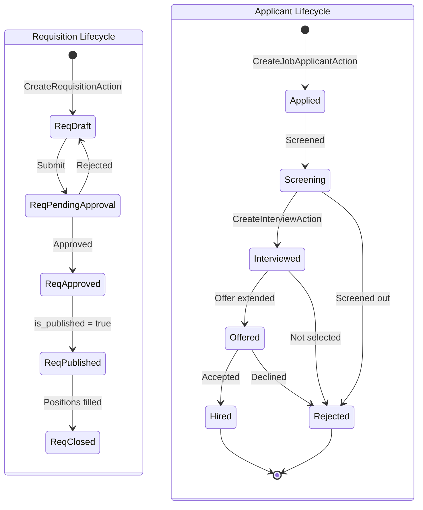

# Hiring Workflows

## Overview

The hiring workflow encompasses the end-to-end talent acquisition process within ACCSYSTEM, spanning from the creation of an authorized headcount request through applicant evaluation and into structured onboarding. The TalentRecruitment subdomain manages this pipeline as two interlinked lifecycles: the Recruitment Requisition lifecycle governing headcount authorization, and the Job Applicant lifecycle governing individual candidate progression. Both terminate in the creation of an Employee Record and the initiation of an Onboarding Workflow.

## State Diagram

## State Definitions

| State | Business Meaning | Entry Condition | Exit Condition |
|-------|-----------------|-----------------|----------------|
| ReqDraft | Requisition is being authored; not yet submitted for approval. | CreateRequisitionAction executed by requesting manager. | Manager submits for approval. |
| ReqApproved | Headcount is authorized; recruitment may proceed. | Approver accepts the requisition. | HR publishes the requisition. |
| ReqPublished | Open position is visible to recruiters and external applicants. | is_published flag set to true. | All budgeted positions are filled and requisition is closed. |
| Applied | Candidate has submitted an application against a published requisition. | CreateJobApplicantAction executed. | HR officer initiates screening. |
| Screening | Candidate is under initial screening; resume and qualifications are being assessed. | HR assigns screened_by and records screening_notes. | Decision to advance or reject is made. |
| Interviewed | One or more Interview records are linked to the applicant; formal evaluation is in progress. | CreateInterviewAction executed against the applicant. | Interview panel decision is recorded. |
| Offered | A position offer has been extended to the candidate. | HR updates applicant status to offered. | Candidate accepts or declines. |
| Hired | Applicant has accepted the offer; transition to Employee Record creation and onboarding is initiated. | UpdateJobApplicantStatusAction sets status to hired. | Terminal — Employee Record created. |

## Transition Rules

1. **ReqDraft → ReqPendingApproval:** The requesting manager submits the requisition, which is routed to the designated approver. Budget range (budgeted_salary_min, budgeted_salary_max) and required qualifications must be specified.

2. **ReqApproved → ReqPublished:** An HR officer sets is_published to true, making the requisition visible for applicant intake. Publication does not require a secondary approval.

3. **Applied → Screening:** An HR officer assigns a screener and begins evaluating the applicant. A match_score may be recorded to prioritize candidates.

4. **Screened → Interviewed:** HR creates an Interview record, specifying the interview format, date, and assigned interviewer. Multiple interviews may be created for a single applicant.

5. **Interviewed → Offered:** Interview notes and ratings are reviewed. An offer decision advances the applicant to Offered status.

6. **Offered → Hired:** On acceptance, the applicant status is set to Hired. An Onboarding Workflow is created (CreateOnboardingWorkflowAction) and assigned to an HR coordinator. A new Employee Record is subsequently created using CreateEmployeeAction.

## Irreversibility & Immutability

The Hired status is terminal for a JobApplicant record. The Rejected status is also terminal. Once a RecruitmentRequisition is closed, it cannot be reopened; a new requisition must be created for any additional headcount. Soft deletes (SoftDeletes trait) are applied to both RecruitmentRequisition and JobApplicant, meaning records are retained for reporting and audit purposes even after logical deletion.

## Integration Impact

The Hired transition initiates the Employee Record creation process in the WorkforceAdmin subdomain, establishing the link between the TalentRecruitment pipeline and the employee master. The Onboarding Workflow completion_percentage is tracked through OnboardingTask records, and completion triggers the employee's transition from Provisioning to Active eligibility. Requisition cost data (budgeted_salary_min, budgeted_salary_max) informs Finance's headcount budget tracking.

## Assumptions & Open Questions

<!-- [ASSUMPTION] -->
The automated creation of an Employee Record upon the Hired transition is inferred from the workflow structure; the source does not contain an explicit event listener or observer for this trigger. Business confirmation of the exact handoff mechanism between TalentRecruitment and WorkforceAdmin is required.
