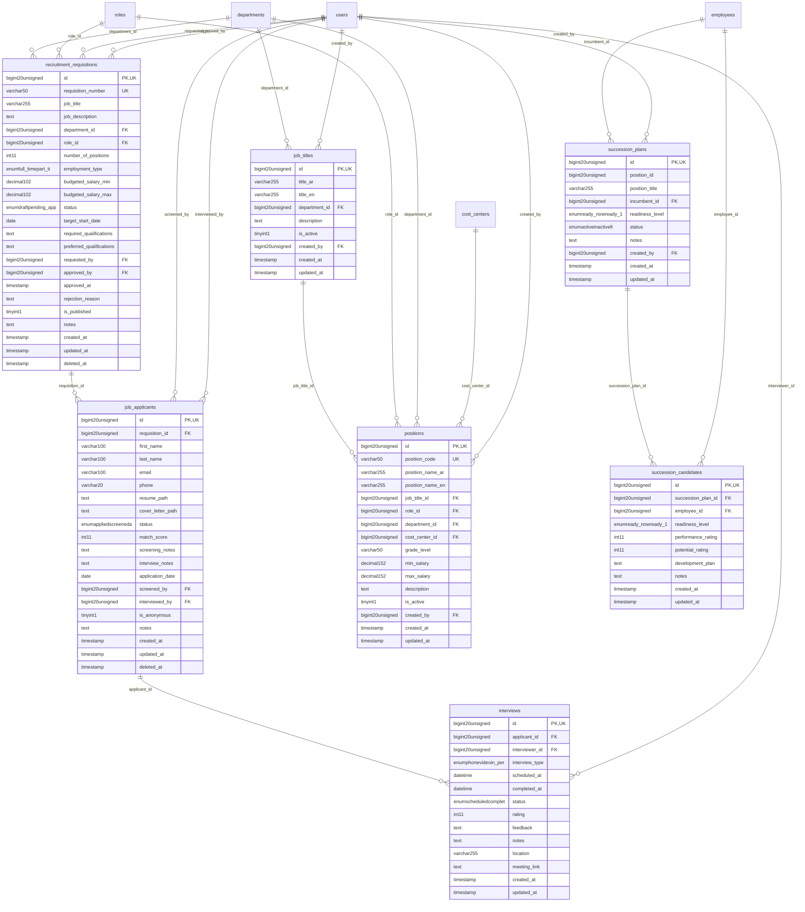

# HumanCapital - TalentRecruitment

> **Bounded Context Schema & ERD**
> 7 Tables | Generated dynamically by accore engine

---

## Tables List

- `interviews`
- `job_applicants`
- `job_titles`
- `positions`
- `recruitment_requisitions`
- `succession_candidates`
- `succession_plans`

---

## Entity Relationship Diagram

---

## Data Dictionary

### Table: `interviews`

| Column | Type | Nullable | Default | Indexes | Foreign Keys |
|---|---|---|---|---|---|
| `id` | `bigint(20) unsigned` | No |  | **PK** |  |
| `applicant_id` | `bigint(20) unsigned` | No |  | IDX | -> `job_applicants.id` |
| `interviewer_id` | `bigint(20) unsigned` | No |  | IDX | -> `users.id` |
| `interview_type` | `enum('phone','video','in_person','panel')` | No | `'in_person'` |  |  |
| `scheduled_at` | `datetime` | No |  |  |  |
| `completed_at` | `datetime` | Yes | `NULL` |  |  |
| `status` | `enum('scheduled','completed','cancelled','no_show')` | No | `'scheduled'` |  |  |
| `rating` | `int(11)` | Yes | `NULL` |  |  |
| `feedback` | `text` | Yes | `NULL` |  |  |
| `notes` | `text` | Yes | `NULL` |  |  |
| `location` | `varchar(255)` | Yes | `NULL` |  |  |
| `meeting_link` | `text` | Yes | `NULL` |  |  |
| `created_at` | `timestamp` | Yes | `NULL` |  |  |
| `updated_at` | `timestamp` | Yes | `NULL` |  |  |

### Table: `job_applicants`

| Column | Type | Nullable | Default | Indexes | Foreign Keys |
|---|---|---|---|---|---|
| `id` | `bigint(20) unsigned` | No |  | **PK** |  |
| `requisition_id` | `bigint(20) unsigned` | No |  | IDX | -> `recruitment_requisitions.id` |
| `first_name` | `varchar(100)` | No |  |  |  |
| `last_name` | `varchar(100)` | No |  |  |  |
| `email` | `varchar(100)` | No |  |  |  |
| `phone` | `varchar(20)` | Yes | `NULL` |  |  |
| `resume_path` | `text` | Yes | `NULL` |  |  |
| `cover_letter_path` | `text` | Yes | `NULL` |  |  |
| `status` | `enum('applied','screened','assessment','interview','offer','hired','rejected','withdrawn')` | No | `'applied'` |  |  |
| `match_score` | `int(11)` | Yes | `NULL` |  |  |
| `screening_notes` | `text` | Yes | `NULL` |  |  |
| `interview_notes` | `text` | Yes | `NULL` |  |  |
| `application_date` | `date` | No |  |  |  |
| `screened_by` | `bigint(20) unsigned` | Yes | `NULL` | IDX | -> `users.id` |
| `interviewed_by` | `bigint(20) unsigned` | Yes | `NULL` | IDX | -> `users.id` |
| `is_anonymous` | `tinyint(1)` | No | `0` |  |  |
| `notes` | `text` | Yes | `NULL` |  |  |
| `created_at` | `timestamp` | Yes | `NULL` |  |  |
| `updated_at` | `timestamp` | Yes | `NULL` |  |  |
| `deleted_at` | `timestamp` | Yes | `NULL` |  |  |

### Table: `job_titles`

| Column | Type | Nullable | Default | Indexes | Foreign Keys |
|---|---|---|---|---|---|
| `id` | `bigint(20) unsigned` | No |  | **PK** |  |
| `title_ar` | `varchar(255)` | No |  |  |  |
| `title_en` | `varchar(255)` | Yes | `NULL` |  |  |
| `department_id` | `bigint(20) unsigned` | Yes | `NULL` | IDX | -> `departments.id` |
| `description` | `text` | Yes | `NULL` |  |  |
| `is_active` | `tinyint(1)` | No | `1` |  |  |
| `created_by` | `bigint(20) unsigned` | Yes | `NULL` | IDX | -> `users.id` |
| `created_at` | `timestamp` | Yes | `NULL` |  |  |
| `updated_at` | `timestamp` | Yes | `NULL` |  |  |

### Table: `positions`

| Column | Type | Nullable | Default | Indexes | Foreign Keys |
|---|---|---|---|---|---|
| `id` | `bigint(20) unsigned` | No |  | **PK** |  |
| `position_code` | `varchar(50)` | No |  | *UK* |  |
| `position_name_ar` | `varchar(255)` | No |  |  |  |
| `position_name_en` | `varchar(255)` | Yes | `NULL` |  |  |
| `job_title_id` | `bigint(20) unsigned` | No |  | IDX | -> `job_titles.id` |
| `role_id` | `bigint(20) unsigned` | Yes | `NULL` | IDX | -> `roles.id` |
| `department_id` | `bigint(20) unsigned` | Yes | `NULL` | IDX | -> `departments.id` |
| `cost_center_id` | `bigint(20) unsigned` | Yes | `NULL` | IDX | -> `cost_centers.id` |
| `grade_level` | `varchar(50)` | Yes | `NULL` |  |  |
| `min_salary` | `decimal(15,2)` | Yes | `NULL` |  |  |
| `max_salary` | `decimal(15,2)` | Yes | `NULL` |  |  |
| `description` | `text` | Yes | `NULL` |  |  |
| `is_active` | `tinyint(1)` | No | `1` | IDX |  |
| `created_by` | `bigint(20) unsigned` | Yes | `NULL` | IDX | -> `users.id` |
| `created_at` | `timestamp` | Yes | `NULL` |  |  |
| `updated_at` | `timestamp` | Yes | `NULL` |  |  |

### Table: `recruitment_requisitions`

| Column | Type | Nullable | Default | Indexes | Foreign Keys |
|---|---|---|---|---|---|
| `id` | `bigint(20) unsigned` | No |  | **PK** |  |
| `requisition_number` | `varchar(50)` | No |  | *UK* |  |
| `job_title` | `varchar(255)` | No |  |  |  |
| `job_description` | `text` | Yes | `NULL` |  |  |
| `department_id` | `bigint(20) unsigned` | Yes | `NULL` | IDX | -> `departments.id` |
| `role_id` | `bigint(20) unsigned` | Yes | `NULL` | IDX | -> `roles.id` |
| `number_of_positions` | `int(11)` | No | `1` |  |  |
| `employment_type` | `enum('full_time','part_time','contract','temporary')` | No | `'full_time'` |  |  |
| `budgeted_salary_min` | `decimal(10,2)` | Yes | `NULL` |  |  |
| `budgeted_salary_max` | `decimal(10,2)` | Yes | `NULL` |  |  |
| `status` | `enum('draft','pending_approval','approved','rejected','closed','filled')` | No | `'draft'` |  |  |
| `target_start_date` | `date` | Yes | `NULL` |  |  |
| `required_qualifications` | `text` | Yes | `NULL` |  |  |
| `preferred_qualifications` | `text` | Yes | `NULL` |  |  |
| `requested_by` | `bigint(20) unsigned` | Yes | `NULL` | IDX | -> `users.id` |
| `approved_by` | `bigint(20) unsigned` | Yes | `NULL` | IDX | -> `users.id` |
| `approved_at` | `timestamp` | Yes | `NULL` |  |  |
| `rejection_reason` | `text` | Yes | `NULL` |  |  |
| `is_published` | `tinyint(1)` | No | `0` |  |  |
| `notes` | `text` | Yes | `NULL` |  |  |
| `created_at` | `timestamp` | Yes | `NULL` |  |  |
| `updated_at` | `timestamp` | Yes | `NULL` |  |  |
| `deleted_at` | `timestamp` | Yes | `NULL` |  |  |

### Table: `succession_candidates`

| Column | Type | Nullable | Default | Indexes | Foreign Keys |
|---|---|---|---|---|---|
| `id` | `bigint(20) unsigned` | No |  | **PK** |  |
| `succession_plan_id` | `bigint(20) unsigned` | No |  | IDX | -> `succession_plans.id` |
| `employee_id` | `bigint(20) unsigned` | No |  | IDX | -> `employees.id` |
| `readiness_level` | `enum('ready_now','ready_1_2_years','ready_3_5_years','not_ready')` | No | `'ready_1_2_years'` |  |  |
| `performance_rating` | `int(11)` | Yes | `NULL` |  |  |
| `potential_rating` | `int(11)` | Yes | `NULL` |  |  |
| `development_plan` | `text` | Yes | `NULL` |  |  |
| `notes` | `text` | Yes | `NULL` |  |  |
| `created_at` | `timestamp` | Yes | `NULL` |  |  |
| `updated_at` | `timestamp` | Yes | `NULL` |  |  |

### Table: `succession_plans`

| Column | Type | Nullable | Default | Indexes | Foreign Keys |
|---|---|---|---|---|---|
| `id` | `bigint(20) unsigned` | No |  | **PK** |  |
| `position_id` | `bigint(20) unsigned` | Yes | `NULL` |  |  |
| `position_title` | `varchar(255)` | No |  |  |  |
| `incumbent_id` | `bigint(20) unsigned` | Yes | `NULL` | IDX | -> `employees.id` |
| `readiness_level` | `enum('ready_now','ready_1_2_years','ready_3_5_years','not_ready')` | No | `'ready_1_2_years'` |  |  |
| `status` | `enum('active','inactive','filled')` | No | `'active'` |  |  |
| `notes` | `text` | Yes | `NULL` |  |  |
| `created_by` | `bigint(20) unsigned` | Yes | `NULL` | IDX | -> `users.id` |
| `created_at` | `timestamp` | Yes | `NULL` |  |  |
| `updated_at` | `timestamp` | Yes | `NULL` |  |  |

