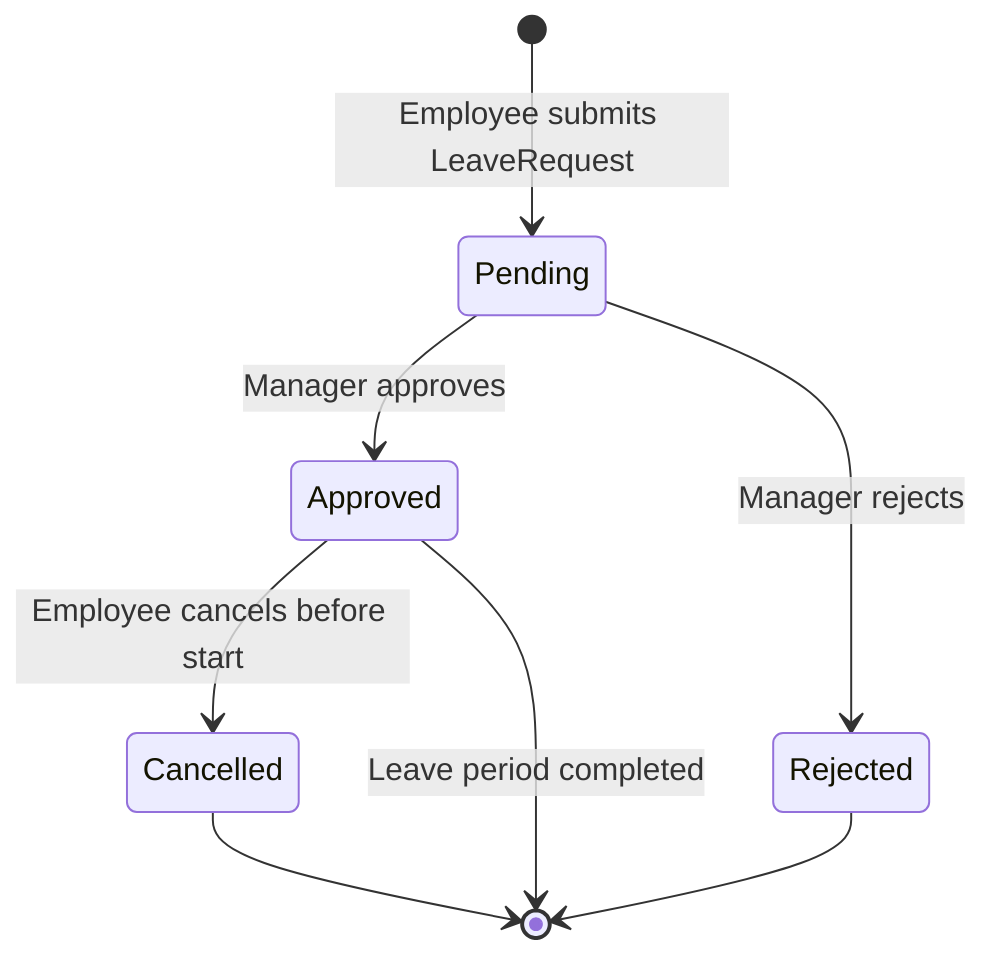

# Timesheets and Leave Accrual

## Business Context & Objective

Accurate time-tracking and leave management are foundational to payroll integrity and labor law compliance. The TimeProductivity subdomain captures daily attendance through manual entry or biometric device synchronization, governs the leave request and approval workflow, and provides the attendance data consumed by the payroll salary calculator. HR administrators, department managers, and employees are the primary users. The subdomain ensures that absences are formally approved, leave balances are maintained in real time, and unpaid periods are correctly communicated to the payroll engine.

## Domain Entities

| Entity | Business Definition | Role |
|--------|-------------------|------|
| AttendanceRecord | A single day's presence record for an employee, capturing check-in, check-out, hours worked, overtime, and lateness metrics. | Primary time data source for payroll calculation. |
| LeaveRequest | A formal request by an employee for approved absence, tied to a leave type and balance. | Governs absence approval and accrual deduction. |
| BiometricDevice | A registered physical attendance terminal capable of syncing raw attendance events into the system. | Hardware integration point for automated attendance capture. |
| BiometricSyncLog | An audit record of each synchronization event between a biometric device and the system. | Traceability for automated attendance data imports. |
| WorkforceSchedule | A named schedule pattern defining working days and shift templates for a group of employees. | Basis for shift assignment and overtime threshold calculation. |
| ScheduleShift | A specific shift block within a WorkforceSchedule, defining start time, end time, and break rules. | Granular definition used to evaluate lateness and overtime. |

## State Machine / Lifecycle

## Business Rules & Constraints

1. Working days are calculated by excluding Friday and Saturday from the requested leave period, consistent with the Islamic business week convention applied in the system.
2. A LeaveRequest must not exceed the employee's current vacation_days_balance; the system prevents submission of requests that would result in a negative balance.
3. Attendance records sourced from biometric devices carry an immutable source flag of `biometric`; manual overrides require a notes field entry and are recorded with source `manual`.
4. An employee on approved leave receives an AttendanceRecord with status `leave` for each day of the approved period, which is distinct from an `absent` record.
5. Overtime hours are computed as the positive difference between recorded hours_worked and the standard daily working hours threshold; negative overtime is set to zero.
6. An approved LeaveRequest that falls within an active Payroll Cycle period is passed to the SalaryCalculatorService; unpaid leave days reduce the pro-rata base salary for that cycle.

## Integration Events

| Event | Direction | Connected Domain | Trigger |
|-------|-----------|-----------------|---------|
| Unpaid Leave Days | Outbound | HumanCapital / PayrollBenefits | SalaryCalculatorService queries LeaveService during cycle generation |
| Attendance Hours Summary | Outbound | HumanCapital / PayrollBenefits | GetAttendanceSummaryAction supplies data to payroll calculator |
| Employee Status Update | Inbound | HumanCapital / WorkforceAdmin | Approved leave triggers employment_status change to `on_leave` |

## Key Operations

**RecordAttendanceAction** creates a single AttendanceRecord for an employee, specifying the attendance date, check-in and check-out times, and status. Hours are derived from the time delta.

**ImportBiometricAttendanceAction** processes a bulk file of raw biometric events, validates employee mappings, and creates AttendanceRecord entries with source set to `biometric`.

**ProcessLeaveRequestAction** routes a submitted LeaveRequest through the hierarchical approval chain. On final approval, it decrements the employee's vacation_days_balance by the calculated working days.

**CancelLeaveRequestAction** permits an employee to withdraw a previously approved leave request before the start date. The balance is reinstated upon cancellation.

## Known Constraints

- A BiometricDevice must be registered and active before synchronization is permitted.
- Bulk biometric import files that contain unrecognized employee identifiers are rejected in their entirety; partial imports are not supported.
- Leave cancellation is not permitted once the leave start date has passed.

## Assumptions & Open Questions

<!-- [ASSUMPTION] -->
The standard daily working hours threshold for overtime calculation is inferred as 8 hours from the AttendanceRecord model's calculateOvertime method default parameter. Explicit configuration per WorkforceSchedule is not confirmed in the source; business verification is required.
