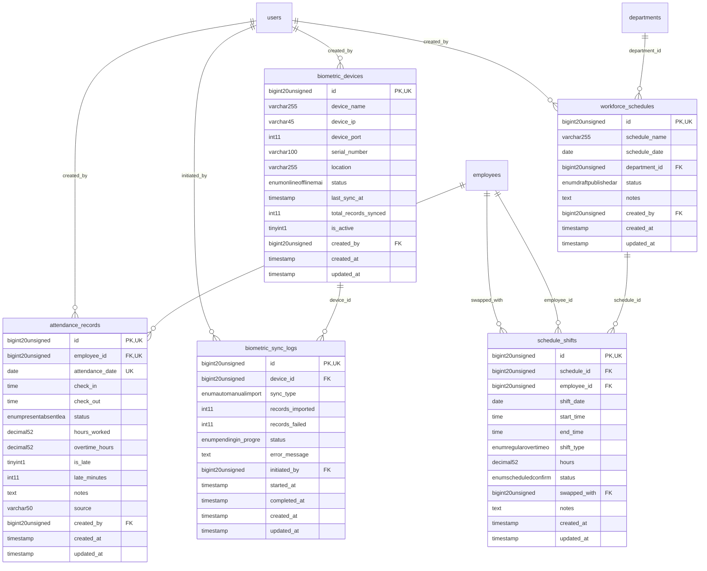

# HumanCapital - TimeProductivity

> **Bounded Context Schema & ERD**
> 5 Tables | Generated dynamically by ACCSYSTEM engine

---

## Tables List

- `attendance_records`
- `biometric_devices`
- `biometric_sync_logs`
- `schedule_shifts`
- `workforce_schedules`

---

## Entity Relationship Diagram

---

## Data Dictionary

### Table: `attendance_records`

| Column | Type | Nullable | Default | Indexes | Foreign Keys |
|---|---|---|---|---|---|
| `id` | `bigint(20) unsigned` | No |  | **PK** |  |
| `employee_id` | `bigint(20) unsigned` | No |  | IDX, *UK* | -> `employees.id` |
| `attendance_date` | `date` | No |  | IDX, IDX, *UK* |  |
| `check_in` | `time` | Yes | `NULL` |  |  |
| `check_out` | `time` | Yes | `NULL` |  |  |
| `status` | `enum('present','absent','leave','holiday','weekend')` | No | `'present'` |  |  |
| `hours_worked` | `decimal(5,2)` | No | `0.00` |  |  |
| `overtime_hours` | `decimal(5,2)` | No | `0.00` |  |  |
| `is_late` | `tinyint(1)` | No | `0` |  |  |
| `late_minutes` | `int(11)` | No | `0` |  |  |
| `notes` | `text` | Yes | `NULL` |  |  |
| `source` | `varchar(50)` | No | `'manual'` |  |  |
| `created_by` | `bigint(20) unsigned` | Yes | `NULL` | IDX | -> `users.id` |
| `created_at` | `timestamp` | Yes | `NULL` |  |  |
| `updated_at` | `timestamp` | Yes | `NULL` |  |  |

### Table: `biometric_devices`

| Column | Type | Nullable | Default | Indexes | Foreign Keys |
|---|---|---|---|---|---|
| `id` | `bigint(20) unsigned` | No |  | **PK** |  |
| `device_name` | `varchar(255)` | No |  |  |  |
| `device_ip` | `varchar(45)` | Yes | `NULL` |  |  |
| `device_port` | `int(11)` | No | `4370` |  |  |
| `serial_number` | `varchar(100)` | Yes | `NULL` |  |  |
| `location` | `varchar(255)` | Yes | `NULL` |  |  |
| `status` | `enum('online','offline','maintenance','error')` | No | `'offline'` |  |  |
| `last_sync_at` | `timestamp` | Yes | `NULL` |  |  |
| `total_records_synced` | `int(11)` | No | `0` |  |  |
| `is_active` | `tinyint(1)` | No | `1` |  |  |
| `created_by` | `bigint(20) unsigned` | Yes | `NULL` | IDX | -> `users.id` |
| `created_at` | `timestamp` | Yes | `NULL` |  |  |
| `updated_at` | `timestamp` | Yes | `NULL` |  |  |

### Table: `biometric_sync_logs`

| Column | Type | Nullable | Default | Indexes | Foreign Keys |
|---|---|---|---|---|---|
| `id` | `bigint(20) unsigned` | No |  | **PK** |  |
| `device_id` | `bigint(20) unsigned` | No |  | IDX | -> `biometric_devices.id` |
| `sync_type` | `enum('auto','manual','import')` | No | `'manual'` |  |  |
| `records_imported` | `int(11)` | No | `0` |  |  |
| `records_failed` | `int(11)` | No | `0` |  |  |
| `status` | `enum('pending','in_progress','completed','failed')` | No | `'pending'` |  |  |
| `error_message` | `text` | Yes | `NULL` |  |  |
| `initiated_by` | `bigint(20) unsigned` | Yes | `NULL` | IDX | -> `users.id` |
| `started_at` | `timestamp` | Yes | `NULL` |  |  |
| `completed_at` | `timestamp` | Yes | `NULL` |  |  |
| `created_at` | `timestamp` | Yes | `NULL` |  |  |
| `updated_at` | `timestamp` | Yes | `NULL` |  |  |

### Table: `schedule_shifts`

| Column | Type | Nullable | Default | Indexes | Foreign Keys |
|---|---|---|---|---|---|
| `id` | `bigint(20) unsigned` | No |  | **PK** |  |
| `schedule_id` | `bigint(20) unsigned` | No |  | IDX | -> `workforce_schedules.id` |
| `employee_id` | `bigint(20) unsigned` | No |  | IDX | -> `employees.id` |
| `shift_date` | `date` | No |  |  |  |
| `start_time` | `time` | No |  |  |  |
| `end_time` | `time` | No |  |  |  |
| `shift_type` | `enum('regular','overtime','on_call','standby')` | No | `'regular'` |  |  |
| `hours` | `decimal(5,2)` | No | `0.00` |  |  |
| `status` | `enum('scheduled','confirmed','swapped','cancelled','completed')` | No | `'scheduled'` |  |  |
| `swapped_with` | `bigint(20) unsigned` | Yes | `NULL` | IDX | -> `employees.id` |
| `notes` | `text` | Yes | `NULL` |  |  |
| `created_at` | `timestamp` | Yes | `NULL` |  |  |
| `updated_at` | `timestamp` | Yes | `NULL` |  |  |

### Table: `workforce_schedules`

| Column | Type | Nullable | Default | Indexes | Foreign Keys |
|---|---|---|---|---|---|
| `id` | `bigint(20) unsigned` | No |  | **PK** |  |
| `schedule_name` | `varchar(255)` | No |  |  |  |
| `schedule_date` | `date` | No |  |  |  |
| `department_id` | `bigint(20) unsigned` | Yes | `NULL` | IDX | -> `departments.id` |
| `status` | `enum('draft','published','archived')` | No | `'draft'` |  |  |
| `notes` | `text` | Yes | `NULL` |  |  |
| `created_by` | `bigint(20) unsigned` | Yes | `NULL` | IDX | -> `users.id` |
| `created_at` | `timestamp` | Yes | `NULL` |  |  |
| `updated_at` | `timestamp` | Yes | `NULL` |  |  |

