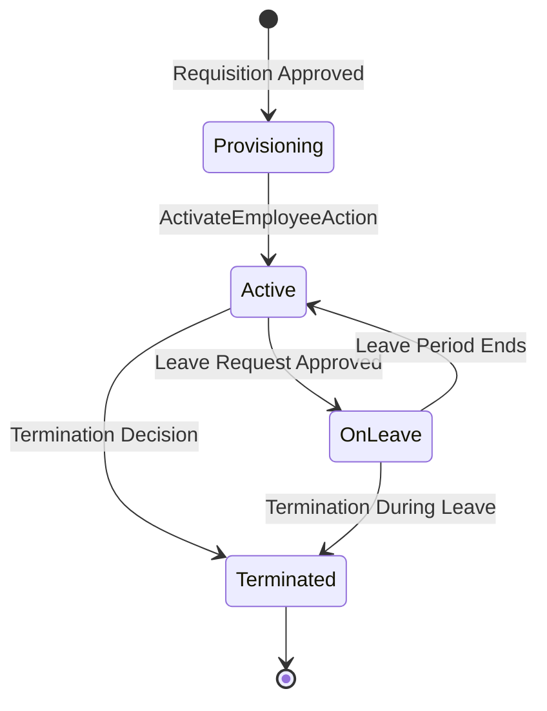

# Employee Lifecycle

## Overview

The Employee Lifecycle documents the complete sequence of states and transitions that govern an Employee Record within ACCSYSTEM. Given that the Employee entity is the root aggregate of the HumanCapital domain — linking payroll, attendance, performance, and access — its lifecycle carries significant cross-domain impact. Each transition triggers downstream effects on system access, payroll eligibility, and compliance records.

## State Diagram

## State Definitions

| State | Business Meaning | Entry Condition | Exit Condition |
|-------|-----------------|-----------------|----------------|
| Provisioning | Employee Record and linked User account are created but the employee has not yet started. | An approved Recruitment Requisition leads to CreateEmployeeAction execution. | HR activates the record via ActivateEmployeeAction on or after the hire date. |
| Active | The employee is actively employed and eligible for payroll, leave, and system access. | ActivateEmployeeAction sets employment_status to `active`. | A leave request is approved, or a termination decision is recorded. |
| OnLeave | The employee is absent on an approved leave and their payroll may be adjusted for unpaid leave days. | An approved LeaveRequest transitions the record to `on_leave` status. | The leave period ends and the system returns the employee to Active. |
| Terminated | The employee relationship has ended. Payroll eligibility ceases. EOSB is calculated. System access is revoked. | A termination action sets the termination_date and records employment_status as `terminated`. | Terminal state — no further transitions are permitted. |

## Transition Rules

1. **Provisioning → Active:** Triggered by an HR officer executing ActivateEmployeeAction. The employee's hire_date must be reached or passed. The linked User account is simultaneously activated. The employee becomes eligible for Payroll Cycle inclusion.

2. **Active → OnLeave:** Triggered when a LeaveRequest transitions to `approved` status through the approval chain. The leave balance is decremented. If the leave type is unpaid, a flag is passed to the SalaryCalculatorService for pro-rata deduction in the current Payroll Cycle.

3. **OnLeave → Active:** Triggered by the return_date of the approved LeaveRequest passing, or by an HR officer manually reinstating active status. Attendance records resume.

4. **Active → Terminated:** Initiated by an HR officer recording a termination decision with a termination reason (resignation, termination, end_of_contract). The termination_date is recorded. EOSBCalculatorService is invoked to calculate final entitlements under Saudi Labor Law. The linked User account is deactivated.

5. **OnLeave → Terminated:** Permitted when an employee is terminated while on approved leave. The same EOSB calculation applies. Unused vacation days are encashed at the daily rate.

## Irreversibility & Immutability

The transition to Terminated is irreversible. An Employee Record in Terminated state cannot be reactivated; a new Employee Record must be created for a re-hire scenario, preserving the audit trail of the original engagement. The termination_date is immutable once set. All Payroll Cycles and Leave Requests associated with the employee remain as historical records.

The CreateEmployeeAction operates within a database transaction; if User account creation fails, the Employee Record is not persisted. This ensures referential integrity between the two entities at all times.

## Integration Impact

Upon transition to Active, the employee's GL account_id becomes eligible as a credit target for payroll expense journal entries posted by the Finance domain's LedgerService. Upon Terminated status, the EnterpriseCore IdentityAccess module deactivates the linked User and revokes all role-based permissions. The TimeProductivity subdomain ceases accepting new Attendance Records for a terminated employee. EOSB amounts are posted as a liability in the Finance domain before payment is disbursed.

## Assumptions & Open Questions

<!-- [ASSUMPTION] -->
The re-hire process (creating a new Employee Record for a previously terminated employee) is inferred from the immutability of the Terminated state and the absence of a "reactivate" action in the source code. Business confirmation of this process is required.
