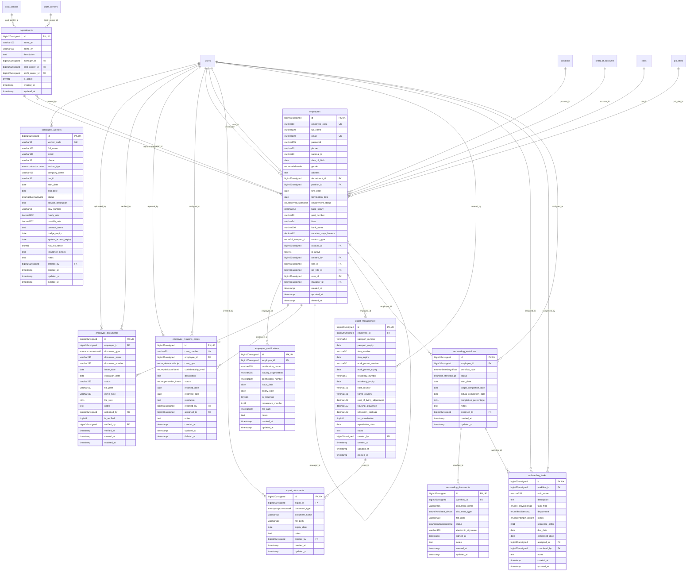

# HumanCapital - WorkforceAdmin

> **Bounded Context Schema & ERD**
> 11 Tables | Generated dynamically by ACCSYSTEM engine

---

## Tables List

- `contingent_workers`
- `departments`
- `employee_certifications`
- `employee_documents`
- `employee_relations_cases`
- `employees`
- `expat_documents`
- `expat_management`
- `onboarding_documents`
- `onboarding_tasks`
- `onboarding_workflows`

---

## Entity Relationship Diagram

---

## Data Dictionary

### Table: `contingent_workers`

| Column | Type | Nullable | Default | Indexes | Foreign Keys |
|---|---|---|---|---|---|
| `id` | `bigint(20) unsigned` | No |  | **PK** |  |
| `worker_code` | `varchar(50)` | No |  | *UK* |  |
| `full_name` | `varchar(100)` | No |  |  |  |
| `email` | `varchar(100)` | Yes | `NULL` |  |  |
| `phone` | `varchar(20)` | Yes | `NULL` |  |  |
| `worker_type` | `enum('contractor','consultant','freelancer','temp_agency')` | No | `'contractor'` |  |  |
| `company_name` | `varchar(255)` | Yes | `NULL` |  |  |
| `tax_id` | `varchar(50)` | Yes | `NULL` |  |  |
| `start_date` | `date` | No |  |  |  |
| `end_date` | `date` | Yes | `NULL` |  |  |
| `status` | `enum('active','inactive','terminated')` | No | `'active'` |  |  |
| `service_description` | `text` | Yes | `NULL` |  |  |
| `sow_number` | `varchar(50)` | Yes | `NULL` |  |  |
| `hourly_rate` | `decimal(10,2)` | Yes | `NULL` |  |  |
| `monthly_rate` | `decimal(10,2)` | Yes | `NULL` |  |  |
| `contract_terms` | `text` | Yes | `NULL` |  |  |
| `badge_expiry` | `date` | Yes | `NULL` |  |  |
| `system_access_expiry` | `date` | Yes | `NULL` |  |  |
| `has_insurance` | `tinyint(1)` | No | `0` |  |  |
| `insurance_details` | `text` | Yes | `NULL` |  |  |
| `notes` | `text` | Yes | `NULL` |  |  |
| `created_by` | `bigint(20) unsigned` | Yes | `NULL` | IDX | -> `users.id` |
| `created_at` | `timestamp` | Yes | `NULL` |  |  |
| `updated_at` | `timestamp` | Yes | `NULL` |  |  |
| `deleted_at` | `timestamp` | Yes | `NULL` |  |  |

### Table: `departments`

| Column | Type | Nullable | Default | Indexes | Foreign Keys |
|---|---|---|---|---|---|
| `id` | `bigint(20) unsigned` | No |  | **PK** |  |
| `name_ar` | `varchar(100)` | No |  |  |  |
| `name_en` | `varchar(100)` | Yes | `NULL` |  |  |
| `description` | `text` | Yes | `NULL` |  |  |
| `manager_id` | `bigint(20) unsigned` | Yes | `NULL` | IDX | -> `employees.id` |
| `cost_center_id` | `bigint(20) unsigned` | Yes | `NULL` | IDX | -> `cost_centers.id` |
| `profit_center_id` | `bigint(20) unsigned` | Yes | `NULL` | IDX | -> `profit_centers.id` |
| `is_active` | `tinyint(1)` | No | `1` |  |  |
| `created_at` | `timestamp` | Yes | `NULL` |  |  |
| `updated_at` | `timestamp` | Yes | `NULL` |  |  |

### Table: `employee_certifications`

| Column | Type | Nullable | Default | Indexes | Foreign Keys |
|---|---|---|---|---|---|
| `id` | `bigint(20) unsigned` | No |  | **PK** |  |
| `employee_id` | `bigint(20) unsigned` | No |  | IDX | -> `employees.id` |
| `certification_name` | `varchar(255)` | No |  |  |  |
| `issuing_organization` | `varchar(255)` | Yes | `NULL` |  |  |
| `certification_number` | `varchar(100)` | Yes | `NULL` |  |  |
| `issue_date` | `date` | Yes | `NULL` |  |  |
| `expiry_date` | `date` | Yes | `NULL` |  |  |
| `is_recurring` | `tinyint(1)` | No | `0` |  |  |
| `recurrence_months` | `int(11)` | Yes | `NULL` |  |  |
| `file_path` | `varchar(500)` | Yes | `NULL` |  |  |
| `notes` | `text` | Yes | `NULL` |  |  |
| `created_at` | `timestamp` | Yes | `NULL` |  |  |
| `updated_at` | `timestamp` | Yes | `NULL` |  |  |

### Table: `employee_documents`

| Column | Type | Nullable | Default | Indexes | Foreign Keys |
|---|---|---|---|---|---|
| `id` | `bigint(20) unsigned` | No |  | **PK** |  |
| `employee_id` | `bigint(20) unsigned` | No |  | IDX | -> `employees.id` |
| `document_type` | `enum('cv','contract','certificate','other')` | No |  |  |  |
| `document_name` | `varchar(255)` | No |  |  |  |
| `document_number` | `varchar(255)` | Yes | `NULL` |  |  |
| `issue_date` | `date` | Yes | `NULL` |  |  |
| `expiration_date` | `date` | Yes | `NULL` |  |  |
| `status` | `varchar(255)` | No | `'active'` |  |  |
| `file_path` | `varchar(500)` | No |  |  |  |
| `mime_type` | `varchar(100)` | Yes | `NULL` |  |  |
| `file_size` | `int(11)` | Yes | `NULL` |  |  |
| `notes` | `text` | Yes | `NULL` |  |  |
| `uploaded_by` | `bigint(20) unsigned` | Yes | `NULL` | IDX | -> `users.id` |
| `is_verified` | `tinyint(1)` | No | `0` |  |  |
| `verified_by` | `bigint(20) unsigned` | Yes | `NULL` | IDX | -> `users.id` |
| `verified_at` | `timestamp` | Yes | `NULL` |  |  |
| `created_at` | `timestamp` | Yes | `NULL` |  |  |
| `updated_at` | `timestamp` | Yes | `NULL` |  |  |

### Table: `employee_relations_cases`

| Column | Type | Nullable | Default | Indexes | Foreign Keys |
|---|---|---|---|---|---|
| `id` | `bigint(20) unsigned` | No |  | **PK** |  |
| `case_number` | `varchar(50)` | No |  | *UK* |  |
| `employee_id` | `bigint(20) unsigned` | No |  | IDX | -> `employees.id` |
| `case_type` | `enum('grievance','disciplinary','investigation','whistleblowing','complaint','other')` | No | `'grievance'` |  |  |
| `confidentiality_level` | `enum('public','confidential','highly_confidential')` | No | `'confidential'` |  |  |
| `description` | `text` | No |  |  |  |
| `status` | `enum('open','under_investigation','hearing','resolved','closed','escalated')` | No | `'open'` |  |  |
| `reported_date` | `date` | No |  |  |  |
| `resolved_date` | `date` | Yes | `NULL` |  |  |
| `resolution` | `text` | Yes | `NULL` |  |  |
| `reported_by` | `bigint(20) unsigned` | Yes | `NULL` | IDX | -> `users.id` |
| `assigned_to` | `bigint(20) unsigned` | Yes | `NULL` | IDX | -> `users.id` |
| `notes` | `text` | Yes | `NULL` |  |  |
| `created_at` | `timestamp` | Yes | `NULL` |  |  |
| `updated_at` | `timestamp` | Yes | `NULL` |  |  |
| `deleted_at` | `timestamp` | Yes | `NULL` |  |  |

### Table: `employees`

| Column | Type | Nullable | Default | Indexes | Foreign Keys |
|---|---|---|---|---|---|
| `id` | `bigint(20) unsigned` | No |  | **PK** |  |
| `employee_code` | `varchar(50)` | No |  | *UK* |  |
| `full_name` | `varchar(100)` | No |  |  |  |
| `email` | `varchar(100)` | No |  | *UK* |  |
| `password` | `varchar(255)` | No |  |  |  |
| `phone` | `varchar(20)` | Yes | `NULL` |  |  |
| `national_id` | `varchar(20)` | Yes | `NULL` |  |  |
| `date_of_birth` | `date` | Yes | `NULL` |  |  |
| `gender` | `enum('male','female')` | Yes | `NULL` |  |  |
| `address` | `text` | Yes | `NULL` |  |  |
| `department_id` | `bigint(20) unsigned` | Yes | `NULL` | IDX | -> `departments.id` |
| `position_id` | `bigint(20) unsigned` | Yes | `NULL` | IDX | -> `positions.id` |
| `hire_date` | `date` | No |  |  |  |
| `termination_date` | `date` | Yes | `NULL` |  |  |
| `employment_status` | `enum('active','suspended','terminated')` | No | `'active'` |  |  |
| `base_salary` | `decimal(15,2)` | No | `0.00` |  |  |
| `gosi_number` | `varchar(50)` | Yes | `NULL` |  |  |
| `iban` | `varchar(34)` | Yes | `NULL` |  |  |
| `bank_name` | `varchar(100)` | Yes | `NULL` |  |  |
| `vacation_days_balance` | `decimal(8,2)` | No | `0.00` |  |  |
| `contract_type` | `enum('full_time','part_time','contract','freelance')` | No | `'full_time'` |  |  |
| `account_id` | `bigint(20) unsigned` | Yes | `NULL` | IDX | -> `chart_of_accounts.id` |
| `is_active` | `tinyint(1)` | No | `1` |  |  |
| `created_by` | `bigint(20) unsigned` | Yes | `NULL` | IDX | -> `users.id` |
| `role_id` | `bigint(20) unsigned` | Yes | `NULL` | IDX | -> `roles.id` |
| `job_title_id` | `bigint(20) unsigned` | Yes | `NULL` | IDX | -> `job_titles.id` |
| `user_id` | `bigint(20) unsigned` | Yes | `NULL` | IDX | -> `users.id` |
| `manager_id` | `bigint(20) unsigned` | Yes | `NULL` | IDX | -> `employees.id` |
| `created_at` | `timestamp` | Yes | `NULL` |  |  |
| `updated_at` | `timestamp` | Yes | `NULL` |  |  |
| `deleted_at` | `timestamp` | Yes | `NULL` |  |  |

### Table: `expat_documents`

| Column | Type | Nullable | Default | Indexes | Foreign Keys |
|---|---|---|---|---|---|
| `id` | `bigint(20) unsigned` | No |  | **PK** |  |
| `expat_id` | `bigint(20) unsigned` | No |  | IDX | -> `expat_management.id` |
| `document_type` | `enum('passport','visa','work_permit','residency','contract','other')` | No | `'other'` |  |  |
| `document_name` | `varchar(255)` | No |  |  |  |
| `file_path` | `varchar(500)` | No |  |  |  |
| `expiry_date` | `date` | Yes | `NULL` |  |  |
| `notes` | `text` | Yes | `NULL` |  |  |
| `created_by` | `bigint(20) unsigned` | Yes | `NULL` | IDX | -> `users.id` |
| `created_at` | `timestamp` | Yes | `NULL` |  |  |
| `updated_at` | `timestamp` | Yes | `NULL` |  |  |

### Table: `expat_management`

| Column | Type | Nullable | Default | Indexes | Foreign Keys |
|---|---|---|---|---|---|
| `id` | `bigint(20) unsigned` | No |  | **PK** |  |
| `employee_id` | `bigint(20) unsigned` | No |  | IDX | -> `employees.id` |
| `passport_number` | `varchar(50)` | Yes | `NULL` |  |  |
| `passport_expiry` | `date` | Yes | `NULL` |  |  |
| `visa_number` | `varchar(50)` | Yes | `NULL` |  |  |
| `visa_expiry` | `date` | Yes | `NULL` |  |  |
| `work_permit_number` | `varchar(50)` | Yes | `NULL` |  |  |
| `work_permit_expiry` | `date` | Yes | `NULL` |  |  |
| `residency_number` | `varchar(50)` | Yes | `NULL` |  |  |
| `residency_expiry` | `date` | Yes | `NULL` |  |  |
| `host_country` | `varchar(100)` | Yes | `NULL` |  |  |
| `home_country` | `varchar(100)` | Yes | `NULL` |  |  |
| `cost_of_living_adjustment` | `decimal(10,2)` | No | `0.00` |  |  |
| `housing_allowance` | `decimal(10,2)` | No | `0.00` |  |  |
| `relocation_package` | `decimal(10,2)` | No | `0.00` |  |  |
| `tax_equalization` | `tinyint(1)` | No | `0` |  |  |
| `repatriation_date` | `date` | Yes | `NULL` |  |  |
| `notes` | `text` | Yes | `NULL` |  |  |
| `created_by` | `bigint(20) unsigned` | Yes | `NULL` | IDX | -> `users.id` |
| `created_at` | `timestamp` | Yes | `NULL` |  |  |
| `updated_at` | `timestamp` | Yes | `NULL` |  |  |
| `deleted_at` | `timestamp` | Yes | `NULL` |  |  |

### Table: `onboarding_documents`

| Column | Type | Nullable | Default | Indexes | Foreign Keys |
|---|---|---|---|---|---|
| `id` | `bigint(20) unsigned` | No |  | **PK** |  |
| `workflow_id` | `bigint(20) unsigned` | No |  | IDX | -> `onboarding_workflows.id` |
| `document_name` | `varchar(255)` | No |  |  |  |
| `document_type` | `enum('i9','w4','direct_deposit','nda','contract','policy','other')` | No | `'other'` |  |  |
| `file_path` | `varchar(500)` | Yes | `NULL` |  |  |
| `status` | `enum('pending','sent','signed','completed')` | No | `'pending'` |  |  |
| `electronic_signature` | `varchar(500)` | Yes | `NULL` |  |  |
| `signed_at` | `timestamp` | Yes | `NULL` |  |  |
| `notes` | `text` | Yes | `NULL` |  |  |
| `created_at` | `timestamp` | Yes | `NULL` |  |  |
| `updated_at` | `timestamp` | Yes | `NULL` |  |  |

### Table: `onboarding_tasks`

| Column | Type | Nullable | Default | Indexes | Foreign Keys |
|---|---|---|---|---|---|
| `id` | `bigint(20) unsigned` | No |  | **PK** |  |
| `workflow_id` | `bigint(20) unsigned` | No |  | IDX | -> `onboarding_workflows.id` |
| `task_name` | `varchar(255)` | No |  |  |  |
| `description` | `text` | Yes | `NULL` |  |  |
| `task_type` | `enum('it_provisioning','badge_access','system_id','document','training','facilities','security','payroll','other')` | No | `'other'` |  |  |
| `department` | `enum('it','facilities','security','hr','payroll','other')` | No | `'hr'` |  |  |
| `status` | `enum('pending','in_progress','completed','blocked')` | No | `'pending'` |  |  |
| `sequence_order` | `int(11)` | No | `0` |  |  |
| `due_date` | `date` | Yes | `NULL` |  |  |
| `completed_date` | `date` | Yes | `NULL` |  |  |
| `assigned_to` | `bigint(20) unsigned` | Yes | `NULL` | IDX | -> `users.id` |
| `completed_by` | `bigint(20) unsigned` | Yes | `NULL` | IDX | -> `users.id` |
| `notes` | `text` | Yes | `NULL` |  |  |
| `created_at` | `timestamp` | Yes | `NULL` |  |  |
| `updated_at` | `timestamp` | Yes | `NULL` |  |  |

### Table: `onboarding_workflows`

| Column | Type | Nullable | Default | Indexes | Foreign Keys |
|---|---|---|---|---|---|
| `id` | `bigint(20) unsigned` | No |  | **PK** |  |
| `employee_id` | `bigint(20) unsigned` | No |  | IDX | -> `employees.id` |
| `workflow_type` | `enum('onboarding','offboarding')` | No | `'onboarding'` |  |  |
| `status` | `enum('not_started','in_progress','completed','cancelled')` | No | `'not_started'` |  |  |
| `start_date` | `date` | No |  |  |  |
| `target_completion_date` | `date` | Yes | `NULL` |  |  |
| `actual_completion_date` | `date` | Yes | `NULL` |  |  |
| `completion_percentage` | `int(11)` | No | `0` |  |  |
| `notes` | `text` | Yes | `NULL` |  |  |
| `assigned_to` | `bigint(20) unsigned` | Yes | `NULL` | IDX | -> `users.id` |
| `created_at` | `timestamp` | Yes | `NULL` |  |  |
| `updated_at` | `timestamp` | Yes | `NULL` |  |  |

