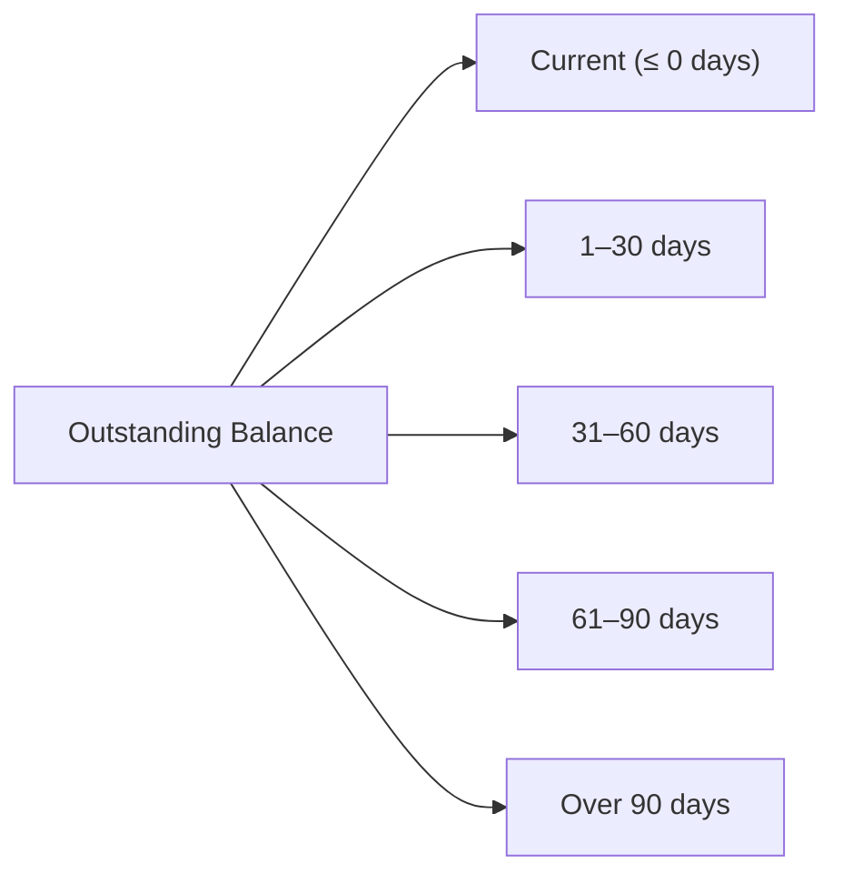

# Predictive Models

## Business Context & Objective

The AdvancedAnalytics subdomain provides the formal financial and operational reports used for period close, management decision-making, and regulatory compliance. Despite the task title referencing predictive models, the actual subdomain implementation delivers deterministic financial reports — Balance Sheet, Profit and Loss, Cash Flow, Aging Receivables, Aging Payables, and Comparative Financial Report — derived directly from General Ledger and Accounts Receivable data. Finance controllers, CFOs, external auditors, and board members are the primary users. Each report is generated on demand for a specified date or period.

<!-- [ASSUMPTION] -->
> **Note:** The task references "Predictive Models" but the subdomain contains no machine learning, forecasting, or statistical modeling implementations. All actions in `AdvancedAnalytics` generate deterministic financial statements. This document covers the actual implemented capability. If predictive analytics (demand forecasting, cash flow projection, etc.) are planned, they have not yet been implemented and should be tracked as a separate escalation.

## Available Reports

| Report | Action | Primary Input | Output |
|--------|--------|--------------|--------|
| Balance Sheet | GenerateBalanceSheetReportAction / GetBalanceSheetAction | as_of_date | Assets, Liabilities, Equity breakdown with computed net income |
| Profit and Loss | GenerateProfitLossReportAction / GetProfitLossAction | period dates | Revenue vs Expense with net profit figure |
| Cash Flow | GenerateCashFlowReportAction | period dates | GL-derived cash movement summary |
| Aging Receivables | GenerateAgingReceivablesReportAction / GetAgingReportAction | as_of_date | Customer-level AR aging in 5 time buckets |
| Aging Payables | GenerateAgingPayablesReportAction | as_of_date | Supplier-level AP aging in 5 time buckets |
| Comparative Financial | GenerateComparativeFinancialReportAction | two periods | Period-over-period financial comparison |

## Aging Report Structure

Aging reports segment outstanding balances into the following standardized time buckets:

Each aging bucket is computed using a DATEDIFF comparison against the transaction_date and the as_of_date parameter. Balances of zero or below are excluded from the output.

## Balance Sheet Architecture

The Balance Sheet report derives its figures entirely from the General Ledger via account_type classification. A virtual `NET_INCOME_VIRTUAL` entry is appended to the Equity section when net income (Revenue minus Expenses for the period) is non-zero, ensuring the accounting equation (Assets = Liabilities + Equity) is maintained without requiring a manual closing entry.

## Business Rules & Constraints

1. All reports use the General Ledger as the single source of truth; no report reads directly from invoice or purchase tables for financial figures (aging reports read ArTransaction records which are themselves GL-linked).
2. Reports are stateless and generated on demand; there is no caching or pre-computation layer. Each report request executes fresh database queries.
3. The `as_of_date` parameter defaults to the current date if not provided; historical reporting is supported by supplying any valid past date.
4. The `reports → view` permission is required to access all AdvancedAnalytics actions.

## Key Operations

**GenerateBalanceSheetReportAction** / **GetBalanceSheetAction** query GL entries by account_type, compute account-level balances using CREDIT/DEBIT logic, append the virtual net income line to equity, and return the three-section balance sheet.

**GenerateAgingReceivablesReportAction** queries ArTransaction records joined to customer records, applies DATEDIFF bucketing for five aging intervals, and returns customer-level rows with bucket subtotals and a grand total row.

## Known Constraints

- There is no report scheduling or export-to-file functionality in the current implementation; reports are delivered as JSON API responses only.
- The Comparative Financial report format and comparison dimensions are not fully documented in the source; its exact output structure is subject to business confirmation.
