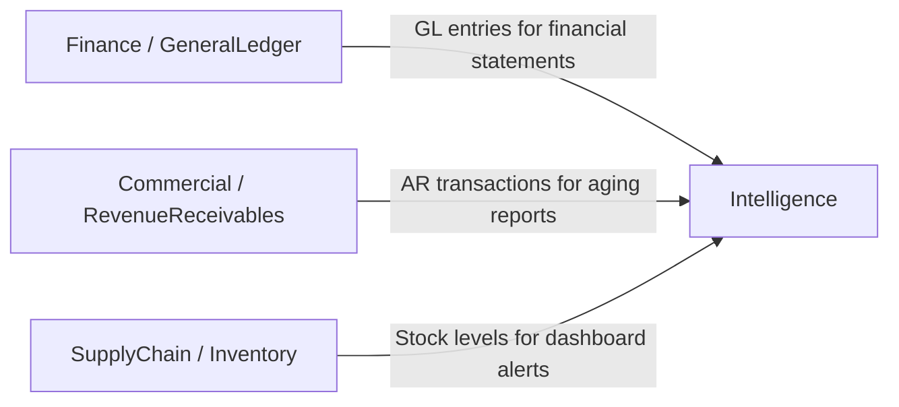

# Intelligence — Domain Overview

## Business Purpose

The Intelligence domain provides the analytical and reporting layer for accore. Its mission is to transform transactional data generated across all operational domains into structured reports, KPI dashboards, and financial statements that support executive decision-making, investor communication, financial close processes, and operational oversight. CFOs, finance controllers, executive management, and business analysts are the primary consumers. The domain acts as a read-only aggregation layer — it owns no master data but derives all its outputs from the General Ledger, Accounts Receivable, Accounts Payable, and operational domain records.

## Bounded Context Boundaries

The Intelligence domain does not own any transactional or master data. It reads from the Finance domain's GeneralLedger, the Commercial domain's ArTransaction and Invoice records, and the SupplyChain domain's Inventory and Procurement records. All data mutations occur in the originating domains; the Intelligence domain's actions are strictly read operations that compute derived outputs.

## Subdomains

| Subdomain | Description |
|-----------|-------------|
| BusinessIntelligence | Provides executive KPI dashboards aggregating key financial metrics, inventory alerts, and sales performance indicators in real time. |
| AdvancedAnalytics | Generates formal financial statements and aging analysis reports: Balance Sheet, Profit and Loss, Cash Flow, Comparative Financial Report, Aging Receivables, and Aging Payables. |

## Key Capabilities

The **BusinessIntelligence** subdomain delivers a multi-metric executive dashboard that surfaces total net revenue, today's sales, total expense, net profit, current AR balance, current AP balance, invoice count, low-stock product alerts, and items approaching expiry. Separate detail endpoints drill into low-stock and expiring inventory with product-level data.

The **AdvancedAnalytics** subdomain generates the six core financial and operational reports used for period close, audit preparation, and management reporting:

- **Balance Sheet** — Assets, Liabilities, and Equity as of a specified date, with net income computed from the GL.
- **Profit and Loss** — Revenue versus Expense comparison for a defined period.
- **Cash Flow** — GL-derived cash movement summary.
- **Aging Receivables** — Customer-level receivables bucketed into current, 1–30, 31–60, 61–90, and over-90-day aging bands.
- **Aging Payables** — Supplier-level payables in the same aging structure.
- **Comparative Financial Report** — Period-over-period or budget-versus-actual financial comparison.

## Integration Points

## Documentation Scope

| Document | Task ID | Status |
|----------|---------|--------|
| Intelligence Domain Overview | INT-001 | draft |
| Standard Dashboards | INT-002 | draft |
| Predictive Models | INT-003 | draft |
