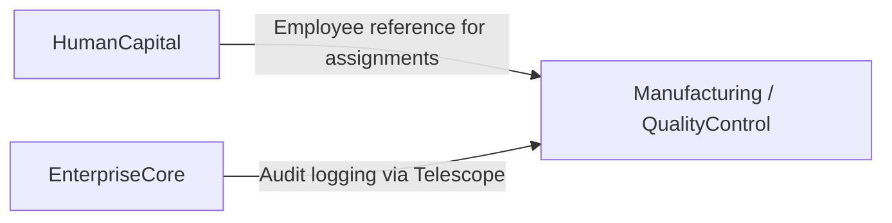

# Manufacturing — Domain Overview

## Business Purpose

The Manufacturing domain encompasses the organization's engineering and production control capabilities within accore. Its business purpose is to govern the design of products through bills of materials and formulas, orchestrate production work orders and routing, and enforce quality assurance standards through inspection, compliance tracking, and corrective action processes. Production managers, quality officers, process engineers, and supply chain coordinators are the primary stakeholders.

## Implementation Status

> **NOTICE:** The Manufacturing domain is currently in partial implementation. The QualityControl subdomain is the only subdomain with production-ready source code. The Engineering and ProductionControl subdomains are declared as future expansion in the domain README and do not have implemented models, actions, or services. Documentation for those subdomains has been escalated for business prioritization.

## Bounded Context Boundaries

The Manufacturing domain owns quality compliance records, corrective action and preventive action (CAPA) records associated with quality events, and any quality-driven process data. It receives employee context from the HumanCapital domain for assigning compliance activities and CAPs to specific personnel.

Bills of materials, work order management, and production routing are intended to be owned by the Engineering and ProductionControl subdomains respectively. These boundaries are defined but not implemented.

## Subdomains

| Subdomain | Description | Status |
|-----------|-------------|--------|
| QualityControl | Manages quality compliance checks, audit findings, and corrective and preventive action (CAPA) records. | Implemented |
| Engineering | Intended to manage bills of materials, product formulas, and engineering change orders. | Future expansion |
| ProductionControl | Intended to manage production work orders, routing, and floor scheduling. | Future expansion |

## Key Domain Entities (Implemented)

The **QaCompliance** entity records a formal quality compliance activity, capturing the compliance type, applicable standard, responsible employee, assigned reviewer, findings, corrective actions, and a status-tracked lifecycle from open to completed.

The **Capa** entity records a single Corrective and Preventive Action arising from a quality compliance finding. It captures the issue description, root cause analysis, action plan, verification outcome, target and completion dates, and a status lifecycle from open through verified completion.

## Integration Points

## Documentation Scope

| Document | Task ID | Status |
|----------|---------|--------|
| Manufacturing Domain Overview | MFG-001 | draft |
| Bill of Materials and Formulas | MFG-002 | escalated |
| Work Orders and Routing | MFG-003 | escalated |
| Inspections and Tolerances | MFG-004 | draft |
