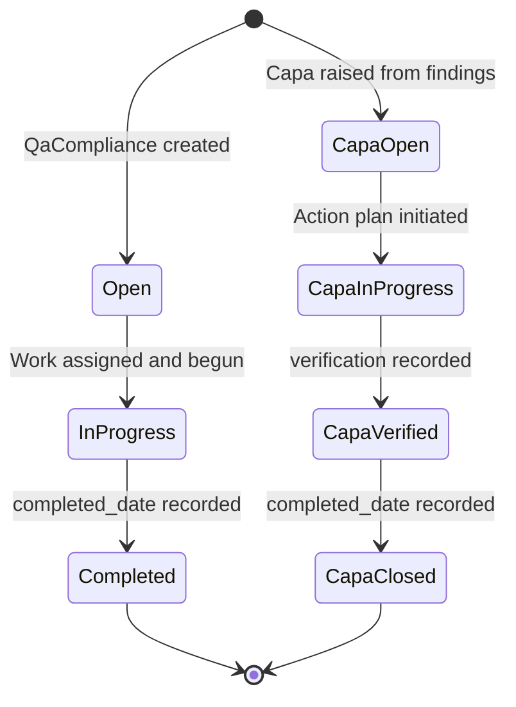

# Inspections and Tolerances

## Business Context & Objective

Quality assurance in a manufacturing environment requires systematic inspection of processes and outputs against defined standards, coupled with a formal response mechanism when non-conformances are detected. The QualityControl subdomain provides the framework for conducting quality compliance checks against named industry or regulatory standards, capturing inspection findings, and managing corrective and preventive actions (CAPAs) that result from those findings. Quality officers, process engineers, compliance managers, and employees subject to compliance activities are the primary users. The subdomain creates a traceable record linking every non-conformance finding to the action taken to resolve and prevent recurrence.

## Domain Entities

| Entity | Business Definition | Role |
|--------|-------------------|------|
| QaCompliance | A formal quality compliance activity record that tracks the application of a named quality standard to an employee, process, or product area. | The root audit and inspection record; parent to zero or more CAPA records. |
| Capa | A Corrective and Preventive Action record raised in response to findings in a QaCompliance activity. It documents root cause, action plan, verification, and completion. | The resolution and closure record for each identified non-conformance. |

## State Machine / Lifecycle

## Business Rules & Constraints

1. A QaCompliance record may be linked to a specific employee via employee_id; if the compliance activity is process-wide rather than person-specific, this field is nullable.
2. A QaCompliance record in Completed status must have both a completed_date and a completed_by reference; closing without these fields is not permitted.
3. A Capa record is associated with a parent QaCompliance via compliance_id; all CAPA records inherit the context of the quality event that generated them.
4. A Capa record with type = `corrective` must include both a root_cause and an action_plan before its status can progress past InProgress.
5. A Capa record of type = `preventive` must include a verification entry before it can be marked as completed.
6. Both QaCompliance and Capa records support soft deletion via the SoftDeletes trait; deleted records are retained in the database and visible in historical audit queries.

## Integration Events

| Event | Direction | Connected Domain | Trigger |
|-------|-----------|-----------------|---------|
| QaCompliance Employee Link | Inbound | HumanCapital / WorkforceAdmin | Employee record is referenced on compliance creation |
| CAPA Assignment | Internal | QualityControl | CAPA assigned_to references a User; notification may be dispatched |

## Key Operations

**CreateQaComplianceAction** registers a new compliance activity, specifying the compliance_type, applicable standard_name, associated employee, assigned reviewer, due date, and initial findings.

**CreateCapaAction** raises a corrective or preventive action record against a parent QaCompliance, documenting the issue description, root cause (for corrective), action plan, target date, and assigned responsible party.

**UpdateQaComplianceAction** allows the assigned reviewer to record findings, corrective action details, and ultimately mark the compliance activity as Completed with the completion date and responsible user.

**UpdateCapaAction** allows the CAPA owner to record progress, update the action plan, log the verification outcome, and mark the CAPA as closed with the completion date.

## Known Constraints

- A QaCompliance record cannot be hard-deleted after creation; soft deletion is the only supported removal path.
- CAPA records are fully traceable to their parent QaCompliance and cannot be orphaned; the compliance_id foreign key is required and non-nullable.
- Status transitions for both QaCompliance and CAPA records are not enforced by a formal state machine in the current implementation; status values are free-text constrained by application-level validation.

## Assumptions & Open Questions

<!-- [ASSUMPTION] -->
The compliance_type field on QaCompliance is assumed to be an enumerated set (e.g., internal audit, external audit, regulatory inspection) based on naming convention. The exact permitted values are not defined in the model and may be validated at the controller or DTO layer. Business confirmation of the compliance type vocabulary is required.
