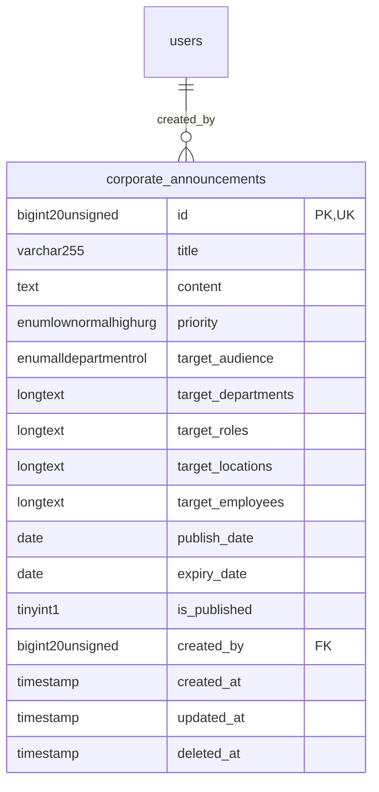

# Platform - Communication

> **Bounded Context Schema & ERD**
> 1 Tables | Generated dynamically by ACCSYSTEM engine

---

## Tables List

- `corporate_announcements`

---

## Entity Relationship Diagram

---

## Data Dictionary

### Table: `corporate_announcements`

| Column | Type | Nullable | Default | Indexes | Foreign Keys |
|---|---|---|---|---|---|
| `id` | `bigint(20) unsigned` | No |  | **PK** |  |
| `title` | `varchar(255)` | No |  |  |  |
| `content` | `text` | No |  |  |  |
| `priority` | `enum('low','normal','high','urgent')` | No | `'normal'` |  |  |
| `target_audience` | `enum('all','department','role','location','custom')` | No | `'all'` |  |  |
| `target_departments` | `longtext` | Yes | `NULL` |  |  |
| `target_roles` | `longtext` | Yes | `NULL` |  |  |
| `target_locations` | `longtext` | Yes | `NULL` |  |  |
| `target_employees` | `longtext` | Yes | `NULL` |  |  |
| `publish_date` | `date` | No |  |  |  |
| `expiry_date` | `date` | Yes | `NULL` |  |  |
| `is_published` | `tinyint(1)` | No | `0` |  |  |
| `created_by` | `bigint(20) unsigned` | Yes | `NULL` | IDX | -> `users.id` |
| `created_at` | `timestamp` | Yes | `NULL` |  |  |
| `updated_at` | `timestamp` | Yes | `NULL` |  |  |
| `deleted_at` | `timestamp` | Yes | `NULL` |  |  |

