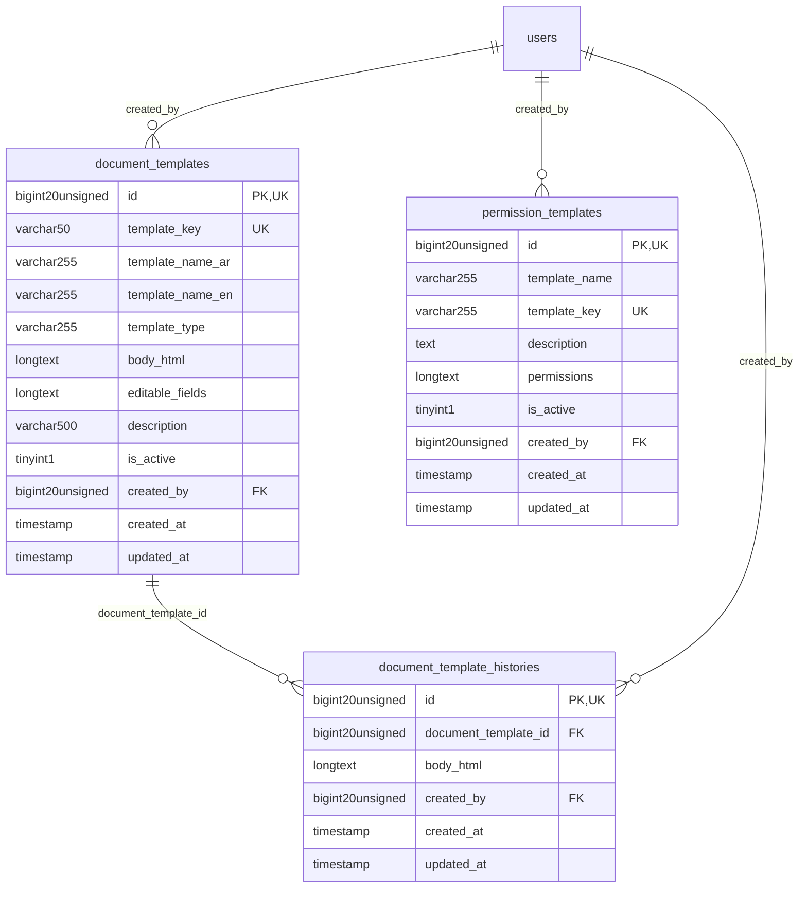

# Platform - Customization

> **Bounded Context Schema & ERD**
> 3 Tables | Generated dynamically by accoregine

---

## Tables List

- `document_template_histories`
- `document_templates`
- `permission_templates`

---

## Entity Relationship Diagram

---

## Data Dictionary

### Table: `document_template_histories`

| Column | Type | Nullable | Default | Indexes | Foreign Keys |
|---|---|---|---|---|---|
| `id` | `bigint(20) unsigned` | No |  | **PK** |  |
| `document_template_id` | `bigint(20) unsigned` | No |  | IDX | -> `document_templates.id` |
| `body_html` | `longtext` | No |  |  |  |
| `created_by` | `bigint(20) unsigned` | Yes | `NULL` | IDX | -> `users.id` |
| `created_at` | `timestamp` | Yes | `NULL` |  |  |
| `updated_at` | `timestamp` | Yes | `NULL` |  |  |

### Table: `document_templates`

| Column | Type | Nullable | Default | Indexes | Foreign Keys |
|---|---|---|---|---|---|
| `id` | `bigint(20) unsigned` | No |  | **PK** |  |
| `template_key` | `varchar(50)` | No |  | *UK* |  |
| `template_name_ar` | `varchar(255)` | No |  |  |  |
| `template_name_en` | `varchar(255)` | Yes | `NULL` |  |  |
| `template_type` | `varchar(255)` | No | `'other'` |  |  |
| `body_html` | `longtext` | No |  |  |  |
| `editable_fields` | `longtext` | Yes | `NULL` |  |  |
| `description` | `varchar(500)` | Yes | `NULL` |  |  |
| `is_active` | `tinyint(1)` | No | `1` |  |  |
| `created_by` | `bigint(20) unsigned` | Yes | `NULL` | IDX | -> `users.id` |
| `created_at` | `timestamp` | Yes | `NULL` |  |  |
| `updated_at` | `timestamp` | Yes | `NULL` |  |  |

### Table: `permission_templates`

| Column | Type | Nullable | Default | Indexes | Foreign Keys |
|---|---|---|---|---|---|
| `id` | `bigint(20) unsigned` | No |  | **PK** |  |
| `template_name` | `varchar(255)` | No |  |  |  |
| `template_key` | `varchar(255)` | No |  | *UK* |  |
| `description` | `text` | Yes | `NULL` |  |  |
| `permissions` | `longtext` | No |  |  |  |
| `is_active` | `tinyint(1)` | No | `1` |  |  |
| `created_by` | `bigint(20) unsigned` | Yes | `NULL` | IDX | -> `users.id` |
| `created_at` | `timestamp` | Yes | `NULL` |  |  |
| `updated_at` | `timestamp` | Yes | `NULL` |  |  |

