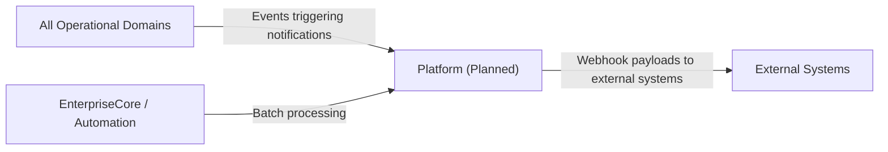

# Platform — Domain Overview

## Business Purpose

The Platform domain is designed to provide the digital infrastructure services that enable ACCSYSTEM's integration, communication, and extensibility capabilities. This includes outbound and inbound email and SMS notification channels, an API gateway and webhook dispatching infrastructure for third-party integrations, and dynamic field and form customization tools for adapting the ERP's data model to organization-specific requirements. Platform and integration engineers, and system administrators are the intended users.

## Implementation Status

> **NOTICE:** The Platform domain is a placeholder for future expansion. The domain directory contains only a README file. The README identifies Compliance (compliance profiles, token management, external pull endpoints) and Automation (batch processing) as the current capabilities, but these are in EnterpriseCore and are not implemented as Platform-domain subdomains. The Communication, IntegrationHub, and Customization subdomains referenced in the task plan do not exist. Documentation for those subdomains has been escalated pending implementation.

## Planned Subdomains

| Subdomain | Planned Capability | Status |
|-----------|-------------------|--------|
| Communication | Email and SMS notification dispatching for system events and workflows. | Future expansion |
| IntegrationHub | API gateway management, webhook event dispatching, and external system connector configuration. | Future expansion |
| Customization | Dynamic custom field definition and dynamic form schema management for tenant-level ERP customization. | Future expansion |

## Integration Points

## Documentation Scope

| Document | Task ID | Status |
|----------|---------|--------|
| Platform Domain Overview | PLT-001 | draft |
| Email, SMS and Notifications | PLT-002 | escalated |
| API Gateway and Webhooks | PLT-003 | escalated |
| Dynamic Fields and Forms | PLT-004 | escalated |
