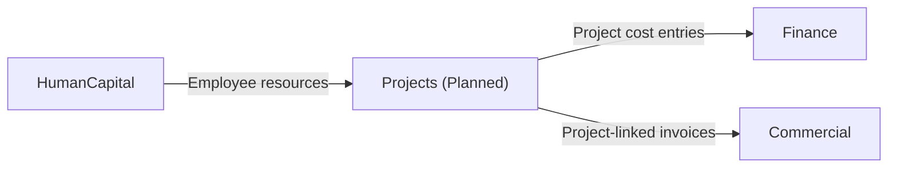

# Projects — Domain Overview

## Business Purpose

The Projects domain is designed to govern project-based work within ACCSYSTEM, covering work breakdown structure (WBS) and cost tracking, resource allocation and planning, and milestone and progress management. Project managers, resource coordinators, and finance controllers are the intended stakeholders. The domain is designed to bridge operational project management with financial performance tracking, enabling organizations to track project profitability, resource utilization, and delivery progress within the same ERP system.

## Implementation Status

> **NOTICE:** The Projects domain is a placeholder for future expansion. The domain directory contains only a README file. No subdomain implementations exist — ProjectFinance, ProjectPlanning, and ExecutionTracking are all declared as future capabilities with no current models, actions, or services. All subdomain-specific documentation tasks (PRJ-002, PRJ-003, PRJ-004) have been escalated pending implementation.

## Bounded Context Boundaries

When implemented, the Projects domain is expected to own the project record as its root aggregate, with sub-records for WBS nodes, resource assignments, milestones, and cost entries. It will integrate with the Finance domain for project cost posting, with HumanCapital for employee resource assignment, and with Commercial for project-linked invoicing.

## Planned Subdomains

| Subdomain | Planned Capability | Status |
|-----------|-------------------|--------|
| ProjectFinance | WBS definition, budget tracking, cost variance reporting, and project-level profitability. | Future expansion |
| ProjectPlanning | Resource allocation, capacity planning, and team assignment to project tasks. | Future expansion |
| ExecutionTracking | Milestone management, progress reporting, and project status updates. | Future expansion |

## Integration Points

## Documentation Scope

| Document | Task ID | Status |
|----------|---------|--------|
| Projects Domain Overview | PRJ-001 | draft |
| WBS and Cost Tracking | PRJ-002 | escalated |
| Resource Allocation | PRJ-003 | escalated |
| Milestones and Progress | PRJ-004 | escalated |
