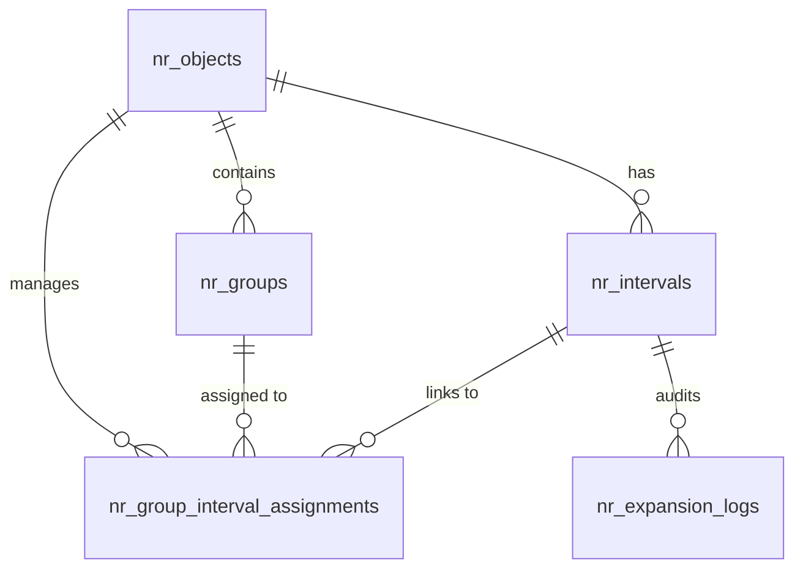

# Database Schema

The Numeration system relies on 5 primary interconnected tables that ensure data integrity, concurrency safety, and historical traceability.

## 1. Objects Table `nr_objects`
Stores the main entity types registered in the system.
- `id`: Primary Key.
- `object_type`: Unique key for the entity (e.g., `employees`, `invoices`).
- `name` / `name_en`: Display names in Arabic and English.
- `number_length`: The total length of the numeric part.
- `prefix`: Optional string prepended to the generated number.
- `is_active`: Global activation status.

## 2. Groups Table `nr_groups`
Stores sub-categories for each NR Object.
- `id`: Primary Key.
- `nr_object_id`: Foreign key to `nr_objects`.
- `code`: Unique group code (e.g., `GRP-01`).
- `name` / `name_en`: Group names.
- `description`: Detailed description.

## 3. Intervals Table `nr_intervals`
Stores the actual numeric ranges and their state.
- `id`: Primary Key.
- `nr_object_id`: Foreign key to `nr_objects`.
- `code`: Unique identifier for the interval (e.g., `INT-01`).
- `from_number`: Start of the range.
- `to_number`: End of the range.
- `current_number`: Current position (0 if not yet started).
- `is_external`: Boolean. If true, user provides the number manually (checked against range).
- `is_active`: Activation status.

## 4. Assignments Table `nr_group_interval_assignments`
The junction table linking Groups to Intervals.
- `id`: Primary Key.
- `nr_object_id`: Foreign key to `nr_objects`.
- `nr_group_id`: Foreign key to `nr_groups`.
- `nr_interval_id`: Foreign key to `nr_intervals`.
- `is_active`: Link status.

## 5. Expansion Logs Table `nr_expansion_logs`
An audit trail for all range adjustments.
- `id`: Primary Key.
- `nr_interval_id`: The affected interval.
- `old_from` / `old_to`: Boundaries before expansion.
- `new_from` / `new_to`: Boundaries after expansion.
- `reason`: Mandatory text field explaining why the expansion was needed.
- `expanded_by`: Foreign key to the `users` table.

## Entity Relationship Diagram (ERD)

