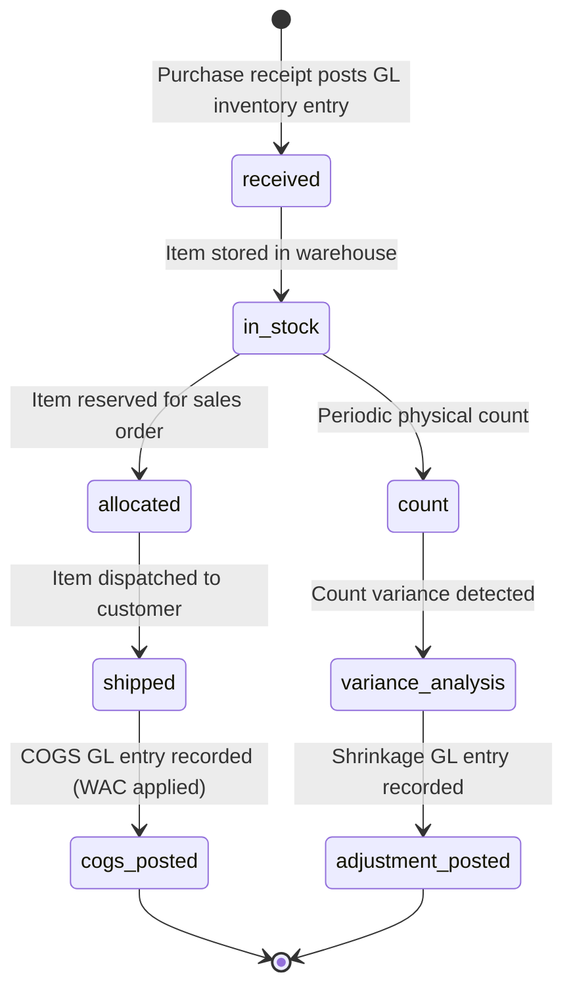

# Stock Valuation & Inventory Movements

## Business Context & Objective

Inventory valuation is the process of assigning monetary value to physical stock based on acquisition cost. It is fundamental to COGS calculation, balance sheet accuracy, and period-end financial reporting. Warehouse managers, cost accountants, and finance controllers depend on accurate inventory valuation to track asset value, calculate profitability, and detect shrinkage or obsolescence. SupplyChain uses Weighted-Average Costing (WAC) to ensure consistent, objective valuation regardless of procurement timing or sequencing. Every inventory movement (purchase receipt, sales shipment, internal transfer) updates the WAC and GL inventory accounts in real-time.

## Domain Entities

| Entity | Business Definition | Role |
|--------|-------------------|------|
| **Product** | An item in the master catalog with item_type, unit structure, and weighted_average_cost. | Central entity for inventory control. WAC is updated with every purchase receipt or COGS posting. |
| **InventoryCount** | A periodic physical count record reconciling system quantities to physical stock. | Used for cycle counting, period-end reconciliation, and shrinkage detection. |
| **Batch** | A logical grouping of items for traceability, expiration tracking, or lot-level accounting. | Enables batch-level costing and expiration date management. |

## State Machine / Lifecycle

Product inventory progresses through receipt, holding, and consumption states:

<!-- [ASSUMPTION] --> WAC is recalculated with every purchase receipt; historical transactions are not revalued retroactively.

## Business Rules & Constraints

1. **Weighted-Average Costing** — Product.weighted_average_cost is updated with every purchase: new_wac = (current_stock * wac + new_qty * new_price) / (current_stock + new_qty).
2. **No FIFO or LIFO** — Only WAC is supported; FIFO/LIFO valuation is not available.
3. **Unit Structure** — Products support composite units (main unit with items_per_unit sub-units). Stock quantity is tracked in main units; sub-unit conversions are applied at line item level.
4. **Inventory Control Flag** — Only products with inventory_control=true track stock quantities. Services and non-inventoried items have stock_quantity=0.
5. **GL Synchronization** — Every stock movement must post a GL inventory entry (Debit/Credit to Inventory account) with GL voucher linkage.
6. **Batch Traceability** — Batch-level tracking enables expiry date management and lot recall capability (e.g., if a batch is found defective).
7. **Physical Count Reconciliation** — Periodic physical counts (InventoryCount) reconcile system quantities to actual stock. Variances trigger shrinkage adjustments.
8. **Minimum Stock Alerts** — Products with stock_quantity below minimum_stock trigger reorder alerts.

## Integration Events

| Event | Direction | Connected Domain | Trigger |
|-------|-----------|-----------------|---------|
| Purchase.Received | Outbound | Finance | Goods receipt posts GL inventory increase |
| COGS.Posted | Outbound | Finance | Sales shipment posts GL COGS and inventory decrease |
| Inventory.Adjusted | Outbound | Finance | Physical count variance triggers GL shrinkage entry |
| Stock.LowAlert | Outbound | Procurement | Stock falls below minimum; reorder requisition created |

## Key Operations

**UpdateWeightedAverageCost()** — Recalculates Product.weighted_average_cost upon purchase receipt. Applies standard WAC formula; updates GL inventory account with new cost basis.

**RecordGoodsReceipt()** — Receives purchase goods into inventory. Posts GL entry (Debit Inventory, Credit Accounts Payable). Updates Product.stock_quantity and weighted_average_cost.

**RecordGoodsShipment()** — Ships items to customer. Posts GL COGS entry (Debit COGS, Credit Inventory) using current weighted_average_cost. Reduces Product.stock_quantity.

**PerformInventoryCount()** — Records physical count snapshot. Compares system quantity vs. counted quantity. Calculates variance and posts shrinkage GL entry if needed.

**RevaluateInventory()** — Periodic revaluation (e.g., for price increases, obsolescence write-downs). Posts GL adjustment entries to revalue inventory.

## Known Constraints

1. <!-- [ASSUMPTION] --> WAC updates are not retroactive; historical COGS is not recalculated if prior-period purchase prices are corrected.
2. Batch expiration tracking (expiry_date) is not linked to automatic write-off; expired items must be manually identified and adjusted.
3. Multi-warehouse inventory is not supported; all stock is aggregated into a single Product.stock_quantity.
4. Inventory adjustments (shrinkage, spoilage, theft) require manual GL posting; no automatic detection.
5. Service items and non-inventoried products (inventory_control=false) do not participate in WAC calculations.
6. No ABC analysis or slow-moving item identification built in.

## Assumptions & Open Questions

<!-- [ASSUMPTION] -->
**Batch Lifecycle**: Batch entities are created but their linkage to Product and purchase receipts is unclear. Clarification needed: How are batches assigned to products upon goods receipt?

<!-- [ASSUMPTION] -->
**Physical Count Frequency**: InventoryCount represents periodic counts, but frequency (cycle counting, monthly, annual) is not defined. Clarification needed: What triggers inventory counts and how often?

<!-- [ASSUMPTION] -->
**Obsolescence and Write-Off**: Products with expiry_date or obsolescence flags are not automatically written off. Clarification needed: Who and how are obsolete items identified and removed from GL inventory?

<!-- [ASSUMPTION] -->
**Sub-Unit Conversions**: Product supports items_per_unit (e.g., 1 case = 12 bottles), but the conversion logic is not visible in the model. Clarification needed: Are sub-unit prices tracked or are they derived?

<!-- [ASSUMPTION] -->
**Currency and WAC**: Products have purchase_currency_id, but WAC application in multi-currency scenarios is unclear. Clarification needed: Is WAC calculated in purchase currency or company currency?
