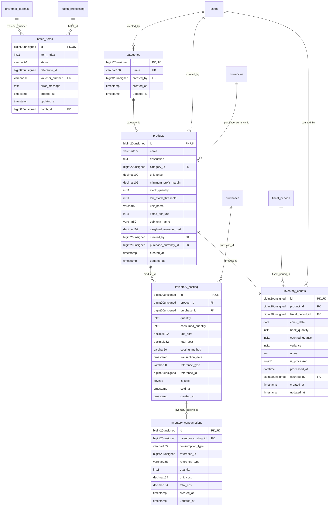

# SupplyChain - Inventory

> **Bounded Context Schema & ERD**
> 6 Tables | Generated dynamically by accore engine

---

## Tables List

- `batch_items`
- `categories`
- `inventory_consumptions`
- `inventory_costing`
- `inventory_counts`
- `products`

---

## Entity Relationship Diagram

---

## Data Dictionary

### Table: `batch_items`

| Column | Type | Nullable | Default | Indexes | Foreign Keys |
|---|---|---|---|---|---|
| `id` | `bigint(20) unsigned` | No |  | **PK** |  |
| `item_index` | `int(11)` | No |  |  |  |
| `status` | `varchar(20)` | No | `'pending'` | IDX |  |
| `reference_id` | `bigint(20) unsigned` | Yes | `NULL` |  |  |
| `voucher_number` | `varchar(50)` | Yes | `NULL` | IDX | -> `universal_journals.voucher_number` |
| `error_message` | `text` | Yes | `NULL` |  |  |
| `created_at` | `timestamp` | Yes | `NULL` |  |  |
| `updated_at` | `timestamp` | Yes | `NULL` |  |  |
| `batch_id` | `bigint(20) unsigned` | No |  | IDX | -> `batch_processing.id` |

### Table: `categories`

| Column | Type | Nullable | Default | Indexes | Foreign Keys |
|---|---|---|---|---|---|
| `id` | `bigint(20) unsigned` | No |  | **PK** |  |
| `name` | `varchar(100)` | No |  | *UK* |  |
| `created_by` | `bigint(20) unsigned` | Yes | `NULL` | IDX | -> `users.id` |
| `created_at` | `timestamp` | Yes | `NULL` |  |  |
| `updated_at` | `timestamp` | Yes | `NULL` |  |  |

### Table: `inventory_consumptions`

| Column | Type | Nullable | Default | Indexes | Foreign Keys |
|---|---|---|---|---|---|
| `id` | `bigint(20) unsigned` | No |  | **PK** |  |
| `inventory_costing_id` | `bigint(20) unsigned` | No |  | IDX | -> `inventory_costing.id` |
| `consumption_type` | `varchar(255)` | No | `'sale'` | IDX |  |
| `reference_id` | `bigint(20) unsigned` | No |  |  |  |
| `reference_type` | `varchar(255)` | No | `'invoices'` |  |  |
| `quantity` | `int(11)` | No |  |  |  |
| `unit_cost` | `decimal(15,4)` | No |  |  |  |
| `total_cost` | `decimal(15,4)` | No |  |  |  |
| `created_at` | `timestamp` | Yes | `NULL` |  |  |
| `updated_at` | `timestamp` | Yes | `NULL` |  |  |

### Table: `inventory_costing`

| Column | Type | Nullable | Default | Indexes | Foreign Keys |
|---|---|---|---|---|---|
| `id` | `bigint(20) unsigned` | No |  | **PK** |  |
| `product_id` | `bigint(20) unsigned` | No |  | IDX, IDX | -> `products.id` |
| `purchase_id` | `bigint(20) unsigned` | Yes | `NULL` | IDX | -> `purchases.id` |
| `quantity` | `int(11)` | No |  |  |  |
| `consumed_quantity` | `int(11)` | No | `0` |  |  |
| `unit_cost` | `decimal(10,2)` | No |  |  |  |
| `total_cost` | `decimal(15,2)` | No |  |  |  |
| `costing_method` | `varchar(20)` | No | `'FIFO'` |  |  |
| `transaction_date` | `timestamp` | No | `current_timestamp()` |  |  |
| `reference_type` | `varchar(50)` | Yes | `NULL` | IDX |  |
| `reference_id` | `bigint(20) unsigned` | Yes | `NULL` | IDX |  |
| `is_sold` | `tinyint(1)` | No | `0` | IDX |  |
| `sold_at` | `timestamp` | Yes | `NULL` |  |  |
| `created_at` | `timestamp` | No | `current_timestamp()` |  |  |

### Table: `inventory_counts`

| Column | Type | Nullable | Default | Indexes | Foreign Keys |
|---|---|---|---|---|---|
| `id` | `bigint(20) unsigned` | No |  | **PK** |  |
| `product_id` | `bigint(20) unsigned` | No |  | IDX | -> `products.id` |
| `fiscal_period_id` | `bigint(20) unsigned` | No |  | IDX | -> `fiscal_periods.id` |
| `count_date` | `date` | No |  |  |  |
| `book_quantity` | `int(11)` | No |  |  |  |
| `counted_quantity` | `int(11)` | No |  |  |  |
| `variance` | `int(11)` | No |  |  |  |
| `notes` | `text` | Yes | `NULL` |  |  |
| `is_processed` | `tinyint(1)` | No | `0` | IDX |  |
| `processed_at` | `datetime` | Yes | `NULL` |  |  |
| `counted_by` | `bigint(20) unsigned` | Yes | `NULL` | IDX | -> `users.id` |
| `created_at` | `timestamp` | Yes | `NULL` |  |  |
| `updated_at` | `timestamp` | Yes | `NULL` |  |  |

### Table: `products`

| Column | Type | Nullable | Default | Indexes | Foreign Keys |
|---|---|---|---|---|---|
| `id` | `bigint(20) unsigned` | No |  | **PK** |  |
| `name` | `varchar(255)` | No |  |  |  |
| `description` | `text` | Yes | `NULL` |  |  |
| `category_id` | `bigint(20) unsigned` | Yes | `NULL` | IDX | -> `categories.id` |
| `unit_price` | `decimal(10,2)` | No | `0.00` |  |  |
| `minimum_profit_margin` | `decimal(10,2)` | No | `0.00` |  |  |
| `stock_quantity` | `int(11)` | No | `0` |  |  |
| `low_stock_threshold` | `int(11)` | No | `5` |  |  |
| `unit_name` | `varchar(50)` | No | `'كرتون'` |  |  |
| `items_per_unit` | `int(11)` | No | `1` |  |  |
| `sub_unit_name` | `varchar(50)` | Yes | `'حبة'` |  |  |
| `weighted_average_cost` | `decimal(10,2)` | No | `0.00` |  |  |
| `created_by` | `bigint(20) unsigned` | Yes | `NULL` | IDX | -> `users.id` |
| `purchase_currency_id` | `bigint(20) unsigned` | Yes | `NULL` | IDX | -> `currencies.id` |
| `created_at` | `timestamp` | Yes | `NULL` |  |  |
| `updated_at` | `timestamp` | Yes | `NULL` |  |  |

