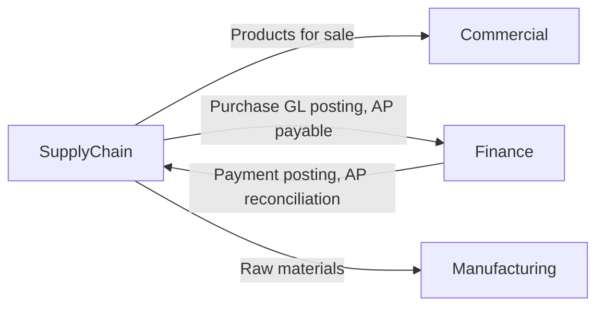

# SupplyChain — Domain Overview

## Business Purpose

The SupplyChain domain manages the complete procurement lifecycle, inventory control, vendor relationships, and accounts payable operations. It is the operational hub connecting external suppliers to internal manufacturing and sales processes. Procurement managers, warehouse staff, finance controllers, and supply chain planners depend on SupplyChain to procure goods efficiently, maintain optimal inventory levels, manage vendor performance, and track purchase obligations. SupplyChain bridges Commercial (demand for products) and Finance (payment obligations), ensuring that every purchase is authorized, received, invoiced, and paid correctly. Without effective supply chain management, the enterprise cannot fulfill customer orders, optimize working capital, or control procurement costs.

## Bounded Context Boundaries

SupplyChain owns and manages:
- Product and item master data (goods, services, raw materials)
- Supplier/vendor master data and payment terms
- Purchase orders and purchase requests
- Goods receipt and inventory movements
- Inventory valuation and periodic counts
- Accounts payable sub-ledger (supplier transactions)
- Purchase-to-pay workflow

SupplyChain explicitly excludes:
- Sales orders and customer demand (Commercial domain)
- General ledger accounts and GL posting rules (Finance domain)
- Manufacturing production schedules (Manufacturing domain, future)
- Inventory logistics and warehouse operations (operational execution)
- Tax calculation (Finance/TaxCompliance domain)

## Subdomains

| Subdomain | Description |
|-----------|-------------|
| **Inventory** | Products, categories, stock quantities, weighted-average costing, periodic counts, batch tracking, and inventory movements. |
| **Procurement** | Purchase orders, purchase requests, purchase-to-pay workflow, goods receipt, and approval routing. |
| **PayablesExpenses** | Accounts payable sub-ledger transactions, supplier invoice matching, and payment clearing. |
| **SupplierSourcing** | Supplier master data, sourcing policies, vendor performance, payment terms, and supplier relationships. |

## Key Domain Entities

**Inventory Models:**
- **Product** — Unified item catalog (products, services, raw materials) with item classification, stock quantity, unit structure, and weighted-average cost.
- **Category** — Product classification for segmentation and reporting.
- **Batch** — Batch grouping for periodic processing and traceability.
- **InventoryCount** — Periodic physical inventory count records for reconciliation.
- **ServiceAvailability** — Service availability schedules and capacity tracking.

**Procurement Models:**
- **Purchase** — Purchase order record (SAP FI pattern) with product, supplier, quantity, price, tax lines, and GL voucher reference.
- **PurchaseRequest** — Purchase requisition preceding a purchase order; used for approval routing.

**PayablesExpenses Models:**
- **ApTransaction** — Accounts payable sub-ledger entry. Operational metadata only; financial amounts live in GL.

**SupplierSourcing Models:**
- **ApSupplier** — Vendor master record with code, contact, tax ID, credit limit, payment terms, and running balance.

## Integration Points

<!-- [ASSUMPTION] --> SupplyChain emits Purchase.Created (GL posting) and ApTransaction.Created (AP sub-ledger) events to Finance. Finance responds with payment GL entries.

## Governance Rules

1. **Purchase Authorization** — All purchases must be created from approved purchase requests; ad-hoc purchases require manager override.
2. **Three-Way Match** — Invoice must match purchase order (quantity, price) and goods receipt before payment is authorized.
3. **Inventory Accuracy** — Stock quantities must be reconciled to GL inventory accounts monthly.
4. **Weighted-Average Costing** — Product cost is calculated using WAC; FIFO and LIFO are not supported.
5. **Goods Receipt** — Goods received are recorded before supplier invoice is processed; receipt triggers GL inventory posting.
6. **Supplier Credit Limits** — New purchases cannot exceed supplier credit_limit + current_balance without approval.
7. **Payment Terms Enforcement** — Payment is due per supplier payment_terms; aged payables are flagged for payment processing.
8. **Tax Line Integrity** — Tax amounts on purchases are sourced from Finance.TaxCompliance, not calculated in SupplyChain.

## Documentation Scope

The following documentation pages are planned for the SupplyChain domain:

| Document | Task ID | Status |
|----------|---------|--------|
| SupplyChain Domain Overview | SC-001 | In Progress |
| Stock Valuation & Movements | SC-002 | Pending |
| Accounts Payable & Clearing | SC-003 | Pending |
| Purchase-to-Pay Cycle | SC-004 | Pending |
| Vendor Management | SC-005 | Pending |

---

## Assumptions & Open Questions

<!-- [ASSUMPTION] -->
**Goods Receipt Integration**: The domain includes Procurement (POs) but goods receipt mechanics are not visible in the Purchase model. Clarification needed: Is goods receipt tracked separately (in a different model or domain), or is it implicit in purchase status progression?

<!-- [ASSUMPTION] -->
**Batch Processing and Traceability**: The Batch and BatchItem models suggest batch-level tracking, but their integration with Purchase and Inventory is unclear. Clarification needed: How are batches tracked through the purchase-to-inventory-to-sales lifecycle?

<!-- [ASSUMPTION] -->
**Manufacturing Integration**: The domain overview mentions raw_material item type, but no Manufacturing domain integration is visible. Clarification needed: How are materials allocated from inventory to manufacturing orders?

<!-- [ASSUMPTION] -->
**Service Items and Inventory Control**: Product model supports item_type='service', but services are not inventory-controlled. Clarification needed: Are service items (consulting, support) procured through the same purchase workflow as goods?

<!-- [ASSUMPTION] -->
**Multi-Currency and Exchange Rates**: Purchase model has currency references, but rate application is unclear. Clarification needed: Are purchase prices in supplier currency or company currency? When is conversion applied?
