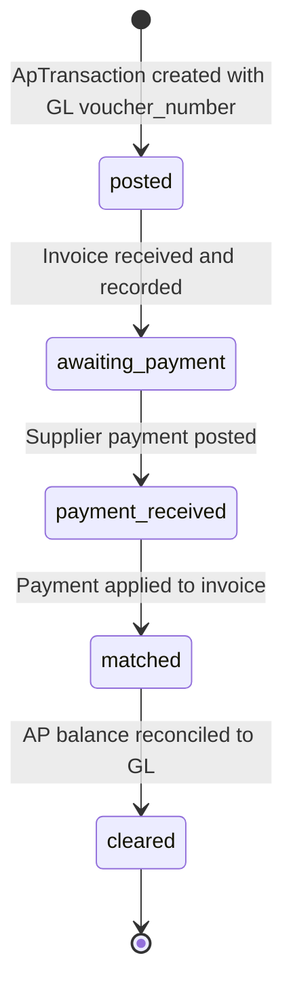

# Accounts Payable & Payment Clearing

## Business Context & Objective

Accounts Payable (AP) is the operational sub-ledger tracking supplier invoice obligations, payment schedules, and cash outflows. Accounts Payable managers, finance controllers, and procurement teams depend on AP to identify payment due dates, manage supplier relationships, optimize cash flow, and reconcile supplier statements. Unlike the General Ledger (which records amounts), AP operates at the transaction level: which supplier, what purchase, when due, how much paid. Every supplier payment must be matched to an invoice via AP before cash is disbursed.

## Domain Entities

| Entity | Business Definition | Role |
|--------|-------------------|------|
| **ApTransaction** | A supplier transaction record (invoice, payment, credit memo) linked to GL via voucher_number. | Operational metadata; financial amounts live in GL. Enables payment matching and supplier reconciliation. |
| **ApSupplier** | Supplier master record with contact, tax ID, credit limit, payment terms, and running balance. | Central reference for all AP operations. Payment_terms determines when invoices are due. |

## State Machine / Lifecycle

ApTransaction follows a simple creation-to-clearance lifecycle:

<!-- [ASSUMPTION] --> ApTransaction uses soft-delete semantics (is_deleted flag); deletion is not permanent.

## Business Rules & Constraints

1. **GL Linkage** — Every ApTransaction must reference a GL voucher_number. Transactions without GL entries are incomplete.
2. **Dual-Entry Posting** — ApTransaction creation posts GL entries (e.g., DEBIT Inventory/Expense, CREDIT Accounts Payable). Posting must succeed atomically.
3. **Supplier Balance Reconciliation** — ApSupplier.current_balance must equal sum of unpaid ApTransaction amounts for that supplier.
4. **Payment Terms Governance** — ApSupplier.payment_terms (in days) determines invoice due date. Payments after due date are flagged as aged.
5. **Transaction Types** — ApTransaction.type supports 'invoice' (purchase obligation) and 'payment' (cash outflow), 'credit' (credit memo).
6. **Reference Tracking** — ApTransaction stores reference_type and reference_id to link to Purchase orders or manual adjustments.
7. **Immutable Amounts** — Once posted, transaction amount cannot be changed; reversal requires offsetting entry.
8. **Account Code Mapping** — Standard GL account mappings (accounts_payable, expense, inventory) are retrieved via ChartOfAccountsMappingService.

## Integration Events

| Event | Direction | Connected Domain | Trigger |
|-------|-----------|-----------------|---------|
| Invoice.Posted | Outbound | Finance | ApTransaction creates GL entries |
| Payment.Posted | Outbound | Finance | Supplier payment posts GL debit |
| AP.Reconciled | Outbound | MonitoringCompliance | Daily reconciliation AP subledger vs. GL |
| Supplier.BalanceUpdated | Outbound | SupplierSourcing | ApSupplier.current_balance recalculated |

## Key Operations

**CreateApTransaction()** — Creates supplier invoice or payment transaction. Constructs GL entries based on type, posts via Finance.LedgerService, creates ApTransaction record, links GL voucher to transaction, updates supplier balance. Atomic within transaction.

**DeleteApTransaction()** — Soft-deletes an ApTransaction by setting is_deleted=true and deleted_at=now(). Reverses GL entries. Updates supplier balance.

**MatchPaymentToInvoice()** — Applies supplier payment to outstanding invoice. Creates ApTransaction with type='payment', links to original invoice via reference_id. Updates supplier balance.

**ListApTransactions()** — Retrieves paginated list of AP transactions for a supplier with filtering by type, date range, payment status.

**UpdateSupplierBalance()** — Recalculates ApSupplier.current_balance by summing GL credits minus GL debits for all non-deleted transactions in the AP account for that supplier.

**IdentifyAgedPayables()** — Queries invoices with transaction_date + ApSupplier.payment_terms < today(). Used for payment prioritization and cash flow forecasting.

## Known Constraints

1. Payment matching (applying a payment to a specific invoice) is not automated; manual operator matching is required.
2. Multi-currency transactions are not supported at the AP level; currency conversion is handled at GL entry level.
3. Supplier statement reconciliation is manual; no automated three-way match (invoice vs. PO vs. receipt) is visible.
4. Discount terms (e.g., 2/10 Net 30) are not encoded in ApSupplier.payment_terms; early payment discounts require manual tracking.
5. Supplier balance updates are synchronous; high-volume invoice processing may cause performance issues.
6. No automatic payment proposal or check-writing; payment initiation is manual.

## Assumptions & Open Questions

<!-- [ASSUMPTION] -->
**Three-Way Match Requirement**: The Procurement domain mentions "three-way match" (PO, receipt, invoice) but the matching logic is not visible in AP. Clarification needed: Is three-way match enforced at PO or invoice creation time?

<!-- [ASSUMPTION] -->
**GL Account Mapping**: ApTransaction retrieves standard accounts from ChartOfAccountsMappingService. Clarification needed: If a company has multiple expense accounts or custom GL structure, how are those overrides handled?

<!-- [ASSUMPTION] -->
**Supplier Statement Reconciliation**: ApSupplier.current_balance is denormalized (not automatically synced to GL). Clarification needed: How frequently is current_balance reconciled to GL AP balance? Who triggers reconciliation?

<!-- [ASSUMPTION] -->
**Payment Hold on Disputes**: If a supplier disputes an invoice, is payment automatically held, or is it manual? Clarification needed: What is the approval workflow for disputed invoices?

<!-- [ASSUMPTION] -->
**Debit Memo Handling**: ApTransaction supports 'credit' type (credit memo), but how are supplier debit memos (supplier returns) handled? Clarification needed: Are supplier returns tracked as negative invoices?
