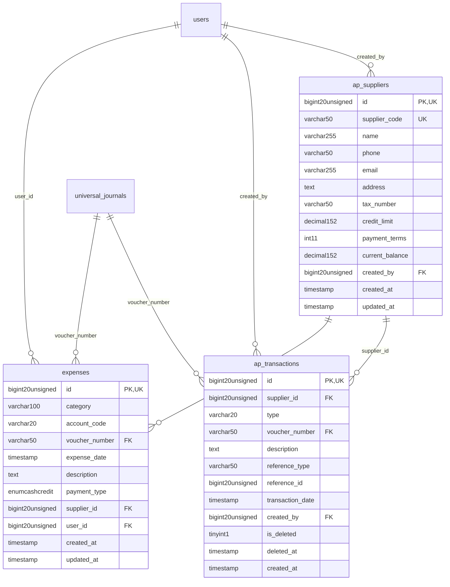

# SupplyChain - PayablesExpenses

> **Bounded Context Schema & ERD**
> 3 Tables | Generated dynamically by ACCSYSTEM engine

---

## Tables List

- `ap_suppliers`
- `ap_transactions`
- `expenses`

---

## Entity Relationship Diagram

---

## Data Dictionary

### Table: `ap_suppliers`

| Column | Type | Nullable | Default | Indexes | Foreign Keys |
|---|---|---|---|---|---|
| `id` | `bigint(20) unsigned` | No |  | **PK** |  |
| `supplier_code` | `varchar(50)` | Yes | `NULL` | *UK* |  |
| `name` | `varchar(255)` | No |  |  |  |
| `phone` | `varchar(50)` | Yes | `NULL` |  |  |
| `email` | `varchar(255)` | Yes | `NULL` |  |  |
| `address` | `text` | Yes | `NULL` |  |  |
| `tax_number` | `varchar(50)` | Yes | `NULL` |  |  |
| `credit_limit` | `decimal(15,2)` | No | `0.00` |  |  |
| `payment_terms` | `int(11)` | No | `30` |  |  |
| `current_balance` | `decimal(15,2)` | No | `0.00` |  |  |
| `created_by` | `bigint(20) unsigned` | Yes | `NULL` | IDX | -> `users.id` |
| `created_at` | `timestamp` | Yes | `NULL` |  |  |
| `updated_at` | `timestamp` | Yes | `NULL` |  |  |

### Table: `ap_transactions`

| Column | Type | Nullable | Default | Indexes | Foreign Keys |
|---|---|---|---|---|---|
| `id` | `bigint(20) unsigned` | No |  | **PK** |  |
| `supplier_id` | `bigint(20) unsigned` | No |  | IDX | -> `ap_suppliers.id` |
| `type` | `varchar(20)` | No |  |  |  |
| `voucher_number` | `varchar(50)` | Yes | `NULL` | IDX | -> `universal_journals.voucher_number` |
| `description` | `text` | Yes | `NULL` |  |  |
| `reference_type` | `varchar(50)` | Yes | `NULL` | IDX |  |
| `reference_id` | `bigint(20) unsigned` | Yes | `NULL` | IDX |  |
| `transaction_date` | `timestamp` | No | `current_timestamp()` |  |  |
| `created_by` | `bigint(20) unsigned` | Yes | `NULL` | IDX | -> `users.id` |
| `is_deleted` | `tinyint(1)` | No | `0` |  |  |
| `deleted_at` | `timestamp` | Yes | `NULL` |  |  |
| `created_at` | `timestamp` | No | `current_timestamp()` |  |  |

### Table: `expenses`

| Column | Type | Nullable | Default | Indexes | Foreign Keys |
|---|---|---|---|---|---|
| `id` | `bigint(20) unsigned` | No |  | **PK** |  |
| `category` | `varchar(100)` | No |  |  |  |
| `account_code` | `varchar(20)` | Yes | `NULL` | IDX |  |
| `voucher_number` | `varchar(50)` | Yes | `NULL` | IDX | -> `universal_journals.voucher_number` |
| `expense_date` | `timestamp` | No | `current_timestamp()` |  |  |
| `description` | `text` | Yes | `NULL` |  |  |
| `payment_type` | `enum('cash','credit')` | No | `'cash'` |  |  |
| `supplier_id` | `bigint(20) unsigned` | Yes | `NULL` | IDX | -> `ap_suppliers.id` |
| `user_id` | `bigint(20) unsigned` | Yes | `NULL` | IDX | -> `users.id` |
| `created_at` | `timestamp` | Yes | `NULL` |  |  |
| `updated_at` | `timestamp` | Yes | `NULL` |  |  |

