# Purchase-to-Pay Cycle Lifecycle

## Overview

The Purchase-to-Pay (P2P) cycle is the complete procurement workflow spanning from purchase requisition, authorization, goods receipt, supplier invoicing, payment, and reconciliation. A Purchase entity progresses through request, approval, receipt, invoice matching, and payment. The P2P cycle is critical to financial accuracy, vendor relationship management, and cash flow control. Unlike simpler entities, Purchases interact with Inventory (receipt updates stock), Finance (GL posting via voucher_number), and Payables (payment obligation tracking). Every step is governed by approval policies and audit requirements.

## State Diagram

```mermaid
stateDiagram-v2
    [*] --> requested: PurchaseRequest created by procurement staff
    requested --> approved: Manager approval of purchase request
    approved --> po_issued: Purchase Order issued to supplier
    po_issued --> goods_in_transit: Goods dispatched by supplier
    goods_in_transit --> received: Goods receipt confirmed; inventory updated
    received --> invoiced: Supplier invoice received and recorded
    invoiced --> three_way_matched: Invoice matched to PO & goods receipt
    three_way_matched --> payment_due: Payment obligation recorded in AP
    payment_due --> payment_initiated: Payment instruction generated
    payment_initiated --> paid: Payment cleared; vendor balance updated
    paid --> reconciled: AP reconciled to GL; P2P cycle complete
    reconciled --> [*]
    
    po_issued --> cancelled: Cancellation request approved
    cancelled --> [*]
    
    note right of received
        Goods receipt posts GL inventory entry.
        Stock quantity increased; inventory account debited.
    end note
    
    note right of invoiced
        Supplier invoice received.
        Does not post GL until 3-way match succeeds.
    end note
    
    note right of three_way_matched
        Invoice amount matches PO price.
        Received quantity matches PO quantity.
        GL posting authorized.
    end note
```

## State Definitions

| State | Business Meaning | Entry Condition | Exit Condition |
|-------|-----------------|-----------------|----------------|
| **Requested** | Purchase Requisition created; awaiting managerial approval. | PurchaseRequest.create() completes. | Purchase request approved by authorized manager. |
| **Approved** | Purchase request approved; ready for PO issuance. | Manager approval recorded; purchase_request.approval_status='approved'. | PO issued to supplier. |
| **PO Issued** | Purchase Order sent to supplier; awaiting goods. | PO created and transmitted to vendor (email, EDI, portal). | Goods dispatched by supplier. |
| **Goods In Transit** | Supplier has shipped; goods in transportation. | Supplier shipment confirmation received (optional tracking). | Goods arrive at receiving dock. |
| **Received** | Goods physically received and inspected; inventory posted. | Goods receipt record created; Purchase.status='received'. GL inventory entry posted (Debit Inventory, Credit AP). | Supplier invoice received. |
| **Invoiced** | Supplier invoice received; awaiting three-way match. | ApTransaction created with type='invoice'. Invoice amount, quantity, and dates recorded. | Three-way match validation succeeds. |
| **Three-Way Matched** | Invoice matches PO price and goods receipt quantity. | Comparison of PO, goods receipt, and invoice (amount, qty) succeeds. | GL posting for cost of goods authorized. |
| **Payment Due** | GL posting complete; payment obligation recorded in AP. | Purchase.approval_status='approved' and Purchase.voucher_number assigned. | Payment instruction generated. |
| **Payment Initiated** | Payment instruction issued (check, ACH transfer, wire). | Payment processing initiated; ApTransaction.type='payment' created. | Payment clears bank. |
| **Paid** | Payment received and cleared by supplier's bank. | ApTransaction payment confirmation received. ApSupplier.current_balance updated. | AP reconciliation completed. |
| **Reconciled** | AP sub-ledger balance reconciled to GL; cycle closed. | Daily AP-to-GL reconciliation confirms match. | Terminal state. |
| **Cancelled** | Purchase order cancelled before goods receipt. | Cancellation approved; PO withdrawn from supplier. | Terminal state. |

## Transition Rules

1. **Requested → Approved** — PurchaseRequest.approval_status changed to 'approved'. Manager or procurement lead authorizes spend. Pre-requisite: supplier credit limit check passes.

2. **Approved → PO Issued** — Purchase.create() generates PO and transmits to supplier. Uses EnterpriseCore.SystemOverview numbering (PO number assignment). Supplier contact (email, EDI, portal) triggered.

3. **PO Issued → Goods In Transit** — Supplier shipment confirmed (optional). Tracking information recorded if available.

4. **Goods In Transit → Received** — Goods Receipt Notification (GRN) created upon physical arrival. Quantity, quality inspection recorded. GL inventory entry posted atomically: Debit Inventory, Credit Accounts Payable (provisional). Product.stock_quantity increased; Product.weighted_average_cost updated.

5. **Received → Invoiced** — Supplier invoice (bill) received. ApTransaction created with type='invoice'. Invoice amount, tax lines, due date recorded. GL posting is PENDING (not posted) until three-way match succeeds.

6. **Invoiced → Three-Way Matched** — System validates: PO.amount == Invoice.amount, PO.qty == GRN.qty. If match succeeds, GL posting is authorized. If mismatch detected, invoice is flagged for resolution (dispute, credit memo, etc.).

7. **Three-Way Matched → Payment Due** — GL posting finalized (Debit COGS/Expense, Credit Accounts Payable). Purchase.approval_status='approved', Purchase.voucher_number assigned. Payment due date calculated (invoice_date + supplier.payment_terms).

8. **Payment Due → Payment Initiated** — Payment instruction created by treasury/finance. ApTransaction.type='payment' posted with GL entries (Debit Accounts Payable, Credit Cash). Check/ACH/wire prepared.

9. **Payment Initiated → Paid** — Payment clears supplier's bank. Confirmation received from bank or supplier. ApSupplier.current_balance reduced by payment amount.

10. **Paid → Reconciled** — AP reconciliation batch (daily) matches payment GL entries to invoice GL entries via voucher_number. AP sub-ledger balance reconciled to GL AP account. P2P cycle complete.

11. **PO Issued → Cancelled** — PO cancellation approved (due to changed requirements, supplier delinquency, etc.). Cancellation notice sent to supplier. Any partial goods received are handled via return/credit memo.

## Irreversibility & Immutability

- **Goods Receipt is Irreversible** — Once goods are received and GL inventory posted, reversal requires explicit return/credit process (not simple cancellation).
- **GL Posting is Immutable** — Once voucher_number is assigned, GL entries are permanent. Corrections require reversing entries (offsetting transactions).
- **Three-Way Match is Final** — If a three-way match is confirmed, invoice amount is locked; subsequent disputes require credit memos or reversals.
- **Payment Clearing is Irreversible** — Once payment is cleared by the bank, reversal requires stop payment instruction or customer reversal (rare).
- **Audit Trail** — Every state transition must be logged with user_id, timestamp, and rationale (especially for cancellations and disputes).

## Integration Impact

| Transition | Affected Domain | Event Emitted | Side Effect |
|-----------|-----------------|---------------|------------|
| Received | Inventory, Finance | GoodsReceipt.Posted | GL inventory entry; Product WAC updated; stock quantity increased |
| Three-Way Matched | Finance | Invoice.Approved | GL posting authorized; COGS/expense entry scheduled |
| Payment Due | PayablesExpenses | Purchase.DueForPayment | AP sub-ledger updated; payment run includes this invoice |
| Paid | Finance | Payment.Posted | GL payment entry; AP reduced; supplier balance updated |
| Reconciled | Finance | AP.Reconciled | Daily P2P completion; audit trail confirmed |

## Assumptions & Open Questions

<!-- [ASSUMPTION] -->
**Purchase Request to PO Conversion**: The lifecycle begins at "Requested" (PurchaseRequest), but the mechanism for converting an approved request into a formal Purchase Order is unclear. Clarification needed: Is there a separate approval step for PO creation, or is PO issued automatically upon requisition approval?

<!-- [ASSUMPTION] -->
**Goods Receipt Tracking**: The "Goods In Transit" state suggests tracking of shipments, but no Shipment or GoodsReceipt model is visible in the source code. Clarification needed: How is goods receipt recorded? Is it via a separate GoodsReceipt entity or implicit in Purchase model?

<!-- [ASSUMPTION] -->
**Three-Way Match Automation**: The "Three-Way Matched" transition validates invoice amount, PO price, and goods receipt quantity. Clarification needed: Is matching automated, manual, or exception-based (only flagged if mismatch)?

<!-- [ASSUMPTION] -->
**Partial Shipments and Invoices**: The lifecycle assumes single shipment and single invoice. Clarification needed: How are partial shipments, multiple invoices for one PO, or invoicing ahead of receipt handled?

<!-- [ASSUMPTION] -->
**Reversal and Return Handling**: Cancelled POs and payment reversals are mentioned but mechanics are unclear. Clarification needed: Are reversals treated as new offsetting transactions or modifications to original Purchase records?
