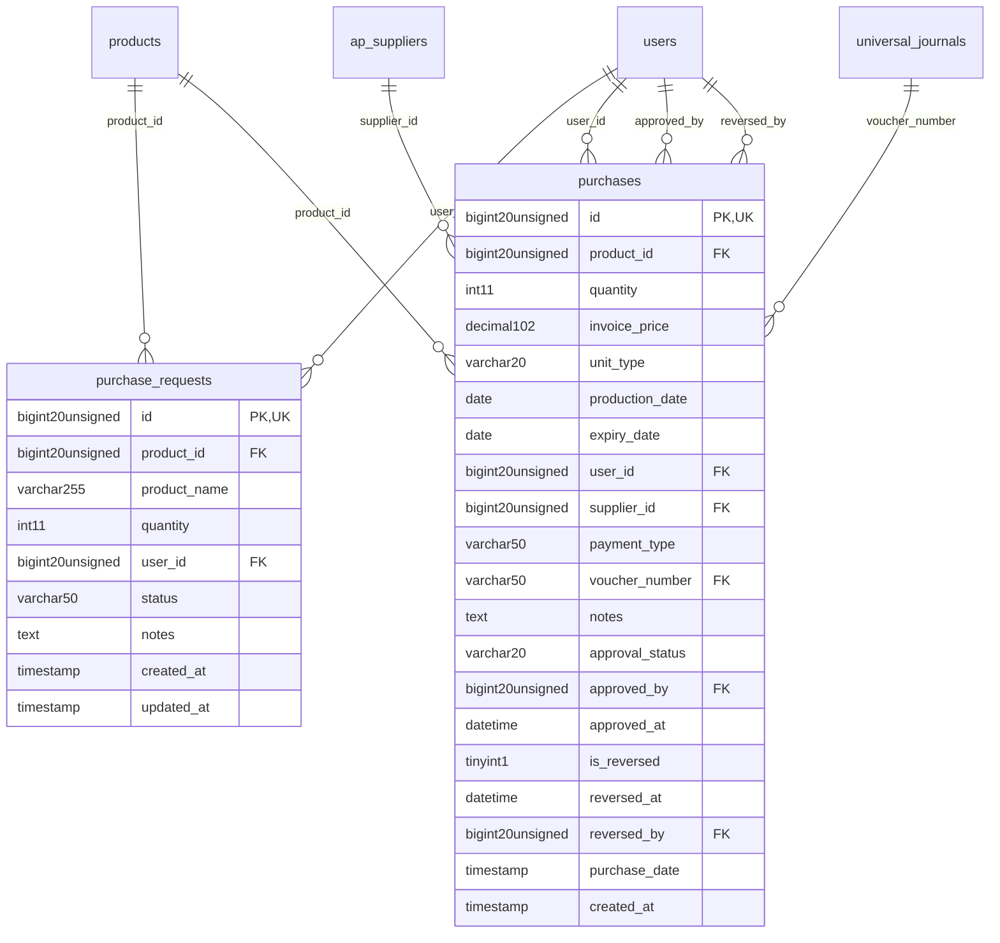

# SupplyChain - Procurement

> **Bounded Context Schema & ERD**
> 2 Tables | Generated dynamically by ACCSYSTEM engine

---

## Tables List

- `purchase_requests`
- `purchases`

---

## Entity Relationship Diagram

---

## Data Dictionary

### Table: `purchase_requests`

| Column | Type | Nullable | Default | Indexes | Foreign Keys |
|---|---|---|---|---|---|
| `id` | `bigint(20) unsigned` | No |  | **PK** |  |
| `product_id` | `bigint(20) unsigned` | Yes | `NULL` | IDX | -> `products.id` |
| `product_name` | `varchar(255)` | Yes | `NULL` |  |  |
| `quantity` | `int(11)` | No | `1` |  |  |
| `user_id` | `bigint(20) unsigned` | Yes | `NULL` | IDX | -> `users.id` |
| `status` | `varchar(50)` | No | `'pending'` |  |  |
| `notes` | `text` | Yes | `NULL` |  |  |
| `created_at` | `timestamp` | Yes | `NULL` |  |  |
| `updated_at` | `timestamp` | Yes | `NULL` |  |  |

### Table: `purchases`

| Column | Type | Nullable | Default | Indexes | Foreign Keys |
|---|---|---|---|---|---|
| `id` | `bigint(20) unsigned` | No |  | **PK** |  |
| `product_id` | `bigint(20) unsigned` | No |  | IDX | -> `products.id` |
| `quantity` | `int(11)` | No |  |  |  |
| `invoice_price` | `decimal(10,2)` | No |  |  |  |
| `unit_type` | `varchar(20)` | No | `'sub'` |  |  |
| `production_date` | `date` | Yes | `NULL` |  |  |
| `expiry_date` | `date` | Yes | `NULL` |  |  |
| `user_id` | `bigint(20) unsigned` | Yes | `NULL` | IDX | -> `users.id` |
| `supplier_id` | `bigint(20) unsigned` | Yes | `NULL` | IDX | -> `ap_suppliers.id` |
| `payment_type` | `varchar(50)` | No | `'credit'` |  |  |
| `voucher_number` | `varchar(50)` | Yes | `NULL` | IDX | -> `universal_journals.voucher_number` |
| `notes` | `text` | Yes | `NULL` |  |  |
| `approval_status` | `varchar(20)` | No | `'approved'` | IDX |  |
| `approved_by` | `bigint(20) unsigned` | Yes | `NULL` | IDX | -> `users.id` |
| `approved_at` | `datetime` | Yes | `NULL` |  |  |
| `is_reversed` | `tinyint(1)` | No | `0` |  |  |
| `reversed_at` | `datetime` | Yes | `NULL` |  |  |
| `reversed_by` | `bigint(20) unsigned` | Yes | `NULL` | IDX | -> `users.id` |
| `purchase_date` | `timestamp` | No | `current_timestamp()` |  |  |
| `created_at` | `timestamp` | No | `current_timestamp()` |  |  |

