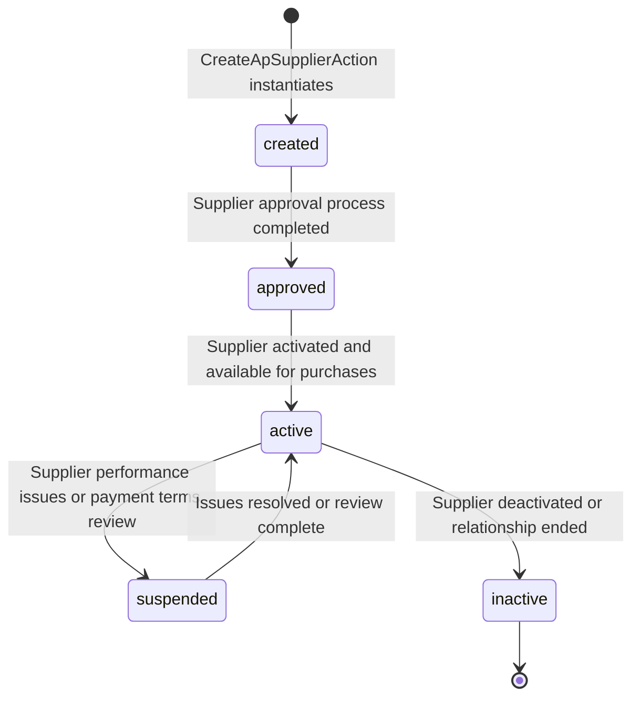

# Vendor Management & Sourcing

## Business Context & Objective

Vendor management is the strategic discipline of selecting, evaluating, and maintaining supplier relationships to ensure reliable, cost-effective procurement. Procurement managers, sourcing specialists, and supply chain planners depend on vendor management to build a healthy supplier base, negotiate favorable terms, monitor supplier performance, and mitigate supply chain risk. ApSupplier is the enterprise's single source of truth for supplier identity, payment terms, credit limits, and financial standing. Every purchase must go through an approved supplier; unapproved suppliers are blocked.

## Domain Entities

| Entity | Business Definition | Role |
|--------|-------------------|------|
| **ApSupplier** | Supplier/vendor master record with identity, contact, financial terms, and performance metrics. | Single source of truth for "who is this supplier?" and "what are their payment terms?". |

## State Machine / Lifecycle

ApSupplier progresses through onboarding, active use, suspension, and deactivation:

<!-- [ASSUMPTION] --> ApSupplier does not have an explicit "status" field; instead, soft-delete or is_active flag determines availability.

## Business Rules & Constraints

1. **Unique Identification** — Each supplier must have a unique supplier_code and unique name within the organization.
2. **Supplier Code Generation** — Supplier codes are auto-generated via NumberRangeService (NrObject/NrGroup configuration). Manual codes are allowed if explicitly provided.
3. **Credit Limit Governance** — Credit limit is set at supplier approval and updated by procurement managers. New purchases cannot exceed supplier credit_limit + current_balance unless override granted.
4. **Payment Terms Definition** — payment_terms (in days) determines when invoices are due relative to invoice date (e.g., payment_terms=30 means Net 30).
5. **Tax Registration** — tax_number (VAT ID or local equivalent) is captured at creation. Duplicate tax numbers may indicate duplicate suppliers or subsidiaries.
6. **Current Balance Tracking** — ApSupplier.current_balance represents net payable (invoiced - paid). This field must be reconciled daily against ApTransaction totals.
7. **Supplier Deactivation** — Deactivated suppliers cannot be the target of new purchases, but historical transactions remain visible for audit.
8. **Audit Trail** — All supplier updates must record the user making the change (created_by).

## Integration Events

| Event | Direction | Connected Domain | Trigger |
|-------|-----------|-----------------|---------|
| Supplier.Created | Outbound | MonitoringCompliance, Finance | CreateApSupplierAction completes; audited |
| Supplier.CreditLimitUpdated | Outbound | Procurement | Credit limit change may block pending purchases |
| Supplier.Deactivated | Outbound | Procurement | Supplier status changes to inactive; prevents new purchases |
| Supplier.BalanceUpdated | Outbound | Finance | ApSupplier.current_balance recalculated after payment |

## Key Operations

**CreateApSupplier()** — Creates a new supplier with name, phone, email, address, tax_number, credit_limit, and payment_terms. If supplier_code is not provided, generates one via NumberRangeService. Validates uniqueness of name and tax_number. Returns supplier ID.

**UpdateApSupplier()** — Updates supplier contact details or payment terms. Credit limit changes are captured with timestamp for audit.

**DeleteApSupplier()** — Marks a supplier as inactive or deleted. Deactivated suppliers cannot be the target of new purchases, but historical transactions remain visible.

**ValidateSupplierCredit()** — Checks if a proposed purchase (amount) can proceed given supplier credit_limit and current_balance. Blocks purchases exceeding credit unless manager override approved.

**RecalculateSupplierBalance()** — Queries all non-deleted ApTransaction records for the supplier and recalculates current_balance = invoiced - paid.

**ListSuppliers()** — Retrieves paginated list of suppliers with optional filtering by status, credit limit, or payment terms.

**EvaluateSupplierPerformance()** — Analyzes supplier metrics: on-time delivery rate, invoice accuracy, payment history. Used for strategic sourcing decisions.

## Known Constraints

1. ApSupplier.current_balance is a denormalized cache; it is not automatically updated by invoice/payment operations. Daily reconciliation is required.
2. No multi-entity supplier support; a supplier can belong to only one company code (implicit or explicit).
3. Supplier code uniqueness is enforced only at the database level; race conditions during CreateApSupplier may cause duplicates.
4. <!-- [ASSUMPTION] --> No explicit approval workflow visible; suppliers can be created and used immediately without formal vetting process.
5. Payment term discounts (e.g., 2/10 Net 30) are not supported in the payment_terms field; discounts require manual tracking.
6. No supplier performance scorecard or risk ranking built in.

## Assumptions & Open Questions

<!-- [ASSUMPTION] -->
**Supplier Approval Workflow**: The domain mentions "supplier approval," but no approval workflow is implemented in visible code. Clarification needed: Is supplier creation automatic, or must a manager approve before use?

<!-- [ASSUMPTION] -->
**Current Balance Auto-Update**: current_balance is shown as a decimal field but is not updated in CreateApSupplier or UpdateApSupplier code. Clarification needed: Who updates current_balance? Is it a nightly batch or real-time?

<!-- [ASSUMPTION] -->
**Credit Limit Enforcement**: Credit managers set credit_limit, but enforcement ("prevent purchases exceeding limit") is not visible. Clarification needed: Is credit validation delegated to Procurement (Purchase creation) or handled at the API gateway?

<!-- [ASSUMPTION] -->
**Multi-Tenancy and Supplier Codes**: NumberRangeService is called with nr_object_id and nr_group_id but no explicit tenant_id. Clarification needed: How does supplier code generation ensure uniqueness across tenants?

<!-- [ASSUMPTION] -->
**Duplicate Supplier Detection**: The system validates supplier code and name uniqueness, but tax_number is not explicitly checked for duplicates (though comment suggests they may occur). Clarification needed: Are duplicate tax_numbers allowed or is there a merge process?
