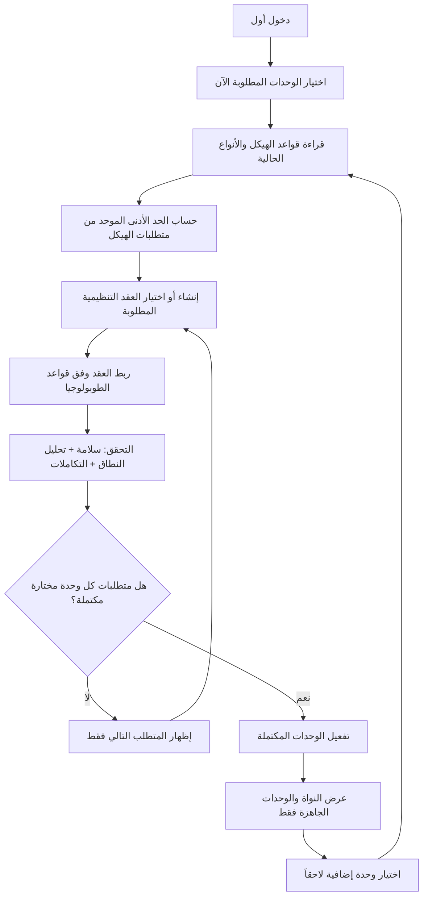

# إعادة ترتيب تهيئة الهيكل التنظيمي أولاً — النسخة المصححة

**الإصدار:** 2.0  
**الحالة:** تصور تنفيذي مصحح  
**المبدأ الحاكم:** **لا تظهر أي وحدة في النظام قبل اكتمال الهيكل التنظيمي الذي تتطلبه تلك الوحدة، ولا يعاد إنشاء منطق تنظيمي موازٍ.**

## التصحيح الأساسي للتصور السابق

التصميم الصحيح هنا ليس مشروع «Onboarding» منفصل ينسخ منطق الأعمال إلى جداول ومسارات جديدة، وليس واجهة توثيقية كبيرة تعرض كل أدوات الهيكل دفعة واحدة. إنه **إعادة ترتيب عملية ومدروسة للواجهات الحالية وواجهات API الحالية** بحيث تتحول من تبويبات تقنية متشعبة إلى رحلة عمل قصيرة وموجهة.

> محرك Organization Governance الحالي صحيح: لديه أنواع تنظيمية، قواعد طوبولوجيا، عقد، روابط، تحليل نطاق، تحقق سلامة، سجل تغيير، وتكاملات تشغيلية. المشكلة أن هذه القدرات تعرض اليوم كـ«لوحة إدارة كاملة» بدلاً من ترتيبها في تسلسل قرار وتنفيذ مناسب لمنشأة جديدة.

لا ننشئ جدولاً ثانياً للعقد أو الروابط أو المستودعات أو المراكز. كما لا نعيد كتابة `OrgStructureService` أو `OperatingContextService`. المطلوب هو **طبقة تقديم وترتيب** تستخدم هذه الواجهات نفسها، مع حفظ اختيار الوحدات وتقدم الرحلة في مخزن الإعدادات القائم، وتمنع الإظهار قبل الجاهزية.

| الفكرة غير الصحيحة | التصحيح المعتمد |
| --- | --- |
| البدء بصفحة الهيكل التنظيمي بكل تبويباتها ثم مطالبة المستخدم باكتشاف المطلوب. | بدء رحلة تهيئة عملية تعرض سؤالاً أو قراراً واحداً في كل شاشة، وتستخدم الخلفية لتحديد المطلوب التالي. |
| اعتبار جاهزية متجر التشغيل مرحلة عامة دائماً. | جعلها متطلباً تنظيمياً/تشغيلياً **مشروطاً** بوحدات تتطلب موقع تشغيل فعلياً، كالمبيعات التجزئة والمخزون. |
| إظهار الوحدة بعد اختيارها. | اختيار الوحدة يعني أنها «مطلوبة للتهيئة» فقط؛ لا تصبح مرئية إلا عند نجاح كل متطلباتها التنظيمية. |
| إنشاء إعدادات هيكل جديدة للـwizard. | إنشاء العقد والروابط والتكاملات عبر endpoints الهيكل الحالي نفسها؛ الواجهة الجديدة ترتبها فقط. |
| جعل القائمة الجانبية مصدر قرار الإتاحة. | `Module.is_active` وحالة التحقق التنظيمي والإعدادات المحفوظة هي المصدر؛ القائمة نتيجة عرض لها. |

## السلوك المستهدف من منظور المستخدم

### التثبيت الأول

بعد تسجيل الدخول الأول لا يظهر الغلاف المعتاد ولا لوحة التحكم ولا القائمة الجانبية. يظهر مسار `/setup` كامل الشاشة، به شعار النظام، اللغة، حفظ تلقائي مؤكد، ومؤشر بسيط للمرحلة الحالية. لا تعرض الواجهة مخططاً تنظيمياً واسعاً، ولا تبويبات توثيقية، ولا كل إعدادات النظام.

يختار المستخدم الوحدات التي يريد تشغيلها الآن. يقرأ النظام متطلبات كل اختيار ويبني **قائمة التأسيس التنظيمي الإلزامي الموحّدة**. ثم تظهر له الخطوات بالتتابع: شاشة قصيرة، حفظ، تحقق، ثم «التالي». لا يتقدم زر التالي إن لم تكن العملية المقابلة في API الحالية نجحت فعلاً.

بعد أن ينتهي من كل المتطلبات التنظيمية الإلزامية للوحدات المختارة، يصبح النظام قابلاً للعرض. تظهر فقط النواة التي يلزم وجودها ومجموعات الوحدات الجاهزة. تبقى الوحدات غير المختارة أو المختارة وغير المهيأة مخفية تماماً من القائمة والبحث وبطاقات التنقل.

### ما بعد الإطلاق الأساسي

يوجد في النواة عنصر واحد ظاهر للإدارة: **إضافة/تهيئة وحدة**. عند اختيار وحدة إضافية، يعود المستخدم إلى نفس تسلسل الخطوات الموجّهة، ولكن بمتطلبات تلك الوحدة فقط. لا يعود إلى صفحة هيكل تنظيمية عملاقة، ولا يضطر إلى إعادة إدخال عناصر جاهزة. تظهر الوحدة فور اكتمال متطلباتها التنظيمية وتشغيلها، وليس قبل ذلك.

## عقد الإتاحة: لا اختيار بلا جاهزية

لكل وحدة ثلاثة أوضاع تشغيلية فقط. لا يسمح النظام بحالة مبهمة بين الاختيار والإتاحة.

| الحالة | معناها | موضعها في الواجهة | أثرها على القائمة والمسارات |
| --- | --- | --- | --- |
| `not_selected` | المستخدم لم يطلب تشغيل الوحدة. | تظهر في كتالوج الإضافة فقط. | مخفية تماماً. |
| `selected_pending_org_setup` | اختيرت لكن ينقصها هيكل أو تكامل تنظيمي أو تحقق إلزامي. | بطاقة داخل رحلة التهيئة فقط مع المتطلب التالي. | مخفية تماماً، بما في ذلك البحث والتنقل المباشر. |
| `active` | اكتملت كل متطلبات الهيكل الخاصة بها، نجحت التحققات، وفُعلت الوحدة. | تظهر كمجموعة/شاشة تشغيل عادية. | ظاهرة فقط للمستخدم الذي يملك الصلاحية. |

يمكن تمثيل حالة الاختيار والتقدم ضمن مخزن الإعدادات الموجود حالياً، لأن جدول `settings` يدعم مفاتيح مستقلة وتحديثها عبر `/v2/settings` [1]. لكن لا تسجل فيه بيانات هيكل مكررة؛ تسجل مفاتيح قرار/عرض صغيرة فقط، مثل:

| مفتاح إعداد مقترح | القيمة | الغرض |
| --- | --- | --- |
| `setup.version` | `2` | حماية ترقية شكل التهيئة مستقبلاً. |
| `setup.selected_modules` | JSON لمفاتيح الوحدات المختارة. | يحدد ما يجب أن يمر بالرحلة. |
| `setup.current_module` | مفتاح وحدة أو `core`. | الاستئناف في الموضع الصحيح. |
| `setup.completed_requirements` | JSON لمفاتيح المتطلبات التي أثبتتها endpoints الحالية. | يسمح بالعودة دون إعادة أسئلة منجزة. |
| `setup.visible_modules` | JSON مشتق ومؤكد بعد التحقق. | لقطة عرض للقائمة؛ لا تحل محل فحص الخلفية. |

تضاف **قائمة سماح وتحقق شكلي** لمفاتيح `setup.*` داخل Action الإعدادات الحالي، حتى لا تتحول الواجهة إلى كاتب عام لأي قيمة في جدول settings. ولا حاجة لمسار بيانات تنظيمي جديد؛ تبقى العقد والروابط في جداولها الحالية ويظل مصدرها متحكم الهيكل التنظيمي الحالي.

## خريطة الوحدة إلى هيكلها المطلوب

لا تكتب الواجهة قواعد التنظيم في JSX أو في وصف ثابت. تبنى مصفوفة متطلبات مركزية صغيرة (`moduleSetupRequirements`) تتلقى الاستجابة الفعلية من `meta-types` و`topology-rules` وتعيد المتطلبات المنطبقة. هدفها هو **ترتيب ما هو موجود**، لا تجاوز قواعد المجال.

| فئة الوحدة | أمثلة وحدات | الحد الأدنى التنظيمي الذي يظهر في التهيئة | لا يظهر إلا بعد |
| --- | --- | --- | --- |
| النواة التنظيمية | `org_structure`، الإدارة الأساسية | عقدة كيان/منشأة جذرية والعقد الإلزامية التي تعيدها قواعد النظام، وروابطها الصحيحة. | نجاح قواعد الربط وفحص السلامة. |
| المالية | دليل الحسابات، الأستاذ العام، الفترات، القيود | وحدات تنظيمية صالحة للتكلفة/الربحية متى طلبتها القواعد المالية المختارة. | نجاح تحليل النطاق، وتفعيل/ربط المراكز المطلوبة. |
| المخزون | المنتجات، المشتريات، المخزون | موقع/وحدة تشغيلية ومستودع مرتبطان بعقدة صحيحة، والمراكز ذات الصلة إن طلبت. | وجود المستودع الفعال وانطباق نطاقه التنظيمي. |
| المبيعات والتجزئة | المبيعات، المرتجعات، نقاط البيع | موقع بيع/فرع صحيح، ومستودع، ومركز/مراكز لازمة، ونقطة بيع عند اختيار نمط POS. | نجاح سياق التشغيل وارتباطاته. |
| الموارد البشرية | الموظفون، التوظيف، الحضور، الرواتب | كيان/إدارة/قسم ووظائف أو مسميات عندما تطلبها الوحدة الفرعية. | نجاح الهيكل والربط التنظيمي المطلوب للوحدة. |
| وحدات اختيارية متخصصة | التصنيع، المشاريع، الذكاء | فقط العقد والعلاقات التي تحددها metadata الوحدة وقواعد النظام. | تحقق المتطلبات الخاصة ثم التفعيل. |

> **قاعدة دقيقة:** كلمة «هيكل» لا تعني دائماً شجرة كاملة جديدة. للوحدة التي تختار لاحقاً، يفحص النظام أولاً العقد والروابط الموجودة عبر endpoints الحالية؛ إذا كانت كافية، لا يعرض إلا خطوة تحقق قصيرة. لا ينشئ عناصر جديدة إلا عند الحاجة الفعلية.

## رحلة الواجهة: التالي، ثم التالي، دون توثيق مشتت

تتشكل الرحلة من شاشات متتابعة قصيرة، لا من تبويبات. كل شاشة تستدعي endpoint أو مجموعة endpoints متجانسة، وتعرض توصية واحدة أو اثنتين فقط حسب الاستجابة. يمكن للمستخدم حفظ والعودة، لكن لا يرى التبويب المتقدم إلا بعد الإطلاق بصفته أداة إدارة.

| رقم الخطوة | ما يراه المستخدم | endpoints القائمة المستخدمة | قاعدة الانتقال |
| --- | --- | --- | --- |
| 1 | «اختر ما ستشغله الآن» مع وصف مختصر للوحدات وفوائدها. | كتالوج `Module` القائم؛ `POST /v2/settings` لحفظ الاختيار. | يحفظ اختياراً واحداً على الأقل ويعرض ملخص متطلباته. |
| 2 | «هذا ما تحتاجه منشأتك»؛ ملخص محدود للعقد والعلاقات المطلوبة، بلا مصطلحات تقنية غير لازمة. | `GET /v2/org-structure/meta-types` و`GET /v2/org-structure/topology-rules`. | يولد المسار الموجه من الأنواع والقواعد والمتطلبات المختارة. |
| 3 | «أنشئ/اختر الكيان والمنشآت أو الفروع المطلوبة». | `GET/POST/PUT /v2/org-structure/nodes` و`GET /v2/org-structure/nodes/{uuid}`. | كل عقدة مطلوبة موجودة وصالحة. |
| 4 | «اربط الوحدات التنظيمية». | `GET/POST/PUT/DELETE /v2/org-structure/links`. | الروابط الإلزامية تلتزم بقواعد الطوبولوجيا. |
| 5 | «تحقق من نطاق العمل». لا تعرض إلا العقد التي تحتاج قراراً. | `GET /v2/org-structure/scope-context/{uuid}` و`GET /v2/org-structure/statistics`. | لا يوجد نطاق غامض أو عقدة مطلوبة غير قابلة للحل. |
| 6 | «حضّر الموارد المرتبطة». تظهر فقط للحاجة: مركز تكلفة/ربح، مستودع، أو نقطة بيع. | endpoints المالية الحالية للمراكز، ثم `GET/POST /v2/operating-context/*`. | `readiness.ready` صحيح للوحدات التي تتطلب سياق تشغيل. |
| 7 | «افحص قبل التشغيل». ملخص أخطاء قابل للإصلاح، لا تقرير تقني طويل. | `GET /v2/org-structure/integrity-check` و`GET /v2/org-integration/status` و`GET /v2/org-integration/issues`. | لا توجد أخطاء حاجبة؛ التحذيرات تظهر كقرار واعٍ فقط. |
| 8 | «تفعيل الوحدات الجاهزة». | `POST /v2/org-structure/bulk-status-update` عند الحاجة، وendpoints التكامل القائمة (`sync/*`, `open-center`) فقط إن كان المتطلب منطبقاً، ثم `POST /v2/settings`. | تُحدّث `Module.is_active` للوحدات الجاهزة وتُحدّث قائمة الإظهار. |
| 9 | «جاهز للبدء». يعرض الوجهة التالية فقط. | `GET /v2/settings` وقراءة حالة الوحدات. | يغادر `/setup` إلى أول وحدة جاهزة. |

جميع endpoints الهيكل التنظيمي الحالية تبقى في الخدمة. في الرحلة المبكرة، تستخدم عمليات القراءة والإنشاء والتعديل والتحقق؛ أما الحذف، سجل التغيير، التحديث الدفعي، وعمليات التكامل المفصلة فتبقى متاحة لاحقاً في أدوات الإدارة أو تظهر فقط عندما تكون خطوة الإصلاح بحاجة إليها. لا يُلغى أي endpoint لأنه «توثيقي»، بل يتغير موضع عرضه ودرجة تعقيده.

## تفعيل الوحدات وإخفاؤها باستخدام البنية القائمة

نموذج `Module` الحالي يحتوي بالفعل على `module_key` و`is_active` [2]. يستخدم هذا الحقل كحالة تشغيل للوحدة في التثبيت الحالي: لا تفعّل الوحدة عند الاختيار، بل بعد أن تمر بكل متطلبات الهيكل وتنجح الخطوة 7. وبذلك لا يلزم اختراع جدول إتاحة مستقل.

تضاف طبقة `ModuleAvailability` صغيرة للغاية — خدمة/دالة سياسة وليست نموذج مجال جديداً — وظيفتها:

1. قراءة الوحدات المفعلة من `modules.is_active`.
2. قراءة مفاتيح `setup.selected_modules` و`setup.completed_requirements` لتحديد الوحدة التالية فقط داخل رحلة التهيئة.
3. إخفاء كل رابط/مجموعة/نتيجة بحث لا تنتمي إلى `visible_modules`.
4. رفض الوصول إلى route محمي لو كانت وحدته غير مفعلة، حتى لو كان لدى المستخدم إذن تقليدي.

الخطوة الرابعة ضرورية للحوكمة. يتم تنفيذها كمتحقق صغير على المسارات الموجودة أو في `canAccess`، لا بتغيير endpoints المجال. تبقى endpoints الهيكل التنظيمي متاحة لمسار `/setup` للمسؤول المخول، بينما تتحكم حالة `is_active` في routes التشغيلية للوحدات.

| طبقة النظام | التعديل المطلوب | ما لا يتغير |
| --- | --- | --- |
| `ModuleSeeder` و`Module` | تعريف واضح للوحدات القابلة للتفعيل وحالة `is_active`. | مفاتيح الوحدات وفئاتها الحالية. |
| `UpdateSettingsAction` | السماح المفحوص بمفاتيح `setup.*` وتطبيع JSON. | endpoint `/v2/settings` وواجهة التخزين الحالية. |
| مكوّن التنقل | فلتر ثانٍ بعد الصلاحيات: `is_active && isVisible`. | تعريف التنقل الثابت وبنيته البصرية. |
| `MainLayout` | قبل رسم الغلاف، يعيد التوجيه إلى `/setup` إذا كانت المتطلبات المحددة غير منتهية. | التحقق من الدخول والصلاحيات الحالية. |
| API routes التشغيلية | middleware خفيف لفحص نشاط الوحدة. | متحكمات المجال وعقود الطلبات الموجودة. |
| صفحة الهيكل الحالية | إزالة بطاقة إعداد المتجر من الأعلى؛ إبقاء كل التبويبات كمساحة إدارة بعد الإطلاق. | المكوّنات والمتحكمات والـendpoints التنظيمية. |

## معالجة جاهزية متجر التشغيل بدقة

`OperatingContextService` وواجهات `/v2/operating-context/readiness` و`configure` ليست خطأ؛ إنها بالفعل تحقق من المستودع والمركزين ونقطة البيع وتستطيع إنشاء الموارد/ربطها [3]. الخطأ في جعلها بطاقة عامة معروضة داخل شاشة الهيكل للجميع.

في التصميم الجديد، لا يظهر إعداد موقع التشغيل إلا إذا كان مخطط الوحدات المختار يحتاج إليه. تسير الواجهة كالتالي:

1. تقرأ العقد التنظيمية النشطة من endpoints الهيكل.
2. تعرض فقط النطاق/الفرع المؤهل كموقع تشغيل.
3. تستدعي endpoints المراكز المالية والمستودعات المتاحة.
4. تجمع البيانات في نموذج قصير وتستدعي `POST /v2/operating-context/configure`.
5. تستدعي `GET /v2/operating-context/readiness`.
6. إذا رجعت `ready = true`، تعلم المتطلب كاملاً وتفعّل الوحدة التي تعتمد عليه؛ وإلا تبقي المستخدم في نفس الخطوة مع علاج محدد.

لا تظهر هذه الخطوات للموارد البشرية فقط أو للمالية التي لا تتطلب موقعاً/نقطة بيع. وهذا هو الفارق بين توصية ذكية شحيحة وبين نموذج عام مزعج.

## إعادة ترتيب الواجهات الحالية

| الواجهة الحالية | وضعها اليوم | وضعها بعد الترتيب |
| --- | --- | --- |
| صفحة `org-hierarchy` ذات التبويبات التسعة | مساحة كبيرة تخلط التأسيس والإدارة المتقدمة وجاهزية المتجر. | أداة إدارة متقدمة تظهر فقط بعد تأسيس المنظمة؛ لا تستخدم كأول شاشة. |
| `DashboardTab` و`HierarchyTab` | عرض/استكشاف واسع. | يمكن أن يظهرا كتأكيد بصري مبسط بعد اكتمال العقد والروابط، لا كخطوة بداية. |
| `NodesTab` و`LinksTab` | تحرير حر وتقني. | تصبحان نماذج موجّهة صغيرة في `/setup`: «أضف الكيان»، ثم «أضف الفرع»، ثم «اربطه». |
| `MetaTypesTab` و`TopologyRulesTab` | توثيق لقواعد المحرك. | بيانات خلفية لتوليد التوصية؛ لا تظهر إلا كتفسير مختصر: «يلزم فرع تحت الكيان». |
| `ScopeContextTab` | تحليل تقني للنطاق. | تحقق خفي/مختصر لا يظهر إلا عند الغموض أو الاختيار المطلوب. |
| `IntegrityTab` | تقرير كامل قد يخيف المستخدم الجديد. | بوابة قبل التفعيل تظهر الأخطاء القابلة للإصلاح فقط. |
| `ChangeHistoryTab` | سجل تدقيق وإدارة. | يبقى بعد الإطلاق للمراجعة؛ لا يدخل رحلة التهيئة. |
| نافذة إعداد المتجر | آخر بطاقة في صفحة الهيكل. | خطوة مشروطة داخل مسار الوحدة التي تحتاج موقع تشغيل. |

## أقل تغيير خلفي ممكن

هذا التحول لا يتطلب تغيير منطق endpoints التنظيمية. التغيير الخلفي المطلوب يقتصر على ضبط الإتاحة وحفظ تقدم العرض:

1. تقييد مفاتيح `setup.*` داخل endpoint الإعدادات الموجود، مع تحقق من شكل JSON ومن صلاحية المسؤول.
2. استخدام `modules.is_active` لتفعيل الوحدة بعد اجتياز متطلباتها، لا عند اختيارها.
3. إضافة middleware صغير للتحقق من نشاط الوحدة قبل routes التشغيلية؛ لا يغير Controller أو Request أو Action للوحدة.
4. استدعاء `bulk-status-update` وواجهات التكامل القائمة عندما تطلب عملية التفعيل ذلك، بدلاً من فتح وحدات على بنية غير مفعلة.
5. إنشاء طبقة واجهة فقط باسم `OrgFirstSetupFlow` تجمع البيانات من endpoints القائمة وتعرض الخطوة التالية. لا تخزن عقداً أو روابط أو سياق تشغيل خارج المصدر الموجود بالفعل.

إذا احتاج الأداء إلى تجميع قراءات كثيرة في استجابة واحدة، يمكن إضافة endpoint قراءة **مركب فقط** باسم `GET /v2/setup/overview` لاحقاً. لا يحفظ بيانات ولا ينسخ قواعد المجال؛ يستدعي ويجمع نتائج endpoints الحالية. ليس ضرورياً للنسخة الأولى، ويمكن تأجيله تماماً مع استخدام الواجهة للـendpoints الحالية مباشرة.

## معايير القبول المصححة

| المعيار | الدليل العملي |
| --- | --- |
| لا يظهر النظام قبل الأساس التنظيمي | زيارة أي مسار عادي في تثبيت جديد تعيد إلى خطوة `/setup` الصحيحة، ولا يُرسم `MainLayout`. |
| لا تظهر وحدة قبل هيكلها | اختيار المبيعات أو HR لا يضيف أي رابط تنقل حتى ينجح التحقق الخاص بها ويصبح `is_active = true`. |
| لا تكرر التهيئة بيانات المجال | كل عقدة/رابط/مستودع/سياق يظهر في الجداول والنقاط الموجودة حالياً، لا في نموذج onboarding جديد. |
| واجهة موجّهة وليست توثيقاً | المستخدم يرى في كل مرة خطوة واحدة مع توصية أو اثنتين وأزرار «حفظ» و«التالي»، وليس قائمة تبويبات كاملة. |
| الاستكمال اللاحق متسق | إضافة وحدة بعد الإطلاق تستدعي المسار نفسه، تتحقق من الموجود أولاً، وتطلب الناقص فقط. |
| الوحدات غير المختارة مخفية | لا تظهر في القائمة الجانبية، الشبكة، البحث، أو الصفحات المستهدفة. |
| الوحدات غير المهيأة محكومة | رابط مباشر أو API تشغيلي لوحدة غير مفعلة يرفض الوصول أو يعيد إلى خطوة إعدادها. |
| endpoints القائمة مستثمرة | تستخدم الرحلة endpoints الأنواع والقواعد والعقد والروابط والنطاق والسلامة والتكامل وسياق التشغيل بحسب الحاجة، ولا يلغى محرك الهيكل. |

## ترتيب التنفيذ الصحيح

1. إنشاء `OrgFirstSetupFlow` في الواجهة مع descriptors لمتطلبات الوحدات، من دون تعديل شاشات المجال.
2. تعديل صفحة الدخول/الغلاف ليطبق البوابة قبل عرض القائمة.
3. توصيل خطوات العقد والروابط والتحقق بواجهات API الحالية، وإظهار توصيات صغيرة مستخلصة منها.
4. ربط `is_active` للوحدات مع اكتمال المتطلبات، وإضافة فلتر التنقل والحارس الخلفي.
5. نقل «جاهزية متجر التشغيل» من صفحة الهيكل إلى خطوة مشروطة تستخدم endpoints الحالية نفسها.
6. إبقاء صفحة الهيكل الحالية مساحة حوكمة متقدمة، ثم إزالة المحتوى المكرر منها فقط بعد نجاح المسار الجديد.
7. إضافة مسار «إضافة وحدة» بعد الإطلاق يعيد استخدام الخطوات نفسها.

## المراجع

[1]: https://github.com/Emran025/accore-erp/blob/main/backend/app/Domains/EnterpriseCore/OrganizationGovernance/Actions/UpdateSettingsAction.php "آلية حفظ إعدادات النظام الحالية"
[2]: https://github.com/Emran025/accore-erp/blob/main/backend/app/Domains/EnterpriseCore/OrganizationGovernance/Models/Module.php "نموذج Module وحالة is_active"
[3]: https://github.com/Emran025/accore-erp/blob/main/backend/app/Domains/EnterpriseCore/OrganizationGovernance/Services/OperatingContextService.php "خدمة جاهزية سياق التشغيل الحالية"
[4]: https://github.com/Emran025/accore-erp/blob/main/backend/app/Http/Controllers/Api/V2/EnterpriseCore/OrganizationGovernance/OrgStructureController.php "واجهة محرك الهيكل التنظيمي القائمة"
[5]: https://github.com/Emran025/accore-erp/blob/main/frontend/app/01-enterprise-core/organization-governance/org-structure/org-hierarchy/%28pages%29/page.tsx "واجهة الهيكل الحالية التي يعاد ترتيبها"
