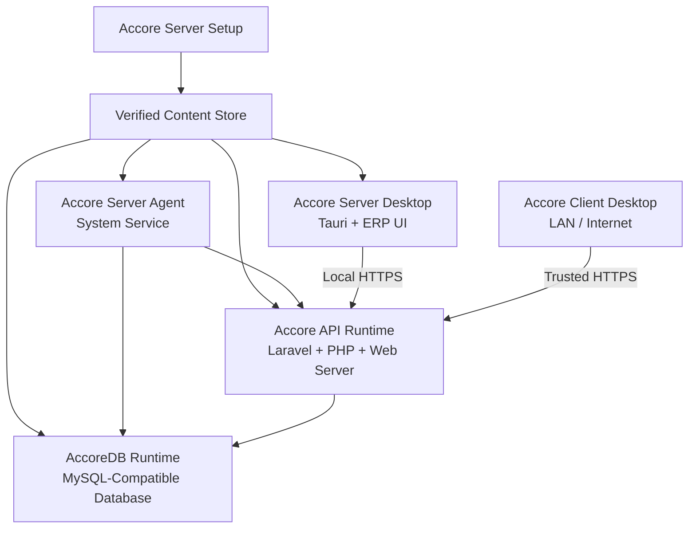
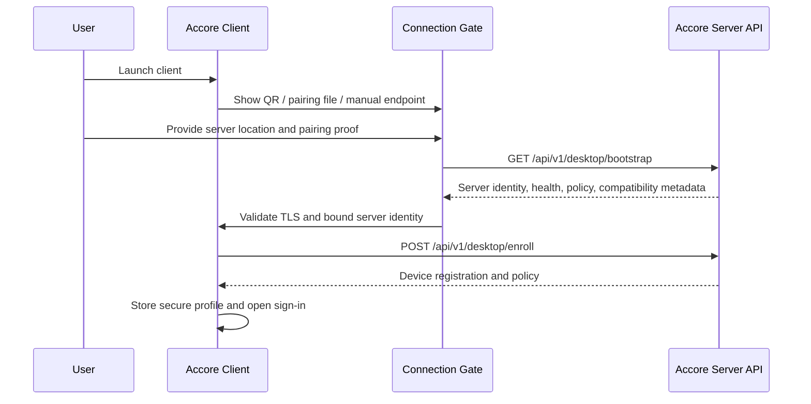

# Accore Server and Client Distribution Architecture

## Executive Summary

Accore ERP will be distributed as **two product flavours built from one source repository**: **Accore Server**, installed once on the organisation’s primary machine, and **Accore Client**, installed on each user workstation. Both flavours present the same Next.js-based ERP experience through Tauri. The Server flavour additionally installs, starts, supervises, updates, and monitors the local application runtime and database. The Client flavour contains no database or Laravel runtime and cannot enter the ERP application until it has established a trusted connection to an approved Accore Server.

This design deliberately separates **developer tooling** from **end-user runtime requirements**. End users must not install or operate Node.js, npm, Composer, PHP, Rust, Cargo, or a pre-existing MySQL service. These are build-time tools or packaged runtime components. The installer either downloads signed application packages into a shared local content store or imports previously downloaded offline packages, verifies them, and installs them with an observable and recoverable workflow.

> Closing the Server desktop window must not stop the organisation’s server by default. A supervised system service owns the database, API runtime, queue processing, backup, and update lifecycle. This preserves availability for LAN and Internet-connected clients.

## Scope and Product Boundary

| Product | Installed on | Includes | Does not include | Primary responsibility |
|---|---|---|---|---|
| **Accore Server Setup** | The organisation’s primary server/workstation | Server Desktop, Server Agent, API runtime, database runtime, runtime cache, first-run wizard | Developer toolchains | Installs and configures the organisation’s operational server |
| **Accore Server Desktop** | The primary machine | The same ERP UI plus server administration surfaces | Direct database process ownership | Shows ERP after local services are healthy; administers the server through a privileged local channel |
| **Accore Client Setup** | Each user workstation | Client Desktop, WebView dependency where needed, local connection profile store | Laravel, PHP, Composer, database runtime, Server Agent | Installs the ERP client and pairs it with a trusted server |
| **Accore Client Desktop** | Each user workstation | The same ERP UI, connection gate, secure credential storage, updater | Any local ERP server component | Connects securely to an Accore Server over LAN or the Internet |

The architecture is intended for a single-machine deployment as well as multi-user LAN and Internet deployments. A single-machine installation is simply an Accore Server installation whose Server Desktop connects to the local API. It is not a separate codebase or a separate database model.

## Current-Code Assessment

The repository already contains the foundations for the UI flavour of this design. The frontend is a Next.js 16 application configured for static export, and Tauri is configured to use the generated `out` directory when building a desktop package. In development, Tauri starts only `npm run dev` and loads the frontend at port 5000.[1] [2]

The Laravel backend is structurally independent. Its example configuration expects a MySQL database at `127.0.0.1:3306`, and it defaults sessions, cache, and queues to database-backed drivers.[3] Its Composer development script starts Laravel, a queue listener, Pail, and Vite concurrently; it does not start MySQL.[4] The frontend currently falls back to `http://127.0.0.1:8000/api` when no public API base is supplied.[5]

These facts mean that the current repository is **not yet a self-contained local-server installer**. It must gain a service supervisor, a packaged Laravel runtime, a packaged database runtime, product flavours, a client pairing protocol, and a secure release/install pipeline. The plan below specifies those additions without duplicating the existing ERP domain implementation.

## Target Architecture



The **Accore Server Agent** is the operating authority. It runs as a system service under a dedicated operating-system account, starts AccoreDB before the API runtime, monitors health, performs controlled updates, coordinates backups and migrations, and exposes only an authenticated local management interface. The Server Desktop must never invoke database binaries directly and must not be required to remain open for the service to operate.

The database listens on loopback only. Clients communicate with the API over HTTPS; they never receive database credentials and never connect to the database port. LAN exposure is opt-in and explicitly configured through the Server Desktop or a server-management command. Internet exposure requires an organisation-controlled DNS and TLS deployment policy; raw public database exposure is prohibited.

## Runtime Packaging Model

### Packaged components

| Component | Distribution approach | End-user dependency eliminated | Mutable state |
|---|---|---|---|
| Server and Client Desktop | Signed Tauri applications per operating system and architecture | Node.js, npm, Rust, Cargo | No business state |
| Server Agent | Native Rust system-service binary | Service-manager scripting by the user | Service configuration and logs only |
| API Runtime | Self-contained FrankenPHP/Laravel application with the required PHP extensions | PHP, Composer, a separately installed web server | Versioned runtime only |
| AccoreDB Runtime | A vetted MySQL-compatible distribution per target platform | Pre-existing database server | Persistent database files, separately stored |
| Queue runtime | Managed by the Server Agent as a dedicated process or compatible worker mode | Manual queue execution | Database-backed queue state and logs |
| Runtime content store | Signed content-addressable store shared by all Accore installers | Repeated dependency downloads | Package objects and manifests only |
| WebView dependency | Included or installed through the native Tauri installer when required | Manual WebView installation | OS-managed runtime |

FrankenPHP is suitable for the packaged API runtime because it supports distributing a Laravel application, a PHP interpreter, and a production web server as one standalone binary. Its tooling can execute embedded Artisan commands for migrations and optimisation.[6] [7] The persistent Laravel storage path must be moved outside any embedded or versioned runtime directory because embedded application files can be extracted into a temporary location on each release.[6]

### Storage boundaries

All installers follow one non-negotiable rule: **application binaries are replaceable; customer data is not**. The runtime home is named `ACCORERUNTIME_HOME` and is owned by the Accore service identity.

| Purpose | Windows system-wide default | macOS system-wide default | Linux system-wide default |
|---|---|---|---|
| Installed binaries | `%ProgramFiles%\\Accore\\` | `/Applications/Accore Server.app` | `/opt/accore/` |
| Runtime home | `%ProgramData%\\Accore\\` | `/Library/Application Support/Accore/` | `/var/lib/accore/` |
| Verified object store | `cache/objects/` under runtime home | `cache/objects/` | `cache/objects/` |
| Versioned server runtimes | `runtime/server/<version>/` | equivalent | equivalent |
| Database files | `data/database/` | equivalent | equivalent |
| Laravel persistent storage | `data/laravel-storage/` | equivalent | equivalent |
| Secrets and runtime configuration | `config/` with service-only ACLs | equivalent | equivalent |
| Logs and backups | `logs/`, `backups/` | equivalent | equivalent |

The server sets `LARAVEL_STORAGE_PATH=${ACCORERUNTIME_HOME}/data/laravel-storage`. The database directory, backup directory, runtime secrets, and service account credentials are never placed below `Program Files`, inside the Tauri bundle, or inside a versioned runtime directory.

## Package, Cache, and Offline-Install Design

The installers use a signed, content-addressed package store rather than an unstructured cache. A release manifest defines each artifact’s logical name, product flavour, semantic version, platform/architecture, byte size, SHA-256 digest, signature, and source URL. The installer downloads to a `.partial` file, supports resume, verifies integrity and signature, and atomically promotes the artifact into the local object store.

```text
${ACCORERUNTIME_HOME}/cache/objects/sha256/<first-two-characters>/<full-sha256>
```

The store maintains a signed local index and an object-level lock. This allows Server Setup and Client Setup to reuse an already verified component without downloading it twice. It also allows an offline installer or a package downloaded independently by the user to import the exact same artifact after signature verification.

| Distribution option | Contents | Intended use |
|---|---|---|
| **Online bootstrapper** | Small signed setup application; downloads missing artifacts | Normal connected installation |
| **Full offline installer** | The same installer plus all required signed `accorepkg` artifacts | Restricted, air-gapped, or USB-based installation |
| **Standalone application package** | A signed Server or Client `accorepkg`, not a standalone executable | Pre-download, controlled import, repair, or update staging |
| **Updater artifact** | Signed platform-specific application update | In-product update after installation |

The Server and Client product families must each publish an online bootstrapper, a full offline installer, and an importable application package. This satisfies both delivery paths: the setup program can obtain the application itself, or a user can supply a previously downloaded package without installing developer tools.

## Accore Server First-Run Workflow

The Server Setup is a native, cross-platform Tauri installation application backed by a Rust installation core. It displays real byte-level download progress, component verification progress, service state, migration progress, warnings, recovery instructions, and a support-bundle reference. The visual progress is driven by an append-only installation journal, not by optimistic frontend timers.

| Stage | Server Setup responsibility | Gate before continuation |
|---:|---|---|
| 1 | Inspect OS, architecture, free storage, ports, elevation, and conflicts | Platform prerequisites pass |
| 2 | Create runtime home and restrictive access controls | Service account and data paths are writable only by authorised identities |
| 3 | Download/import signed components into the content store | Hash and signature pass for every artifact |
| 4 | Install and register Accore Server Agent | The operating system reports the service as installed |
| 5 | Initialise AccoreDB data path and generate a database account/password | Database starts on loopback and passes a readiness check |
| 6 | Generate protected runtime configuration and application key | Secrets are not exposed to the UI or user profile |
| 7 | Start API runtime and run controlled initialisation | `accore:install`, migrations, optimisation, and health checks pass |
| 8 | Run the organisation wizard | Organisation metadata and the first administrator are successfully created |
| 9 | Produce server identity and pairing material | QR code and/or signed enrolment package is generated |
| 10 | Open Server Desktop | The local API passes the application bootstrap check |

The database service must use a dedicated application account; production configuration must never rely on the example `root` account in `backend/.env.example`.[3] The first administrator’s password is supplied only to Laravel’s normal password-hashing flow. It is neither stored in the setup journal nor added to local configuration files.

If a stage fails, the installer stops at a durable journal boundary. It can safely resume verification or download work on the next launch. It must not erase an existing data directory merely because a first-run process failed. Any irreversible reset must require an explicit administrative confirmation after a backup has been created.

## Server Service Lifecycle

The default lifecycle is designed for a multi-user organisation:

| Event | Required Server Agent behaviour |
|---|---|
| OS boot | Start AccoreDB, wait for readiness, start API runtime and queue processing, then publish healthy state |
| Server Desktop open | Query the local management channel; show startup progress only if the service is still becoming healthy |
| Server Desktop close | Leave Server Agent, API, queue worker, and database running |
| Database failure | Stop dependent API processing, capture diagnostics, attempt bounded recovery, raise an actionable unhealthy state |
| API failure | Restart under a defined retry budget; preserve database process and diagnostics |
| Administrative shutdown | Enable maintenance, drain/stop queue work safely, stop API, then stop database in order |
| Update | Enter maintenance, back up data, migrate once, restart services, verify health, then release clients |

A single-workstation convenience mode may be offered later. It can request a graceful service stop when the last UI window closes, but it must be an explicit administrator-selected mode. It cannot be the default when the server is reachable by other users.

## Client Connection and Pairing Architecture

Accore Client contains the same ERP UI but has no local backend. It begins at a **Connection Gate**. The gate is the only accessible application state until a connection profile has passed endpoint, TLS, server identity, compatibility, and enrolment checks.



### Connection modes

| Mode | Endpoint discovery | Trust decision | Result |
|---|---|---|---|
| **Local Server Desktop** | Built-in `local-server` profile | Local API identity and Agent readiness | The Server UI opens after local health succeeds |
| **LAN client** | Server-generated QR code, pairing file, mDNS/DNS name, or manual endpoint | HTTPS plus pinned server identity/certificate policy | The client joins the organisation’s local server |
| **Internet client** | DNS, QR code, or pairing file | Publicly trusted TLS or enterprise PKI; server identity binding | The client connects remotely without exposing AccoreDB |

Production clients accept HTTPS only. A development-only HTTP exception must not be present in release builds. For enterprise LAN certificate deployment, the pairing package carries the expected server identity and certificate trust material; the user cannot bypass a certificate mismatch dialog to accept an arbitrary server.

### Pairing API

The Laravel application gains a deliberately narrow, rate-limited desktop bootstrap namespace. It must expose no financial data, user directory data, or runtime secrets.

| Route | Authentication | Purpose | Essential response data |
|---|---|---|---|
| `GET /api/v1/desktop/bootstrap` | None, rate-limited | Endpoint health, server identity, policy discovery, version negotiation | `server_id`, display name, API contract, minimum client version, health, enrolment mode, certificate fingerprint |
| `POST /api/v1/desktop/enroll` | Short-lived one-time enrolment proof | Register an approved device | Device identifier, policy, enrolment evidence; no user access token |
| `GET /api/v1/desktop/policy` | Registered device plus authenticated user | Return active compatibility and feature policy | Minimum client version, feature flags, server time |
| `GET /up` | None | Laravel process health only | HTTP 200 or 500; not a replacement for bootstrap |

New persistence includes `client_devices`, `enrollment_codes`, `installations`, `release_ledger`, and `schema_checkpoints`. An enrolment code is stored as a hash, expires quickly, is single-use by default, and can be bound to a network scope. The Server Desktop creates the QR or pairing file only after an authorised administrator action.

## Credential and Configuration Storage

The current frontend persists `sessionToken` and authentication state through Zustand and browser `localStorage`.[8] This must be replaced for desktop distribution.

| Data classification | Storage location | Examples |
|---|---|---|
| Public client profile | Conventional app configuration | Endpoint, server identifier, display name, language, last connection status |
| Client secrets | Tauri Stronghold encrypted store | Refresh credential, enrolment evidence, certificate binding, private device material |
| Active session state | In-memory Zustand state only | Short-lived access token, current user, permissions |
| Server runtime secrets | Service-owned runtime configuration | Database password, `APP_KEY`, TLS material, release-service credentials |

Tauri Stronghold provides encrypted storage across Windows, macOS, and Linux, but it must be intentionally installed, configured, and granted capabilities.[9] Long-lived refresh and device credentials must be revocable from the server. Client passwords must never be cached locally. The application should use short-lived access tokens, protected refresh credentials, and server-side device revocation.

## Repository and Code Structure

The project remains one repository. Existing `backend/` and `frontend/` directories remain the product source; distribution infrastructure is added alongside them.

```text
accore-erp/
├── backend/
│   ├── app/Console/Commands/
│   │   ├── AccoreInstallCommand.php
│   │   ├── AccoreUpgradeCommand.php
│   │   ├── AccoreRuntimeHealthCommand.php
│   │   └── CreateEnrollmentCodeCommand.php
│   ├── app/Http/Controllers/Api/V1/Desktop/
│   ├── app/Services/Deployment/
│   ├── config/accore-runtime.php
│   └── database/migrations/
├── frontend/
│   ├── app/connection/
│   ├── lib/connection/
│   ├── stores/useConnectionStore.ts
│   └── src-tauri/
│       ├── tauri.client.conf.json
│       ├── tauri.server.conf.json
│       ├── capabilities/client.json
│       ├── capabilities/server.json
│       └── src/{connection,secure_store,server_control,commands}.rs
├── distribution/
│   ├── crates/
│   │   ├── accore-installer/
│   │   ├── accore-installer-core/
│   │   ├── accore-server-agent/
│   │   └── accore-release-tool/
│   ├── runtime/{frankenphp,accoredb}/
│   ├── manifests/schema/
│   ├── installers/{windows,macos,linux}/
│   └── docs/
└── .github/workflows/
    ├── release-server.yml
    ├── release-client.yml
    └── verify-installers.yml
```

The Rust layer uses explicit, allow-listed operations. React code must not execute arbitrary shell commands or pass user-controlled command paths/arguments to the operating system. Sensitive responsibilities are separated as follows:

| Module | Responsibilities | Representative API |
|---|---|---|
| `accore-installer-core::manifest` | Manifest download, signature verification, compatibility resolution | `verify_manifest()` |
| `accore-installer-core::download` | Resumable download, cancellation, byte-progress emission | `fetch_verified()` |
| `accore-installer-core::cache` | Content-addressable objects, locks, imports, garbage collection | `ContentStore` |
| `accore-installer-core::journal` | Recovery boundaries and interrupted-install resume | `resume_or_rollback()` |
| `accore-installer-core::platform` | Paths, operating-system service control, firewall integration | `PlatformService` |
| `accore-server-agent` | Database/API lifecycle, health gates, backup and upgrade coordination | `Supervisor`, `UpgradeCoordinator` |
| Tauri `connection` module | Probe, identity binding, device enrolment, profile persistence | `probe_server()`, `verify_binding()` |
| Tauri `server_control` module | Strictly limited local status and authorised administrative actions | `server_status()`, `request_maintenance()` |

Server Desktop communicates with Server Agent over an ACL-protected named pipe on Windows or a permission-restricted Unix domain socket on macOS/Linux. It must not expose an unauthenticated TCP administration port.

## Laravel Operational Commands

The product introduces explicit Laravel operations so installation and update behaviour is deterministic and auditable. The Server Agent invokes the embedded API runtime; it never calls `composer`, `npm`, `php`, or `artisan` from the user’s `PATH`.

| Command | Who may execute it | Behaviour |
|---|---|---|
| `accore:install --runtime-config=<path>` | First-run Agent flow only | Validate the database, execute migrations, create an installation ledger record, and issue one-time setup flow material |
| `accore:upgrade --release=<version>` | Server Agent only | Verify compatibility, create a backup checkpoint, migrate once, and record the release result |
| `accore:runtime:health --json` | Agent and installer | Validate database, cache, queue, storage capacity, and schema compatibility |
| `accore:enrollment:create` | Authenticated Server administrator | Issue a short-lived pairing code/QR without exposing runtime secrets |
| `accore:maintenance --on|--off` | Server Agent only | Control planned maintenance around an update |

The API runtime can execute commands through the packaged binary, for example:

```text
${ACCORERUNTIME_HOME}/runtime/server/2026.8.0/accore-api \
  php-cli artisan accore:upgrade --release=2026.8.0 --no-interaction --force
```

All installation and upgrade work is protected by a database or file lock. `release_ledger` records the release digest, current and target schema versions, timing, result, initiating identity, and backup checkpoint. No client installer is permitted to run a database migration.

## Release, Update, Backup, and Recovery Policy

Every release uses semantic versioning and a signed compatibility manifest.

```json
{
  "release": "2026.8.0",
  "api_contract": "v1",
  "database_schema_min": 142,
  "database_schema_target": 145,
  "client_minimum": "2026.7.0",
  "server_minimum": "2026.7.0",
  "platform": "windows-x86_64",
  "artifacts": []
}
```

Tauri update artifacts must be signed. The public verification key is embedded in the relevant product flavour, while the private signing key is held outside source control in the release environment. Tauri’s updater requires signature validation and must not be configured to disable it.[10]

The Server Agent performs a transactional release sequence: stage verified files; inspect compatibility and current health; create a consistent database backup; enter maintenance; perform migrations; restart the API/queue runtime; execute post-upgrade health checks; and finally atomically activate the new runtime. A failed pre-migration release rolls back to the prior executable runtime. A failed post-migration release remains in maintenance and follows a backup-restoration runbook; automatic database rollback must not be assumed to restore business data safely.

| Failure point | Required response | Client access |
|---|---|---:|
| Signature or digest failure | Discard staging object; retain current release | Available |
| Failure before migration | Re-activate prior runtime after health verification | Available after recovery |
| Migration failure | Maintain safe maintenance state; present backup restoration path | Blocked |
| API health failure after migration | Bounded restart, then recovery/restore escalation | Blocked until healthy |
| Successful release | Update ledger, atomically switch `current`, publish compatibility policy | Available |

The queue worker is a long-running service. Laravel’s deployment guidance requires long-running services to be reloaded or restarted after deployment and recommends production optimisation/health checks.[11] The existing database-backed queue configuration also requires migrated queue tables before the worker is started.[3] [12]

## Security Baseline

| Current or potential risk | Required control |
|---|---|
| Example MySQL root configuration | Installer creates a dedicated least-privilege database account; production never uses root |
| Localhost API fallback | Server flavour has an explicit protected local profile; Client flavour requires verified pairing and no silent production fallback |
| Persisted browser token | Short-lived access token in memory; encrypted, revocable refresh/device data only in Stronghold |
| `csp: null` in current Tauri configuration | Product-specific strict CSP and remote-origin allowlist limited to the bound Accore Server |
| Direct process execution from UI | Rust-only allow-listed control plane; no arbitrary shell access from React |
| Unauthenticated LAN device discovery | One-time enrolment proof, server identity binding, rate limiting, audit events, and device revocation |
| Public database exposure | AccoreDB loopback-only; HTTPS API is the sole client data boundary |
| Unverified update | Signed manifest, SHA-256 verification, code-signed native installers, and pinned release verification key |

## Acceptance Test Matrix

| Test family | Required scenarios |
|---|---|
| Clean installation | Machine without Node.js, PHP, Composer, npm, or MySQL; online, interrupted, resumed, and offline package installation |
| First-run server | Runtime setup, database creation, migration, first administrator creation, restart persistence, health and bootstrap success |
| Client pairing | QR, pairing file, manual endpoint, wrong endpoint rejection, certificate mismatch rejection, revoked device rejection |
| Security | Invalid manifest, altered package, untrusted TLS, insufficient OS permissions, secret/token access attempt |
| Upgrades | Client-only update, API update, schema migration, interrupted upgrade journal recovery, post-migration restore procedure |
| Operations | Database outage, API failure, queue backlog, disk exhaustion, Agent restart, normal and administrative shutdown |
| Uninstall | UI-only removal preserves data by default; destructive removal requires explicit confirmation and backup acknowledgement |
| Platform coverage | Windows x64 reference implementation, followed by macOS ARM/x64 and Linux x64 verification |

## Implementation Sequence

| Phase | Deliverable | Completion criterion |
|---:|---|---|
| 0 | Architecture Decision Records | Supported operating systems, database distribution/licensing, TLS policy, backup policy, and release-key custody approved |
| 1 | Product flavours and connection foundation | Server and Client Tauri flavours build; Client cannot reach ERP without a verified server profile |
| 2 | Secure pairing and secret storage | Stronghold integration, device enrolment/revocation, and removal of persisted browser tokens completed |
| 3 | Standalone API runtime | Packaged Laravel runtime runs on a clean target without PHP, Composer, Node.js, or npm |
| 4 | Server Agent and setup | Clean machine can install, initialise, restart, and health-check the complete local server |
| 5 | Client setup and offline artifacts | Bootstrapper, full installer, and importable package flows pass acceptance tests |
| 6 | Safe release lifecycle | Signed updates, backups, migrations, recovery ledger, and compatibility gates pass failure tests |
| 7 | Production readiness | OS signing, monitoring, documented support operations, and customer acceptance test complete |

## Decisions Requiring Approval Before Implementation

1. **Initial target platform:** The recommended reference release is Windows x64 if that reflects the initial customer estate. macOS and Linux use the same architecture but must not be claimed as production-ready before their installer and recovery matrices pass.
2. **AccoreDB distribution:** The current Laravel configuration is MySQL-compatible. The project must select a legally distributable and operationally supportable MySQL/MariaDB runtime per platform before embedding it in installers.
3. **Default operational mode:** LAN server mode is the recommended default. Single-workstation on-demand stop/start is an optional future policy, not the default lifecycle.
4. **Certificate model:** The product must choose between an enterprise PKI and a practical self-hosted LAN certificate/pinning model, and specify public-DNS/TLS prerequisites for Internet access.
5. **Licensing policy:** Product activation must remain separate from user authentication. The policy for a disconnected customer, grace periods, and reactivation must be approved before implementation.

## References

[1]: https://github.com/Emran025/accore-erp/blob/8ddbe38ac0e4629254909319e7c1d9613a9a5325/frontend/src-tauri/tauri.conf.json "Current Tauri configuration"
[2]: https://github.com/Emran025/accore-erp/blob/8ddbe38ac0e4629254909319e7c1d9613a9a5325/frontend/next.config.ts "Current static Next.js export configuration"
[3]: https://github.com/Emran025/accore-erp/blob/8ddbe38ac0e4629254909319e7c1d9613a9a5325/backend/.env.example "Current database, cache, session, and queue defaults"
[4]: https://github.com/Emran025/accore-erp/blob/8ddbe38ac0e4629254909319e7c1d9613a9a5325/backend/composer.json "Current backend setup and development scripts"
[5]: https://github.com/Emran025/accore-erp/blob/8ddbe38ac0e4629254909319e7c1d9613a9a5325/frontend/lib/api.ts "Current frontend API base behaviour"
[6]: https://frankenphp.dev/docs/laravel/ "Running Laravel with FrankenPHP and standalone binaries"
[7]: https://frankenphp.dev/docs/embed/ "Embedding PHP applications as standalone binaries"
[8]: https://github.com/Emran025/accore-erp/blob/8ddbe38ac0e4629254909319e7c1d9613a9a5325/frontend/stores/useAuthStore.ts "Current token persistence implementation"
[9]: https://v2.tauri.app/plugin/stronghold/ "Tauri Stronghold secure storage"
[10]: https://v2.tauri.app/plugin/updater/ "Tauri signed updater"
[11]: https://laravel.com/docs/13.x/deployment "Laravel deployment, optimisation, and service reload guidance"
[12]: https://laravel.com/docs/13.x/queues "Laravel database queue requirements"
