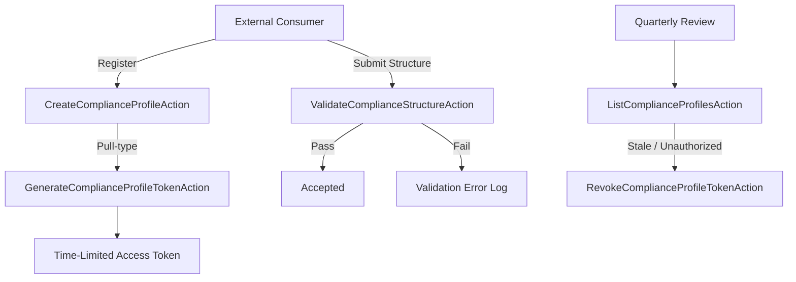

# Audit Trails & Security Logging

## Purpose

This runbook defines the operational procedures for maintaining, validating, and reviewing the Audit Trail and security logging mechanisms within accore ERP. It is addressed to security engineers, compliance officers, and auditors responsible for confirming that system activity is traceable and that access credentials for regulated data consumers are properly governed. The accore Audit Trail is defined as an immutable, chronological record of all system events for regulatory compliance.

## Scope & Applicability

This document applies to the `EnterpriseCore/MonitoringCompliance` subdomain, which governs compliance profiles, external data access tokens, and structural validation for regulated data consumers. It additionally applies to General Ledger reconciliation controls documented under the Finance domain (FIN-004). Both production and staging environments are in scope.

## Procedure

**Compliance Profile Lifecycle Management**

1. A Compliance Profile is created via `CreateComplianceProfileAction`, which registers the external consumer and optionally generates a time-limited access token for pull-type integrations.
2. Token generation for pull-type profiles is performed via `GenerateComplianceProfileTokenAction`. Tokens carry an explicit expiry (`expires_in_days`, defaulting to 365) and are associated with a defined pull endpoint.
3. Token revocation is performed via `RevokeComplianceProfileTokenAction` when a consumer relationship is terminated or a token is suspected of compromise.
4. All compliance structure payloads (JSON, XML, YAML) submitted by external consumers are validated via `ValidateComplianceStructureAction` before acceptance. Validation failures are logged with error details.
5. Compliance profiles are reviewed quarterly. The reviewer executes `ListComplianceProfilesAction` to enumerate active profiles, confirms each profile has a current business justification, and revokes stale or unauthorized profiles.

**Audit Log Integrity**

6. Financial Audit Trail records in the General Ledger are immutable by system design. No update or delete operations are provided in the `LedgerService` for posted entries, consistent with the Financial Immutability doctrine.
7. Login attempt records are captured in the `login_attempts` table and reviewed for anomalous patterns (repeated failures, off-hours access) on a weekly basis. <!-- [ASSUMPTION] -->

## Monitoring & Verification

- Token expiry dates are monitored. Tokens within 30 days of expiry trigger a renewal notification to the compliance profile owner. <!-- [ASSUMPTION] -->
- The `login_attempts` table is queried weekly for failure rate anomalies by IP address and user account.
- The `migrations` table is inspected post-deployment to confirm that the `login_attempts` and compliance profile tables are present and at the current schema version.
- Validation error rates from `ValidateComplianceStructureAction` are reviewed to detect systematic data quality issues from specific consumers.

## Failure Recovery

1. If a token is suspected of unauthorized use, the compliance officer immediately invokes `RevokeComplianceProfileTokenAction` for the affected profile and initiates an access review.
2. If `ValidateComplianceStructureAction` begins rejecting previously accepted structures, the compliance engineer reviews the format specification against the current validation logic and determines whether the consumer or the validator requires correction.
3. Inability to revoke a token due to a system fault is escalated to the backend technical lead. Manual database intervention to clear the token field is authorized only under documented DBA approval. <!-- [ASSUMPTION] -->

## Compliance & Audit

- Compliance profile creation, token generation, and revocation events constitute auditable access governance records for regulated external consumers.
- The immutability of General Ledger entries ensures that financial Audit Trail records cannot be retroactively altered, satisfying IFRS and GAAP audit evidence requirements.
- Validation error logs provide evidence that incoming data from external systems is subject to structural controls before acceptance into the ERP.
- Quarterly compliance profile reviews must be documented and retained as evidence of access governance for SOC 2 Type II and regulatory audit requirements.

## Change History

| Date | Change | Author |
|------|--------|--------|
| 2026-03-26 | Initial creation — Phase 4 execution | AI (OPS-003) |

## Assumptions & Open Questions

<!-- [ASSUMPTION] --> Token expiry monitoring and renewal notifications are assumed to be implemented via a scheduled job or external monitoring tool; no such scheduler is explicitly present in the observed source files.
<!-- [ASSUMPTION] --> Login attempt analysis is performed manually or via a reporting query; no automated anomaly detection service is present in the observed repository.
<!-- [ASSUMPTION] --> Manual database intervention to clear tokens requires written DBA authorization; the authorization process is defined in an internal governance document not present in the repository.
