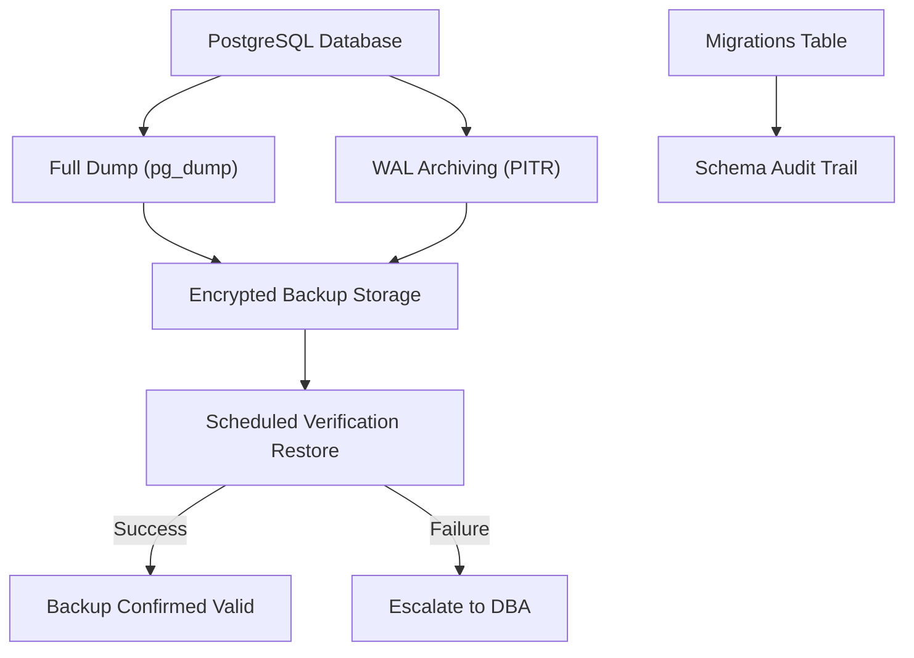

# Database Backup & Recovery Policies

## Purpose

This runbook defines the policies and procedures for database backup, point-in-time recovery, and schema version control for ACCSYSTEM ERP. It is addressed to database administrators (DBAs) and DevOps engineers responsible for data continuity. Given that ACCSYSTEM ERP enforces Financial Immutability across its General Ledger, the integrity of the persistent store is an enterprise-critical concern. Loss or corruption of database records constitutes an irreversible audit failure.

## Scope & Applicability

This policy applies to the primary ACCSYSTEM ERP PostgreSQL database instance, including all schemas created by the 142 managed migration files under `backend/database/migrations/`. It encompasses all environments: production, staging, and development. Migration-managed schema changes are subject to the same backup discipline as operational data.

## Procedure

**Schema Version Control**

1. All schema changes MUST be expressed as numbered Laravel migration files in `backend/database/migrations/`. Direct schema modifications via SQL executed outside the migration system are prohibited.
2. Before executing any migration in production, the DBA confirms that a verified database backup exists dated within the current maintenance window.
3. Migrations are applied using `php artisan migrate --force` from the backend working directory. The `migrations` table in PostgreSQL records the name and batch of every applied migration, providing a schema Audit Trail.
4. Rollback migrations (`php artisan migrate:rollback`) are available for development and staging environments. In production, rollback is permitted only under explicit DBA authorization, as it may conflict with Financial Immutability constraints where financial data resides in migrated tables.

**Backup Execution** <!-- [ASSUMPTION] -->

5. Full logical backups of the PostgreSQL database are scheduled using `pg_dump` with the `--format=custom` flag to enable selective restoration.
6. Backups are stored in an encrypted, off-instance location with a minimum retention period of 30 days.
7. Incremental point-in-time recovery (PITR) is enabled via PostgreSQL Write-Ahead Log (WAL) archiving to support granular recovery objectives. <!-- [ASSUMPTION] -->

## Monitoring & Verification

- Backup job completion status is verified against the backup storage manifest after each scheduled run.
- A test restoration is performed monthly to a non-production environment to validate recoverability. <!-- [ASSUMPTION] -->
- The `migrations` table in the production database is queried post-deployment to confirm all expected migration batches are present: `SELECT batch, COUNT(*) FROM migrations GROUP BY batch ORDER BY batch`.
- Backup file size anomalies (greater than 20% deviation from the rolling average) trigger an alert for DBA investigation.

## Failure Recovery

1. If a backup job fails, the DBA is notified immediately and the failure is logged in the operations incident register.
2. If schema corruption is detected, the database is restored from the most recent verified backup. WAL-based PITR is applied to minimize data loss window.
3. If a migration failure leaves the schema in a partially applied state, the DBA executes `php artisan migrate:status` to identify the failed migration and either corrects the migration file or manually resolves the schema state before re-running.
4. The incident is documented with root cause, recovery action, and time-to-recovery for audit purposes.

## Compliance & Audit

- Financial Immutability requires that the General Ledger tables (`general_ledger`, `universal_journals`) are never subject to bulk deletion or truncation outside a formally documented and authorized disaster recovery event.
- All backup and restore activities are recorded in the operations incident log, which constitutes evidence for SOC 2 Type II audits.
- Schema migration history in the `migrations` table provides verifiable evidence that all structural changes were applied through the controlled migration process.

## Change History

| Date | Change | Author |
|------|--------|--------|
| 2026-03-26 | Initial creation — Phase 4 execution | AI (OPS-002) |

## Assumptions & Open Questions

<!-- [ASSUMPTION] --> Backup scheduling and WAL archiving are assumed to be configured at the infrastructure level. Explicit backup tooling configuration is not present in the observed repository files.
<!-- [ASSUMPTION] --> Monthly verification restore targets a non-production environment provisioned for that purpose; this environment is not defined in the observed repository configuration.
<!-- [ASSUMPTION] --> Encrypted off-instance storage is provided by the hosting platform or cloud provider; no backup destination configuration is present in the repository.
