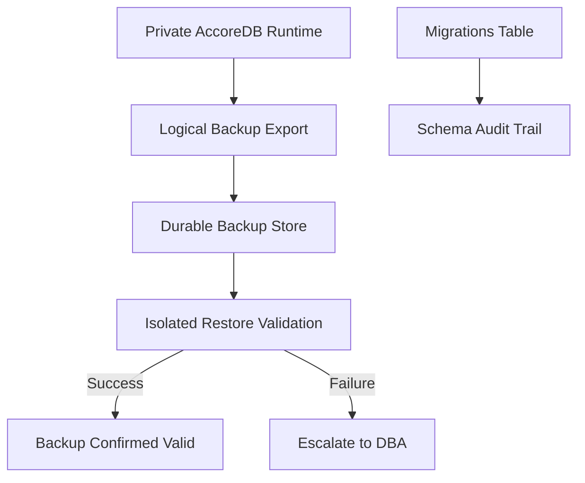

# Database Backup & Recovery Policies

## Purpose

This runbook defines the policies and procedures for database backup, point-in-time recovery, and schema version control for accore ERP. It is addressed to database administrators (DBAs) and DevOps engineers responsible for data continuity. Given that accore ERP enforces Financial Immutability across its General Ledger, the integrity of the persistent store is an enterprise-critical concern. Loss or corruption of database records constitutes an irreversible audit failure.

## Scope & Applicability

This policy applies to the private **AccoreDB** MySQL-compatible runtime, including schemas created by Laravel migrations under `backend/database/migrations/`. It covers the packaged Server production environment and its isolated restore-validation environment. Migration-managed schema changes are subject to the same backup discipline as operational data.

## Procedure

**Schema Version Control**

1. All schema changes MUST be expressed as numbered Laravel migration files in `backend/database/migrations/`. Direct schema modifications via SQL executed outside the migration system are prohibited.
2. Before executing any migration in production, the DBA confirms that a verified database backup exists dated within the current maintenance window.
3. Migrations are applied using the packaged Laravel runtime under maintenance after a verified backup checkpoint. The `migrations` table in AccoreDB records the name and batch of every applied migration, providing a schema audit trail.
4. Rollback migrations (`php artisan migrate:rollback`) are available for development and staging environments. In production, rollback is permitted only under explicit DBA authorization, as it may conflict with Financial Immutability constraints where financial data resides in migrated tables.

**Backup Execution** <!-- [ASSUMPTION] -->

5. Full logical backups are created through the packaged AccoreDB runtime and are immediately restored into the isolated `restore-validation` root for an integrity probe.
6. Backups are stored in an approved durable location with a minimum retention period of 30 days; the 14 newest restore points are protected from rotation.
7. Backup verification is successful only after export, isolated restore, integrity probe, and validation cleanup complete. Failed or unverified backups are retained for investigation.

## Monitoring & Verification

- Backup job completion status is verified against the backup storage manifest after each scheduled run.
- An isolated restore verification is performed immediately for a new backup and at least every seven days thereafter to validate recoverability.
- The `migrations` table in the production database is queried post-deployment to confirm all expected migration batches are present: `SELECT batch, COUNT(*) FROM migrations GROUP BY batch ORDER BY batch`.
- Backup file size anomalies (greater than 20% deviation from the rolling average) trigger an alert for DBA investigation.

## Failure Recovery

1. If a backup job fails, the DBA is notified immediately and the failure is logged in the operations incident register.
2. If schema corruption is detected, the database is restored from the most recent verified backup through the packaged AccoreDB runtime; the isolated validation directory is never copied over production data.
3. If a migration failure leaves the schema in a partially applied state, the DBA executes `php artisan migrate:status` to identify the failed migration and either corrects the migration file or manually resolves the schema state before re-running.
4. The incident is documented with root cause, recovery action, and time-to-recovery for audit purposes.

## Compliance & Audit

- Financial Immutability requires that the General Ledger tables (`general_ledger`, `universal_journals`) are never subject to bulk deletion or truncation outside a formally documented and authorized disaster recovery event.
- All backup and restore activities are recorded in the operations incident log, which constitutes evidence for SOC 2 Type II audits.
- Schema migration history in the `migrations` table provides verifiable evidence that all structural changes were applied through the controlled migration process.

## Change History

| Date | Change | Author |
|------|--------|--------|
| 2026-03-26 | Initial creation — Phase 4 execution | AI (OPS-002) |

## Assumptions & Open Questions

The production backup destination and any off-instance replication remain deployment-specific. They must preserve the retention and isolated-validation invariants described here without placing customer data in release caches or runtime binary directories.
