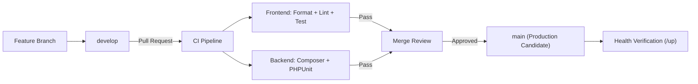

# Deployment Strategy

## Purpose

This runbook defines the deployment strategy for accore ERP, covering the continuous integration pipeline, branch promotion model, and release controls. It is addressed to DevOps engineers, release managers, and senior engineers responsible for promoting code changes through the development and production lifecycle. The document establishes the authoritative pipeline topology and the behavioral expectations of each automated gate.

## Scope & Applicability

This document applies to all accore ERP components: the Laravel PHP backend (`backend/`) and the Next.js frontend (`frontend/`). It governs deployments across all environments where code is promoted from a feature branch through to the production release. All personnel with repository write access are bound by the branch promotion model defined here.

## Procedure

The deployment pipeline is governed by GitHub Actions and follows a two-branch promotion model.

1. **Branch topology**: `develop` is the integration branch for in-progress work. `main` is the production-ready branch. Direct commits to `main` are prohibited; all changes arrive via pull request from `develop`.
2. **Automated quality gates on push/PR**: On every push or pull request targeting `develop` or `main`, the CI pipeline executes two parallel jobs:
   - **Frontend quality job (`lint.yml`)**: Installs frontend dependencies, runs code formatting via Prettier, executes ESLint, and runs the frontend test suite via Vitest.
   - **Backend test job (`tests.yml`)**: Provisions a MySQL 8.0 service container, installs PHP 8.2 dependencies via Composer, generates the application key, sets directory permissions, and executes all PHPUnit and feature tests via `php artisan test`.
3. **Gate enforcement**: A pull request to `main` MUST NOT be merged if either CI job reports a non-zero exit code.
4. **Release promotion**: Once all gates pass and at least one authorized reviewer approves the pull request, the merge to `main` constitutes the production release candidate.
5. **Post-merge verification**: After merge to `main`, the release engineer verifies that all application health endpoints (`/up` on the backend) respond with HTTP 200. <!-- [ASSUMPTION] -->

## Monitoring & Verification

- CI job status is visible in the GitHub Actions tab for each commit and pull request.
- A passing backend job confirms that all database migrations execute without error against the test schema.
- A passing frontend job confirms code style conformance and test correctness.
- Post-deployment, the `/up` health endpoint confirms backend availability.

## Failure Recovery

- If the backend test job fails, identify the failing test class from the GitHub Actions log. Resolve the failure in the feature branch and re-push.
- If the frontend quality job fails, run `npm run lint` and `npm run format` locally to reproduce and correct the issue.
- If a production deployment produces an unhealthy `/up` response, initiate a rollback to the previous `main` commit via the repository's branch reset protocol.
- Escalation contact: Release Manager and backend technical lead. <!-- [ASSUMPTION] -->

## Compliance & Audit

- Every merge to `main` is recorded in the Git commit history with an associated pull request, reviewer identity, and CI result, forming a traceable Audit Trail for all production changes.
- The CI pipeline enforces code quality and test coverage standards as a prerequisite for production access, reducing the risk of deploying defective financial transaction logic.
- All CI execution logs are retained by GitHub Actions for the standard retention period configured on the repository. <!-- [ASSUMPTION] -->

## Change History

| Date | Change | Author |
|------|--------|--------|
| 2026-03-26 | Initial creation — Phase 4 execution | AI (OPS-001) |

## Assumptions & Open Questions

<!-- [ASSUMPTION] --> Post-merge production deployment is performed manually by a release engineer following the health check procedure; no automated deployment-to-production step is implemented in the observed CI configuration.
<!-- [ASSUMPTION] --> Escalation contacts for deployment failures are defined in an internal operations contact registry not available in the source repository.
<!-- [ASSUMPTION] --> GitHub Actions retention period for CI logs is set at the repository or organization level and is not explicitly configured in the observed workflow files.
