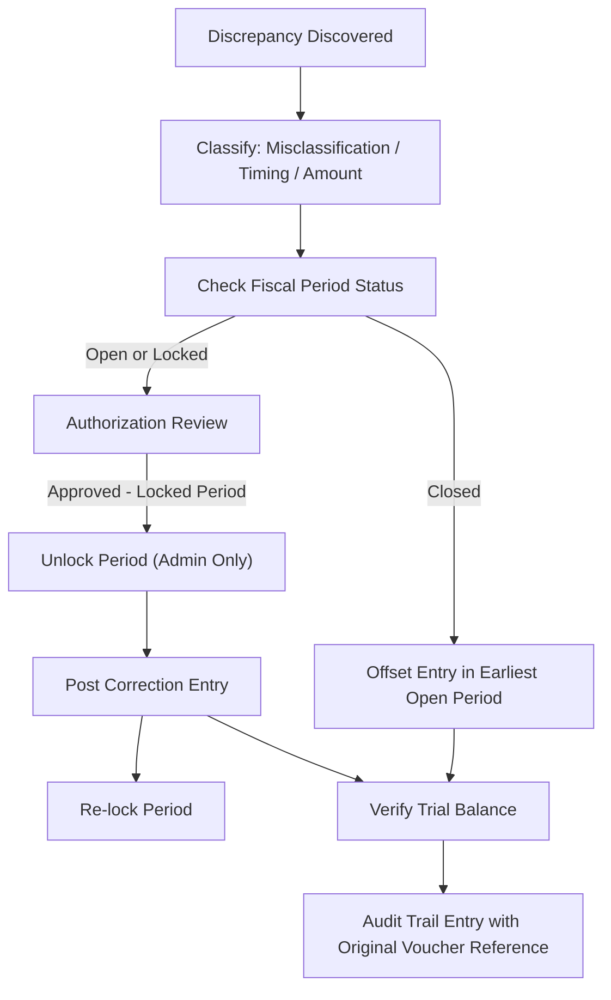

# Post-Closure Financial Discrepancies

## Purpose

This runbook defines the operational procedures for identifying, classifying, and resolving financial discrepancies that are discovered after a Fiscal Period has been closed. It is addressed to finance controllers, senior accountants, and auditors who encounter misstatements in the General Ledger following period closure. The procedures in this document operate within the Financial Immutability doctrine: closed period records are permanent, and all corrections must be recorded as new transactions in an open period.

## Scope & Applicability

This document applies to all accore ERP environments where financial Posting has occurred and Fiscal Periods have been advanced to a closed or locked state. It encompasses all financial Domains whose transactions ultimately post to the General Ledger, including Commercial (Sales Invoices), SupplyChain (Purchases), HumanCapital (Payroll), and Assets (Depreciation). It is directly dependent on the reconciliation controls defined in FIN-004 and the cash management procedures in FIN-008.

## Procedure

**Discrepancy Classification**

1. Upon discovery of a post-closure discrepancy, the finance controller classifies the finding into one of three categories:
   - **Misclassification**: A transaction was posted to the incorrect Chart of Accounts account.
   - **Timing difference**: A transaction was posted in the wrong Fiscal Period.
   - **Erroneous amount**: The monetary value of a posted Journal Entry is incorrect.

2. The controller confirms the Fiscal Period status via the system. Periods in `closed` status cannot receive any correction entries regardless of authorization level. Periods in `locked` status may be unlocked by an authorized administrator for adjustment, after which they must be re-locked.

**Correction via Offset Entry**

3. For all three discrepancy categories, the correction mechanism is an Offset Entry — a new, distinct Journal Entry posted in the earliest available open Fiscal Period that reverses the effect of the error and records the correct treatment.
4. The Offset Entry references the original voucher number in its description field to preserve traceability between the error and its correction in the Audit Trail.
5. The corrected amounts are reviewed against the reconciled Trial Balance to confirm that the adjustment restores balance. <!-- [ASSUMPTION] -->

## Monitoring & Verification

- Following every period closure, the finance team runs a Trial Balance report to identify zero-balance anomalies or accounts with unexpected activity.
- Reconciliation of cash and treasury accounts (per FIN-008 procedures) is executed as the primary detection mechanism for timing differences and erroneous amounts.
- All Offset Entries are reviewed by a second authorized approver before Posting. <!-- [ASSUMPTION] -->
- The Audit Trail is inspected post-correction to confirm that both the original entry and the Offset Entry are visible and traceable to their respective voucher numbers.

## Failure Recovery

1. If an Offset Entry is posted with an incorrect amount or account, the same Offset Entry procedure is applied recursively — a further correcting Offset Entry is posted in an open period, referencing the prior correction voucher. No entries are deleted.
2. If a period unlock is required but the administrator is unavailable, the discrepancy is documented in the incident register with its estimated financial impact and is deferred to the next available authorized administrator session.
3. If the Trial Balance remains unbalanced after correction, the finance controller escalates to the senior auditor for a full reconciliation investigation before any further entries are made.

## Compliance & Audit

- The Offset Entry pattern ensures that the correction history is fully visible in the Audit Trail: auditors see the original error and the correction as separate, immutable records.
- Closed Fiscal Periods are treated as permanent historical records. No mechanism within accore ERP permits modification or deletion of entries in a closed period; this constraint supports IFRS and GAAP requirements for reproducible financial statements.
- All period unlock events are logged with the authorizing administrator identity and the business justification, providing evidence of controlled exception management for external auditors.

## Change History

| Date | Change | Author |
|------|--------|--------|
| 2026-03-26 | Initial creation — Phase 4 execution | AI (OPS-005) |

## Assumptions & Open Questions

<!-- [ASSUMPTION] --> Second-approver review of Offset Entries is enforced via the system's Approval Workflow; the specific workflow configuration for correction entries is assumed to follow the standard financial posting authorization model.
<!-- [ASSUMPTION] --> Trial Balance verification after correction is performed by the finance controller using the system's reporting module; no automated post-correction validation script is present in the observed codebase.
