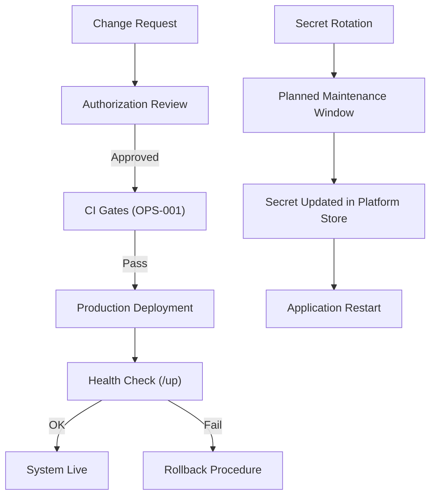

# Production Environment Governance

## Purpose

This runbook establishes the governance framework for the ACCSYSTEM ERP production environment. It defines the access control model, change authorization requirements, secret management discipline, and environment parity standards. It is addressed to release managers, DevOps engineers, and security officers who are accountable for maintaining the integrity, availability, and auditability of the production system. This document complements the Deployment Strategy (OPS-001) by specifying the controls applied to the production environment specifically.

## Scope & Applicability

This document applies to the production runtime environment of ACCSYSTEM ERP, encompassing the Laravel PHP backend, the Next.js frontend, the PostgreSQL database, and all environment secrets and configuration values. All personnel with production access are bound by this framework.

## Procedure

**Environment Secret Management**

1. All sensitive configuration values (database credentials, application keys, API tokens, encryption secrets) are stored exclusively in the platform-managed secrets store and injected as environment variables at runtime. No secret is committed to the repository in plaintext.
2. The `APP_KEY` for the Laravel backend is generated via `php artisan key:generate` and stored as a managed secret. Rotation of `APP_KEY` invalidates all existing encrypted payloads and sessions; rotation must be authorized by the Release Manager and executed during a planned maintenance window.
3. Database credentials (`PGHOST`, `PGPORT`, `PGUSER`, `PGPASSWORD`, `PGDATABASE`) are runtime-injected from the platform secret store. Direct hardcoding of credentials in configuration files is prohibited.
4. `APP_DEBUG` MUST be set to `false` in production. Debug mode exposes stack traces containing internal file paths and query details, creating an information disclosure risk.

**Change Authorization**

5. Every change promoted to production must have passed all CI gates as defined in OPS-001 (lint, format, frontend tests, backend PHPUnit tests).
6. Infrastructure or environment-level changes (secret rotation, server configuration, dependency upgrades affecting security) require a written change request authorized by the technical lead and documented in the incident log before execution. <!-- [ASSUMPTION] -->
7. Emergency hotfixes that bypass the standard pull request process require post-hoc review within 24 hours and full documentation of the change, justification, and impact.

## Monitoring & Verification

- Application health is continuously verified via the `/up` endpoint, which Laravel exposes as a standard health check route.
- Log aggregation captures Laravel application log output at the configured log level; `LOG_LEVEL` is set to `error` in production to reduce noise while preserving actionable events. <!-- [ASSUMPTION] -->
- Unauthorized access attempts and failed authentication events from the `login_attempts` table are reviewed weekly by the security officer.
- Environment variable integrity (confirming that `APP_DEBUG=false` and `APP_ENV=production`) is verified at each deployment as part of the post-deployment checklist. <!-- [ASSUMPTION] -->

## Failure Recovery

1. If a production deployment results in an unhealthy state, the release engineer executes a rollback to the prior `main` commit and notifies stakeholders. Recovery time objective is 30 minutes. <!-- [ASSUMPTION] -->
2. If a secret is suspected of compromise, the secret is immediately rotated in the platform secret store and the application is restarted. A security incident report is filed.
3. If `APP_DEBUG=true` is detected in production, the environment variable is corrected immediately without a formal change request, and the event is recorded in the security incident log as a severity-2 misconfiguration.

## Compliance & Audit

- The restriction of debug mode in production protects against inadvertent disclosure of financial data, user credentials, or internal system paths in error responses.
- Secret management via the platform store ensures credentials are not exposed in version control history, supporting SOC 2 CC6 (Logical and Physical Access) compliance.
- The authorization requirement for all production changes produces an evidence trail suitable for internal audit and external regulatory review.

## Change History

| Date | Change | Author |
|------|--------|--------|
| 2026-03-26 | Initial creation — Phase 4 execution | AI (OPS-004) |

## Assumptions & Open Questions

<!-- [ASSUMPTION] --> Infrastructure change request authorization is performed through an internal process (ticketing or written approval); the specific system is not defined in the observed repository.
<!-- [ASSUMPTION] --> Log aggregation at the production level is provided by the hosting platform or an external log management service; no specific log aggregation configuration is present in the repository.
<!-- [ASSUMPTION] --> Recovery time objective of 30 minutes for rollback is a working assumption based on typical enterprise ERP availability targets and is not formally defined in the observed codebase.
<!-- [ASSUMPTION] --> Post-deployment checklist is maintained as an operational procedure by the release team; its contents are not codified in the repository.
