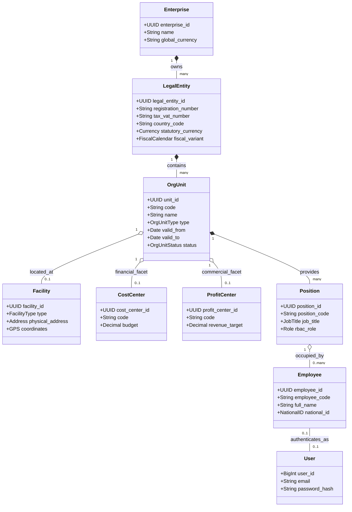
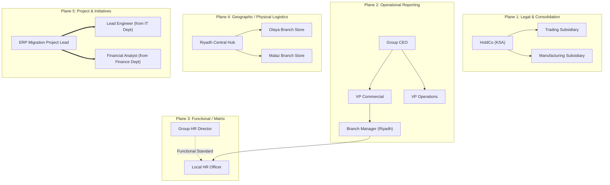
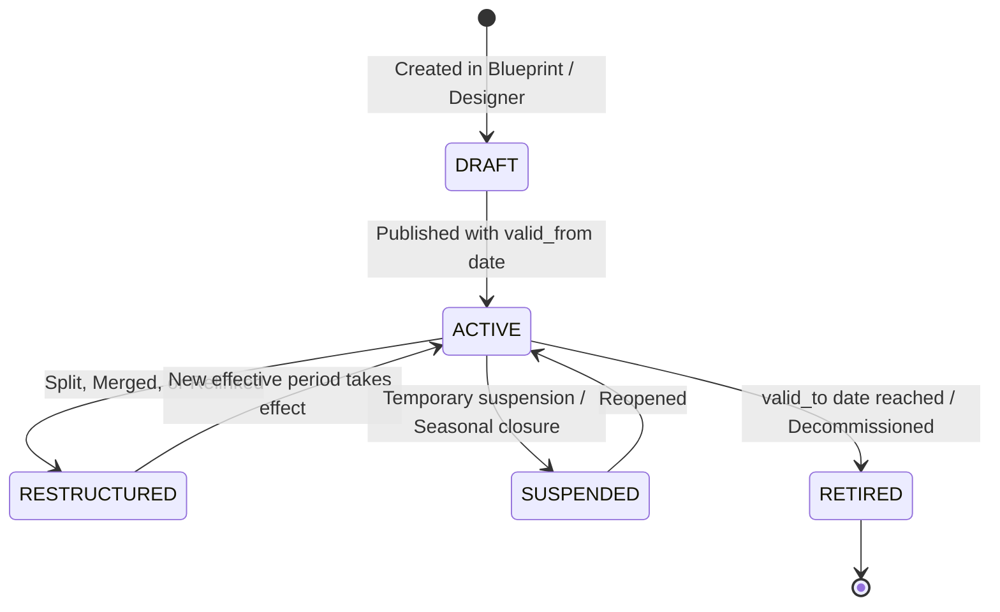

# DOCUMENT 02 — Organizational Domain Model

**Domain:** EnterpriseCore / OrganizationGovernance  
**System:** ACCORE ERP  
**Status:** Approved Domain Model Specification  
**Author:** Senior ERP Domain Model Architect  

---

## 1. Executive Summary

Enterprise systems routinely suffer from organizational modeling failures because they make one of two errors:
1. **The Reductionist Fallacy:** Reducing an enterprise to a single hierarchical tree (typically an HR reporting tree or a chart of accounts tree).
2. **The Fragmentation Fallacy:** Creating completely separate, disconnected entities for "Company", "Branch", "Warehouse", "Department", "Cost Center", and "Project Team", leading to redundant data entry and synchronization nightmares.

This document establishes the definitive **Unified Organizational Domain Model** for ACCORE ERP. 

At the center of this model is the **Organizational Unit (`OrgUnit`)**, modeled as a typed node in a multi-relational directed graph. Rather than creating five separate database records when a company opens a new retail branch, that branch is instantiated as a single canonical `OrgUnit` equipped with multiple **Functional Facets** (`FacilityFacet`, `ProfitCenterFacet`, `CostCenterFacet`, `CommercialBranchFacet`).

Employees occupy **Positions** linked to `OrgUnits`, and participate in multiple distinct relationship planes:
- **Administrative / Legal plane** (who signs the paycheck)
- **Operational / Direct Management plane** (who approves daily work and leave)
- **Functional / Matrix plane** (who sets technical standards or functional direction)
- **Project plane** (who directs cross-functional initiative deliverables)

This model satisfies both the extreme simplicity of a 5-person boutique and the sophisticated governance of a multi-national holding conglomerate.

---

## 2. Core Concepts & Disambiguation Matrix

A foundational principle of enterprise domain architecture is rigorous definition. In legacy ERPs, words like "Company", "Branch", "Department", and "Cost Center" are used interchangeably, creating massive design confusion.



### 2.1 Disambiguation of Critical Concepts

| Concept | What It Actually Is | What It Is NOT | Role in ACCORE ERP |
| :--- | :--- | :--- | :--- |
| **Enterprise (`CLIENT`)** | The overarching enterprise ecosystem or tenancy umbrella. Represents the entire business group. | It is NOT a legal entity; it does not pay taxes or have a single trade license. | Top root of the tenant instance. Governs master data registries, global currencies, and users. |
| **Legal Entity (`COMP_CODE`)** | A registered business corporation, LLC, or establishment possessing legal personality, a tax identification number (VAT/ZATCA), and independent balance-sheet accounting. | It is NOT a physical location or a management department. | The boundary of General Ledger balancing, VAT compliance, and statutory financial statements. |
| **Organizational Unit (`OrgUnit`)** | The universal building block of structure: a division, department, branch, plant, regional office, or service desk. | It is NOT necessarily a legal entity or a physical building. | Primary node in the organizational graph. Carries facets and relationships. |
| **Facility / Location (`PLANT` / `SITE`)** | A real-world physical geographic space with a street address, GPS coordinates, and physical storage/work boundaries. | It is NOT an accounting entity or an HR department. | Defines logistics, stock inventory, shipping origin, and POS operations. |
| **Cost Center (`COST_CENTER`)** | An internal accounting collector for cost accumulation, expense attribution, and overhead budget tracking. | It is NOT an employee, and it cannot generate direct commercial revenue. | Attached to general ledger expense transactions for managerial accounting. |
| **Profit Center (`PROFIT_CENTER`)** | An internal accounting collector for revenue attribution, cost of sales matching, and operational P&L responsibility. | It is NOT a legal company; it is an internal segment of a company. | Attached to invoices, purchases, and GL lines for management P&L reporting. |
| **Department (`DEPT`)** | A permanent functional aggregation of workforce personnel performing related tasks (e.g., Marketing, Accounting, R&D). | It is NOT a temporary project or a single cost center. | Groups positions and employees for operational management and workforce planning. |
| **Position (`POSITION`)** | An abstract, budget-allocated slot or chair in the organization (e.g., "Senior Financial Analyst - Slot #03"). Exists even if vacant. | It is NOT an employee. Employees come and go; positions remain. | Bridges organizational hierarchy to security access (`roles`) and job descriptions (`job_titles`). |
| **Employee (`EMPLOYEE`)** | A human living person contracted to perform work for compensation. Has personal, legal, and banking attributes. | It is NOT a system user account and NOT a position. | Recipient of payroll; holder of positions; subject of HR compliance. |
| **User (`USER`)** | An authentication credential and session identity within the software platform. | It is NOT an employee; an external auditor or API service account is a user without an employee record. | Security actor for audit logs, API requests, and permissions. |

---

## 3. The Multi-Facet Organizational Unit Architecture

In conventional systems, if a company opens a retail store in Riyadh, the database is polluted with:
1. A record in `branches` (ID: 12)
2. A record in `warehouses` (ID: 4)
3. A record in `cost_centers` (ID: 104)
4. A record in `profit_centers` (ID: 204)
5. A record in `departments` (ID: 8)

When the store name changes, the user must update five different screens. If one fails, the system becomes corrupt.

### 3.1 ACCORE Solution: The Faceted OrgUnit

In ACCORE, **one `OrgUnit` node** can assume multiple operational facets through typed metadata attributes and relationship edges:

```
                      ┌────────────────────────────┐
                      │          OrgUnit           │
                      │  Code: "BR-RUH-01"         │
                      │  Name: "Riyadh Olaya Store"│
                      └─────────────┬──────────────┘
                                    │
       ┌────────────────────────────┼────────────────────────────┐
       │                            │                            │
┌──────▼────────────┐      ┌────────▼──────────┐      ┌──────────▼────────┐
│  Facility Facet   │      │ Financial Facet   │      │ Commercial Facet  │
│ - Address         │      │ - Cost Center:    │      │ - POS Terminals:  │
│ - Warehouse Stock │      │   "CC-RUH-01"     │      │   POS-01, POS-02  │
│ - Shipping Dock   │      │ - Profit Center:  │      │ - Price List ID   │
│ - Factory Cal: SA │      │   "PC-RUH-01"     │      │ - Sales Rep Team  │
└───────────────────┘      └───────────────────┘      └───────────────────┘
```

### 3.2 Facet Definitions

1. **`LegalEntityFacet`:** Applied when the unit is a distinct legal corporation or registered establishment. Carries tax number, registration number, local statutory currency, and baseline chart of accounts.
2. **`OperationalFacilityFacet`:** Applied when the unit represents physical property (store, warehouse, distribution hub, factory). Carries address, coordinates, operating calendar, and physical storage capacity.
3. **`FinancialResponsibilityFacet`:** Applied when the unit incurs costs or generates revenues. Maps to automated cost center and profit center allocations.
4. **`CommercialBranchFacet`:** Applied when the unit conducts sales or customer service. Carries POS terminal configurations, cash registers, retail inventory allocations, and sales target quotas.
5. **`WorkforceGroupFacet`:** Applied when the unit houses employees and departments. Carries headcount authorizations, wage budgets, and departmental sub-units.

---

## 4. Multi-Plane Relationship Network (Beyond the Tree)

A key limitation of legacy ERPs is attempting to express an entire company as a single hierarchy tree. In real-world enterprise operations, employees and units exist in **multiple orthogonal relationship planes simultaneously**.

ACCORE explicitly models five distinct relationship planes via `structure_links.link_type`:



### 4.1 Relationship Plane Taxonomy

| Plane Code | Link Type | Purpose & Business Semantics | Cardinality | Example Rule |
| :--- | :--- | :--- | :--- | :--- |
| **`LEGAL_OWNERSHIP`** | `ownership` | Expresses equity holding, parent company to subsidiary relationships, and financial consolidation rollups. | `N:1` or `N:M` (with ownership %) | Subsidiary belongs to Holding Company. |
| **`OPERATIONAL_HIERARCHY`** | `line_management` | The direct line of command. Determines operational approvals (leave approval, expense authorization, operational sign-off). | `N:1` (Strict Tree) | Every position/employee has exactly one primary direct supervisor. |
| **`FUNCTIONAL_MATRIX`** | `dotted_line` | Secondary or functional oversight (e.g., a Plant Safety Officer reports administratively to Plant Manager, but functionally to Group EHS Director). | `N:M` | Position has 0 to many functional advisors/directors. |
| **`GEOGRAPHIC_CONTAINMENT`**| `location` | Physical and logistical hierarchy: Global $\to$ Region $\to$ Country $\to$ City $\to$ Site $\to$ Sublocation. | `N:1` | Storage Location resides inside a Physical Plant. |
| **`PROJECT_ASSIGNMENT`** | `project_member` | Dynamic, temporary cross-functional teams assembled for specific objectives, with start and end dates. | `N:M` | Employee allocated 40% to Project Apollo, 60% to Core Operations. |
| **`FINANCIAL_ROLLUP`** | `cost_allocation` | Controlling areas, cost center rollups, and profit center segment consolidation. | `N:1` | Cost Center rolls up into Controlling Area. |

---

## 5. Workforce, Positions, and Multi-Assignment Architecture

### 5.1 Why Positions Are Mandatory in Enterprise Modeling

Directly assigning an employee to a department (`employee.department_id = 5`) is a common anti-pattern that fails as soon as:
1. An employee takes parental or sabbatical leave and a temporary contractor fills the role.
2. An employee is promoted, leaving the prior role vacant but requiring the replacement to inherit identical permissions, budget limits, and workflow approval gates.
3. An organization conducts headcount budgeting for unhired staff.

**ACCORE Solution:**
$$\text{OrgUnit} \xrightarrow{\text{houses}} \text{Position} \xrightarrow{\text{assigned to}} \text{Employee}$$
- The **`Position`** defines the budget, grade level, role permissions, and primary cost center.
- The **`Employee`** occupies the position. When the employee departs, the position becomes `vacant`, but workflow rules remain intact and ready for the successor.

### 5.2 Multi-Assignment Capabilities for a Single Employee

An employee in ACCORE may simultaneously carry:
1. **One Primary Position:** Defines their legal employment contract, base salary, and statutory reporting.
2. **Zero or More Secondary Positions:** (e.g., Acting Branch Manager, Lead Auditor).
3. **One Direct Line Manager:** Primary supervisor for day-to-day operations and leave approvals.
4. **Zero or More Matrix Managers:** Dotted-line supervisors for specialized functional oversight.
5. **Zero or More Project Assignments:** With time allocation percentages (e.g. 30% Project Alpha, 70% Base Ops) and project-specific managers.
6. **One Default Operating Context:** Current default physical facility, warehouse, and cash terminal.

---

## 6. Temporal Integrity & State Machine

Organizations change continuously. An ERP must maintain historical truth: past financial audits must reflect the organizational hierarchy as it existed on the transaction date, while current workflows must execute against today's structure.

### 6.1 Entity State Lifecycle



### 6.2 Temporal Consistency Rules

1. **Validity Windows:** Every `OrgUnit`, `Position`, and `StructureLink` carries `valid_from` (DATE) and `valid_to` (DATE, nullable).
2. **Non-Overlapping Parent Links:** On a strict `N:1` relationship plane (such as `OPERATIONAL_HIERARCHY`), a unit or position can have at most **one active target link** for any given date:
   $$\forall t, \quad \left| \{ L \in \text{Links} \mid L.\text{source} = u \land L.\text{type} = \text{line\_management} \land L.\text{valid\_from} \le t \le L.\text{valid\_to} \} \right| \le 1$$
3. **Historical Querying:** All analytical and financial rollups evaluate links based on `transaction.voucher_date` rather than the live system date:
   $$\text{ActiveLinkAt}(t) = \{ L \mid L.\text{valid\_from} \le t \land (L.\text{valid\_to} \text{ IS NULL} \lor L.\text{valid\_to} \ge t) \}$$
4. **Immutability of Closed Periods:** No retroactive org restructuring is permitted within a closed fiscal period.

---

## 7. Architectural Validation Rules & Invariants

The domain engine enforces strict invariants across the organizational graph:

1. **No Circular Hierarchies (Acyclic Invariant):**  
   Within any single hierarchy link type (e.g., `line_management`, `ownership`), the graph must be a Directed Acyclic Graph (DAG). A unit cannot be its own ancestor.
2. **Country Boundary Invariant:**  
   A physical facility (`PLANT`) can only report to a `LegalEntity` registered in the identical sovereign country, unless registered as a recognized cross-border permanent establishment.
3. **Balancing Unit Invariant:**  
   Every operational transaction producing a financial impact must resolve to exactly one primary `LegalEntity` (`COMP_CODE`) for statutory accounting balance.
4. **Headcount Integrity:**  
   A position cannot exceed its authorized headcount quota (default = 1.0 FTE) unless explicitly marked as a "Pool Position" (e.g., "Cashier Team").
5. **No Dangling Operating Contexts:**  
   An `OperatingContext` cannot reference an inactive or archived `OrgUnit`, `Warehouse`, or `PosTerminal`.
