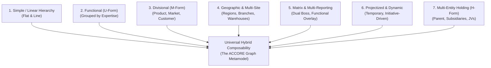

# DOCUMENT 03 — Organizational Structure Taxonomy & Pattern System

**Domain:** EnterpriseCore / OrganizationGovernance  
**System:** ACCORE ERP  
**Status:** Approved Architectural Specification  
**Author:** Enterprise Organizational Design Specialist & ERP Architect  

---

## 1. Executive Summary

Organizational design literature, management consulting frameworks, and academic treatises (from Alfred Chandler and Oliver Williamson to Henry Mintzberg and Jay Galbraith) identify dozens of structural topologies. In commercial consulting, analysts frequently reference landscapes of upwards of **57 recognized organizational structures**.

However, hardcoding 57 separate, rigid ERP templates would be a catastrophic architectural mistake. It would produce 57 parallel code paths, impenetrable UI dropdowns, and an unmaintainable software surface.

This document performs a deep deconstruction of the organizational taxonomy. It demonstrates that:
1. All 57 historical and modern organizational patterns are actually permutations of **7 Fundamental Structural Families**.
2. Any enterprise structure—no matter how complex—is a **composable combination** of these fundamental patterns operating across the multi-plane graph metamodel established in Document 02.
3. The end user does **not** need to know academic terminology (e.g., "M-Form divisional structure with shared-service matrix overlay"). Instead, ACCORE infers the appropriate structural archetype from ordinary business facts and composes the exact topological graph required.

---

## 2. Research & Deconstruction of Organizational Structure Patterns

To design a universal engine, we inspect how organizational design has evolved over a century of industrial management:

```
1920s: Classical Hierarchical & Functional (Taylor, Fayol)
  │
1950s: Multidivisional "M-Form" (DuPont, General Motors, Chandler)
  │
1970s: Matrix & Projectized Systems (NASA, Aerospace, Davis & Lawrence)
  │
1990s: Geographic Hub-and-Spoke & Holding Groups (Williamson, Bartlett & Ghoshal)
  │
2010s+: Flat, Networked, Pod, Agile, & Hybrid Ecosystems (Spotify, Valve, Haier Rendanheyi)
```

### 2.1 The "57 Structures" Deconstruction

Literature and management consulting taxonomies document 57 distinct configurations, including:

1. Traditional Line Hierarchy
2. Functional Departmental
3. Bureaucratic Machine
4. Professional Bureaucracy
5. Product Divisional
6. Customer Segment Divisional
7. Geographic Regional
8. Market Channel Divisional
9. Process-Based Division
10. Holding Company (H-Form)
11. Pure Subsidiary Group
12. Conglomerate Matrix
13. Strong Matrix (Project-Led)
14. Balanced Matrix (Dual Command)
15. Weak Matrix (Functional-Led)
16. Functional Matrix
17. Overlay Project Teams
18. Pure Projectized (No Permanent Depts)
19. Cross-Functional Task Force
20. Centralized Shared Services
21. Decentralized Autonomous Units
22. Hub-and-Spoke Logistics
23. Multi-Branch Retail Hierarchy
24. Franchise Distribution Network
25. Direct-to-Consumer / E-Commerce Hybrid
26. Joint Venture Entity
27. Front-Back Hybrid (Galbraith)
28. Transnational Matrix (Bartlett & Ghoshal)
29. International Division
30. Global Product Division
31. Global Geographic Division
32. Cellular Organization
33. Network Organization (Virtual)
34. Modular Corporation
35. Pod-Based Organization
36. Circle / Holacratic Hierarchy
37. Flatarchy (Horizontal Management)
38. Value-Stream Organization (Lean/Agile)
39. Multi-Tier Holding with Intercompany
40. Dual-Headquarters Bi-National
41. Cooperative Enterprise
42. Public Sector Regulated Agency
43. Professional Services Practice Groups
44. Medical / Clinical Staff Matrix
45. Academic Faculty-Department Matrix
46. EPC Construction Site Matrix
47. Factory Work-Center Shop Floor
48. Distribution Franchisee Operator
49. Contract Manufacturing Tolling
50. Multi-Brand Omnichannel
51. Incubator / Startup Accelerator
52. Spoke Retail with Master Warehouse
53. Decentralized Regional Distribution
54. Matrix Shared Warehousing
55. Captive BPO / IT Shared Service Center
56. Multi-Tenant Franchise Group
57. Dynamic Boundaryless Enterprise

### 2.2 The Reduction Proof: 7 Fundamental Structural Families

When analyzed from an ERP computer science and relational graph perspective, these 57 structures collapse into **7 Genuinely Distinct Topological Archetypes**:



---

## 3. Deep Analysis of the 7 Fundamental Archetypes

### Archetype 1: Simple / Linear Hierarchy (Flat & Single-Site)
- **Real-world context:** Micro-businesses, sole proprietorships, single-office consultancies, neighborhood clinics, startups.
- **Topological Characteristics:**
  - Depth: 1 to 2 levels.
  - Nodes: Legal Entity = Operating Site = Profit Center.
  - Employees report directly to the Owner / Founder.
  - No departmental separation.
- **Graph Representation:**
  $$\text{CLIENT} \longrightarrow \text{COMP\_CODE (with All Facets)} \longrightarrow \text{Positions} \longrightarrow \text{Employees}$$
- **ERP Behavior:** Centralized accounting, single general ledger, no intercompany transactions, minimal approval chains.

### Archetype 2: Functional Structure (U-Form / Unitary)
- **Real-world context:** Mid-size manufacturing plants, specialized service bureaus, software vendors, financial brokerages.
- **Topological Characteristics:**
  - Grouped by professional specialization: Sales, Purchasing, Engineering, Accounting, HR.
  - High operational efficiency, economies of scale, clear career ladders.
  - Weakness: Cross-functional silos, slow decision-making across departments.
- **Graph Representation:**
  $$\text{COMP\_CODE} \longrightarrow \{\text{Dept: Sales}, \text{Dept: Operations}, \text{Dept: Finance}, \text{Dept: HR}\}$$
  Each Department acts as a Cost Center.

### Archetype 3: Divisional Structure (M-Form / Multidivisional)
- **Real-world context:** Companies operating distinct product lines (e.g. Electronics vs Chemicals) or distinct customer types (Retail vs Wholesale vs Government B2G).
- **Topological Characteristics:**
  - Each division operates as a self-contained semi-autonomous business unit (`PROFIT_CENTER`).
  - Each division contains its own dedicated functional teams (Sales, Marketing, Quality).
  - Weakness: Duplication of corporate functions (e.g., each division hiring its own accountants).
- **Graph Representation:**
  $$\text{COMP\_CODE} \longrightarrow \text{Divisions (Profit Centers)} \longrightarrow \text{Functional Departments (Cost Centers)}$$

### Archetype 4: Geographic & Multi-Branch Structure
- **Real-world context:** Supermarket chains, retail store networks, logistics carriers, hospitality hotels, regional service offices.
- **Topological Characteristics:**
  - Headquarters (Central Governance) $\to$ Regional Hubs $\to$ Local Branches / Stores / Warehouses.
  - Physical facilities carry local operational autonomy for inventory, cash registers, and customer fulfillment.
  - Finance is typically centralized at HQ, while branch managers manage local staff and local inventory.
- **Graph Representation:**
  $$\text{COMP\_CODE} \longrightarrow \text{Regions} \longrightarrow \text{Branches (Facility Facet + Commercial Facet)}$$
  Branches link to central purchasing organization and centralized general ledger.

### Archetype 5: Matrix Structure (Dual / Multi-Reporting)
- **Real-world context:** Engineering consultancies, international technology firms, healthcare networks, construction EPC firms.
- **Topological Characteristics:**
  - Employees have **two (or more) managers**:
    1. Line / Administrative Manager (e.g., Head of Civil Engineering).
    2. Operational / Project / Regional Manager (e.g., Riyadh Metro Project Director).
  - High resource efficiency, cross-fertilization of knowledge.
  - In ACCORE: Modeled by separating `line_management` links from `dotted_line` or `project_member` links on the `Position`.

### Archetype 6: Projectized & Dynamic Organization
- **Real-world context:** Creative agencies, film studios, turnkey contractors, audit firms, management consultancies.
- **Topological Characteristics:**
  - The business operates around **Projects**, not static departments.
  - OrgUnits are assembled dynamically around client contracts with planned start/end dates.
  - Profit and Loss is calculated per Project (`WBS_ELEMENT` or Project Profit Center).
  - When the project concludes, resources return to a talent pool or transition to new projects.

### Archetype 7: Multi-Entity Holding & Subsidiary Structure (H-Form)
- **Real-world context:** Family conglomerates, multinational enterprises, private equity portfolios, corporate groups.
- **Topological Characteristics:**
  - Multiple distinct `LegalEntity` nodes (`COMP_CODE`) under a single parent `HoldingCompany`.
  - Independent balance sheets, distinct tax registrations, different sovereign jurisdictions, multiple functional currencies.
  - Requires intercompany sales/purchases, automated intercompany eliminations, and consolidated financial reporting.

---

## 4. Composability: How ACCORE Constructs Real-World Hybrids

No serious enterprise is purely functional or purely geographic. A real modern enterprise is a **hybrid composite**.

For example, consider a 300-person retail & manufacturing company:
- **Corporate Level:** Multi-entity holding (Holding Company in Dubai, Trading Co in Riyadh, Factory Co in Dammam).
- **Trading Subsidiary:** Geographic multi-branch network (12 retail stores in 4 cities).
- **Manufacturing Subsidiary:** Functional structure (Production, Maintenance, Quality).
- **Headquarters:** Centralized shared-service departments (Finance, Legal, HR).
- **Special Initiatives:** Cross-functional project teams for E-Commerce launch.

### 4.1 Composition Matrix

In ACCORE, any hybrid organization is composed by assembling building blocks:

$$\text{Enterprise Architecture} = \text{Legal Archetype} \oplus \text{Operational Archetype} \oplus \text{Workforce Archetype} \oplus \text{Project Archetype}$$

| Layer | Building Block Choice | ACCORE Graph Representation |
| :--- | :--- | :--- |
| **Legal Layer** | Single Entity *OR* Holding + Subsidiaries | `COMP_CODE` nodes linked via `LEGAL_OWNERSHIP` links |
| **Operational Layer** | Single Site *OR* Multi-Branch *OR* Regional Hubs | `PLANT` / `BRANCH` nodes linked via `GEOGRAPHIC_CONTAINMENT` links |
| **Functional Layer** | Direct *OR* Divisional *OR* Shared Services | `DEPT` / `COST_CENTER` nodes linked via `FINANCIAL_ROLLUP` links |
| **Workforce Layer** | Single Line *OR* Dual Matrix | `POSITION` nodes with dual outgoing links (`line_management` + `dotted_line`) |
| **Initiative Layer** | Permanent Only *OR* Projectized Overlay | `WBS_ELEMENT` / `PROJECT` nodes with dynamic member assignment links |

---

## 5. Bridging the Gap: Intuitive Language Translation

How does a business owner who knows nothing about organizational theory communicate their needs to ACCORE?

### 5.1 The Natural Language Translation Engine

ACCORE implements a semantic bridge that maps conversational business statements directly into structural building blocks:

```
User Statement:
"We are a retail company with 8 stores in Riyadh, Jeddah, and Dammam, 
a central warehouse, and an online website. Finance is done at HQ."
                           │
                           ▼
             Semantic Translation Engine
                           │
 ┌─────────────────────────┴─────────────────────────┐
 │                                                   │
 ▼                                                   ▼
Structural Pattern Inferred:             Capabilities Activated:
- Legal: Single Entity (`COMP_CODE`)     - Multi-Warehouse Inventory
- Operational: Multi-Branch Geographic   - Point of Sale (POS) Engine
- Facilities: 8 Stores + 1 Central Hub   - E-Commerce Fulfillment Channel
- Financial: Centralized Controlling Area - Centralized AP/AR & General Ledger
```

Another example:
```
User Statement:
"We are a software consulting firm of 45 engineers. We work on client 
deliverables in cross-functional squads. Engineers report to a Practice 
Lead for performance, but day-to-day work is guided by Project Managers."
                           │
                           ▼
             Semantic Translation Engine
                           │
 ┌─────────────────────────┴─────────────────────────┐
 │                                                   │
 ▼                                                   ▼
Structural Pattern Inferred:             Capabilities Activated:
- Legal: Single Entity (`COMP_CODE`)     - Project Accounting & Time Tracking
- Functional: Practice Areas (Depts)     - Project Billing & Milestones
- Workforce: Balanced Matrix Hierarchy   - Cross-Functional Squad Allocations
- Reporting: Dual Links (Lead + PM)      - Employee Utilization Reporting
```

The user never hears the words "M-Form", "Dual Boss Matrix", or "SPRO Topology Rule". The system transparently configures the exact enterprise graph while speaking the natural language of the business owner.
