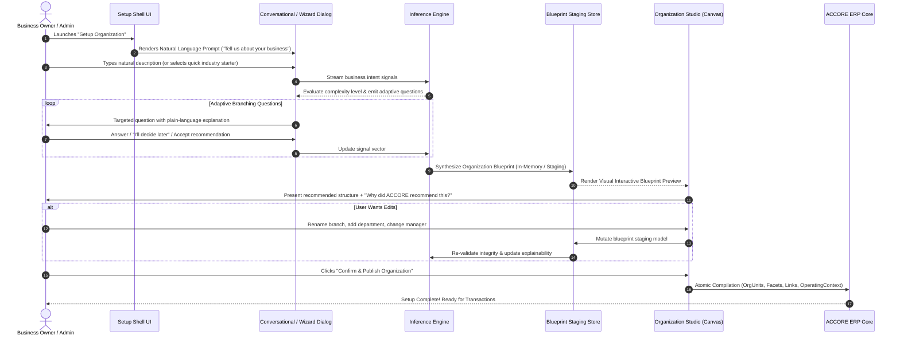

# DOCUMENT 04 — Intelligent Organization Setup Experience

**Domain:** EnterpriseCore / OrganizationGovernance  
**System:** ACCORE ERP  
**Status:** Approved Product & UX Specification  
**Author:** Senior ERP Product Architect & Lead UX Designer  

---

## 1. Executive Summary

Traditional ERP setup is notorious for its hostility: users are confronted with cryptic configuration tables, mandatory foreign keys, and esoteric organizational acronyms before they can enter their first customer or record their first sale. This causes high abandonment rates, expensive implementation consultant overhead, and frequent configuration blunders.

The **ACCORE Intelligent Organization Setup Experience** revolutionizes this process.

It replaces static configuration forms with an **adaptive, progressive, conversational onboarding journey**:
1. A small shopkeeper answers 3 simple questions in 2 minutes and gets a clean, production-ready structure.
2. A complex regional holding company answers deeper questions regarding subsidiaries, foreign branches, factories, and matrix reporting, receiving a sophisticated multi-plane enterprise blueprint.
3. The user is **always in control**: the system never silently commits an automated guess. It presents an explainable, visual **Organization Blueprint** that can be inspected, customized, edited, and verified before publishing.

---

## 2. End-to-End User Journey



---

## 3. The 8 Stages of the Setup Journey

### Stage 1: The Zero-Friction Entry Point
- **Visual Presentation:** A clean, spacious, uncluttered screen inspired by modern conversational design.
- **Primary Prompt:**
  > **"Tell us about your business."**  
  > *"Describe how your company operates in plain language. For example: 'We are a retail clothing brand with 3 stores in Riyadh and Jeddah, a central warehouse, and an online shop.' Or pick a starter archetype below."*
- **Interaction Options:**
  1. **Free-Text Input:** Large, responsive multi-line prompt supporting Arabic and English.
  2. **Voice/Audio Input:** Direct speech-to-text dictation for mobile/tablet business owners.
  3. **Visual Archetype Cards:** Quick-start cards for users who prefer clicking (Retail, Professional Services, Manufacturing, Wholesale, Multi-Branch).

### Stage 2: Signal Extraction & Complexity Grading
As the user types or selects a starter, the backend inference engine extracts structural signals:
- **Scale Signals:** Number of employees, revenue volume, number of sites.
- **Physical Footprint:** Single office, multi-store, warehouse, factory, remote.
- **Commercial Channels:** B2B wholesale, B2C retail POS, e-commerce, services.
- **Governance Style:** Centralized vs decentralized, single owner vs corporate board.
- **Legal Boundaries:** Single tax entity vs multi-country holding group.

The engine immediately computes an **Organizational Complexity Grade (Levels 1–5)**:
- **Grade 1 (Micro):** Single site, $\le 10$ staff, 1 legal entity $\to$ **3 questions maximum**.
- **Grade 2 (Small Business):** Multi-department or single store + warehouse, $\le 50$ staff $\to$ **5 questions**.
- **Grade 3 (Multi-Site Commercial):** Multi-branch retail/wholesale, 2–10 locations $\to$ **7–9 questions**.
- **Grade 4 (Mid-Market Enterprise):** Projects, matrix teams, manufacturing, regional offices $\to$ **10–14 questions**.
- **Grade 5 (Complex Conglomerate):** Multi-company holding, cross-border, foreign currencies $\to$ **Full enterprise wizard**.

### Stage 3: Adaptive Progressive Branching
Questions are **never presented as a monolithic 100-field form**. They appear progressively, one at a time or in small thematic clusters.

#### Example Adaptive Flow for a Multi-Branch Retailer:

```
[System]: "How many physical locations (stores, warehouses, showrooms) do you operate?"
[User]: "3 retail shops and 1 storage depot."

  │ (System detects multi-site requirement)
  ▼
[System]: "Are all 3 shops in the same city, or across different regions?"
[User]: "2 in Riyadh, 1 in Jeddah."

  │ (System branches: needs regional grouping and physical facility facets)
  ▼
[System]: "Where does inventory arrive from suppliers?"
( ) Directly to each store
(•) To the central warehouse first, then transferred to stores (Recommended)
( ) Hybrid

  │ (System branches: inventory logistics topology configured)
  ▼
[System]: "How is accounting handled?"
(•) Central finance team at headquarters (Recommended)
( ) Each branch has its own independent bookkeeper and financial statements
```

#### Handling Uncertainty & Flexibility
- **"I don't know / Decide later":** The system injects a sensible default and flags an item in the blueprint checklist to revisit after go-live.
- **"Why are we asking this?":** An expandable micro-help explaining the exact operational consequence (e.g., *"This tells ACCORE whether each store needs its own purchasing authorization or if procurement is centralized at HQ"*).

### Stage 4: Synthesis of the Organization Blueprint
Before writing a single row to `structure_nodes` or `warehouses`, the engine compiles an **Organization Blueprint**.
- The Blueprint is an intermediate JSON object (see Document 06).
- It contains the proposed legal entities, physical facilities, commercial branches, financial cost/profit centers, positions, and operational links.
- It includes confidence scores and an explainability rationale for every structural choice.

### Stage 5: Visual Blueprint Inspection & Explainability
The user transitions to the preview screen.

#### The "Explainability Card"
A prominent, human-readable panel explaining:
> **Why ACCORE recommended this structure:**
> - **Multi-Site Commercial Topology:** You operate stores in Riyadh and Jeddah with a central storage depot.
> - **Centralized Purchasing Organization:** All stock flows from suppliers into the Riyadh Central Hub before replenishment.
> - **Unified Legal Entity:** All stores operate under your single Commercial Registration (`CR-1010XXXXXX`) with unified ZATCA VAT reporting.
> - **Individual Store Profitability:** Each store is assigned a Profit Center so you can measure store-by-store margins.

### Stage 6: Direct Blueprint Customization (User Remains in Total Control)
The user is never trapped by the system's recommendation. They can directly modify the proposed blueprint:
- **Rename:** Change "Branch #1" to "Olaya Flagship Store".
- **Add:** Click `+ Add Warehouse` or `+ Add Sales Team`.
- **Remove:** Delete an unnecessary department with one click.
- **Reassign:** Drag a store under a different regional manager.
- **Toggle Capabilities:** Turn off POS for a location that is office-only.

### Stage 7: Pre-Flight Integrity Check
When the user clicks "Review & Publish", the system executes a pre-flight sanity check:
- Validates all mandatory attributes (currency, legal tax numbers, site calendars).
- Verifies graph acyclicity (no circular reporting loops).
- Confirms that every physical store is connected to an active parent legal entity.
- Highlights warnings in plain language (e.g., *"Jeddah Branch has no designated store manager; would you like to assign one now or leave it vacant?"*).

### Stage 8: Atomic Compilation & Publishing
Once verified:
1. A single database transaction compiles the blueprint into `structure_nodes`, `structure_links`, `warehouses`, `pos_terminals`, and `cost_centers`.
2. The initial `OperatingContext` is initialized for the logged-in administrator.
3. Relevant ERP capabilities (POS, Inventory, ZATCA e-invoicing) are activated.
4. An audit record is logged in `org_change_history` marking the genesis event.
5. The user is greeted with a celebration screen and taken directly to their active ERP dashboard.

---

## 4. Dual-Mode Experience: Beginner vs Advanced

| Dimension | Guided / Beginner Mode | Advanced / Enterprise Studio Mode |
| :--- | :--- | :--- |
| **Target Persona** | Business owner, startup founder, store manager, office administrator with zero ERP jargon knowledge. | Enterprise Architect, Finance Controller, SAP-certified administrator, HR Director. |
| **Language & Terminology** | "Stores", "Offices", "Depots", "Team Leaders", "Who reports to whom". | "Company Codes", "Controlling Areas", "Valuation Areas", "Topology Constraints", "N:M Cardinality". |
| **Interaction Style** | Step-by-step conversational prompts, card selections, progressive sliders. | Multi-tab property inspectors, raw JSON attribute editors, graph node connection wiring. |
| **Automation Level** | High: System infers intermediate nodes (`CLIENT`, `CONTROLLING_AREA`, `PURCH_ORG`) automatically in the background. | Full Manual: User can define custom `OrgMetaTypes`, add custom topology rules, and design bespoke link matrices. |
| **Switching Between Modes** | Seamless: At any moment, a user can click "Switch to Advanced Studio" to view and fine-tune the exact graph. | Seamless: Can run the wizard to generate a baseline, then open it in the Studio. |

---

## 5. Wireframe & UI Interaction Architecture

### 5.1 Main Setup Screen Layout

```
┌──────────────────────────────────────────────────────────────────────────────┐
│  ACCORE ERP  │  Organization Setup                           [Mode: Guided ▾]│
├──────────────────────────────────────────────────────────────────────────────┤
│                                                                              │
│   Step 1 of 4: Business Discovery                                            │
│   ───────────────────────────────                                            │
│                                                                              │
│   ┌──────────────────────────────────────────────────────────────────────┐   │
│   │ 💬 Tell us about your business                                        │   │
│   │                                                                      │   │
│   │  "We are an omnichannel retail company selling specialty coffee.    │   │
│   │   We have 4 cafes in Riyadh, a central roasting warehouse, an        │   │
│   │   online store, and 35 employees."                                   │   │
│   │                                                                      │   │
│   │  [ 🎙️ Speak Description ]                     [ Analyze Business ✨ ] │   │
│   └──────────────────────────────────────────────────────────────────────┘   │
│                                                                              │
│   Or pick an industry starter:                                               │
│   ┌──────────────┐  ┌──────────────┐  ┌──────────────┐  ┌──────────────┐     │
│   │ 🛒 Retail &  │  │ ☕ Cafe /    │  │ 🏢 Services  │  │ 🏭 Production│     │
│   │    Stores    │  │    Hospitality│  │    & Projects│  │    & Factory │     │
│   └──────────────┘  └──────────────┘  └──────────────┘  └──────────────┘     │
│                                                                              │
└──────────────────────────────────────────────────────────────────────────────┘
```

### 5.2 Blueprint Preview & Explainability Layout

```
┌──────────────────────────────────────────────────────────────────────────────┐
│  ACCORE ERP  │  Review Your Organization Blueprint                           │
├──────────────────────────────────────────────────────────────────────────────┤
│                                                                              │
│  💡 Recommended Structure: Multi-Site Retail + Central Roasting Hub         │
│  "Based on your 4 cafes and 1 central warehouse in Riyadh." [Why this? ▾]    │
│                                                                              │
│  ┌─ Blueprint Navigator ──────────────────┐  ┌─ Unit Inspector ───────────┐  │
│  │                                        │  │ Riyadh Roastery Hub        │  │
│  │  🏢 Specialty Coffee Co. (Legal Entity) │  │ ────────────────────────── │  │
│  │   ├── 🏭 Central Roasting & Warehouse   │  │ Type: Facility + Warehouse│  │
│  │   ├── ☕ Olaya Cafe (POS + Store)       │  │ Address: Al-Sulaimaniyah  │  │
│  │   ├── ☕ Hittin Cafe (POS + Store)      │  │ Stocks: Green/Roasted Bean│  │
│  │   ├── ☕ Diplomatic Quarter Cafe        │  │ Profit Center: PC-ROAST-01│  │
│  │   ├── ☕ Al-Nakheel Mall Cafe           │  │ Manager: [ Khalid Al-Amri ]│  │
│  │   └── 🌐 Online Store Fulfillment       │  │                            │  │
│  │                                        │  │ [✏️ Edit] [🗑️ Delete]     │  │
│  │  [ + Add Store ]  [ + Add Warehouse ]  │  │                            │  │
│  └────────────────────────────────────────┘  └────────────────────────────┘  │
│                                                                              │
│  [ Back to Questions ]                                [ Confirm & Publish 🚀 ]│
└──────────────────────────────────────────────────────────────────────────────┘
```

---

## 6. Edge Cases, Failure Handling & Recovery

1. **Incomplete Information:** If the user only enters "We sell clothes", the system does not fail or show an error. It assumes a sensible single-store retail baseline and asks: *"Do you have a physical shop, or do you sell online only?"*
2. **Conflicting Signals:** If the user specifies "We are a 2-person company" but selects "Multinational holding with foreign factories", the system gently flags the discrepancy: *"You indicated a team of 2 with multinational operations. Would you like to start with a lean single-entity structure and scale up later, or configure the full multinational model now?"*
3. **Draft Preservation:** Every keystroke and question answer is auto-saved to session and user cache. If the user accidentally closes their browser, returning to `/setup` restores the exact state without data loss.
4. **Undo / Redo:** Full undo/redo stack supported during blueprint editing before final publishing.
