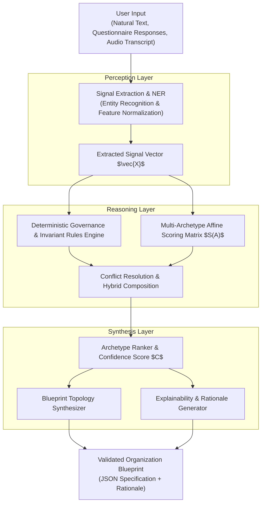

# DOCUMENT 05 — Organization Inference & Recommendation Engine

**Domain:** EnterpriseCore / OrganizationGovernance  
**System:** ACCORE ERP  
**Status:** Approved Algorithmic Specification  
**Author:** Senior ERP Architect & Intelligence Systems Engineer  

---

## 1. Executive Summary

An intelligent ERP must never confront an end user with an empty canvas or an arbitrary list of academic topology names. Conversely, it must never rely on an unpredictable, unconstrained "black box" AI that hallucinates invalid financial structures or invents non-compliant organizational models.

The **ACCORE Organization Inference & Recommendation Engine** is an enterprise-grade hybrid system:
1. **Perception Layer (Semantic Parser):** Utilizes deterministic pattern matching and optional LLM semantic parsing to extract structured operational signals from natural business descriptions.
2. **Reasoning Layer (Deterministic Rules & Scoring Matrix):** Evaluates signals against mathematically rigorous rules, computing structural archetype affinities, confidence scores, and conflict resolutions.
3. **Synthesis Layer (Blueprint Generator):** Assembles a topologically compliant `OrganizationBlueprint` using verified governance constraints.
4. **Explainability Layer (Rationale Synthesizer):** Translates activated decision rules into plain, transparent business rationale, answering: *"Why did ACCORE recommend this structure?"*

---

## 2. System Architecture & Information Flow



---

## 3. The Signal Vector: Input Feature Taxonomy

The engine transforms raw user answers into a normalized, strongly typed signal vector $\vec{X}$:

$$\vec{X} = \langle X_{\text{scale}}, X_{\text{geo}}, X_{\text{facilities}}, X_{\text{commercial}}, X_{\text{governance}}, X_{\text{industry}} \rangle$$

### 3.1 Feature Definitions

| Signal Dimension | Variable | Data Type | Range / Domain | Operational Meaning |
| :--- | :--- | :--- | :--- | :--- |
| **Scale** | $N_{\text{emp}}$ | Integer | $[1, \infty)$ | Total headcount (full-time + part-time) |
| | $N_{\text{legal}}$ | Integer | $[1, \infty)$ | Number of registered legal corporations / CRs |
| **Geographic** | $N_{\text{countries}}$ | Integer | $[1, \infty)$ | Number of sovereign nations with physical presence |
| | $N_{\text{cities}}$ | Integer | $[1, \infty)$ | Number of distinct operating metropolitan areas |
| **Facilities** | $N_{\text{stores}}$ | Integer | $[0, \infty)$ | Physical retail customer-facing outlets |
| | $N_{\text{warehouses}}$| Integer | $[0, \infty)$ | Pure inventory storage / distribution centers |
| | $N_{\text{factories}}$ | Integer | $[0, \infty)$ | Manufacturing, assembly, or processing plants |
| | $N_{\text{offices}}$ | Integer | $[0, \infty)$ | Administrative or professional service offices |
| **Commercial** | $B_{\text{pos}}$ | Boolean | $\{0, 1\}$ | Operates physical Point-of-Sale cash desks |
| | $B_{\text{ecom}}$ | Boolean | $\{0, 1\}$ | Operates online / digital e-commerce channels |
| | $B_{\text{wholesale}}$| Boolean | $\{0, 1\}$ | Operates B2B bulk wholesale / distributor sales |
| | $B_{\text{services}}$ | Boolean | $\{0, 1\}$ | Bills for professional time, contracts, or labor |
| **Governance** | $G_{\text{finance}}$ | Categorical | `centralized` \| `decentralized` | Financial ledger and payable control model |
| | $G_{\text{purchasing}}$| Categorical | `centralized` \| `per_site` \| `hybrid` | Procurement authorization topology |
| | $G_{\text{matrix}}$ | Boolean | $\{0, 1\}$ | Staff report to both functional lead and project/site lead |
| | $G_{\text{projects}}$ | Boolean | $\{0, 1\}$ | Core revenue delivered via temporary client projects |
| **Industry** | $I_{\text{type}}$ | Enum | `retail`, `manufacturing`, `services`, `contracting`, `holding` | Primary industrial domain |

---

## 4. Scoring Algorithm & Affine Weights

The engine evaluates affinity scores for the 7 fundamental structural archetypes defined in Document 03:

$$S(A_k) = \beta_k + \sum_{i=1}^{M} w_{k, i} \cdot f_i(\vec{X})$$

Where:
- $S(A_k)$ is the affinity score for Archetype $k \in \{1 \dots 7\}$.
- $\beta_k$ is the baseline bias for archetype $k$.
- $w_{k, i}$ is the calibrated weight of feature $i$ for archetype $k$.
- $f_i(\vec{X})$ is the normalized feature activation function ($0.0 \le f_i \le 1.0$).

### 4.1 Weight Matrix $\mathbf{W}$

| Feature / Signal | A1: Simple Line | A2: Functional | A3: Divisional | A4: Multi-Branch | A5: Matrix | A6: Projectized | A7: Multi-Entity |
| :--- | :---: | :---: | :---: | :---: | :---: | :---: | :---: |
| $N_{\text{emp}} \le 10$ | **+50** | -10 | -30 | -20 | -40 | 0 | -50 |
| $11 \le N_{\text{emp}} \le 50$ | +10 | **+40** | 0 | +10 | +10 | +15 | -20 |
| $N_{\text{emp}} > 50$ | -40 | +20 | **+40** | **+30** | **+35** | **+30** | **+40** |
| $N_{\text{legal}} > 1$ | -100 | -50 | -20 | -10 | +10 | 0 | **+100** |
| $N_{\text{countries}} > 1$ | -80 | -30 | +20 | +30 | **+40** | +10 | **+80** |
| $N_{\text{stores}} \ge 2$ | -50 | -10 | +10 | **+80** | 0 | -20 | +20 |
| $N_{\text{warehouses}} \ge 1$ | -10 | +10 | +10 | **+50** | 0 | 0 | +10 |
| $N_{\text{factories}} \ge 1$ | -30 | **+40** | +20 | +10 | +10 | -10 | +20 |
| $B_{\text{pos}} = 1$ | +10 | 0 | 0 | **+60** | -10 | -20 | +10 |
| $G_{\text{projects}} = 1$ | -20 | -20 | +10 | -10 | **+50** | **+90** | +10 |
| $G_{\text{matrix}} = 1$ | -50 | -30 | +10 | 0 | **+100** | +40 | +20 |
| $G_{\text{finance}} = \text{decentral}$ | -40 | -30 | **+50** | +20 | +10 | +20 | **+60** |

---

## 5. Confidence Calculation & Hybrid Synthesis

### 5.1 Confidence Score Metric
Let the top two ranked archetypes be $A_{(1)}$ and $A_{(2)}$ with scores $S_1$ and $S_2$.  
The confidence metric $C \in [0.0, 1.0]$ is defined as:

$$C = \min\left(1.0, \; \frac{S_1 - S_2}{S_1 + \epsilon} \cdot \gamma + \alpha(N_{\text{signals}})\right)$$

Where:
- $\alpha(N_{\text{signals}})$ increases as more questions are answered with high clarity.
- If $C \ge 0.40$, the engine presents $A_{(1)}$ as the unambiguous primary recommendation.
- If $C < 0.40$, the engine recognizes a **Competing or Hybrid Structure** and triggers **Hybrid Composition**.

### 5.2 Hybrid Composition Logic
When signals activate two or more distinct archetypes strongly (e.g. $A_4$ Multi-Branch and $A_6$ Projectized both score $> 60$), the engine does **not** force an artificial choice.

Instead, it composes a **Multi-Plane Hybrid**:
$$\text{Topology} = A_{\text{Operational}} \cup A_{\text{Workforce}} \cup A_{\text{Financial}}$$
- **Operational Layer:** Instantiates $A_4$ (Geographic Branches & Central Warehouse).
- **Workforce & Initiatives Layer:** Instantiates $A_6$ (Project Teams with Matrix Links).
- **Financial Layer:** Centralized Controlling Area with branch profit centers and project WBS elements.

---

## 6. The Deterministic vs AI Boundary

To ensure enterprise reliability, ACCORE establishes strict boundaries between probabilistic AI (LLMs) and deterministic code:

```
┌─────────────────────────────────────────────────────────────┐
│                      PROBABILISTIC AI                       │
│                     (Large Language Model)                  │
│                                                             │
│  - Natural Language Entity Extraction ("8 stores" -> N=8)   │
│  - Slang & Regional Dialect Comprehension (Arabic / English)│
│  - Generating human-friendly unit names and descriptions    │
│  - Synthesizing conversational explanations                 │
└──────────────────────────────┬──────────────────────────────┘
                               │ Structured JSON Facts
                               ▼
┌─────────────────────────────────────────────────────────────┐
│                     DETERMINISTIC CODE                      │
│                    (Rule & Graph Engine)                    │
│                                                             │
│  - Mathematical Affine Scoring & Confidence Metric          │
│  - Topology Constraint Validation (Acyclicity, Country Laws)│
│  - Accounting Balancing & Chart of Accounts Verification    │
│  - Database Transactions (`structure_nodes`, `links`)       │
│  - Security Scoping & Operating Context Enforcement         │
└─────────────────────────────────────────────────────────────┘
```

> **Cardinal Rule:** An LLM is **never** permitted to generate database records or commit transactions directly. The LLM only parses conversational text into structured facts; the deterministic engine verifies constraints and builds the blueprint.

---

## 7. Concrete Worked Examples

### Example 1: Single Store Boutique
- **Input:** *"I run a specialty perfume boutique in Riyadh with 4 sales staff."*
- **Extracted Signals:** $N_{\text{emp}} = 4, N_{\text{legal}} = 1, N_{\text{countries}} = 1, N_{\text{stores}} = 1, B_{\text{pos}} = 1, G_{\text{finance}} = \text{centralized}$.
- **Scoring Results:**
  - $S(A_1 \text{ Simple}) = \mathbf{92}$
  - $S(A_2 \text{ Functional}) = 18$
  - $S(A_4 \text{ Multi-Branch}) = 12$
- **Inferred Blueprint:**
  - Single `COMP_CODE` + 1 `PLANT` (Olaya Boutique) + 1 `STORAGE_LOC` (Store Stock) + 1 POS Terminal.
  - Cashier & Sales positions report directly to the Owner.
- **Generated Explanation:** *"Recommended: Simple Single-Store Model. Ideal for an independent retail boutique. Minimizes administrative complexity while maintaining full POS and inventory tracking."*

### Example 2: Multi-Branch Pharmacy Chain
- **Input:** *"We are a pharmacy company with 14 branches across Riyadh and Jeddah, 2 central cold-storage warehouses, and 120 employees. Purchases are negotiated centrally, but branch managers manage daily shifts."*
- **Extracted Signals:** $N_{\text{emp}} = 120, N_{\text{legal}} = 1, N_{\text{stores}} = 14, N_{\text{warehouses}} = 2, B_{\text{pos}} = 1, G_{\text{purchasing}} = \text{centralized}$.
- **Scoring Results:**
  - $S(A_4 \text{ Multi-Branch Geographic}) = \mathbf{148}$
  - $S(A_2 \text{ Functional}) = 45$
  - $S(A_1 \text{ Simple}) = -80$
- **Inferred Blueprint:**
  - Single `COMP_CODE` + Central `PURCH_ORG`.
  - 2 Regional Hubs: Riyadh Region, Western Region.
  - 2 Central Warehouses (`PLANT` with high-capacity inventory facet).
  - 14 Branch Nodes (`OrgUnit` with Commercial Branch + POS + Local Inventory facet).
  - Centralized General Ledger with 14 individual Profit Centers.
- **Generated Explanation:** *"Recommended: Geographic Multi-Branch Structure with Centralized Procurement. Enables local branch operational autonomy and POS checkout while ensuring centralized supplier purchasing power and corporate inventory control."*

### Example 3: Engineering Consultancy Firm
- **Input:** *"We are a structural engineering consultancy with 50 staff in Riyadh. Our engineers belong to disciplines (Civil, Electrical, Mechanical), but work on multi-year client infrastructure projects. Project managers oversee deliverables, while discipline heads oversee technical quality and salaries."*
- **Extracted Signals:** $N_{\text{emp}} = 50, G_{\text{projects}} = 1, G_{\text{matrix}} = 1, B_{\text{services}} = 1$.
- **Scoring Results:**
  - $S(A_5 \text{ Balanced Matrix}) = \mathbf{162}$
  - $S(A_6 \text{ Projectized}) = 140$
  - $S(A_2 \text{ Functional}) = 30$
- **Inferred Blueprint:**
  - Single `COMP_CODE` + Functional Departments (Civil, Electrical, Mechanical).
  - Permanent Positions report administratively to Discipline Heads (`line_management`).
  - Active Client Projects (`WBS_ELEMENT` / Project Units) with dynamic `project_member` links from Engineers to Project Managers.
- **Generated Explanation:** *"Recommended: Balanced Matrix Organization. Empowers Discipline Heads to manage technical standards and career growth, while Project Managers direct day-to-day project milestones and client billings."*

---

## 8. Explainability Engine: Rule-to-Rationale Synthesis

The engine generates human-understandable explanations by formatting activated rule assertions:

```php
// Conceptual PHP rule activation logic
$reasons = [];

if ($signals->storeCount > 1) {
    $reasons[] = [
        'factor' => 'multi_store',
        'en' => "You operate {$signals->storeCount} customer-facing branches across {$signals->cityCount} cities.",
        'ar' => "تدير {$signals->storeCount} فروع لمواجهة العملاء في {$signals->cityCount} مدن.",
    ];
}

if ($signals->purchasingModel === 'centralized') {
    $reasons[] = [
        'factor' => 'central_procurement',
        'en' => "Purchasing is centralized to leverage bulk supplier discounts and maintain uniform inventory quality.",
        'ar' => "تم توحيد المشتريات للاستفادة من خصومات الشراء المجمع وضمان جودة المخزون.",
    ];
}

if ($signals->isMatrixRequired) {
    $reasons[] = [
        'factor' => 'dual_reporting',
        'en' => "Employees participate in client projects while maintaining permanent departmental reporting lines.",
        'ar' => "يشارك الموظفون في مشاريع العملاء مع الحفاظ على خطوط التبعية الإدارية الدائمة لأقسامهم.",
    ];
}
```

This transforms complex topology mathematics into clear, empowering explanations that give business owners complete trust and mastery over their system.
