# DOCUMENT 06 — Organization Blueprint & Generation System

**Domain:** EnterpriseCore / OrganizationGovernance  
**System:** ACCORE ERP  
**Status:** Approved Technical & Data Specification  
**Author:** Senior ERP Architect & Lead Systems Engineer  

---

## 1. Executive Summary

In naive software implementations, setup forms directly execute database `INSERT` statements as the user clicks buttons. If the user changes their mind halfway through, encounters an error, or cancels the wizard, the database is left in a corrupted, half-initialized state littered with orphaned records.

The **Organization Blueprint** is the foundational intermediate abstraction that solves this problem in ACCORE ERP.

The Blueprint decouples **intent and design** from **database persistence**:
1. It is a complete, self-contained, serializable in-memory and staged representation of an organizational architecture.
2. It allows live interactive preview, graph visualization, manual user customization, drag-and-drop editing, and validation checks *without touching production database tables*.
3. When the user approves the design, the **Blueprint Compiler** executes an atomic, transactional compilation that instantiates all graph nodes, links, facilities, financial centers, positions, and operating contexts in a single ACID database transaction.

---

## 2. Organization Blueprint Data Contract & JSON Schema

The Blueprint contract is defined strictly in TypeScript (frontend) and PHP DTOs (backend):

```json
{
  "$schema": "https://accore.io/schemas/v2/org-blueprint.json",
  "blueprint_id": "blp_984f1a23-bc8e-49b0-9831-29e1c2049d51",
  "version": "2.0.0",
  "created_at": "2026-09-15T05:30:00Z",
  "updated_at": "2026-09-15T05:35:00Z",
  "status": "staged",
  "metadata": {
    "generator": "ACCORE_Inference_Engine_v2",
    "complexity_grade": 3,
    "primary_archetype": "GEOGRAPHIC_MULTI_BRANCH",
    "confidence_score": 0.94,
    "source_mode": "guided_conversational"
  },
  "business_profile": {
    "company_name": "Al-Amal Specialty Retail Group",
    "company_code": "AMAL",
    "country_code": "SA",
    "primary_currency": "SAR",
    "fiscal_calendar": "K4",
    "headcount_estimate": 45,
    "operating_model": "retail_multibranch"
  },
  "units": [
    {
      "temp_id": "u_legal_01",
      "type_id": "COMP_CODE",
      "code": "AMAL-CORP",
      "name_en": "Al-Amal Specialty Retail LLC",
      "name_ar": "شركة الأمل للتجزئة المحدودة",
      "facets": ["LegalEntityFacet", "FinancialResponsibilityFacet"],
      "attributes": {
        "cr_number": "1010789456",
        "vat_number": "310123456700003",
        "currency_id": "SAR",
        "chart_of_accounts_id": "ACCORE-PRIMARY-GL"
      },
      "is_user_locked": true
    },
    {
      "temp_id": "u_hub_01",
      "type_id": "PLANT",
      "code": "WH-RUH-CENTRAL",
      "name_en": "Riyadh Central Logistics Depot",
      "name_ar": "مستودع الرياض اللوجستي المركزي",
      "facets": ["OperationalFacilityFacet", "FinancialResponsibilityFacet"],
      "attributes": {
        "facility_type": "warehouse",
        "city": "Riyadh",
        "address": "Al-Sulaimaniyah District, Logistics Park Bay 4",
        "factory_calendar_id": "CAL-SA-2026",
        "is_central_purchasing": true
      },
      "is_user_locked": false
    },
    {
      "temp_id": "u_store_01",
      "type_id": "PLANT",
      "code": "BR-RUH-OLAYA",
      "name_en": "Olaya Flagship Store",
      "name_ar": "فرع العليا الرئيسي",
      "facets": ["OperationalFacilityFacet", "CommercialBranchFacet", "FinancialResponsibilityFacet"],
      "attributes": {
        "facility_type": "retail_store",
        "city": "Riyadh",
        "address": "Olaya Main Street, Tower A",
        "pos_terminal_count": 2,
        "cash_registers": ["REG-01", "REG-02"]
      },
      "is_user_locked": false
    },
    {
      "temp_id": "u_store_02",
      "type_id": "PLANT",
      "code": "BR-JED-TAHLIA",
      "name_en": "Tahlia Boutique Store",
      "name_ar": "فرع التحلية - جدة",
      "facets": ["OperationalFacilityFacet", "CommercialBranchFacet", "FinancialResponsibilityFacet"],
      "attributes": {
        "facility_type": "retail_store",
        "city": "Jeddah",
        "address": "Prince Mohammed Bin Abdulaziz St",
        "pos_terminal_count": 1,
        "cash_registers": ["REG-01"]
      },
      "is_user_locked": false
    }
  ],
  "relationships": [
    {
      "temp_id": "rel_01",
      "source_temp_id": "u_hub_01",
      "target_temp_id": "u_legal_01",
      "plane_type": "OPERATIONAL_HIERARCHY",
      "link_type": "line_management",
      "priority": 1
    },
    {
      "temp_id": "rel_02",
      "source_temp_id": "u_store_01",
      "target_temp_id": "u_legal_01",
      "plane_type": "OPERATIONAL_HIERARCHY",
      "link_type": "line_management",
      "priority": 1
    },
    {
      "temp_id": "rel_03",
      "source_temp_id": "u_store_02",
      "target_temp_id": "u_legal_01",
      "plane_type": "OPERATIONAL_HIERARCHY",
      "link_type": "line_management",
      "priority": 1
    },
    {
      "temp_id": "rel_04",
      "source_temp_id": "u_store_01",
      "target_temp_id": "u_hub_01",
      "plane_type": "GEOGRAPHIC_CONTAINMENT",
      "link_type": "inventory_replenishment_source",
      "priority": 2
    },
    {
      "temp_id": "rel_05",
      "source_temp_id": "u_store_02",
      "target_temp_id": "u_hub_01",
      "plane_type": "GEOGRAPHIC_CONTAINMENT",
      "link_type": "inventory_replenishment_source",
      "priority": 2
    }
  ],
  "positions": [
    {
      "temp_id": "pos_ceo",
      "unit_temp_id": "u_legal_01",
      "position_code": "POS-EXEC-01",
      "title_en": "Managing Director / CEO",
      "title_ar": "المدير العام / الرئيس التنفيذي",
      "role_id": "ADMIN_SUPER",
      "headcount": 1
    },
    {
      "temp_id": "pos_hub_mgr",
      "unit_temp_id": "u_hub_01",
      "position_code": "POS-LOG-01",
      "title_en": "Logistics & Warehouse Manager",
      "title_ar": "مدير المستودعات والخدمات اللوجستية",
      "role_id": "INVENTORY_MANAGER",
      "reports_to_temp_id": "pos_ceo",
      "headcount": 1
    },
    {
      "temp_id": "pos_store1_mgr",
      "unit_temp_id": "u_store_01",
      "position_code": "POS-RET-01",
      "title_en": "Olaya Store Supervisor",
      "title_ar": "مشرف فرع العليا",
      "role_id": "BRANCH_MANAGER",
      "reports_to_temp_id": "pos_ceo",
      "headcount": 1
    }
  ],
  "capabilities": {
    "activated": [
      "general_ledger",
      "purchasing",
      "multi_warehouse_inventory",
      "point_of_sale",
      "zatca_einvoicing"
    ],
    "deferred": [
      "manufacturing",
      "project_accounting",
      "field_service"
    ]
  },
  "explainability": {
    "summary": "Tailored multi-branch retail distribution network with centralized supply chain.",
    "points": [
      "Dedicated profit centers for Olaya and Tahlia branches enable location-by-location margin analysis.",
      "Inventory replenishment routes automatically bind stores to the Central Riyadh Depot.",
      "Single Legal Entity configuration ensures consolidated VAT filing under your Saudi CR."
    ],
    "unresolved_items": [
      {
        "key": "store2_supervisor",
        "severity": "info",
        "message": "Tahlia Store currently has no dedicated manager assigned; Olaya Supervisor will temporarily act as overseer."
      }
    ]
  }
}
```

---

## 3. Blueprint Lifecycle & State Progression

```mermaid
stateDiagram-v2
    [*] --> DRAFTING: Question responses stream into engine
    DRAFTING --> STAGED: Synthesis complete; Blueprint generated
    
    STAGED --> CUSTOMIZING: User edits in Studio (Rename, Add, Relink)
    CUSTOMIZING --> STAGED: Changes auto-saved & validated
    
    STAGED --> VALIDATED: Pre-flight integrity check passes
    VALIDATED --> CUSTOMIZING: User makes further adjustment
    
    VALIDATED --> COMPILING: User clicks "Confirm & Publish"
    COMPILING --> PUBLISHED: Transaction commits to Live Core
    COMPILING --> COMPILATION_FAILED: Database error / Constraint violation
    COMPILATION_FAILED --> STAGED: Transaction rolled back; issues reported
    
    PUBLISHED --> [*]: Transition to operational ERP
```



---

## 4. Surviving Regeneration: Partial Regeneration & User Locks

A major problem with automated generators is: if a user customizes a name (e.g. changing "Branch 1" to "King Fahd Road Flagship Store"), and then answers an extra question (e.g. "We also sell wholesale"), a naive generator wipes out all user edits.

### 4.1 The User-Locking Mechanism
Every unit, position, and relationship in the blueprint carries an `is_user_locked` flag:
1. **Explicit Lock:** When a user manually edits a unit name, code, attribute, or link in the UI, that node is automatically marked:
   `unit.is_user_locked = true`
2. **Deterministic Diff & Merge:** When the questionnaire emits an updated signal vector, the engine runs a **Three-Way Merge**:
   - **Preserve:** Any node with `is_user_locked = true` is never deleted, overwritten, or renamed.
   - **Update:** New requirements (e.g., adding a wholesale sales organization) are synthesized as *additive delta nodes*.
   - **Prune:** Only unlocked, obsolete nodes are removed.

---

## 5. The Blueprint Compiler Engine

The **`BlueprintCompiler`** is responsible for turning the abstract JSON specification into production MariaDB records.

### 5.1 ID Resolution Map
During compilation, temporary IDs (`u_legal_01`, `pos_ceo`, `rel_01`) are mapped to persistent database identifiers:

```php
$idMap = [
    'units' => [
        'u_legal_01' => '9b8d2104-5f12-4c22-811a-123456789abc', // UUID in structure_nodes
        'u_hub_01'   => '9b8d2104-5f12-4c22-811a-987654321def',
    ],
    'relational' => [
        'u_legal_01' => 1, // Auto-increment ID in legal_entities
        'u_hub_01'   => 4, // Auto-increment ID in warehouses
    ],
    'positions' => [
        'pos_ceo' => 101, // Auto-increment ID in positions
    ]
];
```

### 5.2 Atomic Compilation Procedure (7-Step ACID Transaction)

```php
DB::transaction(function () use ($blueprint) {
    // 1. Root Mandant Assertion
    $clientNode = $this->assertOrCreateClientNode();

    // 2. Compile OrgUnits into structure_nodes
    foreach ($blueprint->units as $unit) {
        $nodeUuid = (string) Str::uuid();
        $this->idMap['units'][$unit->temp_id] = $nodeUuid;

        StructureNode::create([
            'node_uuid'       => $nodeUuid,
            'node_type_id'    => $unit->type_id,
            'code'            => $unit->code,
            'attributes_json' => $unit->attributes,
            'status'          => 'active',
            'valid_from'      => now()->toDateString(),
        ]);
    }

    // 3. Compile Facets into Relational Domain Projections
    foreach ($blueprint->units as $unit) {
        $uuid = $this->idMap['units'][$unit->temp_id];
        
        if (in_array('FinancialResponsibilityFacet', $unit->facets)) {
            $costCenter = CostCenter::create([
                'structure_node_uuid' => $uuid,
                'code'                => 'CC-' . $unit->code,
                'name'                => $unit->name_ar,
                'name_en'             => $unit->name_en,
                'is_active'           => true,
            ]);
            $profitCenter = ProfitCenter::create([
                'structure_node_uuid' => $uuid,
                'code'                => 'PC-' . $unit->code,
                'name'                => $unit->name_ar,
                'name_en'             => $unit->name_en,
                'is_active'           => true,
            ]);
        }

        if (in_array('OperationalFacilityFacet', $unit->facets)) {
            $warehouse = Warehouse::create([
                'org_node_uuid'   => $uuid,
                'code'            => 'WH-' . $unit->code,
                'name'            => $unit->name_ar,
                'name_en'         => $unit->name_en,
                'cost_center_id'  => $costCenter->id ?? null,
                'profit_center_id'=> $profitCenter->id ?? null,
                'status'          => 'active',
                'is_active'       => true,
            ]);
            $this->idMap['relational'][$unit->temp_id] = $warehouse->id;
        }

        if (in_array('CommercialBranchFacet', $unit->facets)) {
            for ($i = 1; $i <= ($unit->attributes['pos_terminal_count'] ?? 1); $i++) {
                PosTerminal::create([
                    'org_node_uuid'   => $uuid,
                    'warehouse_id'    => $warehouse->id,
                    'code'            => 'POS-' . $unit->code . '-' . str_pad($i, 2, '0', STR_PAD_LEFT),
                    'name'            => $unit->name_ar . ' - نقطة بيع ' . $i,
                    'name_en'         => $unit->name_en . ' - POS #' . $i,
                    'cost_center_id'  => $costCenter->id ?? null,
                    'profit_center_id'=> $profitCenter->id ?? null,
                    'status'          => 'active',
                    'is_active'       => true,
                ]);
            }
        }
    }

    // 4. Compile Directed Graph Links into structure_links
    foreach ($blueprint->relationships as $rel) {
        $sourceUuid = $this->idMap['units'][$rel->source_temp_id];
        $targetUuid = $this->idMap['units'][$rel->target_temp_id];

        StructureLink::create([
            'source_node_uuid' => $sourceUuid,
            'target_node_uuid' => $targetUuid,
            'link_type'        => $rel->link_type,
            'priority'         => $rel->priority,
            'valid_from'       => now()->toDateString(),
        ]);
    }

    // 5. Compile Positions into positions table
    foreach ($blueprint->positions as $pos) {
        Position::create([
            'position_code'   => $pos->position_code,
            'position_name_ar'=> $pos->title_ar,
            'position_name_en'=> $pos->title_en,
            'role_id'         => $this->resolveRoleId($pos->role_id),
            'cost_center_id'  => $this->resolveUnitCostCenterId($pos->unit_temp_id),
            'is_active'       => true,
        ]);
    }

    // 6. Bootstrap Default Administrator Operating Context
    $primaryUnit = $blueprint->units[0];
    $primaryWarehouseId = $this->idMap['relational'][$primaryUnit->temp_id] ?? null;
    OperatingContext::create([
        'user_id'       => auth()->id(),
        'org_node_uuid' => $this->idMap['units'][$primaryUnit->temp_id],
        'warehouse_id'  => $primaryWarehouseId,
        'status'        => 'ready',
        'is_default'    => true,
    ]);

    // 7. Record Genesis Event in Audit History
    $this->recordGenesisHistory($blueprint);
});
```

---

## 6. Resilience & Rollback Guarantees

1. **Transactional All-or-Nothing:** If a single foreign key constraint, duplicate code, or validation rule fails during compilation, the entire transaction is rolled back via standard ACID guarantees. Zero garbage data is written.
2. **Audit Reproducibility:** The raw input JSON blueprint is permanently serialized into `org_change_history` as the genesis snapshot. The exact state of the organization at birth can be inspected years later for statutory audits.
3. **Draft Export & Sharing:** Blueprints can be exported as standalone `.json` artifacts, allowing implementation partners to prepare enterprise structures offline and import them with a single click.
