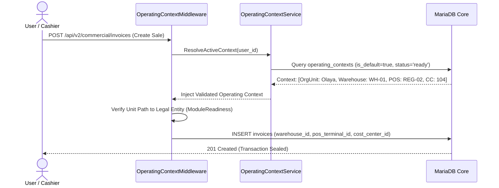

# DOCUMENT 08 — ERP Integration & Capability Architecture

**Domain:** EnterpriseCore / Cross-Cutting ERP Domains  
**System:** ACCORE ERP  
**Status:** Approved Architectural Specification  
**Author:** Principal ERP Integration Architect  

---

## 1. Executive Summary

A critical failure mode in conventional ERP design is the tight coupling of organizational structures with functional modules. When an organization is told: *"To enable manufacturing, you must dismantle your departments and configure a factory hierarchy"*, or when deactivating an experimental retail POS module breaks the general ledger, the ERP architecture has failed.

This document establishes the **Tri-Layer Decoupling Principle** for ACCORE ERP:
1. **The Organizational Structure Layer:** The permanent foundation of actors, facilities, legal entities, and relationship networks.
2. **The ERP Capability Layer:** The modular business powers (e.g., General Ledger, Multi-Warehouse Stock, POS Checkout, Payroll, Production Control, ZATCA Compliance) that can be activated, upgraded, or deactivated independently.
3. **The Operational Configuration Layer:** Specific master parameters (Number ranges, Chart of Account codes, Tax rules, Payment terms) that configure how an active capability executes within an organizational unit.

This decoupling guarantees that ACCORE can scale smoothly from a lean retail boutique to a global multi-plant enterprise without structural upheaval.

---

## 2. The Tri-Layer Decoupling Principle

```mermaid
graph TD
    subgraph Layer 1: Organizational Structure
        OrgUnit["Canonical OrgUnits (Nodes & Facets)"]
        Planes["Multi-Plane Directed Relationships"]
        Positions["Positions & Workforce Staffing"]
    end

    subgraph Layer 2: ERP Capabilities (Pluggable Powers)
        CapFinance["Finance & Ledger Capability"]
        CapInventory["Supply Chain & Inventory Capability"]
        CapSales["Commercial & POS Capability"]
        CapHR["Human Capital & Payroll Capability"]
        CapMfg["Manufacturing & Work Centers"]
        CapProjects["Project Accounting & Milestones"]
    end

    subgraph Layer 3: Operational Configuration
        ConfigNR["Number Range Engine (SAP-style)"]
        ConfigCOA["Chart of Accounts & Fiscal Periods"]
        ConfigTax["ZATCA Phase 2 Tax Engine"]
        ConfigContext["Operating Context Session Binding"]
    end

    OrgUnit -. Activates & Scopes .-> CapFinance
    OrgUnit -. Activates & Scopes .-> CapInventory
    OrgUnit -. Activates & Scopes .-> CapSales
    OrgUnit -. Activates & Scopes .-> CapHR
    OrgUnit -. Activates & Scopes .-> CapMfg
    OrgUnit -. Activates & Scopes .-> CapProjects

    CapFinance --> ConfigCOA
    CapFinance --> ConfigTax
    CapSales --> ConfigNR
    CapInventory --> ConfigContext
```

### Key Architectural Invariant
> **The Capability Invariant:** An `OrgUnit` can activate or deactivate any ERP capability dynamically without modifying its position in the legal or operational hierarchy. Conversely, altering an organizational relationship (e.g., moving a store to a different regional manager) never destroys transactional or operational data.

---

## 3. Domain-by-Domain Integration Matrix

### 3.1 Finance & General Ledger Integration
- **The Statutory Balancing Boundary:**  
  Every financial ledger transaction in ACCORE (`universal_journals` / `general_ledger`) must resolve to exactly one primary **`LegalEntity` (`COMP_CODE`)**. This ensures that balance sheets, trial balances, and ZATCA VAT returns balance to zero ($Debit = Credit$) for each legal establishment.
- **Managerial Accounting Allocation:**  
  Each journal entry line carries:
  - `cost_center_id` (Attributed to an `OrgUnit` carrying `FinancialResponsibilityFacet`).
  - `profit_center_id` (Attributed to the operational or commercial business unit).
- **Intercompany Transactions:**  
  When an operational event spans two different legal entities (e.g., Trading Co in Riyadh purchases inventory manufactured by Factory Co in Dammam), the engine generates automated **Intercompany Due To / Due From** journal postings in both ledgers.

### 3.2 Commercial & Sales Lifecycle Integration
- **Commercial Branch & POS Terminals:**  
  An `OrgUnit` with `CommercialBranchFacet` binds to one or more `PosTerminal` records.
- **Transaction Headers (`invoices`):**  
  Every sale invoice records:
  ```sql
  warehouse_id      BIGINT -- Physical inventory storage point
  pos_terminal_id   BIGINT -- Cash register device identifier
  cost_center_id    BIGINT -- Branch cost collector
  profit_center_id  BIGINT -- Store profit margin collector
  sales_rep_id      BIGINT -- Responsible sales agent (Employee)
  ```
- **Credit Control & Pricing:**  
  Pricing tiers, discount authority limits, and customer credit exposure are scoped to the branch or regional sales organization (`SALES_ORG`).

### 3.3 Supply Chain & Inventory Integration
- **Physical Facility to Warehouse Mapping:**  
  An `OrgUnit` with `OperationalFacilityFacet` binds directly to an inventory `Warehouse`.
- **Sub-Location & Bin Hierarchy:**  
  Inside a warehouse facility, internal storage locations (`STORAGE_LOC`) model receiving docks, quarantine zones, cold storage bays, and picking shelves.
- **Replenishment Routing:**  
  Directed graph links (`inventory_replenishment_source`) automate stock transfer requests (e.g., Store A creates a stock transfer order sourced from Central Warehouse B).
- **Procurement Orders (`purchases`):**  
  Purchase orders capture delivery to a specific `warehouse_id`, allocated to a department `cost_center_id`.

### 3.4 Human Capital, Workforce & Payroll Integration
- **Position-Driven Authorization:**  
  Employees inherit their system privileges not through ad-hoc user toggles, but through their assigned **`Position`**:
  $$\text{Employee} \longrightarrow \text{Position} \longrightarrow \text{Role} \longrightarrow \text{RolePermission}$$
- **Multi-Level Approval Chains:**  
  Leave requests, expense reimbursement claims, and purchase requisitions navigate the `OPERATIONAL_HIERARCHY` (`line_management` links) dynamically:
  $$\text{Requestor} \longrightarrow \text{Direct Line Manager} \longrightarrow \text{Department Head} \longrightarrow \text{Finance Controller}$$
- **Payroll Expense Allocation:**  
  During payroll generation, gross salary, employer social insurance (GOSI), and benefits are automatically distributed as journal entries to the `cost_center_id` designated on the employee's position.

### 3.5 Manufacturing & Production Control Integration
- **Work Centers & Shop Floors:**  
  Manufacturing plants (`PLANT`) host production work centers, assembly lines, and machine groups.
- **Cost of Goods Manufactured (COGM):**  
  Direct labor, machine hours, and overhead costs accumulate onto production orders and roll up into the plant's cost center.

### 3.6 Projects & Project Accounting Integration
- **Project Structure Units (`WBS_ELEMENT`):**  
  Initiatives, contracts, and engineering works are modeled as project nodes linked to a sponsoring department or profit center.
- **Timesheets & Billing:**  
  Employees log hours against project units. Costs flow to the project WBS element, while billing milestones generate customer receivables with direct project profitability tracking.

---

## 4. The Operating Context: Runtime Transactional Scoping

The **`OperatingContext`** is ACCORE's operational security and convenience anchor. It represents the exact physical, commercial, and financial environment in which a user is performing actions.

### 4.1 Resolution Flow on User Action



### 4.2 Multi-Context Switching
For managers supervising multiple locations:
- The top navigation bar displays a persistent **Context Switcher** (e.g. `📍 Olaya Store ▾`).
- Clicking the switcher allows one-click transition to `📍 Tahlia Store` or `🏢 Headquarters`.
- Switching contexts updates session defaults for all subsequent transactions while preserving complete audit logging.

---

## 5. Regulatory Compliance & ZATCA Integration

Under Saudi Arabian ZATCA regulations for Phase 2 E-Invoicing (Fatoora):
1. **Cryptographic Device Identifier (CSID):** Each POS terminal and invoicing solution must be cryptographically onboarded and registered with a unique cryptographic compliance stamp.
2. **Organizational Anchor:** In ACCORE, each ZATCA cryptographic profile binds to:
   - The **`LegalEntity`** (for VAT registration number and legal tax name).
   - The **`CommercialBranchFacet`** (for branch address, CR number, and specific POS device identifiers).
3. **Immutability:** Financial invoices once stamped with a ZATCA cryptographic hash cannot be re-assigned to another organizational unit or altered in any ledger.
