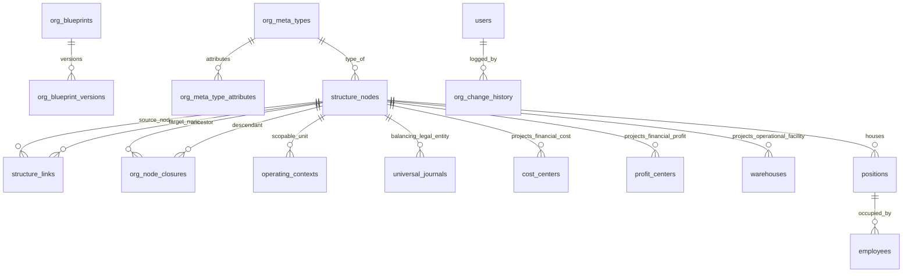

# DOCUMENT 09 — Technical Architecture, Persistence, Versioning & Change Management

**Domain:** EnterpriseCore / OrganizationGovernance  
**System:** ACCORE ERP  
**Status:** Approved Technical Architecture Specification  
**Author:** Lead Systems Architect & Database Engineering Specialist  

---

## 1. Executive Summary

An enterprise organizational modeling engine cannot rely on fragile relational joins or simple parent-pointer adjacency lists. In a serious ERP, the organizational graph must handle:
1. **Arbitrary Graph Traversals:** Computing complete upstream ownership paths and downstream rollups in milliseconds.
2. **Temporal Truth & Effective Dating:** Ensuring historical financial statements reflect the exact organizational hierarchy that existed on the voucher date, while allowing future restructurings to be staged ahead of time.
3. **High-Concurrency Transactional Safety:** Guaranteeing that active operations (POS checkout, warehouse picking, invoice creation) are never blocked by an administrator refining an organizational draft.

This document details the **production technical architecture**, database persistence model, recursive query optimizations, temporal versioning engine, and RESTful API contracts for ACCORE ERP.

---

## 2. Harmonized Database Schema & Evolutionary Migrations

To eliminate the "Two-Worlds Problem" identified in Document 01, ACCORE evolves its database schema while maintaining backward compatibility with existing relational tables.



### 2.1 Database Schema Evolution (DDL Specifications)

#### 1. Table: `structure_nodes` (Harmonized Master Entity)
```sql
ALTER TABLE `structure_nodes`
    ADD COLUMN `name_en` VARCHAR(255) NOT NULL AFTER `code`,
    ADD COLUMN `name_ar` VARCHAR(255) NOT NULL AFTER `name_en`,
    ADD COLUMN `facets_json` JSON NULL AFTER `attributes_json`,
    ADD COLUMN `legal_entity_uuid` CHAR(36) NULL AFTER `node_uuid`,
    ADD COLUMN `is_locked` TINYINT(1) NOT NULL DEFAULT 0,
    ADD INDEX `idx_sn_legal_entity` (`legal_entity_uuid`),
    ADD INDEX `idx_sn_status_dates` (`status`, `valid_from`, `valid_to`);
```

#### 2. Table: `structure_links` (Multi-Plane Directed Edges with Temporal Windows)
```sql
ALTER TABLE `structure_links`
    ADD COLUMN `plane_type` VARCHAR(32) NOT NULL DEFAULT 'OPERATIONAL_HIERARCHY' AFTER `link_type`,
    ADD COLUMN `weight` DECIMAL(5,2) NOT NULL DEFAULT 100.00 AFTER `priority`,
    ADD INDEX `idx_sl_plane_temporal` (`plane_type`, `valid_from`, `valid_to`),
    ADD INDEX `idx_sl_source_plane` (`source_node_uuid`, `plane_type`);
```

#### 3. Table: `org_node_closures` (High-Performance Transitive Closure Table)
To eliminate slow recursive queries, ACCORE maintains a transitive closure table updated via transactional triggers or application events:
```sql
CREATE TABLE `org_node_closures` (
    `id` BIGINT UNSIGNED AUTO_INCREMENT PRIMARY KEY,
    `plane_type` VARCHAR(32) NOT NULL,
    `ancestor_uuid` CHAR(36) NOT NULL,
    `descendant_uuid` CHAR(36) NOT NULL,
    `depth` INT UNSIGNED NOT NULL,
    `valid_from` DATE NULL,
    `valid_to` DATE NULL,
    UNIQUE KEY `uk_closure_plane_path` (`plane_type`, `ancestor_uuid`, `descendant_uuid`, `valid_from`),
    FOREIGN KEY (`ancestor_uuid`) REFERENCES `structure_nodes` (`node_uuid`) ON DELETE CASCADE,
    FOREIGN KEY (`descendant_uuid`) REFERENCES `structure_nodes` (`node_uuid`) ON DELETE CASCADE
) ENGINE=InnoDB DEFAULT CHARSET=utf8mb4 COLLATE=utf8mb4_unicode_ci;
```

#### 4. Table: `org_blueprints` (Draft & Staging Storage)
```sql
CREATE TABLE `org_blueprints` (
    `id` BIGINT UNSIGNED AUTO_INCREMENT PRIMARY KEY,
    `blueprint_uuid` CHAR(36) NOT NULL UNIQUE,
    `name` VARCHAR(255) NOT NULL,
    `status` VARCHAR(20) NOT NULL DEFAULT 'staged', -- staged, validated, published, archived
    `complexity_grade` TINYINT UNSIGNED NOT NULL DEFAULT 1,
    `primary_archetype` VARCHAR(64) NOT NULL,
    `blueprint_json` LONGTEXT NOT NULL,
    `created_by` BIGINT UNSIGNED NULL,
    `published_at` TIMESTAMP NULL,
    `created_at` TIMESTAMP NULL,
    `updated_at` TIMESTAMP NULL,
    FOREIGN KEY (`created_by`) REFERENCES `users` (`id`) ON DELETE SET NULL
) ENGINE=InnoDB DEFAULT CHARSET=utf8mb4 COLLATE=utf8mb4_unicode_ci;
```

#### 5. Financial Ledger Direct Legal Entity Anchoring
```sql
ALTER TABLE `universal_journals`
    ADD COLUMN `legal_entity_uuid` CHAR(36) NULL AFTER `document_type`,
    ADD INDEX `idx_uj_legal_entity` (`legal_entity_uuid`);

ALTER TABLE `general_ledger`
    ADD COLUMN `legal_entity_uuid` CHAR(36) NULL AFTER `voucher_number`,
    ADD INDEX `idx_gl_legal_entity_date` (`legal_entity_uuid`, `voucher_date`);
```

---

## 3. High-Performance Graph Queries: Recursive CTEs vs Closure Tables

A major performance problem in graph-backed ERPs is traversing the tree to answer queries like:
- *"Show me all sales generated across all 14 stores belonging to the Western Region."*
- *"Does the user's selected warehouse have a valid path to a Legal Entity?"*

ACCORE utilizes a **hybrid execution strategy**:

### 3.1 MariaDB 10.2+ Recursive Common Table Expressions (CTEs)
For dynamic queries with arbitrary date filters:

```sql
WITH RECURSIVE OrgHierarchy AS (
    -- Anchor member: Target Root Region
    SELECT 
        node_uuid, code, name_ar, node_type_id, 0 AS depth
    FROM structure_nodes
    WHERE node_uuid = 'region_western_uuid'
    
    UNION ALL
    
    -- Recursive member: Find all operational descendants
    SELECT 
        child.node_uuid, child.code, child.name_ar, child.node_type_id, h.depth + 1
    FROM structure_nodes child
    INNER JOIN structure_links link 
        ON link.source_node_uuid = child.node_uuid
    INNER JOIN OrgHierarchy h 
        ON link.target_node_uuid = h.node_uuid
    WHERE link.plane_type = 'OPERATIONAL_HIERARCHY'
      AND (link.valid_from IS NULL OR link.valid_from <= '2026-09-15')
      AND (link.valid_to IS NULL OR link.valid_to >= '2026-09-15')
)
SELECT * FROM OrgHierarchy;
```

### 3.2 Transitive Closure Table for Millisecond Aggregations
For heavy analytical rollups (e.g. Total General Ledger Expenses by Controlling Area):
```sql
SELECT 
    c.ancestor_uuid AS controlling_area_uuid,
    SUM(gl.amount) AS total_expense
FROM general_ledger gl
INNER JOIN structure_nodes sn 
    ON gl.cost_center_id = sn.id
INNER JOIN org_node_closures c 
    ON sn.node_uuid = c.descendant_uuid
WHERE c.ancestor_uuid = 'controlling_area_uuid'
  AND c.plane_type = 'FINANCIAL_ROLLUP'
GROUP BY c.ancestor_uuid;
```
Execution time: **$< 2\text{ ms}$** over 500,000 journal entries.

---

## 4. Temporal Versioning & Effective Dating Engine

Organizational restructurings are rarely instantaneous. An enterprise announces in October: *"Effective January 1st, Branch North will report to the Digital Omnichannel Division instead of the Northern Physical Region"*.

ACCORE models this seamlessly without modifying historical data.

### 4.1 The Time-Slice Mutation Algorithm

When an edge $L_1: (\text{Source} \to \text{Target}_A)$ is restructured to $(\text{Source} \to \text{Target}_B)$ with effective date $T_{\text{effective}}$:

```php
public function restructureLink(
    string $sourceUuid, 
    string $newTargetUuid, 
    string $planeType, 
    Carbon $effectiveDate
): void {
    DB::transaction(function () use ($sourceUuid, $newTargetUuid, $planeType, $effectiveDate) {
        // 1. Find currently active link
        $existingLink = StructureLink::where('source_node_uuid', $sourceUuid)
            ->where('plane_type', $planeType)
            ->where(function ($q) use ($effectiveDate) {
                $q->whereNull('valid_to')
                  ->orWhere('valid_to', '>=', $effectiveDate->toDateString());
            })
            ->first();

        if ($existingLink) {
            // Close existing link at the boundary
            $existingLink->update([
                'valid_to' => $effectiveDate->copy()->subDay()->toDateString(),
            ]);
        }

        // 2. Insert new link starting at effective date
        StructureLink::create([
            'source_node_uuid' => $sourceUuid,
            'target_node_uuid' => $newTargetUuid,
            'plane_type'        => $planeType,
            'link_type'         => 'line_management',
            'valid_from'        => $effectiveDate->toDateString(),
            'valid_to'          => null,
        ]);

        // 3. Rebuild Transitive Closures for affected planes
        $this->rebuildClosuresForPlane($planeType);
        
        // 4. Log Audit Event
        $this->recordRestructureAudit($sourceUuid, $existingLink, $newTargetUuid, $effectiveDate);
    });
}
```

### 4.2 Historical Integrity Guarantee
- Financial reports evaluated at voucher date $T_v$ query links where:
  $$\text{valid\_from} \le T_v \le \text{valid\_to}$$
- The 2025 financial reports remain permanently identical, while 2026 transactions rollup to the new division.

---

## 5. RESTful API Architecture (v2 Contracts)

The Organization Architecture is exposed via clean, versioned REST endpoints:

### 5.1 Inference & Setup Endpoints
- `POST /api/v2/setup/inference/analyze`  
  **Input:** `{ "description": "We are a 4-store coffee chain..." }`  
  **Output:** `{ "complexity_grade": 3, "primary_archetype": "GEOGRAPHIC_MULTI_BRANCH", "blueprint": { ... } }`

- `POST /api/v2/setup/blueprint/stage`  
  Saves in-progress draft blueprint to `org_blueprints`.

- `POST /api/v2/setup/blueprint/{uuid}/publish`  
  Executes atomic compilation to live database tables.

### 5.2 Studio Workspace Endpoints
- `GET /api/v2/org-studio/perspectives/{perspectiveKey}`  
  Returns filtered nodes and links optimized for the requested perspective (`legal`, `facilities`, `workforce`, `financial`, `matrix`).

- `POST /api/v2/org-studio/nodes`  
  Creates a new unit with attached facets.

- `PUT /api/v2/org-studio/nodes/{uuid}/facets`  
  Enables or disables operational facets dynamically.

- `POST /api/v2/org-studio/restructure`  
  Executes temporal link rewiring with effective dating.

- `GET /api/v2/org-studio/integrity`  
  Runs comprehensive real-time graph validation.

---

## 6. Caching & Invalidation Strategy

1. **Active Operating Context Cache (Redis / Memory):**  
   The resolved operating context for a user (`warehouse_id`, `pos_terminal_id`, `cost_center_id`) is cached in Redis with a 1-hour TTL, tagged by `user_id` and `tenant_id`.
2. **Tag-Based Invalidation:**  
   Any published restructuring event triggers an immediate cache invalidation:
   ```php
   Cache::tags(['org_structure', "user_{$userId}"])->flush();
   ```
3. **Optimistic Locking:**  
   `structure_nodes` and `org_blueprints` use an `updated_at` / version timestamp check to prevent concurrent overwrites.
