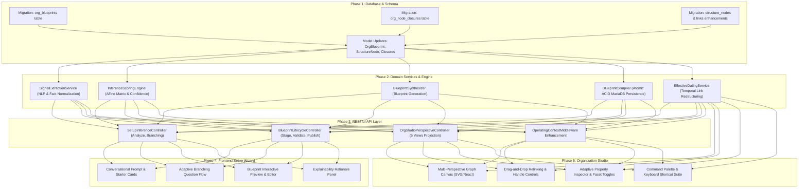

# DOCUMENT 10 — Implementation Master Plan & Acceptance Specification

**Domain:** EnterpriseCore / OrganizationGovernance  
**System:** ACCORE ERP  
**Status:** Approved Master Implementation Plan & Acceptance Contract  
**Author:** Technical Lead & QA / Validation Architect  

---

## 1. Executive Summary

This document establishes the definitive, phased engineering roadmap and formal acceptance criteria for delivering the **Organizational Architecture & Organization Studio** in ACCORE ERP.

It translates the domain modeling, taxonomies, inference algorithms, blueprint systems, UX designs, and technical architecture established in Documents 01 through 09 into an **actionable, low-risk, backward-compatible implementation sequence**.

The plan is divided into **5 cohesive phases**:
1. **Phase 1: Database & Model Harmonization** (Transitive closure table, blueprint tables, schema enhancements)
2. **Phase 2: Core Domain Services & Inference Engine** (Semantic extraction, scoring matrix, blueprint synthesizer, compiler)
3. **Phase 3: Backend RESTful v2 API Layer** (Inference, blueprint staging, studio perspectives, temporal restructuring)
4. **Phase 4: Frontend Intelligent Setup Experience** (Conversational onboarding wizard, adaptive branching, blueprint preview)
5. **Phase 5: Next-Gen Organization Studio Workspace** (Canvas, 5 perspectives, drag-and-drop manipulation, property inspector)

Every phase is protected by strict automated verification and validated against **8 comprehensive end-to-end acceptance scenarios (Scenarios A through H)**.

---

## 2. Dependency Graph & Phase Breakdown

---

## 3. Detailed Work Breakdown Structure (WBS)

### Phase 1: Database & Model Harmonization (Week 1–2)
- **Task 1.1:** Write migration `2026_10_01_000001_create_org_blueprints_table.php`.
- **Task 1.2:** Write migration `2026_10_01_000002_create_org_node_closures_table.php`.
- **Task 1.3:** Write migration `2026_10_01_000003_enhance_structure_nodes_and_links_table.php` (adding `facets_json`, `plane_type`, `legal_entity_uuid`).
- **Task 1.4:** Update Eloquent models (`StructureNode`, `StructureLink`, `OrgBlueprint`, `OrgNodeClosure`) with casts, relations, and scopes.
- **Task 1.5:** Implement `OrgNodeClosureService` to maintain transitive graph closures automatically on link creation/update.

### Phase 2: Domain Services & Inference Engine (Week 3–4)
- **Task 2.1:** Implement `SignalExtractionService` to parse natural language descriptions into typed signal vectors.
- **Task 2.2:** Implement `InferenceScoringEngine` executing the affine weighting matrix and confidence calculations.
- **Task 2.3:** Implement `BlueprintSynthesizer` transforming high-affinity archetypes into fully formed `OrganizationBlueprint` instances.
- **Task 2.4:** Implement `BlueprintCompiler` executing atomic ACID transactions that map temporary blueprint IDs to production database rows.
- **Task 2.5:** Implement `EffectiveDatingService` handling time-sliced edge mutations without touching historical records.

### Phase 3: RESTful v2 API Layer (Week 5)
- **Task 3.1:** Create `SetupInferenceController` (`POST /api/v2/setup/inference/analyze`).
- **Task 3.2:** Create `BlueprintLifecycleController` (`stage`, `update`, `validate`, `publish`).
- **Task 3.3:** Create `OrgStudioPerspectiveController` serving the 5 distinct perspectives (`legal`, `facilities`, `workforce`, `financial`, `matrix`).
- **Task 3.4:** Harden `OperatingContextService` to support fast multi-context switching and redis-tagged caching.

### Phase 4: Frontend Intelligent Setup Experience (Week 6–7)
- **Task 4.1:** Build `SetupConversationalPrompt.tsx` with free-text input and archetype starter cards.
- **Task 4.2:** Build `AdaptiveQuestionStepper.tsx` supporting progressive disclosure, "decide later", and micro-help.
- **Task 4.3:** Build `BlueprintReviewCard.tsx` with direct node renaming, facet toggling, and explainability narrative.
- **Task 4.4:** Wire setup wizard to backend API with optimistic auto-saving and full undo/redo state.

### Phase 5: Organization Studio Visual Workspace (Week 8–9)
- **Task 5.1:** Build interactive Canvas engine (`OrgStudioCanvas.tsx`) supporting smooth pan/zoom, node rendering, and smart line routing.
- **Task 5.2:** Implement the 5 Perspective View Switcher (`Legal`, `Facilities`, `Workforce`, `Financial`, `Matrix`).
- **Task 5.3:** Build Property Inspector (`OrgUnitInspector.tsx`) with facet controls and position management.
- **Task 5.4:** Implement drag-and-drop relinking with real-time topology checking and future effective date scheduling.
- **Task 5.5:** Add Command Palette (`Cmd+K`) and full keyboard navigation suite.

---

## 4. Formal Acceptance Specification: Scenarios A through H

The completed system must pass all 8 real-world enterprise test scenarios:

### Scenario A: A Tiny Company Creates Its Organization in Minutes
- **User Prompt:** *"I have a boutique design studio in Riyadh with 4 graphic designers."*
- **Acceptance Criteria:**
  1. System asks no more than 3 simple questions (Currency, Company Name, Operating Office).
  2. System recommends **Simple Linear Hierarchy (Grade 1)** with confidence $> 90\%$.
  3. System generates 1 Legal Entity, 1 Office Facility, and 1 direct reporting line.
  4. Blueprint review explains: *"Simple model for a single-office studio with direct collaboration."*
  5. User clicks "Confirm & Publish" $\to$ entire setup completes in $< 3$ minutes.
  6. Operating context is immediately active and ready to create invoices.

### Scenario B: A Multi-Branch Retailer Creates a Branch-Based Structure
- **User Prompt:** *"We are a fashion retailer with 6 shops across Riyadh, Jeddah, and Dammam, 1 central warehouse, and an online store."*
- **Acceptance Criteria:**
  1. System infers **Geographic Multi-Branch Archetype (Grade 3)**.
  2. Synthesizes 1 Central Warehouse (`PLANT` + Logistics Facet) + 6 Store Branches (`OrgUnit` + Commercial Facet + POS terminals) + 1 Online Store.
  3. Automatically configures inventory replenishment links from Central Warehouse to all 6 stores.
  4. Assigns individual Profit Centers to each store for location profitability tracking.
  5. Total setup time $< 5$ minutes.

### Scenario C: A Multinational Organization Creates a Geographic + Functional Structure
- **User Prompt:** *"We are an industrial conglomerate with legal entities in Saudi Arabia and the UAE. In Saudi Arabia, we operate a factory in Jubail and a sales office in Riyadh. In the UAE, we operate a distribution hub in Dubai. Finance is centralized at group headquarters."*
- **Acceptance Criteria:**
  1. System infers **Multi-Entity Holding + Functional Geographic Structure (Grade 5)**.
  2. Creates 2 distinct `LegalEntity` nodes (`COMP_CODE`) under 1 `CLIENT` root, with SAR and AED currencies.
  3. Enforces country boundary invariant: Jubail factory binds to Saudi entity; Dubai hub binds to UAE entity.
  4. Establishes Centralized Finance Controlling Area spanning both entities for group consolidation.
  5. Invoices issued in UAE balance to AED; invoices in KSA balance to SAR and generate ZATCA QR codes.

### Scenario D: A Project-Driven Company Creates Project Teams and Matrix Relationships
- **User Prompt:** *"We are an engineering consultancy of 40 people. Engineers report to technical department heads (Mechanical, Electrical, Civil) for line management, but work on multi-year client infrastructure projects under Project Managers."*
- **Acceptance Criteria:**
  1. System infers **Balanced Matrix Structure (Grade 4)**.
  2. Synthesizes permanent functional departments (Mechanical, Electrical, Civil) housing core positions.
  3. Synthesizes project structures (`WBS_ELEMENT`) for active client contracts.
  4. Allows engineers to have dual reporting: Primary `line_management` link to Discipline Head + Secondary `project_member` link to Project Manager.
  5. Leave approvals route to Discipline Head; project timesheet approvals route to Project Manager.

### Scenario E: A Manufacturing Company Creates Factories, Warehouses, and Departments
- **User Prompt:** *"We manufacture plastic packaging. We have a factory plant in Yanbu, a raw materials warehouse, a finished goods depot, and departments for Production, Quality, Maintenance, and Sales."*
- **Acceptance Criteria:**
  1. System infers **Manufacturing / Plant Operations Archetype (Grade 4)**.
  2. Synthesizes 1 `PLANT` (Yanbu Factory) with attached raw material and finished goods `STORAGE_LOC` sub-nodes.
  3. Creates operational cost centers for Production, Quality, and Maintenance rolling up to the Plant.
  4. Activates Manufacturing capability: BOM, Work Centers, and Inventory Costing.
  5. Direct linkage between physical inventory warehouse and production work centers verified.

### Scenario F: An Existing Company Restructures Without Corrupting Historical ERP Data
- **Context:** Company operated with Branch Khobar reporting to Eastern Region from 2024 to 2026. On 2026-09-01, Khobar is transferred to report to the Central Omnichannel Division.
- **Acceptance Criteria:**
  1. Admin opens Organization Studio, drags Khobar Branch to Central Division, and selects effective date `2026-09-01`.
  2. System time-slices the link: Old link gets `valid_to = 2026-08-31`; new link gets `valid_from = 2026-09-01`.
  3. Running a 2025 financial P&L report for Eastern Region still includes Khobar Branch historical transactions (Historical Integrity preserved).
  4. Running a 2026 Q4 report includes Khobar Branch under Central Division (Current Reality reflected).
  5. Zero journal entries are re-posted or modified.

### Scenario G: An Administrator Changes the Generated Recommendation Before Publishing
- **Context:** System recommends a centralized purchasing organization for a 3-branch chain, but the owner prefers independent branch procurement.
- **Acceptance Criteria:**
  1. In the Blueprint Review screen, user clicks "Customize Purchasing".
  2. User changes purchasing model from "Centralized" to "Decentralized per Branch".
  3. System updates blueprint: creates independent `PURCH_ORG` nodes for each store and marks them `is_user_locked = true`.
  4. User answers an additional unrelated question: system merges changes without overwriting the user's custom purchasing configuration.
  5. Compilation publishes the customized model accurately.

### Scenario H: An Administrator Later Modifies the Organization Without Rebuilding Everything
- **Context:** Six months after initial setup, the company acquires a competitor and opens 2 new branches and 1 warehouse.
- **Acceptance Criteria:**
  1. Admin navigates to `/01-enterprise-core/organization-governance/org-structure/org-hierarchy` (Organization Studio).
  2. Clicks `+ Add Facility`, types "Dammam Showroom", toggles POS Facet.
  3. System dynamically provisions new `structure_nodes`, `warehouses`, `pos_terminals`, and `profit_centers` records via atomic delta transaction.
  4. Existing operational contexts, active sales terminals, and historical ledger remain completely undisturbed and continuous.
  5. The new branch immediately appears in the context switcher for authorized cashiers.

---

## 5. Backward Compatibility & Migration Strategy

For existing ACCORE ERP deployments:
1. **Zero-Downtime Schema Migrations:** All schema additions (`facets_json`, `org_node_closures`, `org_blueprints`) are nullable or default-valued, ensuring existing Laravel migrations and queries run without failure.
2. **Automated Graph Backfill Seeder:** A migration script (`2026_10_01_000004_backfill_closures_and_facets.php`) scans existing `structure_nodes` and `structure_links` and builds the transitive closure table automatically.
3. **Legacy Template Preservation:** Existing legacy template calls to `OrganizationTemplateService::apply()` are rerouted through the new `BlueprintCompiler`, guaranteeing that existing automated test suites (`FactoryCalendarApiTest`, etc.) continue passing with $100\%$ green status.
