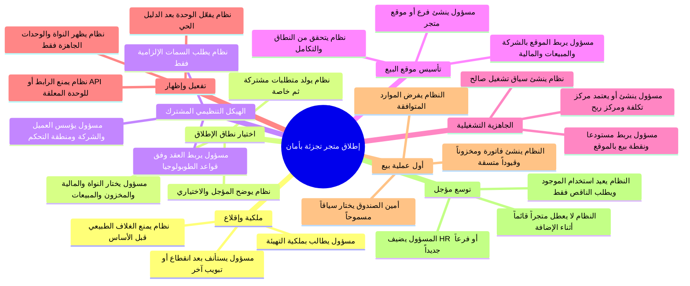
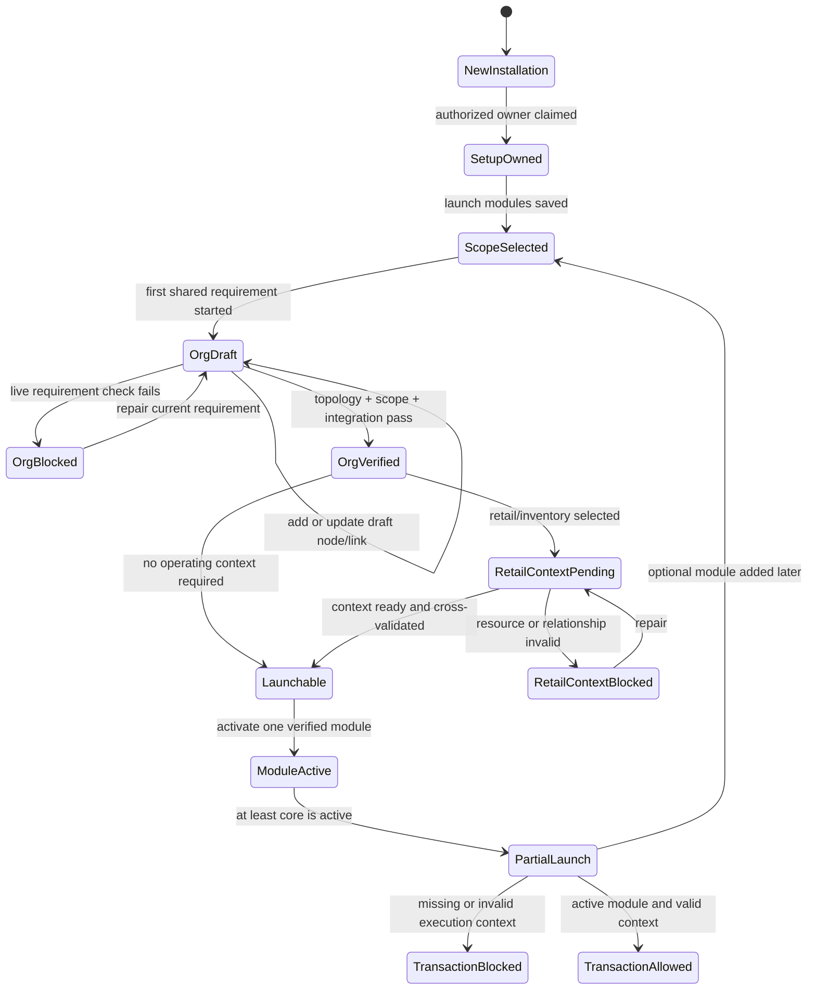

# مراجعة نقدية لتهيئة متجر تجزئة وفق مبدأ «الهيكل التنظيمي أولاً»

**الإصدار:** 1.0  
**المنظور:** منشأة تجزئة تريد بدء البيع من فرع واحد، بمستودع ونقطة بيع ومحاسبة، مع تأجيل الموارد البشرية والتصنيع والمشاريع.  
**القرار:** الاتجاه المعتمد صحيح، لكن الكود الحالي لا يحقق بعد الحوكمة المطلوبة. الواجهة الموجّهة وحدها ستجمل المسار، لكنها لن تمنع بيعاً بلا سياق تشغيلي، أو ظهور وحدة مفعلة افتراضياً، أو تجاوز التهيئة عبر رابط/API مباشر.

## 1. الحكم التنفيذي

إذا لعبنا دور متجر «رِواق للتجزئة»، فإننا لا نحتاج في أول تشغيل إلى فتح شجرة SAP كاملة أو إلى إنشاء كل الوحدات التنظيمية الممكنة. نحتاج إلى تأسيس الحد الأدنى الذي يجعل أول فاتورة صحيحة وقابلة للتتبع: منشأة قانونية، نطاق تحكم، فرع/موقع بيع، منظمة مبيعات وقناة مناسبة، مركز تكلفة ومركز ربح مرتبطان، مستودع، نقطة بيع، وسياق تشغيل صحيح للمستخدم/الفرع.

> **القاعدة الحاسمة:** لا يكون زر «بدء البيع» أو رابط المبيعات أو واجهة إنشاء الفاتورة قابلاً للاستخدام إلا عندما يستطيع الخادم إثبات أن سياق البيع صالح ومترابط مع الهيكل التنظيمي الحالي. لا يكفي أن المستخدم أنهى شاشات wizard، ولا أن القائمة أخفت الرابط.

المشروع يملك مواد بناء قوية: أنواع العقد التنظيمية، قواعد الربط، التحقق، عقد الروابط، مزامنة المراكز، جاهزية سياق التشغيل، ومتحكمات المجال. العجز ليس في غياب المحرك؛ العجز في أن **حالة الإطلاق التشغيلي لم تصبح قراراً مركزياً**. اليوم تظل الوحدات مفعلة افتراضياً، والقائمة تتبع RBAC فقط، وواجهة المبيعات تقبل سياقاً مالياً/تشغيلياً فارغاً.

| النتيجة | التقييم |
| --- | --- |
| إعادة ترتيب الواجهات لا إعادة بناء محرك الهيكل | **صحيحة ومطلوبة**. |
| كشف الوحدات بعد تحقق متطلباتها التنظيمية | **صحيح، لكنه غير منفذ حالياً**. |
| استخدام endpoints القائمة كمصدر للبيانات والتحقق | **صحيح، بشرط إضافة منسق/سياسة لا API موازية للعقد والروابط**. |
| الاعتماد على `Module.is_active` وحده | **غير كافٍ**: يجب فصل الاختيار عن التفعيل وإضافة دليل جاهزية قابل للإعادة. |
| اعتبار `OperatingContext` الحالي دليلاً كافياً لبدء البيع | **غير صحيح حالياً**: لا تستهلكه عملية البيع ولا تفرضه. |

## 2. تمثيل المنشأة المرجعية

يفترض هذا التحليل سيناريو إطلاق واقعي ومقصود أن يكون صغيراً:

| البند | اختيار متجر «رِواق للتجزئة» |
| --- | --- |
| نطاق الإطلاق الآن | إدارة أساسية، مالية أساسية، مخزون، ومبيعات تجزئة. |
| مؤجل | HR، الرواتب، التصنيع، المشاريع، ذكاء الأعمال المتقدم. |
| الكيانات عند البدء | شركة واحدة، فرع/موقع بيع واحد، مستودع واحد، نقطة بيع واحدة. |
| نمط البيع | نقدي وآجل عند الحاجة، منتجات مخزنية، خصم مخزون وتسجيل مالي. |
| الأدوار الأولى | مسؤول التهيئة، محاسب، مدير متجر، أمين صندوق. |
| النتيجة التي لا تقبل التنازل | أول فاتورة ترتبط قسراً بمستودع وPOS ومركز تكلفة ومركز ربح وموقع تنظيمي صالح. |

## 3. شجرة قصص المستخدم المثالية

تبدأ الشجرة من «إطلاق متجر تجزئة بأمان»، وتتفرع إلى قصص قابلة للتنفيذ والاختبار. لا تمثل تبويبات الواجهة، بل نتائج أعمال وحالات صحيحة.



### 3.1 الملحمة A: ملكية وإقلاع التهيئة

**US-A1 — دخول محكوم.** بصفتي مسؤول تهيئة، أريد أن أدخل إلى رحلة تأسيس المتجر بدلاً من لوحة النظام عندما لا توجد منشأة صالحة للإطلاق، لكي لا أنشئ بيانات تشغيلية قبل الأساس. 

**US-A2 — استئناف موثوق.** بصفتي مسؤولاً، أريد أن أرى نفس المتطلب التالي الذي أكده الخادم بعد إغلاق المتصفح أو فقد الشبكة، لكي لا أعيد إنشاء كيان أو مركز أو مستودع بالخطأ.

**US-A3 — حماية التشغيل القائم.** بصفتي مسؤولاً عن متجر يعمل فعلاً، أريد أن يميز النظام التثبيت القائم عن التثبيت الجديد، لكي لا يعيد فتح bootstrap أو يخفي وحدات مستخدمة.

| القبول | حالة النجاح | حالات الرفض/التعافي |
| --- | --- | --- |
| الغلاف الطبيعي | لا يرسم قبل اجتياز متطلبات الإطلاق الإلزامية. | يعاد إلى `/setup` مع المتطلب التالي وسبب الحظر. |
| تبويبان | تغيير التهيئة في أحدهما لا يكتب فوق الآخر. | يظهر تعارض نسخة ويعاد جلب الحالة؛ لا تتكرر المخرجات. |
| تثبيت قائم | لا يفرض first-run جديداً. | يدخل وضع تحقق/ترحيل مقروء لا يدمر البيانات. |

### 3.2 الملحمة B: اختيار نطاق الإطلاق

**US-B1 — اختيار قابل للفهم.** بصفتي مالك متجر، أريد اختيار «تجزئة + مخزون + مالية» لا أن أتعامل مع قائمة مئات من الشاشات، لكي أعرف ما سأشغله اليوم.

**US-B2 — مخطط متطلبات.** بصفتي مالكاً، أريد أن يشرح النظام أن هذه الحزمة ستتطلب موقع بيع ومخزوناً ومراكز مالية، وأن HR ليس مطلوباً، لكي أتخذ قراراً واعياً.

**US-B3 — تأجيل بلا تسريب.** بصفتي مالكاً، أريد تأجيل HR والتصنيع مع بقائهما غائبين من النظام، لكي لا يجد الموظفون شاشات غير جاهزة أو يوهمهم النظام بأنها قابلة للتشغيل.

| المخرج | الحالة | القاعدة |
| --- | --- | --- |
| وحدة غير مختارة | `not_selected` | لا تظهر في أي تنقل أو بحث أو وجهة. |
| وحدة مختارة ومعلقة | `selected_pending_org_setup` | تظهر في مركز الإطلاق للمسؤول فقط، ولا تصبح route/API تشغيلية. |
| وحدة مكتملة | `active` | تظهر فقط بعد دليل جاهزية حي وصلاحية المستخدم. |

### 3.3 الملحمة C: الهيكل التنظيمي المشترك

**US-C1 — تأسيس القانوني والمالي.** بصفتي مسؤولاً، أريد إنشاء العميل/المنشأة، رمز الشركة، ومنطقة التحكم مع السمات الضرورية فقط، لكي أملك نطاقاً قانونياً ومالياً صالحاً.

**US-C2 — تأسيس الموقع.** بصفتي مسؤولاً، أريد إنشاء موقع المتجر (عادة Plant في النموذج الحالي) وربطه برمز الشركة، لكي يصبح للمخزون والبيع نطاق تشغيل حقيقي.

**US-C3 — تأسيس البيع.** بصفتي مسؤولاً، أريد إنشاء منظمة المبيعات وقناة التجزئة وربط الموقع بها، لكي لا تنفذ مبيعات في فرع غير منسوب إلى تنظيم بيع.

**US-C4 — تأسيس الإسناد المالي.** بصفتي مسؤولاً، أريد إنشاء/اعتماد مركز تكلفة ومركز ربح وربطهما بالسياق التنظيمي، لكي لا تنشأ معاملات بلا مسئولية مالية.

**US-C5 — النشر بعد التحقق.** بصفتي مسؤولاً، أريد أن تبقى العناصر الجديدة مسودة حتى ينجح التحقق الخاص بالإطلاق، لكي لا تصبح عقدة ناقصة مورداً تشغيلياً فعالاً.

### 3.4 الملحمة D: السياق التشغيلي لموقع البيع

**US-D1 — موقع تشغيل محدد.** بصفتي مدير متجر، أريد تكوين مستودع ونقطة بيع وربطهما بموقع المتجر ومركزيه الماليين، لكي تمثل كل فاتورة المكان الذي صدرت منه بدقة.

**US-D2 — سياق لا يقبل التناقض.** بصفتي مسؤولاً، أريد أن يرفض النظام POS لمستودع آخر أو مركز تكلفة غير متصل بالموقع، لكي لا تنشأ فاتورة بتركيبة غير ممكنة تنظيمياً.

**US-D3 — مستخدم تشغيلي.** بصفتي أمين صندوق، أريد الحصول على سياق متجر مسموح أو اختياره مرة واحدة، لكي لا أضطر إلى إدخال أربعة معرفات فنية في كل فاتورة.

**US-D4 — متجر ثانٍ لاحقاً.** بصفتي مالكاً، أريد إضافة فرع ومستودع وPOS جديدين لاحقاً دون تغيير سياق الفرع الأول أو تعطيل بيعه.

### 3.5 الملحمة E: التفعيل، الإتاحة، وأول بيع

**US-E1 — كشف تدريجي صادق.** بصفتي مستخدماً، أريد رؤية المبيعات والمخزون فقط عندما يمكنهما العمل فعلاً، لكي لا أصل إلى صفحة فارغة أو نموذج لا يكتمل.

**US-E2 — منع حقيقي.** بصفتي مسؤول أمن، أريد أن يفشل الطلب المباشر إلى API المبيعات إذا لم تكن الوحدة أو سياق المتجر جاهزاً، لكي لا يتجاوز مستخدم الإخفاء البصري.

**US-E3 — أول فاتورة متسقة.** بصفتي أمين صندوق، أريد أن يربط النظام الفاتورة بالسياق التشغيلي المعتمد وأن يرفض المدخلات المتعارضة، لكي تكون آثار المخزون والتكلفة والمالية قابلة للتدقيق.

**US-E4 — إضافة وحدة لاحقة.** بصفتي مسؤولاً، أريد إضافة HR بعد الإطلاق عبر نفس أسلوب المتطلبات، لكي يستخدم النظام الشركة الموجودة ويطلب فقط عناصر HR الناقصة.

## 4. شجرة الحالات والتدفق المثالي

لا يكفي وضع «اكتملت الواجهة». يلزم فصل حالات التهيئة، الهيكل، الوحدة، والسياق التشغيلي والمعاملة.



### 4.1 تدفق متجر التجزئة المقترح

| الترتيب | قرار المستخدم أو النظام | الدليل الخلفي المطلوب | لا يسمح بالانتقال إذا |
| --- | --- | --- | --- |
| 1 | المسؤول يختار Finance, Inventory, Sales/Retail. | حفظ `setup.selected_modules` مع revision. | لا توجد حزمة اختيار أو تعارض غير محلول. |
| 2 | النظام يحسب المتطلبات المشتركة. | Registry يقرأ meta types + topology rules الحالية. | registry لا يستطيع تفسير نوع أو رابط مطلوب. |
| 3 | المسؤول ينشئ/يعتمد CLIENT، COMP_CODE، CONTROLLING_AREA. | عقد وروابط صحيحة، وسمات إجبارية مكتملة. | currency/chart of accounts أو روابط الشركة الأساسية مفقودة. |
| 4 | المسؤول ينشئ موقع المتجر PLANT. | PLANT في مسودة مع country/calendar ثم رابط إلى COMP_CODE يمر بقيود التطابق. | بلد الموقع لا يطابق الشركة أو السمة الإجبارية ناقصة. |
| 5 | المسؤول ينشئ SALES_ORG وDISTR_CHANNEL. | روابط sales إلى company/channel، وربط plant-to-sales عند طلب التوزيع. | نطاق البيع لا يحل إلى الشركة/الموقع الصحيح. |
| 6 | المسؤول ينشئ/يعتمد PROFIT_CENTER وCOST_CENTER. | مزامنة ذهاب وإياب محددة المصدر، وروابط إلى CONTROLLING_AREA. | المركز موجود لكن غير مرتبط أو حالته غير متطابقة. |
| 7 | المسؤول ينشئ/يعتمد warehouse وPOS. | موجودان ونشطان ومرتبطان بنفس org node والمراكز والسياق. | warehouse/POS/centres مختلفة النطاق أو غير نشطة. |
| 8 | النظام يتحقق قبل التفعيل. | integrity + scope + integration + operating readiness، مع سياسة retail blocker. | يوجد ERROR أو WARNING مصنف حاجب لحزمة التجزئة. |
| 9 | النظام يفعّل الوحدة. | معاملة واحدة تغيّر readiness/activation وتسجل audit. | تغيرت البنية منذ التحقق أو تعارضت revision. |
| 10 | أمين الصندوق ينفذ أول فاتورة. | resolver يثبت سياق تشغيل صالح ومتماسك ويحقن معرفاته. | السياق غير موجود أو لا يطابق الوحدة/المستخدم/الفرع. |

## 5. مكامن العجز والأخطاء المثبتة في الكود الحالي

### عجز حرج: النظام قادر اليوم على بيع بلا سياق متجر

الطلب الحالي لإنشاء الفاتورة يجعل `warehouse_id` و`pos_terminal_id` و`cost_center_id` و`profit_center_id` اختيارية [1]. كما أن خدمة البيع تمرر هذه الحقول إلى إنشاء الفاتورة بقيم `null` عند غيابها، ثم تستمر في معالجة المنتجات وتكلفة المخزون [2]. لذلك فإن مشروع wizard، حتى لو كان ممتازاً، لن يحقق وعد «المتجر لا يعمل قبل تهيئته» ما لم تصبح هذه التبعية مفروضة في مسار المعاملة نفسه.

| المعرّف | الفجوة | الدليل الحالي | الأثر على متجر تجزئة | الخطورة |
| --- | --- | --- | --- | --- |
| G-01 | متطلبات بيع اختيارية | حقول الموقع والمراكز والـPOS `nullable` في عقد الفاتورة. [1] | فاتورة ومخزون/تكلفة بلا إسناد لمتجر أو مركز مالي. | **حرجة** |
| G-02 | عدم استهلاك `OperatingContext` في البيع | الخدمة تقرأ IDs الطلب مباشرة ولا تحل/تتحقق من سياق تشغيل. [2] | يستطيع العميل إرسال IDs متعارضة أو فارغة؛ لا معنى لبطاقة readiness. | **حرجة** |
| G-03 | كل الوحدات نشطة افتراضياً | migration تجعل `modules.is_active` افتراضياً `true`، وseeder لا يطفئها. [3] | تظهر الوحدات قبل الاختيار أو التهيئة في تثبيت جديد. | **حرجة** |
| G-04 | التنقل يتبع RBAC فقط | SideNavigationBar يفلتر عبر `canAccess` فقط. [4] | الموظف يكتشف وحدات مختارة/غير جاهزة بمجرد امتلاك صلاحية. | **عالية** |
| G-05 | الغلاف لا يمنع الدخول | MainLayout ينشر إشعار عدم جاهزية لكنه يرسم الغلاف والقائمة. [5] | المستخدم يرى النظام ويتحرك فيه قبل إكمال التأسيس. | **عالية** |
| G-06 | مسارات البيع لا تعرف حالة الوحدة | routes التجارية تعتمد `can:sales,*` فقط. [6] | الرابط أو API المباشر يتجاوز القائمة وwizard. | **حرجة** |
| G-07 | العقد تصبح نشطة فور الإنشاء | `createNodeWithLink` يضبط `status` إلى `active` افتراضياً. [7] | تظهر عناصر هيكل نصف مكتملة في حل النطاق قبل اكتمال رحلة التأسيس. | **عالية** |
| G-08 | تحذيرات قد تكون حواجز إطلاق | العقد المعزولة والأبوية المفقودة تصنف WARNING لا ERROR. [8] | قد يعلن الفحص «لا أخطاء» رغم أن موقع المتجر غير مربوط كما يلزم. | **عالية** |
| G-09 | لا يوجد تعريف موحد لمتطلبات الوحدة | أنواع وقواعد عامة قوية، لكن لا يوجد registry يربط وحدة sales/inventory بما يلزمها. | لا يعرف النظام ما يجب أن يطلبه أو ما يعد حجباً لكل وحدة. | **عالية** |
| G-10 | مصدر حقيقة مزدوج للمراكز | توجد عقد COST/PROFIT ومراكز مالية مستقلة مع مزامنة في الاتجاهين. [9] | قد ينشأ مركز نشط لكن غير مربوط، أو عقدة ومركز بحالات مختلفة. | **عالية** |
| G-11 | سياق التشغيل شخصي افتراضياً | `operating_contexts` مفهرس بـ`user_id` و`is_default`؛ سياق المنشأة/المتجر ليس مفهوماً صريحاً. [10] | أمين صندوق جديد قد لا يجد السياق، أو قد يرث/يختار سياقاً غير مناسب. | **عالية** |
| G-12 | `configure` تحديث صامت حسب code | المستودع وPOS ينشآن/يحدثان بـ`updateOrCreate` على code فريد. [11] | إعادة التهيئة قد تعدل مورداً قائماً بلا قرار اعتماد/ملكية صريح. | **عالية** |
| G-13 | تحديث الإعدادات واسع بلا عقد setup خاص | Action يمر على جميع المفاتيح ويحدّثها مباشرة. [12] | تضارب تبويبات أو مفتاح غير متوقع أو حذف دلالي لحالة التهيئة. | **متوسطة عالية** |
| G-14 | اختبارات الجاهزية سعيدة ومحدودة | الاختبار يثبت إنشاء سياق و`ready` فقط. [13] | لا إثبات لرفض البيع بلا سياق، ولا للتعارض، ولا للروابط، ولا للمتاجر المتعددة. | **عالية** |

### استنتاج تشغيلي مهم

المشكلة ليست أن endpoints الموجودة «غير صحيحة». المشكلة أن كل endpoint يثبت حقيقة محلية، بينما الإطلاق يحتاج **دليلاً مركباً**. فحص السلامة يعرف سمات وروابط عامة؛ فحص التكامل يعرف ارتباط المراكز؛ فحص سياق التشغيل يعرف المستودع/POS/المراكز؛ ولكن لا توجد حالياً سياسة تقول: «لهذه الحزمة Retail Inventory Finance، هذه النتائج الأربعة مجتمعة شرط لتفعيل sales». هذه هي طبقة البناء الناقصة.

## 6. الاستدراكات التصميمية المطلوبة

### 6.1 لا تنشئ محركاً جديداً: أنشئ سياسة جاهزية مركبة

ينشأ `ModuleReadinessPolicy`/`ModuleSetupRequirementRegistry` داخل Enterprise Core. لا ينشئ عقداً أو روابط أو مستودعات. وظيفته قراءة الأدلة الموجودة وتحويلها إلى نتيجة حتمية:

```text
RetailSalesReady =
  Sales module is selected
  AND required organization nodes/links are active and valid
  AND scope resolution contains the expected company/store/sales dimensions
  AND required cost/profit centers are active and linked
  AND operating context is ready and internally consistent
  AND no retail-blocking integrity/integration finding exists
```

يتلقى registry `module_key` وملف تشغيل (مثل `retail_inventory_finance`) ويعيد: المتطلبات المشتركة، متطلبات الوحدة، الفاحص الذي يثبت كل متطلب، وما إذا كان أي warning حاجباً. يبقى مصدر كل حقيقة endpoint أو Action حالي؛ registry لا يكرر بيانات المجال.

### 6.2 افصل المسودة عن النشر التشغيلي

الآن تصبح العقد نشطة مباشرة. في مسار التهيئة فقط، تنشأ العقد والروابط الجديدة بـ`draft`، وتستخدم عملية تحقق مسموح لها بقراءة المسودة. بعد نجاح readiness policy، تنشر معاملة واحدة العناصر المطلوبة إلى `active` وتفعّل الوحدة. لا تعرض المسودة في النطاق التشغيلي ولا تستخدم في البيع.

هذا يتطلب استدراكاً صغيراً في API الحالي، لا محركاً جديداً: دعم خيار setup-authorized لقراءة النطاق للمسودات أو Validator داخلي يقرأ المسودات، ثم استخدام `bulk-status-update` أو Action نشر محكوم بعد اكتمال الشروط. لا يجب أن يستطيع المستخدم تحويل مجموعة عشوائية إلى active دون فحص حزمة الوحدة.

### 6.3 اجعل سياق البيع مدخلاً منضبطاً لا أربع حقول اختيارية

مسار البيع يجب أن يتحول من قبول أربع معرفات اختيارية إلى أحد النموذجين الآتيين، ويُفضل الأول:

| النموذج | السلوك | القرار |
| --- | --- | --- |
| `operating_context_id` أو resolver من جلسة المستخدم | طلب البيع يمرر السياق المعتمد فقط، والخادم يجلب warehouse/POS/cost/profit ويثبت اتساقها مع org node. | **المفضل**. |
| حقول منفصلة مع تحقق متقاطع إلزامي | تبقى IDs ظاهرة، لكن يجب أن تكون جميعها مطلوبة للخطة retail، وأن يثبت الخادم أنها تنتمي لنفس الموقع والسياق. | مقبول فقط كمرحلة توافق قصيرة. |

ينشأ `SalesExecutionContextResolver` يستدعي/يستفيد من `OperatingContextService`، ويفرض أنه: نشط، مرتبط بالمستخدم أو موقعه المسموح، warehouse/POS نشطان، terminal يتبع warehouse، المراكز نشطة، وكلها تتبع العقدة التنظيمية الصحيحة. ثم يحقن المعرّفات في أمر البيع؛ لا يثق بالقيم القادمة من العميل.

### 6.4 اجعل السياق تشغيلياً على مستوى الموقع ثم قابل للتخصيص للمستخدم

السياق العالمي/الموقعي لا ينبغي أن يساوي التفضيل الشخصي. يمكن إعادة استخدام جدول `operating_contexts` الحالي من خلال دلالة واضحة: سجل `user_id = null` هو سياق موقع معتمد، وسجل مستخدم اختياري يختار واحداً من السياقات المعتمدة. يجب تعديل configure/select بحيث لا ينشئ أمين صندوق موقعاً جديداً، ولا يعدل كود مستودع قائم بلا اعتماد. إذا تطلب التوسع لاحقاً مزيداً من الوضوح، يضاف حقل scope/approval صغير إلى نفس النموذج؛ لا جدول عالم موازٍ.

### 6.5 عالج المصدر المزدوج للمراكز بقرار واحد في كل مسار

في retail setup، يحدد registry مصدر إنشاء كل مركز. إما:

1. ينشئ المسؤول عقدة COST/PROFIT في الهيكل، ثم يستدعي sync-node لإنشاء/تحديث المركز المالي؛ أو
2. ينشئ المركز المالي أولاً، ثم يستدعي sync-cost/profit لإنتاج عقدته.

لا يجب إظهار الخيارين لنفس المتطلب في الواجهة الأولى. يوصى بالمسار الأول لأنه يجعل الهيكل التنظيمي هو نقطة البداية المتفقة مع الاستراتيجية. بعد ذلك يصبح `GET /org-integration/status` شرطاً لحزمة التجزئة، وتصبح warnings مثل `unlinked_cost_center` و`status_mismatch` حواجز تشغيل لهذه الحزمة، ولو بقيت warnings عامة في شاشة الحوكمة.

### 6.6 التفعيل والإظهار قراران ذريان وقابلان للعكس بأمان

في تثبيت جديد تبدأ الوحدات غير النواتية بـ`is_active = false`. يحفظ `setup.selected_modules` الاختيار فقط. بعد أن ينجح registry، تنفذ معاملة التفعيل التي: تعيد الفحص، تنشر العقد المطلوبة، تحدث `Module.is_active`، تحدث لقطة الإتاحة، وتسجل التدقيق. إذا فشل أي جزء، لا يظهر الرابط ولا تتغير حالة الوحدة إلى active.

لا تطفئ وحدة تعمل ولها معاملات عبر إعادة التهيئة. التعطيل والرجوع عن التفعيل قصة مختلفة تتطلب فحص التبعيات والبيانات.

## 7. الخطة التفصيلية المصححة

### الحزمة P0 — منع البيع الخاطئ قبل تجميل الواجهة

هذه حزمة حجب إطلاق، ويجب تنفيذها قبل تعريف النجاح في wizard.

| المعرف | المخرج | الملفات/المواضع المحتملة | معيار الإنهاء |
| --- | --- | --- | --- |
| P0-1 | `SalesExecutionContextResolver` وPolicy للمعاملة. | `SalesService`, `StoreInvoiceRequest`, Services جديدة في Commercial/Organization Governance. | لا تنشأ فاتورة retail بلا سياق صالح أو بمكونات متعارضة. |
| P0-2 | Middleware `EnsureModuleOperational` لمسارات sales/inventory. | مجموعات routes التجارية/المخزون، Policy module availability. | أي API تشغيلي لوحدة غير فعالة يرفض سبباً مشفراً آمناً. |
| P0-3 | تغيير القيمة الابتدائية/المهاجرة لنشاط الوحدات. | migration modules + seeder + مسار ترحيل البيئات القائمة. | تثبيت جديد لا يملك sales/inventory/HR مفعلة افتراضياً؛ البيئة القائمة لا تتضرر. |
| P0-4 | عقد إعداد مضبوط بمراجعة نسخة. | `UpdateSettingsAction`, Request/Policy للـsettings. | لا يمكن لأي مفتاح أو تبويب تجاوز progress/selection بلا تحقق وتعارض نسخة. |
| P0-5 | اختبارات رفض البيع والإتاحة. | backend feature/unit tests. | اختبارات تثبت رفض null/mismatch/direct route/inactive module. |

### الحزمة P1 — سياسة متطلبات التجزئة والهيكل المسود

| المعرف | المخرج | تفاصيل البناء | معيار الإنهاء |
| --- | --- | --- | --- |
| P1-1 | `ModuleSetupRequirementRegistry`. | تعريف Retail+Inventory+Finance كبصمة requirement قابلة للاختبار، لا كشرط JSX. | يصدر قائمة مرتبة: مشتركة، خاصة بالموقع، خاصة بالسياق. |
| P1-2 | `RetailReadinessPolicy`. | يجمع topology, scope, integrity, integration, operating readiness ويصنف الحواجز. | يعيد `ready=false` مع action code دقيق لأي نقص. |
| P1-3 | مسودة ثم نشر للعقد. | خطوات setup تنشئ draft؛ checker قادر على فحصها؛ activation ينشر المطلوبة فقط. | لا تدخل عقدة غير معتمدة في scope التشغيلي. |
| P1-4 | قرار مصدر حقيقة للمراكز. | مسار node→center في wizard، مع sync محدد ومعالجة تعارض. | لا يوجد مركز نشط أو عقدة نشطة بدون رابط متبادل بعد التفعيل. |
| P1-5 | حماية تعدد المواقع. | تحقق namespace/اعتماد قبل updateOrCreate، وسياق موقع معتمد منفصل عن preference المستخدم. | إضافة متجر ثانٍ لا تغير مورد المتجر الأول ولا تخلط مستخدميه. |

### الحزمة P2 — رحلة واجهة موجّهة قابلة للتوسع

| المعرف | المخرج | تفاصيل البناء | معيار الإنهاء |
| --- | --- | --- | --- |
| P2-1 | `/setup` مستقل قبل `MainLayout`. | route gate، progress، resume، لا قائمة نظام كاملة. | الدخول الأول يمر دائماً بالرحلة ولا توجد حلقات redirect. |
| P2-2 | خطوة اختيار الإطلاق. | تعريف حزمة التجزئة وتأجيل HR إلخ بوضوح. | يظهر عدد المتطلبات الإلزامية والمتأخرة قبل الحفظ. |
| P2-3 | شاشات عقد وروابط سياقية. | CLIENT/COMP_CODE/CONTROLLING ثم PLANT ثم Sales ثم centers؛ سؤال واحد أو مجموعة صغيرة منطقية لكل شاشة. | لا يرى المستخدم MetaTypes/TopologyRules كمستند تقني. |
| P2-4 | خطوة موقع التشغيل المشروطة. | warehouse/POS/context فقط عند اختيار retail/inventory. | finance-only لا يطلبها؛ retail لا يتجاوزها. |
| P2-5 | review ثم activation. | نتائج blockers، نشر، module activation، وجهة أولى. | لا يعرض النظام قبل صحة الإطلاق الأساسي. |
| P2-6 | إضافة وحدة لاحقاً. | يعيد registry حساب الناقص من الحالة الحية. | HR لاحقاً يطلب HR nodes فقط ولا يعيد تأسيس المتجر. |

### الحزمة P3 — الإتاحة والتنقل والدعم التشغيلي

| المعرف | المخرج | معيار الإنهاء |
| --- | --- | --- |
| P3-1 | فلتر تنقل موحد بعد RBAC. | sidebar/grid/search لا تظهر إلا active+authorized. |
| P3-2 | resolver للوجهة والروابط العميقة. | رابط sales قبل الجاهزية يفتح متطلب الإصلاح، وبعدها يعود للرابط المحفوظ. |
| P3-3 | تشخيص آمن. | تتبع action code وسبب الحجب لا بيانات مبيعات أو أسرار. |
| P3-4 | وضع ترحيل. | عملية فحص للبيئات القائمة وموافقة مسؤول قبل تعديل activation. |

### الحزمة P4 — إثبات الإطلاق

| سيناريو إلزامي | الإثبات |
| --- | --- |
| تثبيت جديد Retail + Inventory + Finance | لا يظهر shell؛ يبنى الهيكل؛ لا تتفعل المبيعات قبل موقع التشغيل؛ أول فاتورة صحيحة. |
| تثبيت جديد Finance فقط | لا يطلب مستودعاً/terminal، ولا يظهر sales/inventory. |
| رابط `/sales` قبل الجاهزية | يعاد لمسار setup ولا يعمل API حتى مع صلاحية sales. |
| إنشاء فاتورة مع IDs فارغة أو متعارضة | `422` أو reason code؛ لا فاتورة ولا حركة تكلفة/مخزون. |
| متجر ثانٍ | سياقان صالحان؛ أمين الصندوق لا يبيع من terminal لمتجر آخر. |
| إضافة HR لاحقاً | تظهر HR فقط بعد متطلباتها؛ المبيعات تستمر دون تأثر. |
| انقطاع وتبويبان | تقدم محفوظ؛ لا تكرار عقد/مراكز/مستودع/terminal. |
| تثبيت قائم | لا يعاد bootstrap ولا تتغير الوحدات النشطة بلا قرار موثق. |

## 8. ربط الاستدراكات بالقضايا المنشورة

| القضية | الاستدراك الذي يجب إلحاقه | الأولوية |
| --- | --- | --- |
| #7 | ملحق برنامج: تعريف Retail Launch Path، وقرار أن «أول بيع صحيح» هو معيار القيمة النهائية. | P0 |
| #9 | تقييد `setup.*`، migration آمن للنشاط الافتراضي، revision/conflict، وقرار التثبيت القائم. | P0 |
| #10 | draft/publish، Retail blueprint، وقرار المصدر الواحد للمراكز ومصفوفة blockers. | P1 |
| #11 | فصل selected/active، registry، readiness policy، وتفعيل ذري بعد فحص حي. | P1 |
| #12 | تدفق متجر التجزئة خطوة بخطوة، optional deferral، واستعادة الرابط المقصود. | P2 |
| #13 | server-side enforcement، SalesExecutionContextResolver، والتنقل بعد RBAC. | P0/P3 |
| #14 | سيناريوهات رفض البيع، المتجر الثاني، HR لاحقاً، والتثبيت القائم. | P0/P4 |

## 9. نصوص التعليقات الإنجليزية الجاهزة للنشر

### Comment for Issue #7 — Program Addendum: Retail Launch Path

```markdown
## Retail Launch Path Addendum

The parent program must be judged by a real operational outcome, not by completion of setup screens: a new retail business must be able to create its first sale only after the required organization, operating-site, inventory, POS, and accounting context are demonstrably valid.

The reference launch profile is **Core + Finance + Inventory + Retail Sales** for one company and one store. HR, manufacturing, projects, and other unselected capabilities remain absent from navigation and APIs until they are deliberately added through the same guided setup model.

> A module is not ready because a user visited its setup page. It is ready only when the existing Organization Governance and operating-context foundations prove that its live organizational prerequisites are complete, and the module is then explicitly activated.

All child issues #9 through #14 must use this retail path as their primary acceptance scenario. The critical go-live proof is: a cashier cannot create a retail invoice without a validated, internally consistent operating context; after activation, the invoice is automatically bound to the approved store, warehouse, POS terminal, cost center, profit center, and organizational scope.
```

### Comment for Issue #9 — Corrective Addendum: Minimal State, Safe Defaults, and Coexistence

```markdown
## Corrective Addendum: Minimal State, Safe Defaults, and Coexistence

The first-run control plane must not rely on UI progress alone. The current `modules.is_active` default is `true`, while the module seeder does not explicitly deactivate non-core modules. A clean installation can therefore present modules before they are selected or structurally ready. This must be corrected before the guided UI is treated as a release gate.

### Required corrective work

- Define `setup.selected_modules` separately from `Module.is_active`. Selection creates work; only activation creates operational visibility.
- Change clean-install defaults so non-core modules begin inactive. Add an explicit, non-destructive migration policy for existing installations; never silently deactivate a live module.
- Restrict the existing settings update path to an allowlisted `setup.*` contract with schema validation, setup-admin authorization, and revision/conflict handling. The current generic key/value update path must not become an unguarded setup state store.
- Persist only setup decisions and server-confirmed requirement references. Do not duplicate organization, link, warehouse, terminal, center, or operating-context data.
- Make the first-run gate derive from live readiness evidence and preserve a safe existing-installation path.

### Acceptance additions

- A clean installation has no non-core retail, inventory, finance, HR, manufacturing, or project module active unless a verified activation path enables it.
- Concurrent setup writes cannot overwrite selected modules or completed-requirement state without a conflict response.
- Existing installations are classified safely before any default/module-state migration is applied.
```

### Comment for Issue #10 — Corrective Addendum: Retail Blueprint, Draft/Publish, and Center Ownership

```markdown
## Corrective Addendum: Retail Blueprint, Draft/Publish, and Center Ownership

The existing organizational engine is suitable for the guided flow, but its default node creation behavior activates nodes immediately. The integrity scan also classifies missing required parents and orphan nodes as warnings. That is appropriate for a broad governance workspace, but insufficient for a retail go-live gate.

### Retail launch blueprint

For the initial Core + Finance + Inventory + Retail Sales profile, define and validate the minimum shared path: `CLIENT -> COMP_CODE`, `CONTROLLING_AREA -> COMP_CODE`, `PLANT -> COMP_CODE`, `SALES_ORG -> COMP_CODE`, retail `DISTR_CHANNEL -> SALES_ORG`, plus the required plant-to-sales, cost-center, profit-center, and operating-site relationships. The exact requirement set must be registry-driven and read the live meta types/topology rules; it must not be hard-coded in a page component.

### Required corrective work

- In the setup path, create new organizational objects as `draft` and publish only the verified requirement set atomically with module activation. Draft objects must not resolve as operational scope.
- Add a setup-authorized draft validation path where necessary, then re-run live validation immediately before publish.
- Define retail-specific blocker severity. For the retail profile, an orphan store node, a missing parent, an unlinked cost/profit center, a status mismatch, or an unresolved store scope is a release blocker even if the generic integrity dashboard labels it `WARNING`.
- Select one source-of-truth path for cost/profit centers during setup: organization node to financial center, or financial center to organization node. Do not let first-run users create both independently.
- Preserve the existing advanced organization workspace after launch; do not expose its full tab set as the first-run experience.

### Acceptance additions

- A retail store node cannot be used by scope resolution or activation while it is a draft.
- No retail module activates if any retail-blocking organization or integration finding remains.
- The first-run flow produces one linked, status-consistent cost center and profit center for every activated retail operating site.
```

### Comment for Issue #11 — Corrective Addendum: Live Readiness and Atomic Module Activation

```markdown
## Corrective Addendum: Live Readiness and Atomic Module Activation

A module readiness model is required between the generic organization APIs and `Module.is_active`. Existing endpoints each prove a local fact; they do not currently prove that a selected retail module has a complete operational foundation.

### Required corrective work

- Implement a versioned `ModuleSetupRequirementRegistry` and `ModuleReadinessPolicy`. The policy must combine live topology, scope-context, integrity, organization-integration, and conditional operating-context evidence.
- Support three explicit states: `not_selected`, `selected_pending_org_setup`, and `active`. Only `active` is visible or operational.
- Re-evaluate live readiness immediately before activation; a previously completed frontend step is not proof after a later organization change.
- Activate a module only in a transaction that records audit evidence and updates visibility after every required check succeeds. Failure must leave the module hidden.
- Make warehouse, POS, and operating-context requirements conditional on the selected profile. Retail/inventory requires them; finance-only and HR-only paths must not request them unless their own rules require them.
- Support later module addition by evaluating the existing live structure and requesting only missing requirements.

### Acceptance additions

- A selected retail module cannot become active from settings/UI state alone.
- A later-added HR module does not re-request valid retail organization data.
- Retrying activation cannot expose a partially validated module or create duplicate operating resources.
```

### Comment for Issue #12 — Corrective Addendum: Retail User Story Flow

```markdown
## Corrective Addendum: Retail User Story Flow

The guided UI must be optimized for an operator establishing a real store, not for exploring a configuration catalogue. The reference first-run journey is: select Core + Finance + Inventory + Retail Sales; establish shared organization; establish the store location; establish retail sales scope; establish cost/profit attribution; configure the first warehouse and POS; validate; activate; then begin selling.

### Required UX behavior

- One decision or tightly related logical group per screen, followed by server-confirmed Save and continue.
- Show the next requirement and a short reason, not the full meta-type/topology/integrity workspace.
- Reuse existing node, link, scope, integration, and operating-context endpoints through typed adapters.
- Make deferred modules explicit and skippable. They remain absent from normal navigation after launch.
- On refresh, browser close, offline retry, or a second-tab change, resume from the last server-confirmed requirement and re-fetch live readiness.
- Preserve an intended protected destination, such as Sales, and return to it only after its module and operating context are valid.

### Acceptance additions

- A new retail administrator can complete the initial store path without opening advanced organization tabs or manually entering raw IDs.
- Finance-only setup never shows warehouse/POS questions.
- Retail setup never exposes the normal shell before its mandatory organization and operating-context requirements are satisfied.
```

### Comment for Issue #13 — Corrective Addendum: Transaction-Level Store Safety

```markdown
## Corrective Addendum: Transaction-Level Store Safety

Navigation hiding and route redirects are necessary but insufficient. Current invoice validation allows `warehouse_id`, `pos_terminal_id`, `cost_center_id`, and `profit_center_id` to be null, and the sales service persists those null values while continuing inventory-cost processing. Retail safety therefore requires transaction-level enforcement.

### Required corrective work

- Implement `EnsureModuleOperational` for protected commercial and inventory route groups. It must deny inactive or organization-unready modules server-side.
- Replace trust in four client-supplied optional identifiers with a `SalesExecutionContextResolver`. Prefer a validated `operating_context_id` or a server-resolved default context; the resolver obtains and validates warehouse, POS, cost center, profit center, and organizational scope.
- Reject a sale when the context is missing, inactive, unlinked, mismatched, outside the user’s permitted store scope, or inconsistent (for example POS belongs to a different warehouse).
- Keep a store-level approved context distinct from a user’s optional default preference. A new cashier may choose among approved contexts but may not create or silently mutate a store context.
- Apply the same active-and-authorized visibility policy to sidebar, navigation grid, global search, bookmarks, and direct routes.

### Acceptance additions

- A retail invoice with missing or mismatched warehouse/POS/center data is rejected before any invoice, stock, cost, or accounting side effect is written.
- A guessed sales API route fails when Sales is inactive or pending organization setup, even for a user who has a sales permission.
- A second store can be configured without modifying the first store’s warehouse, POS, or approved operating context.
```

### Comment for Issue #14 — Corrective Addendum: Retail Go-Live Evidence

```markdown
## Corrective Addendum: Retail Go-Live Evidence

Release certification must prove operational correctness, not only wizard completion. Add the following mandatory test evidence for the reference retail launch path.

| Scenario | Required evidence |
| --- | --- |
| Clean Retail + Inventory + Finance launch | Normal shell remains unavailable until the organization, integrations, operating context, and module activation all pass. |
| Finance-only launch | Warehouse/POS is never requested and Sales/Inventory remains absent. |
| Pending retail deep link/API request | Sidebar, grid, search, direct route, and direct API access are all denied or recover safely. |
| Invalid invoice context | Missing or mismatched location/POS/cost/profit values produce no invoice, inventory, cost, or journal side effects. |
| Multi-store expansion | Second-store setup preserves the first store and limits a cashier to allowed approved contexts. |
| Deferred HR addition | HR remains hidden until its own requirements pass and does not disturb active retail operation. |
| Resume and concurrency | Refresh, retry, multi-tab setup, and repeated activation do not duplicate nodes, centers, warehouse, POS, or contexts. |
| Existing installation | Bootstrap is not reopened and active operations are not silently deactivated. |

The release gate must include server authorization tests, retail context consistency tests, RTL/LTR and keyboard tests, and staged-release monitoring for readiness failure, activation failure, route-guard denial, and successful recovery.
```

## 10. مراجع الكود

[1]: https://github.com/Emran025/accore-erp/blob/main/backend/app/Http/Requests/Commercial/SalesLifecycle/StoreInvoiceRequest.php "عقد طلب الفاتورة"
[2]: https://github.com/Emran025/accore-erp/blob/main/backend/app/Domains/Commercial/SalesLifecycle/Services/SalesService.php "خدمة المبيعات"
[3]: https://github.com/Emran025/accore-erp/blob/main/backend/database/migrations/2026_01_08_050001_create_modules_table.php "ترحيل الوحدات"
[4]: https://github.com/Emran025/accore-erp/blob/main/frontend/components/navigation/SideNavigationBar/SideNavigationBar.tsx "القائمة الجانبية"
[5]: https://github.com/Emran025/accore-erp/blob/main/frontend/components/layout/MainLayout.tsx "الغلاف الرئيسي"
[6]: https://github.com/Emran025/accore-erp/blob/main/backend/routes/domains/02-commercial.php "مسارات المجال التجاري"
[7]: https://github.com/Emran025/accore-erp/blob/main/backend/app/Domains/EnterpriseCore/OrganizationGovernance/Services/OrgStructureService.php "إنشاء العقد وحل النطاق"
[8]: https://github.com/Emran025/accore-erp/blob/main/backend/app/Domains/EnterpriseCore/OrganizationGovernance/Services/OrgStructureService.php "فحص سلامة الهيكل"
[9]: https://github.com/Emran025/accore-erp/blob/main/backend/app/Domains/EnterpriseCore/OrganizationGovernance/Services/OrgIntegrationService.php "مزامنة المراكز التنظيمية والمالية"
[10]: https://github.com/Emran025/accore-erp/blob/main/backend/database/migrations/2026_08_14_000001_create_operating_context_tables.php "جداول سياق التشغيل"
[11]: https://github.com/Emran025/accore-erp/blob/main/backend/app/Domains/EnterpriseCore/OrganizationGovernance/Services/OperatingContextService.php "إنشاء/تحديث سياق التشغيل"
[12]: https://github.com/Emran025/accore-erp/blob/main/backend/app/Domains/EnterpriseCore/OrganizationGovernance/Actions/UpdateSettingsAction.php "تحديث الإعدادات"
[13]: https://github.com/Emran025/accore-erp/blob/main/backend/tests/Feature/Api/OperatingContextApiTest.php "اختبارات جاهزية التشغيل القائمة"
