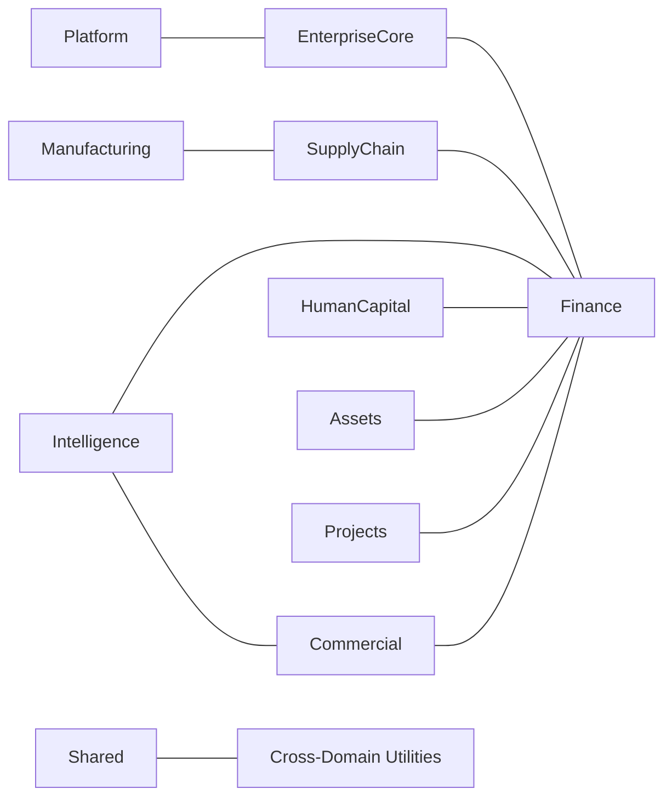

# Bounded Context Map

## Executive Summary
The Bounded Context Map defines how accoreP partitions its business capabilities into discrete Domains, each with its own model, language, and responsibility. This structure prevents conceptual overlap between financial, commercial, operational, and human capital processes. It is the canonical reference for understanding where responsibilities start and end across the platform.

## Business Rationale
Enterprise ERP landscapes become fragile when multiple modules attempt to own the same concepts, or when financial and operational concerns are mixed without clear boundaries. accoreP adopts a Bounded Context approach so that each Domain operates with a well-defined scope, allowing teams to evolve capabilities independently while preserving global coherence.

This separation supports regulatory expectations around financial correctness, traceability, and accountability. Finance can enforce Financial Immutability and Audit Trail discipline without being coupled directly to user-facing workflows, while Commercial, SupplyChain, HumanCapital, and other Domains remain focused on their operational lifecycles.

## Core Principles
1. **Single ownership per business capability** — Each major capability, such as General Ledger or Workforce Administration, belongs to exactly one Domain.
2. **Explicit Subdomain structure** — Domains are internally organized into Subdomains (for example, GeneralLedger or Procurement) that group related capabilities behind a shared vocabulary.
3. **Domain-level isolation** — Business rules and data models do not cross Domain boundaries directly; integration occurs through well-defined integration points.
4. **Context-specific language** — Each Domain uses terminology tailored to its responsibilities while aligning with the shared Glossary for enterprise-wide concepts.
5. **Stable core, extensible edges** — Core Domains such as EnterpriseCore and Finance remain stable anchors, while others like Manufacturing, Projects, and Intelligence can expand over time without destabilizing the foundation.

## Architectural Expression
The accoreP architecture maps 11 Bounded Contexts directly to `backend/app/Domains` folders, reflecting the canonical list in the documentation engine. Subdomains inside each Domain (such as IAM, Governance, Sales, Procurement, GeneralLedger, WorkforceAdmin, or Dashboards) represent focused slices of behavior rather than independent systems.

Domain interactions are constrained to intentional integration paths: Commercial and SupplyChain drive operational events that ultimately post into Finance; HumanCapital activity feeds financial and reporting outcomes; EnterpriseCore and Platform provide shared capabilities such as identity, governance, and integration that do not own business logic for other Domains. <!-- [ASSUMPTION] -->

## Impact on Domains
The Bounded Context Map clarifies that:

- **EnterpriseCore** governs cross-cutting concerns such as identity, governance, and organizational structure but does not own financial or operational lifecycles.
- **Finance** owns the General Ledger, management accounting, and related Subdomains, functioning as the system of record for financial postings.
- **Commercial** owns sales, CRM, and revenue origination, while **SupplyChain** owns procurement and inventory lifecycles that ultimately impact Finance.
- **HumanCapital** governs Workforce Administration, Time and Attendance, Payroll, and related services that create financially relevant events.
- **Assets**, **Manufacturing**, and **Projects** form specialized Domains for asset lifecycle, production control, and project execution, designed to emit financially relevant events into Finance over time. <!-- [ASSUMPTION] -->
- **Intelligence** consumes data from multiple Domains for dashboards and reports, and **Platform** exposes integration and automation capabilities that connect accoreP to external systems.
- **Shared** hosts cross-domain utilities that do not contain independent business logic but are reused across Domains.

## Industry Alignment
This Bounded Context Map aligns with common ERP structuring principles used in large enterprise suites where Finance, Supply Chain, Human Capital, and Projects represent major functional pillars. The emphasis on Finance as an irreversible system of record, coupled with explicit operational Domains, is consistent with the expectations of auditors, regulators, and enterprise architects who require a defensible separation of responsibilities across the ERP landscape.

## Assumptions & Open Questions
- <!-- [ASSUMPTION] --> Operational Domains (Commercial, SupplyChain, HumanCapital, Assets, Manufacturing, Projects) emit Integration Events that ultimately post financial impact into Finance, even where not yet fully implemented in code.
- <!-- [ASSUMPTION] --> Intelligence and Platform are expected to integrate with all relevant Domains via standardized Integration Events and cross-domain utilities.
