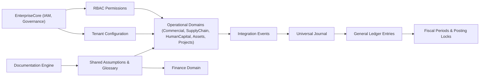

# Core Business Assumptions

## Executive Summary
The Core Business Assumptions define the non-negotiable truths that ACCSYSTEM ERP expects every Domain to respect. They describe how financial correctness, access control, tenancy, and data ownership are treated across the platform and form a stable baseline for future decisions.

## Business Rationale
Enterprise ERP systems operate in regulated environments where errors in financial postings, access control, or tenant isolation have material consequences. ACCSYSTEM ERP therefore adopts explicit business-level assumptions that reduce ambiguity for architects, developers, and auditors. By standardizing concepts such as Double-Entry Bookkeeping, Financial Immutability, Multi-Tenancy, and RBAC, the platform ensures that new capabilities reinforce, rather than weaken, the control framework.

## Core Principles
1. **Double-Entry Bookkeeping is universal** — All financially relevant activity ultimately posts as balanced Journal Entries to the General Ledger.
2. **Financial Immutability is mandatory** — Once Posting occurs into the General Ledger, records are treated as immutable, with corrections performed through Offset Entries and adjustment vouchers rather than mutation of historical entries. <!-- [ASSUMPTION] -->
3. **Universal Journal as single financial spine** — The Universal Journal provides a consolidated financial view across Domains, with each voucher_number grouping the Journal Entries that belong to a single economic event.
4. **RBAC is the sole authorization model** — Role-Based Access Control governs which users may initiate, approve, post, or reverse business activities; permissions are assigned to roles, not individuals.
5. **Multi-Tenancy with strict isolation** — Each Tenant is isolated so that Master Data, transactions, and configuration for one organization do not leak into another.
6. **Domain-level data ownership** — Each Domain owns its core entities and Master Data; cross-domain interactions are mediated via Integration Events rather than shared mutable data. <!-- [ASSUMPTION] -->
7. **Lifecycle governance for documents** — Key business documents follow explicit Lifecycles with defined states and transitions, including posting and closure.
8. **Documentation and code share a single truth** — Documentation is versioned in the same repository as the application and treated as part of the control surface.

## Architectural Expression
These assumptions are reflected in the Finance Domain’s GeneralLedger and UniversalJournal models, which consolidate financial postings and enforce that each transaction is composed of balanced Journal Entries. The concept of Posting, Fiscal Periods, and closed periods reinforces that financial history is not casually altered.

EnterpriseCore and its Identity and Governance capabilities embody the RBAC and Multi-Tenancy assumptions by centralizing user, role, and organizational configuration. Other Domains consume these capabilities rather than implementing bespoke authorization or tenancy mechanisms. <!-- [ASSUMPTION] -->

## Impact on Domains
- **Finance** must implement Posting, Double-Entry Bookkeeping, Fiscal Period locking, and the Universal Journal as the definitive repository of financial truth. Assumptions around immutability and Offset Entries drive how corrections are recorded. <!-- [ASSUMPTION] -->
- **Operational Domains** such as Commercial, SupplyChain, HumanCapital, Assets, and Projects generate Events that become financial postings; their design must respect that final financial impact is determined in Finance according to the shared assumptions. <!-- [ASSUMPTION] -->
- **EnterpriseCore** and **Platform** implement RBAC, Tenant configuration, automation, and integration services that all Domains rely on instead of duplicating these concerns.

## Industry Alignment
These assumptions align with standard ERP expectations that require audit-ready financials, consistent Posting and reversal patterns, tenant isolation for multi-organization deployments, and traceable Lifecycles for key documents. Treating documentation as a governed artifact matches DocOps practices in enterprise software.

## Assumptions & Open Questions
- <!-- [ASSUMPTION] --> All corrections to posted financial records are represented as Offset Entries or adjusting vouchers, not via in-place modification of the General Ledger tables.
- <!-- [ASSUMPTION] --> Cross-domain data ownership is enforced by passing Integration Events and identifiers rather than sharing mutable tables between Domains.
- <!-- [ASSUMPTION] --> Operational Domains that create monetary obligations ultimately post their impact through the Finance Domain’s Universal Journal and General Ledger.
