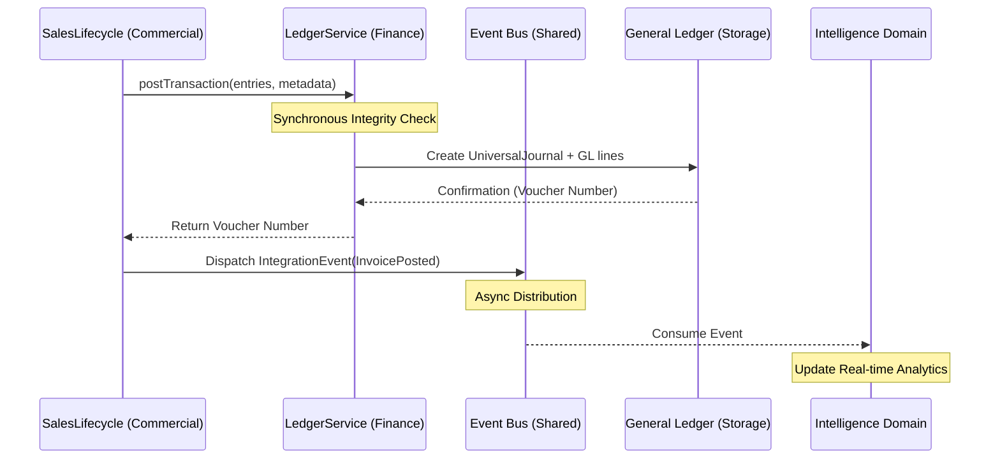

# Cross-Domain Integration Patterns

## Business Context
In an enterprise ERP, no domain operates in isolation. A sale in the Commercial domain has immediate and irreversible financial implications in the Finance domain. Similarly, the movement of inventory in SupplyChain affects both balance sheet assets and Cost of Goods Sold (COGS). 

To maintain the integrity of the Bounded Context Map, ACCSYSTEM enforces strict patterns for how these domains communicate. These patterns prevent "Big Ball of Mud" architectures where every module depends on the internal details of another, ensuring that the system remains maintainable even as it scales to thousands of entities and millions of transactions.

## Integration Architectures

### 1. Synchronous Service Delegation (Financial Core)
For operations requiring immediate consistency—specifically General Ledger postings—operational domains (Sales, Procurement, Payroll) interact with the Finance domain via a "Service Delegation" pattern. This ensures that the operational document (e.g., a Sales Invoice) and its financial reflection (GL Voucher) are committed as an atomic unit of work.

### 2. Event-Driven Decoupling (Operational Extensions)
For non-critical downstream impacts—such as updating an audit log, triggering a marketing notification, or refreshing a dashboard—domains emit **Integration Events**. These events allow the publishing domain to remain unaware of its subscribers, facilitating a plug-and-play architecture for extended ERP capabilities.

## Event Contract Pattern
While individual event payloads vary, all Integration Events in ACCSYSTEM must follow a standardized conceptual contract:

| Field | Type | Business Meaning |
|-------|------|-----------------|
| `event_id` | UUID | Unique identifier for idempotency tracking. |
| `timestamp` | ISO8601 | When the business event occurred in source time. |
| `publisher_domain` | String | The Bounded Context originating the event. |
| `event_type` | String | Categorical name (e.g., `Sales.Invoice.Posted`). |
| `payload` | Object | Minimal DTO containing IDs and immutable state. |
| `context` | Object | Metadata including `user_id` and `tenant_id`. |

## Sequence Diagram: Sales to GL Integration
The following diagram illustrates the primary integration path where a commercial event is translated into a financial record using the dual-layer approach:

## Trigger Conditions
Integration Events are triggered only upon the **successful commit** of a state-changing operation. 
*   **Automatic Firing**: Events are dispatched at the conclusion of an `Action` or `Service` transaction.
*   **Deferred Firing**: In high-volume scenarios, events may be persisted to an Outbox table and dispatched by a background worker to prevent integration failures from blocking the primary business flow. <!-- [ASSUMPTION] -->

## Subscriber Behavior
Subscribers to ERP Integration Events MUST adhere to two critical constraints:
1.  **Idempotency**: Because events may be redelivered due to network or processing failures, subscribers must verify if an `event_id` has already been processed before taking action.
2.  **Read-Only Integrity**: Subscribers must not modify the source entities provided in the payload; any derivative change must be recorded within the subscriber's own Bounded Context.

## Failure & Retry Strategy
A failure in a synchronous integration point (e.g., `LedgerService` rejection) MUST cause the entire parent transaction to roll back, ensuring data never exists in a partially integrated state. 
In contrast, failures in asynchronous Integration Event subscribers are handled via a central retry mechanism with exponential backoff, tracked in the `MonitoringCompliance` domain. <!-- [ASSUMPTION] -->

## Assumptions & Open Questions
1.  **[ASSUMPTION]**: While current implementation in modules like `SalesService` uses direct synchronous service injection, it is assumed that more complex cross-domain workflows (e.g., Manufacturing to Inventory) will utilize the asynchronous Integration Event pattern to avoid long-running locks.
2.  **[ASSUMPTION]**: It is assumed that an "Outbox Pattern" or reliable message queue (e.g., Redis or SQL-based queue) will be standardized across the platform for all non-critical integration events.
3.  **Open Question**: Should the `UniversalJournal` itself emit events (e.g., `GL.Entry.Posted`) for universal downstream consumption by all domains?
