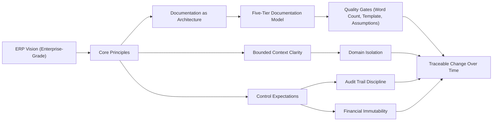

# ERP Philosophy & Vision

## Executive Summary
accore ERP is positioned as an enterprise-grade ERP platform designed to unify core business functions under a single governance model. Its philosophy prioritizes audit safety, financial correctness, and documentation discipline as first-class enterprise controls. The result is an ERP foundation intended to scale from operational execution to compliance-grade reporting without “black box” behavior.

## Business Rationale
Enterprise organizations require more than feature coverage; they require predictable controls, traceability, and a shared model of truth across functions. accore ERP exists to close the gap between day-to-day operational systems and the governance expectations of finance, auditors, and leadership by treating transactional integrity, accountability, and documentation as non-negotiable.

The platform’s strategic intent is to provide a SAP-class ERP posture while remaining accessible to organizations that need modern ERP discipline without vendor lock-in. This posture is expressed through a commitment to end-to-end traceability (Audit Trail), deliberate lifecycle governance for business documents, and a documentation system designed to remain accurate as the product evolves.

## Core Principles
1. **Unified enterprise truth** — Operational activity and financial outcomes converge into a consistent enterprise record suitable for control and reporting.
2. **Audit safety by design** — Business activity is traceable through an immutable Audit Trail that supports investigation, accountability, and regulatory expectations.
3. **Financial Immutability** — Posted financial records are treated as immutable; corrections are represented via Offset Entry patterns rather than silent mutation.
4. **Documentation as architecture** — Documentation is maintained as a governed system artifact, versioned with the application, and enforced with quality gates.
5. **Bounded Context clarity** — The system is organized around Bounded Context boundaries to prevent conceptual drift and reduce cross-functional ambiguity.
6. **Industry-aligned discipline** — Terminology, controls, and lifecycle governance align with established ERP expectations for financial correctness and operational accountability.

## Architectural Expression
The philosophy is expressed through a controlled documentation engine, a tiered documentation taxonomy, and vocabulary governance that stabilizes meaning across teams. This creates an enterprise feedback loop: business principles define constraints, constraints shape system structure, and documentation enforces consistency over time.

## Impact on Domains
This philosophy constrains and enables domain behavior across the ERP:

- **Finance**: Financial postings and reporting require immutability and a defensible Audit Trail, supporting Double-Entry Bookkeeping and correction via Offset Entry.
- **Commercial and SupplyChain**: Operational transactions are expected to be traceable into financially relevant outcomes, preserving accountability across document lifecycles.
- **HumanCapital and Projects**: Workforce and project activities require consistent Master Data and controlled lifecycles to maintain downstream reporting integrity.
- **Platform and Shared capabilities**: Vocabulary consistency, governance automation, and cross-cutting standards exist to reduce ambiguity and maintain system-wide coherence.

## Industry Alignment
Enterprise ERP standards emphasize repeatability, control evidence, and consistent terminology across functional areas. accore ERP aligns with these expectations by centering auditability, disciplined document lifecycles, and the principle that posted financial records are immutable. The tiered documentation model additionally supports enterprise governance norms by ensuring stakeholders can validate “why,” “what,” and “how” with an auditable documentation trail rather than relying on informal tribal knowledge.

## Assumptions & Open Questions
- None identified from the approved input sources for this task.
