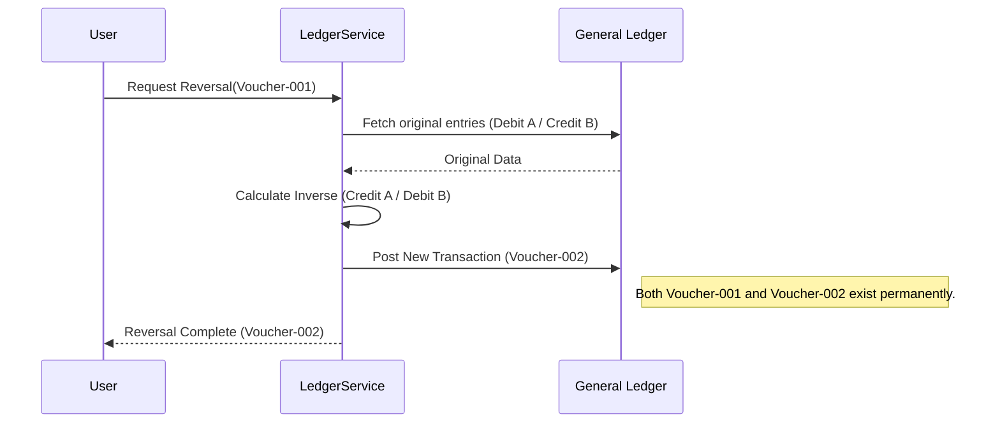

# Financial Data Immutability

## Business Rationale
The integrity of a General Ledger (GL) is the foundation of any Enterprise Resource Planning (ERP) system. In financial accounting, the ability to modify or delete historical records is a catastrophic risk that undermines audit trails, facilitates fraud, and violates international accounting standards such as IFRS and GAAP. 

The Financial Data Immutability doctrine ensures that once a transaction is finalized—known as "posting"—it becomes a permanent part of the organization's economic history. This constraint protects the system against retroactive tampering, ensures that financial reports (Balance Sheets, P&L) are reproducible, and provides external auditors with a reliable record of every value-changing event.

## Constraint Definition
The Immutability Constraint is defined by the following rules:

1. **Post-Commit Persistence**: Once a `UniversalJournal` header and its associated `GeneralLedger` entries are committed with a `posted` status, they MUST NOT be modified or deleted via standard application interfaces or database operations.
2. **Sequential Integrity**: Voucher numbers assigned to transactions MUST follow a non-gap sequence and MUST NOT be reused or reassigned even if a transaction is voided.
3. **Temporal Boundary**: All financial operations MUST occur within an "Open" `FiscalPeriod`. Once a period is "Locked" or "Closed," no entries—including corrections—can be posted to that date range.
4. **Amendment via Offset**: Any error in a posted transaction MUST be corrected using a new, distinct transaction (reversal or adjustment entry) in an active fiscal period.

## Affected Entities & Operations
The following entities are subject to the Immutability Constraint:

*   **UniversalJournal**: The transaction header containing the voucher number and document summary.
*   **GeneralLedger**: The individual line items (debits and credits) that form the double-entry record.
*   **FiscalPeriod**: The temporal controller that defines the validity of transaction dates.

**Operations Enforcing the Constraint**:
*   **PostTransaction**: Validates that the voucher number is unique and that the target fiscal period is open.
*   **ReverseTransaction**: Generates new offsetting entries rather than modifying existing ones.
*   **CloseFiscalPeriod**: Finalizes all entries within a date range and prevents further posting.

## Enforcement Mechanism
Enforcement is implemented at the **Application Logic Layer** to ensure business rules are respected before any database interaction occurs.

1. **State-Based Validation**: The `LedgerService` acts as the primary gatekeeper. Before any entry is written to the `GeneralLedger` table, the service checks the `FiscalPeriod` status associated with the transaction date. If the period is `is_locked` or `is_closed`, the operation is aborted with a hard exception.
2. **Service-Level Immutability**: There are no `update` or `delete` methods provided within the `LedgerService` for posted ledger entries. The system architecture only supports `create` (posting) and `read` (reporting) operations for the ledger.
3. **Model Configuration**: The `GeneralLedger` Eloquent model is configured with `UPDATED_AT = null` and `$timestamps = false` to indicate its static nature. <!-- [ASSUMPTION] -->

## Audit & Compliance Implications
This constraint is the primary mechanism for SOC 1/SOC 2 compliance and statutory financial audits. By forbidding deletes, the system guarantees that every dollar can be traced from its source (e.g., a Sales Invoice) to its final position in the Chart of Accounts. 

Any correction results in two distinct audit events: the original (incorrect) entry and the subsequent reversal/adjustment. This transparency allows auditors to see the full lifecycle of a correction, which is essential for identifying operational patterns or potential internal control weaknesses.

## Reversal Workflow
The following diagram illustrates how corrections are handled without violating immutability:

## Edge Cases
*   **Draft Transactions**: Transactions in a "Draft" or "Pro-forma" state (stored in temporary tables or source modules) are NOT subject to this constraint until they are officially posted to the GL.
*   **Period Re-opening**: In extreme circumstances, an authorized administrator may "Unlock" a locked period to allow a late adjustment. However, once a period is "Closed" (meaning the year-end closing entries are posted), it is permanently immutable.

## Assumptions & Open Questions
1. **[ASSUMPTION]**: While the code lacks update/delete methods in the Service layer, it is assumed that database-level permissions (SQL GRANT/REVOKE) will eventually be used to restrict `UPDATE` and `DELETE` privileges on the `general_ledger` table for the application user.
2. **[ASSUMPTION]**: It is assumed that "Draft" journals are stored in a separate table structure (or separate module) to avoid polluting the immutable ledger with temporary data.
3. **Open Question**: Does the system require a "hard lock" at the database level (e.g., via triggers) to prevent even manual SQL interventions by DBAs?
