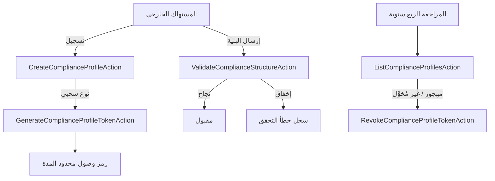

# سجلات التدقيق والتسجيل الأمني

## الغرض

يُحدّد هذا الدليل الإجراءات التشغيلية للحفاظ على Audit Trail (سجل التدقيق) ومراجعته والتحقق من صحته، وكذلك آليات التسجيل الأمني في accore ERP. يُوجَّه إلى مهندسي الأمان ومسؤولي الامتثال والمدققين المسؤولين عن التحقق من قابلية تتبع نشاط النظام والحوكمة السليمة لبيانات اعتماد الوصول للمستهلكين الخاضعين للتنظيم. يُعرَّف Audit Trail في accore بأنه سجل زمني غير قابل للتغيير لجميع أحداث النظام لأغراض الامتثال التنظيمي.

## النطاق والتطبيق

يسري هذا المستند على النطاق الفرعي `EnterpriseCore/MonitoringCompliance` الذي يحكم ملفات تعريف الامتثال (Compliance Profiles) ورموز وصول البيانات الخارجية والتحقق من البنى للمستهلكين الخاضعين للتنظيم. كما يسري على ضوابط مصالحة General Ledger الموثقة في مجال Finance (FIN-004). تقع كل من بيئتَي الإنتاج والتجريبية ضمن نطاقه.

## الإجراء

**إدارة دورة حياة ملف تعريف الامتثال**

1. يُنشَأ Compliance Profile (ملف تعريف الامتثال) عبر `CreateComplianceProfileAction`، الذي يُسجّل المستهلك الخارجي وينشئ اختيارياً رمز وصول محدود المدة لتكاملات النوع السحبي (pull-type).
2. يُنفَّذ توليد الرمز لملفات التعريف السحبية عبر `GenerateComplianceProfileTokenAction`. تحمل الرموز تاريخ انتهاء صريح (`expires_in_days`، القيمة الافتراضية 365) وترتبط بنقطة نهاية سحب محددة.
3. يُنفَّذ إلغاء الرمز عبر `RevokeComplianceProfileTokenAction` عند انتهاء علاقة المستهلك أو اشتباه في تعرّض الرمز للاختراق.
4. تُتحقَّق من جميع حمولات بنية الامتثال (JSON وXML وYAML) المُرسَلة من المستهلكين الخارجيين بواسطة `ValidateComplianceStructureAction` قبل القبول. تُسجَّل إخفاقات التحقق مع تفاصيل الخطأ.
5. تُراجَع ملفات تعريف الامتثال ربع سنوياً. ينفّذ المراجع `ListComplianceProfilesAction` لإحصاء الملفات النشطة، ويتأكد من وجود مبرر تجاري حالي لكل ملف، ويُلغي الملفات المهجورة أو غير المُخوَّلة.

**سلامة سجل التدقيق**

6. سجلات Audit Trail المالية في General Ledger ثابتة بتصميم النظام. لا توجد عمليات تحديث أو حذف في `LedgerService` للقيود المُرحَّلة.
7. سجلات محاولات تسجيل الدخول في جدول `login_attempts` تُراجَع أسبوعياً للكشف عن أنماط شاذة. <!-- [ASSUMPTION] -->

## المراقبة والتحقق

- تُراقَب تواريخ انتهاء الرموز. تُشغّل الرموز المقتربة من الانتهاء خلال 30 يوماً إشعار تجديد. <!-- [ASSUMPTION] -->
- يُستعلَم جدول `login_attempts` أسبوعياً للكشف عن معدلات إخفاق شاذة حسب عنوان IP والحساب.
- تُتفحَّص معدلات أخطاء `ValidateComplianceStructureAction` للكشف عن مشكلات جودة بيانات منهجية.

## استرداد الإخفاق

1. عند الاشتباه في استخدام غير مُخوَّل لرمز، يستدعي مسؤول الامتثال فوراً `RevokeComplianceProfileTokenAction` للملف المتأثر ويُبدأ مراجعة الوصول.
2. إن بدأ `ValidateComplianceStructureAction` في رفض بنى كانت مقبولة سابقاً، يراجع المهندس المواصفة مقابل منطق التحقق الحالي.
3. عدم القدرة على إلغاء الرمز بسبب عطل في النظام يُصعَّد إلى القائد التقني للواجهة الخلفية. التدخل اليدوي في قاعدة البيانات مُرخَّص بموافقة مسؤول قاعدة بيانات مُوثَّقة فحسب. <!-- [ASSUMPTION] -->

## الامتثال والتدقيق

- تُشكّل أحداث إنشاء ملف تعريف الامتثال وتوليد الرمز وإلغائه سجلات حوكمة وصول قابلة للتدقيق للمستهلكين الخارجيين الخاضعين للتنظيم.
- يضمن ثبات قيود General Ledger عدم إمكانية تعديل سجلات Audit Trail المالية بأثر رجعي، مما يلبّي متطلبات أدلة التدقيق بموجب IFRS وGAAP.
- توفر سجلات أخطاء التحقق دليلاً على أن البيانات الواردة من الأنظمة الخارجية خاضعة لضوابط هيكلية قبل قبولها.
- يجب توثيق المراجعات الربع سنوية لملفات تعريف الامتثال والاحتفاظ بها كدليل لمتطلبات SOC 2 Type II.

## سجل التغييرات

| التاريخ | التغيير | المؤلف |
|---------|---------|--------|
| 2026-03-26 | الإنشاء الأولي — تنفيذ المرحلة الرابعة (ترجمة عربية) | AI (L10N-002) |

## الافتراضات والأسئلة المفتوحة

<!-- [ASSUMPTION] --> مراقبة انتهاء الرموز وإشعارات التجديد مُفترَض تطبيقها عبر وظيفة مجدوَلة أو أداة مراقبة خارجية.
<!-- [ASSUMPTION] --> التدخل اليدوي في قاعدة البيانات لمسح الرموز يستلزم موافقة مسؤول قاعدة بيانات مكتوبة؛ العملية مُعرَّفة في وثيقة حوكمة داخلية غير موجودة في المستودع.
